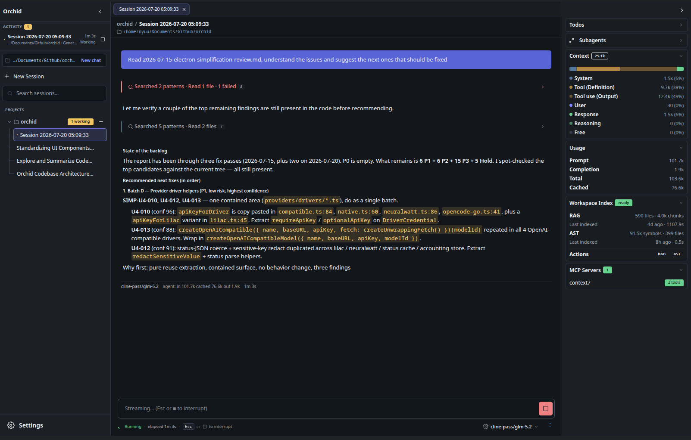
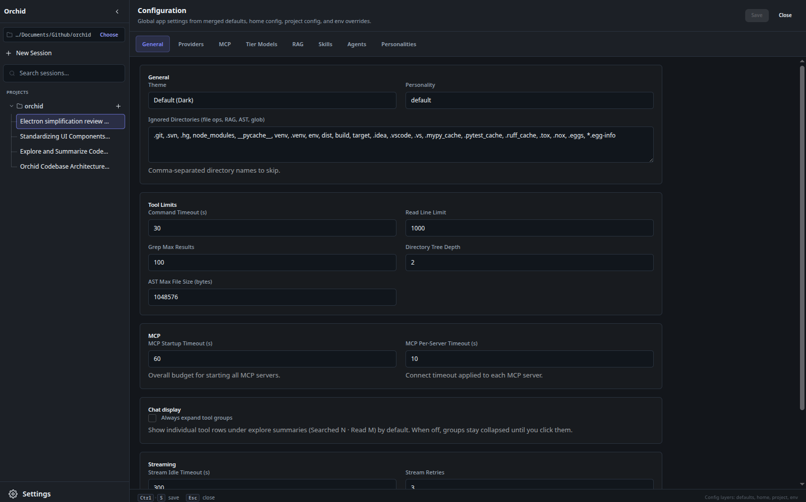
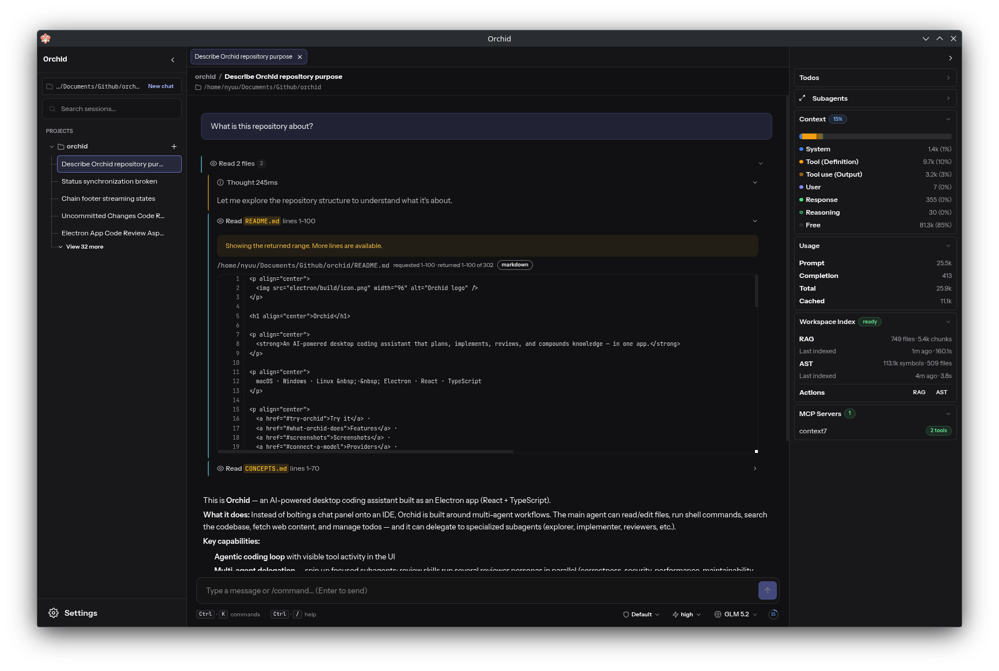

<p align="center">
  
</p>

<h1 align="center">Orchid</h1>

<p align="center">
  <strong>An AI-powered desktop coding assistant that plans, implements, reviews, and compounds knowledge — in one app.</strong>
</p>

<p align="center">
  macOS · Windows · Linux &nbsp;·&nbsp; Electron · React · TypeScript
</p>

<p align="center">
  <a href="#try-orchid">Try it</a> ·
  <a href="#what-orchid-does">Features</a> ·
  <a href="#screenshots">Screenshots</a> ·
  <a href="#connect-a-model">Providers</a> ·
  <a href="#known-limitations">Limitations</a> ·
  <a href="#status">Status</a> ·
  <a href="#for-contributors">Contributors</a>
</p>

---

> **Early preview.** Orchid is under active development. Expect rough edges, missing polish, and breaking changes. Feedback is very welcome — that’s why we’re sharing it now.

Orchid is a standalone desktop app for agentic software work. Instead of bolting a chat panel onto an IDE, it is built around multi-agent workflows: explore a codebase, plan a change, implement it, run specialized reviewers in parallel, then commit and document what you learned.

Inspired by [Stupidex](https://github.com/Zeptiny/stupidex), originally developed as an academic project.

---

## Why Orchid?

Most coding assistants stop at “generate code in the editor.” Orchid aims higher:

| You want… | Orchid gives you… |
|-----------|-------------------|
| Less context-switching | One desktop surface for chat, tools, sessions, settings, and status |
| Real project awareness | Filesystem, shell, grep, AST symbols, and local semantic search (RAG) |
| Structured workflows | Built-in skills for brainstorm, plan, implement, review, commit/PR, and compound |
| Specialists, not one mega-prompt | A main agent that can delegate to focused subagents (explorer, implementer, reviewers, …) |
| Your models, your keys | Bring API keys or env-based credentials; credentials stay out of the renderer |
| Local-first extras | Optional local embeddings, project indexes, and MCP for external tools |

---

## What Orchid does

### Agentic coding loop
Chat with a main agent that can read and edit files, run shell commands, search the codebase, fetch web content, and manage todos — with tool activity visible in the UI.

### Multi-agent delegation
Spin up specialized subagents for exploration, implementation, code review, research, and more. Review skills can run several reviewer personas in parallel (correctness, security, performance, maintainability, testing, …).

### Skills for real workflows
Reusable workflows guide multi-step work, including:

- **brainstorm / ideate / plan / work** — from idea to execution
- **code-review / simplify-code** — structured review and cleanup
- **commit / commit-push-pr / resolve-pr-feedback** — versioning and PR hygiene
- **compound / compound-refresh** — capture solutions so they don’t get rediscovered
- **debug / strategy / doc-review / lfg** — focused workflows for harder jobs

### Project intelligence
- **RAG** — local semantic search over your project (ONNX embeddings; no cloud required for indexing)
- **AST tools** — skeletons, symbol lookup, rename/replace across the tree
- **MCP** — plug in Model Context Protocol servers (e.g. library docs via context7)

### Sessions & workspace
Bind a project directory per session, keep history on disk (`~/.orchid/sessions/`), switch sessions, and track usage/cost attribution per connection.

### Personalities & themes
Change agent tone (default, zen, pirate, socrates, …) and pick a UI theme (dark default, solarized light, bluey, green terminal, Windows XP nostalgia).

---

## Screenshots

<p align="center">
  
</p>

<p align="center">
  
  &nbsp;
  
</p>

---

## Try Orchid

There are no public installers yet. The supported way to try Orchid is to run it from source.

### Requirements

- **Node.js 24** (engines: `>=24 <25`)
- An **LLM API key** (or compatible endpoint) — Orchid starts without a provider and only contacts models after you connect one
- Optional: **Ollama** or any OpenAI-/Anthropic-compatible server if you prefer local or self-hosted models

### Run from source

```bash
git clone https://github.com/Zeptiny/orchid.git
cd orchid/electron
npm install
npm run dev
```

That compiles the main process, starts the Vite renderer on `localhost:5173`, and opens the Electron window.

### First launch

1. Complete (or skip) the onboarding wizard
2. Open **Settings → Providers** (or finish provider setup in onboarding)
3. Add a connection, submit credentials, validate, and pick a default model
4. Bind a project folder (session working directory)
5. Ask Orchid to explore, plan, or implement something small

### Package a local build (optional)

```bash
cd orchid/electron
npm run package        # current platform
# or: npm run package:linux | package:mac | package:win
```

Artifacts land under `electron/release/` (AppImage/deb, dmg, or NSIS installer depending on OS).

---

## Connect a model

Orchid is **local-only until you connect a provider**. Browsing projects, history, indexing, and settings work without network LLM calls.

Supported built-in driver families include:

- OpenAI
- Anthropic
- Google Gemini
- xAI
- OpenCode Go, Lilac, Neuralwatt
- Custom **OpenAI-compatible** and **Anthropic-compatible** endpoints

**Credential safety**

- API keys are one-shot submissions to the main process and are not returned to the UI
- Storage prefers OS secure storage; when that is unavailable, use a validated environment-variable reference instead

Model identity is always `{ connectionId, modelId }` — two accounts for the same provider stay distinct. Agent **tiers** (`seed` → `sprout` → `bloom` → `crown`) can map to different models so cheap tasks stay cheap and hard tasks use stronger models.

---

## Everyday usage

| Action | How |
|--------|-----|
| Command palette | `Cmd+K` / `Ctrl+K` |
| Send message | `Enter` |
| Cancel stream / close modal | `Escape` |
| Toggle sidebar | `Ctrl+B` |

Useful palette commands: `/new`, `/sessions`, `/model`, `/theme`, `/personality`, `/settings`, `/rag index`, `/ast index`.

Config lives in `~/.orchid/config.json` with optional project overrides in `.orchid.json`. Prefer the in-app **Settings** UI for day-to-day changes.

---

## Architecture at a glance

```
┌────────────────────────────────────────────────────────────┐
│  Main process (Node + Electron)                            │
│  Agent loop (XState) · LLM streaming · Tools · MCP         │
│  RAG / AST indexes · Sessions · Config · Credential vault  │
└───────────────────────────┬────────────────────────────────┘
                            │ IPC (validated, allowlisted)
┌───────────────────────────┴────────────────────────────────┐
│  Renderer (React)                                          │
│  Chat · Tool widgets · Sidebar · Settings · Onboarding     │
└────────────────────────────────────────────────────────────┘
```

| Layer | Stack |
|-------|--------|
| Runtime | Electron 43, Node 24 |
| UI | React 19, Tailwind CSS 4, DaisyUI 5 |
| Agent orchestration | XState 5 |
| LLM | Vercel AI SDK 7 + multi-provider drivers |
| Validation | Zod at IPC and tool boundaries |
| Local data | SQLite (RAG/AST), JSON sessions under `~/.orchid/` |

Deep developer map: [`AGENTS.md`](AGENTS.md). Domain vocabulary: [`CONCEPTS.md`](CONCEPTS.md).

---

## Known limitations

Orchid is an early preview. Expect rough edges. Highlights that matter when trying the app:

### UX & reliability
- **Chat scrolling** — scrolling up in the chat stream is currently broken
- **Error surfacing** — some API / tool / subagent failures (e.g. rate limits) may not show a clear message in the UI
- **Tool UI polish** — not every tool has full generating/running states; many results still use a generic viewer instead of dedicated widgets
- **Background commands** — viewing live output and sending stdin to background processes is incomplete
- **Markdown performance** — message markdown may re-parse too aggressively during streaming

### Agent behavior
- The model can still **deviate from plans**, leave work incomplete, or produce dead code — reviewers help but do not always catch everything
- Built-in **skills and agent prompts** are not fully aligned with every current harness capability

### Missing product surface
- **No public installers** or auto-update channel yet — run or package from source
- **No session compaction / compression** — long chats are not summarized or trimmed to stay within context limits
- No LSP, SSH/remote workspaces, or user message queue yet

Full engineering backlog: [`TODO.md`](TODO.md).

---

## Status

| Area | State |
|------|--------|
| Core agent loop + tools | Working — actively iterated |
| Multi-provider connections | Working for key drivers |
| Onboarding + settings | Working |
| Packaging (AppImage/deb/dmg/nsis) | Works locally; no public release channel yet |
| Polish, edge cases, some workflows | In progress |
| Public binaries / auto-update | Not shipped yet |

Orchid is shared as a **developer preview**: suitable for curious early adopters who can run from source and tolerate unfinished UI and incomplete workflows. It is not yet a polished production product.

If something breaks, open an issue with OS, Node version, provider (if relevant), and steps to reproduce.

---

## For contributors

All application code lives under `electron/`. From that directory:

```bash
npm run dev          # Electron + Vite
npm run typecheck    # strict TS
npm run lint
npm run test         # Vitest
npm run build        # production build
```

Useful entry points:

| Task | Where to look |
|------|----------------|
| Agent loop | `electron/src/main/agents/`, `electron/src/main/ipc/chat.ts` |
| Tools | `electron/src/main/tools/` |
| Providers | `electron/src/main/providers/`, `electron/docs/provider-*.md` |
| UI | `electron/src/renderer/` |
| Shared IPC types | `electron/src/shared/` |
| Conventions | [`AGENTS.md`](AGENTS.md) |

Provider-specific notes live in [`electron/README.md`](electron/README.md).

---

## Project layout

```
orchid/
├── README.md                 # You are here
├── TODO.md                   # Full engineering backlog
├── AGENTS.md                 # Contributor guide & architecture
├── CONCEPTS.md               # Shared domain vocabulary
├── docs/
│   ├── screenshots/          # README product captures
│   └── …                     # Plans, brainstorms, reviews
└── electron/                 # The desktop app (run everything from here)
    ├── src/main/             # Main process
    ├── src/renderer/         # React UI
    ├── src/preload/          # contextBridge surface
    ├── src/shared/           # Cross-process types
    └── tests/                # Unit, integration, parity, smoke
```

---

## Feedback

Trying Orchid early is the best way to shape it. Please:

- Open [GitHub issues](https://github.com/Zeptiny/orchid/issues) for bugs and feature ideas
- Note what worked well and what felt confusing on first run
- Share provider/model combos you care about

Thank you for taking a look — more polish is coming.

---

<p align="center">
  <sub>Orchid · early preview · made for people who build software with agents</sub>
</p>
