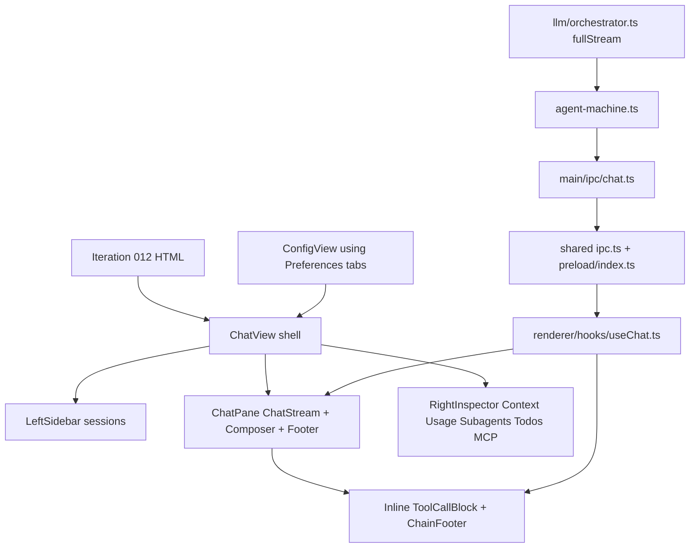
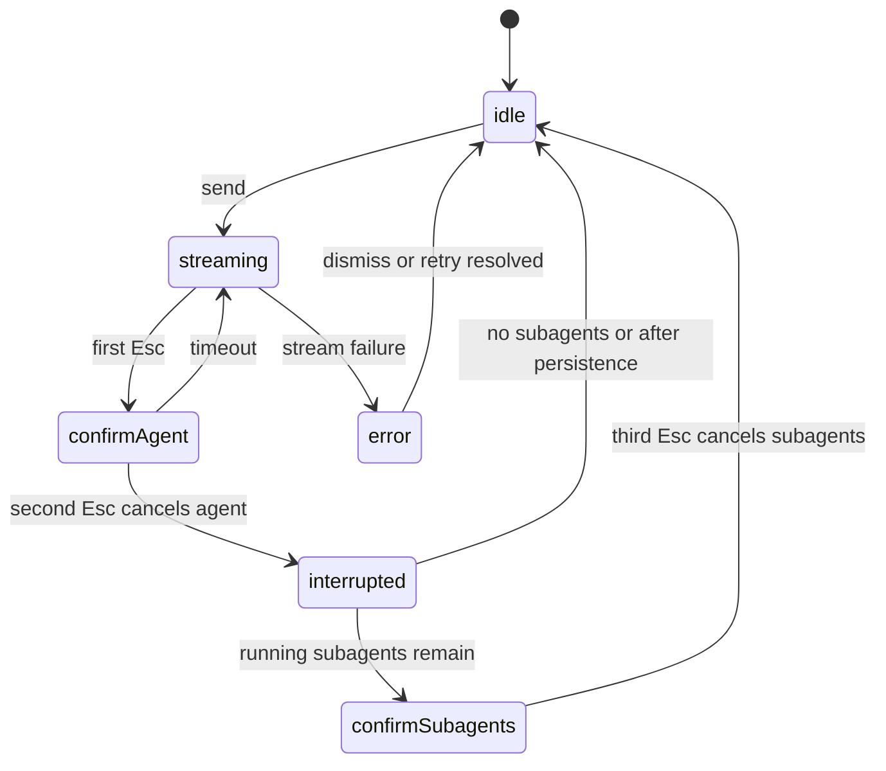

# Iteration 012 Interface Implementation - Plan

## Goal Capsule

| Field | Decision |
|---|---|
| Objective | Implement the screens and states from `ce-brainstorm-visual/orchid-sidebar-split/screens/012-tool-states-interrupt-flow-feather-icons.html` in the Electron React app. |
| Authority | The HTML mockup is the visual and interaction source; current Electron code is the implementation baseline; `electron/CLAUDE.md` supplies stack and conventions. |
| Execution profile | Frontend-heavy feature with targeted main/preload/shared IPC changes for tool lifecycle, interruption, errors, usage, and session persistence. |
| Stop condition | The app has the three-panel shell, inline tool-state blocks, interrupt/error flows, command palette, configuration mode, and tests proving the behavior. |
| Tail ownership | Implementation should remove or rewrite stale ToolRail assumptions and update tests that currently encode the previous UI. |

---

## Product Contract

### Summary

Iteration 012 replaces the current two-panel chat plus ToolRail surface with a compact three-panel desktop interface.
The design uses left sessions, center chat/composer/footer, and right inspector panels; all tool activity appears inline in the chain instead of a separate rail.
The interface also adds a richer tool lifecycle, a staged Esc cancel flow, dismissable error banners, a fullscreen command palette with sub-pickers, and a full-frame configuration mode.

### Problem Frame

The current renderer has most primitives but not the final interface shape.
`ChatView.tsx` still renders a two-panel layout with `ToolRail`, `Sidebar.tsx` still owns sessions in the right rail, `MessageWidget.tsx` renders simple tool call/result collapses with Unicode icons, and `useChat.ts` does not subscribe to the existing tool-call streaming IPC.
The main process has partial support for `fullStream`, usage, and tool-call start/delta events, but it does not yet forward complete running/completed/failed tool lifecycle events to the renderer or persist those events into session chains.

### Design Inventory

- Frame 1. Empty state: left sidebar with empty sessions, centered Orchid welcome state, composer info bar, keyboard footer, right context/MCP sidebar at 0%.
- Frame 2. Idle state: active session list, user/assistant messages, thought collapses, tool blocks in `generating`, `running`, `completed`, and `failed` states, usage/subagents/todos/MCP inspector sections, and chain stats footer.
- Frame 3. Streaming/interruption: four state cards showing streaming, first Esc confirmation, confirmed cancellation, and post-interrupt partial content with an `Interrupted` chain footer.
- Frame 4. Error states: centered stream/rate-limit/auth banners with contextual actions, plus failed tool block and subagent interrupt hint.
- Frame 5. Command palette: fullscreen overlay, grouped command results, `/theme` sub-picker with swatches, keyboard footer, and focus return on close.
- Frame 6. Configuration mode: left sidebar retained, main content replaced by tabbed configuration with General, Providers, MCP, Tier Models, and RAG tabs plus save/close footer.
- Frame 7. Implementation notes: XState/IPC expectations, four tool phases, `fullStream` fallback, three-phase Esc flow, auto-scroll rules, chain footer data, keyboard shortcuts, Feather icon usage, and deferred features.

### Styling Inventory

- Dark compact palette: base `#0b0f14`, panels `#151a21`, borders `#26303d`, primary `#7e88ff`, success `#68d38f`, warning `#f2c665`, error `#ef8383`, info `#76baff`, thought `#f4c542`, tool `#72a8be`.
- Layout: app grid is `260px minmax(460px, 1fr) 300px`; config grid is `260px minmax(460px, 1fr)`; responsive breakpoint below `980px` collapses sidebars to narrow/icon-only columns.
- Components are restrained: 5-8px radii, 1px borders, 12-13px base text, small badges, compact collapses, and non-card page sections.
- Icons should come from `react-feather`, already installed in `electron/package.json`; current renderer imports none and still uses Unicode glyphs.

### Requirements

**Shell and navigation**

- R1. Render a three-panel desktop shell with left sessions, center chat/composer/footer, and right inspector.
- R2. Move session list, search, new session, and settings entry from the right sidebar to a new left sidebar.
- R3. Keep right sidebar for Context, Usage, Subagents, Todos, MCP Servers, and index-related data where still relevant.
- R4. Replace UI icon glyphs with Feather icons through `react-feather`.

**Chat and tool lifecycle**

- R5. Render empty, idle, streaming, interrupted, and error chat states from the mockup.
- R6. Render thought blocks and tool blocks inline as compact collapses.
- R7. Track tool phases as generating, running, completed, and failed; completed tools have no status badge and collapse by default.
- R8. Show streamed tool-call argument JSON during generation and concise summaries in collapsed titles.
- R9. Render a chain footer after agent responses with agent/subagent usage, elapsed time, and interrupted status.

**Interruptions and errors**

- R10. Implement Esc as staged cancellation: streaming hint, first Esc confirms agent cancel, second Esc cancels agent, and a subagent phase appears when applicable.
- R11. Preserve partial assistant content on interrupt without appending `[Interrupted by user]` into the message body.
- R12. Show stream, rate-limit, auth, and tool execution failures using the error UI and contextual actions from the mockup.

**Palette and configuration**

- R13. Keep the command palette as a fullscreen overlay with grouped results and `/theme` and `/personality` sub-pickers.
- R14. Render configuration as a full-frame mode using the existing General, Providers, MCP, Tier Models, and RAG form tabs.

**Behavior and verification**

- R15. Preserve smart auto-scroll: scroll on new content/tool updates, pause when the user scrolls more than 100px from bottom, re-enable when a new stream starts.
- R16. Persist enough tool and chain metadata for session replay and sidebar/chain-footer state.
- R17. Update unit and integration tests so they assert the new interface rather than ToolRail-era behavior.

### Acceptance Examples

- AE1. Given no messages and no active stream, the center pane shows the Orchid welcome state, the left sidebar says no sessions yet, the composer is enabled, and the right sidebar shows minimal context/MCP information.
- AE2. Given a tool call is being generated, the chat shows an inline tool block with a Feather loader, `generating` badge, and partial JSON arguments from IPC deltas.
- AE3. Given a tool call finishes successfully, the inline tool block title shows the tool summary, no status badge is visible, and the content is collapsed by default.
- AE4. Given a stream is active and the user presses Esc once, the footer changes to `Esc again: cancel agent`; after the second Esc, the partial message is saved and the chain footer shows `Interrupted`.
- AE5. Given an auth error, the chat shows an authentication banner with an Open Settings action that opens configuration mode.
- AE6. Given the user types `/theme` in the command palette, the palette changes to a swatch picker and applying a theme persists through the existing config IPC.
- AE7. Given the user opens settings, the app enters the configuration frame instead of a centered modal, preserves unsaved state behavior, and closes back to chat with Esc.

### Scope Boundaries

- The plan implements the Iteration 012 interface in the Electron app only.
- The plan does not add session rename/delete confirmation dialogs; palette commands can remain existing or deferred.
- The plan does not build a live background command output viewer beyond the existing `LiveCommandInline` behavior.
- The plan does not add a scroll-to-bottom button.

### Deferred to Follow-Up Work

- Full live background command output in the right inspector.
- Inline session rename/delete confirmation UI.
- Streaming retry counter display during automatic retries.
- A richer model picker beyond the current palette/settings pathways.

---

## Planning Contract

### Current Code Verification

| Area | Verified State | Planning Impact |
|---|---|---|
| Design source | `012-tool-states-interrupt-flow-feather-icons.html` is 1,948 lines and includes seven frames plus implementation notes. | Treat it as the source of product and visual requirements. |
| Existing plan | `docs/plans/2026-07-08-003-feat-interface-rework-full-plan.md` already targets this mockup but predates/does not fully reflect current code. | Use it as prior context, not the canonical execution plan. |
| Stack | `electron/CLAUDE.md` confirms Electron 33, React 19, TypeScript 5.7, Tailwind CSS 4, daisyUI 5, XState 5, AI SDK 7, Zod 3, Vitest. | Stay within existing stack and Tailwind/daisyUI conventions; avoid inline styles from the mockup. |
| Icons | `react-feather` is already in `electron/package.json` and `electron/package-lock.json`; no renderer imports exist. | Skip dependency installation; add a wrapper/usage pattern and replace glyphs. |
| Layout | `ChatView.tsx` renders center chat, `ToolRail`, then right `Sidebar`; there is no left sidebar component. | Refactor shell before tool UI polish. |
| Sidebar | `Sidebar.tsx` contains sessions, subagents, todos, MCP, index status, context, and usage. | Extract/rehome session UI into `LeftSidebar`; keep inspector data on the right. |
| Tool display | `MessageWidget.tsx` has simple tool call/result collapses; `ToolRail` and `useToolRail` exist but are not connected to live chat events. | Reuse widget parsing ideas where useful, but make inline blocks the only tool surface. |
| Tool streaming backend | `orchestrator.ts`, `agent-machine.ts`, `chat.ts`, `preload/index.ts`, and `ipc.ts` already include start/delta concepts. | Add renderer state and complete lifecycle forwarding for running/result/error. |
| Interrupt backend | `chat.ts` uses `interruptMachine`, which currently returns to `idle` on second Esc and cannot reach `confirmSubagents`; `session-machine.ts` sketches a three-phase flow but is not the active chat IPC path. | Update active IPC path; do not assume three-phase behavior already works. |
| Errors | `orchestrator.ts` classifies timeout/rate/auth errors; `ChatStream.tsx` renders a generic daisyUI alert. | Carry error title/type through IPC and render mockup-specific banners/actions. |
| Configuration | `PreferencesWindow.tsx` already has tabs and dirty/save/Esc behavior in a modal. | Reuse its tab form components in a full-frame `ConfigView` or mode. |
| Tests | Existing tests assert ToolRail file presence and two-phase interrupt behavior. | Update tests as part of the implementation, or CI will preserve the old UI. |

### Key Technical Decisions

- KTD1. **Reuse existing primitives, replace surfaces.** Keep `ContextGrid`, preferences tab components, command registry, config IPC, usage types, and tool widget internals where they fit; replace `ToolRail` as a visible surface.
- KTD2. **Use a typed inline tool event model.** Add a renderer-facing `ToolBlockEvent` lifecycle that can be driven by `chat:toolCallStart`, `chat:toolCallDelta`, complete tool-call events, and result/error events.
- KTD3. **Persist tool lifecycle through messages or chain metadata.** Prefer persisted `MessageType.TOOL_CALL` and `MessageType.TOOL_RESULT` pairs because `Chain` already reconciles tool-call/tool-result invariants; introduce a separate event field only if implementation proves message storage insufficient.
- KTD4. **Refactor config mode around existing preference tabs.** Avoid duplicating form logic; make app chrome switch between chat and configuration while the tab components continue to own field editing.
- KTD5. **Update active cancellation path.** The `chat:cancel` handler must model the mockup flow directly or adopt the session-level interrupt flow; changing only `Footer.tsx` would display states that cannot happen.
- KTD6. **Keep styling token-based.** Port the mockup's visual language into Tailwind/daisyUI classes and shared CSS, not inline style fragments.

### High-Level Technical Design

### Assumptions

- The dirty worktree is the planning baseline; the existing uncommitted backend `fullStream` changes should be preserved and completed.
- The implementation may rename or split renderer components, but public IPC channels should remain allowlisted and typed in `electron/src/shared/types/ipc.ts`.
- The final visual implementation should use Feather icons through React components rather than inline SVG copied from the mockup.

---

## Implementation Units

| Unit | Name | Primary Files | Depends On |
|---|---|---|---|
| U1 | Visual foundation and icon wrapper | `electron/src/renderer/components/Icon.tsx`, renderer styles | None |
| U2 | Three-panel shell and left sidebar | `ChatView.tsx`, `LeftSidebar.tsx`, `Sidebar.tsx` | U1 |
| U3 | Tool lifecycle IPC and persistence | `orchestrator.ts`, `agent-machine.ts`, `chat.ts`, `ipc.ts`, `useChat.ts` | U1 |
| U4 | Inline tool blocks and chain footer | `ToolCallBlock.tsx`, `MessageWidget.tsx`, `ChatStream.tsx` | U3 |
| U5 | Interrupt and error screens | `chat.ts`, `Footer.tsx`, `InputArea.tsx`, `ErrorBanner.tsx` | U2, U3 |
| U6 | Palette and configuration mode | `CommandPalette.tsx`, `ConfigView.tsx`, `App.tsx` | U1, U2 |
| U7 | Right inspector and usage/session polish | `Sidebar.tsx`, `ContextGrid.tsx`, `useSession.ts`, `chat.ts` | U2, U3 |
| U8 | Test and cleanup pass | `electron/tests/**`, removed or repurposed ToolRail files | U1-U7 |

### U1. Visual Foundation and Icon Wrapper

**Goal:** Establish the shared visual vocabulary for Iteration 012 and route all UI icons through Feather.

**Requirements:** R4, R5

**Dependencies:** None

**Files:** `electron/src/renderer/components/Icon.tsx`, `electron/src/renderer/styles/chat.css`, `electron/src/renderer/styles/index.css`, `electron/src/renderer/themes/default.css`, `electron/tests/integration/chat-sidebar.test.ts`

**Approach:** Create a small `Icon` wrapper around `react-feather` for sizes matching the mockup (`sm`, default, `lg`, `xl`) and standard stroke behavior.
Map commonly used icons such as search, plus, settings, chevrons, loader, square stop, alert, lock, terminal, file, and zap.
Add compact shell/tool/error CSS classes backed by theme variables and Tailwind/daisyUI utilities.
Replace visible Unicode icons in current renderer components as those components are touched by later units.

**Patterns to follow:** `electron/CLAUDE.md` renderer conventions, existing Tailwind/daisyUI setup in `electron/src/renderer/styles/index.css`, and mockup `.fi` sizing.

**Test scenarios:**
- Render a default icon and verify it receives the expected accessible label or hidden decorative treatment.
- Render `sm`, default, and `lg` sizes and verify stable dimensions.
- Render inherited color in a warning/error parent and verify no hard-coded color overrides.

**Verification:** Feather icons render anywhere a later unit uses them, no new icon glyphs are introduced for UI controls, and the app still builds with the existing `react-feather` dependency.

### U2. Three-Panel Shell and Left Sidebar

**Goal:** Convert `ChatView` into the mockup shell and move sessions into a dedicated left sidebar.

**Requirements:** R1, R2, R3, R5

**Dependencies:** U1

**Files:** `electron/src/renderer/components/ChatView.tsx`, `electron/src/renderer/components/LeftSidebar.tsx`, `electron/src/renderer/components/Sidebar.tsx`, `electron/src/renderer/hooks/useSession.ts`, `electron/src/renderer/styles/chat.css`, `electron/tests/integration/chat-sidebar.test.ts`

**Approach:** Extract session list/search/create/settings behavior from `Sidebar.tsx` into `LeftSidebar`.
Change `ChatView` from `flex h-screen` plus ToolRail to a three-column grid matching `260px minmax(460px, 1fr) 300px`.
Keep sidebars collapsible and implement the `<980px` responsive behavior with stable narrow columns.
Remove the visible ToolRail slot from the shell while preserving reusable ToolWidgets for inline rendering until U8 decides final file ownership.

**Patterns to follow:** Existing `useSession` load/create/delete/rename flow, `Sidebar.tsx` section rendering, mockup frames 1 and 2.

**Test scenarios:**
- Given an empty session list, left sidebar renders "No sessions yet" and the center pane renders the empty state.
- Given sessions from `session:list`, left sidebar groups/renders active and inactive sessions and selecting a session loads its active chain messages.
- Given a long session name, the row truncates without resizing the layout.
- Given `Ctrl+B`, the right inspector toggles while the left sidebar remains intact.
- Given a viewport below 980px, both sidebars collapse to stable narrow columns without text overlap.

**Verification:** The app has left, center, and right regions matching the design frame; session functionality still works.

### U3. Tool Lifecycle IPC and Persistence

**Goal:** Complete the data path for generating, running, completed, and failed tool blocks.

**Requirements:** R7, R8, R16

**Dependencies:** U1

**Files:** `electron/src/main/llm/orchestrator.ts`, `electron/src/main/agents/xstate/agent-machine.ts`, `electron/src/main/agents/xstate/events.ts`, `electron/src/main/ipc/chat.ts`, `electron/src/shared/types/ipc.ts`, `electron/src/preload/index.ts`, `electron/src/renderer/hooks/useChat.ts`, `electron/src/shared/types/message.ts`, `electron/src/shared/types/chain.ts`, `electron/tests/unit/llm-orchestrator.test.ts`, `electron/tests/unit/xstate-agents.test.ts`, `electron/tests/unit/chat-ipc.test.ts`, `electron/tests/unit/session-persistence.test.ts`

**Approach:** Keep the existing `fullStream` start/delta handling, then add a complete renderer-facing lifecycle event for tool running and tool result/error.
In `agent-machine.ts`, retain enough last-tool update context for `chat.ts` to forward exactly-once updates without repeatedly sending accumulated partial args as new deltas.
In `useChat.ts`, subscribe to the existing start/delta channels and any new update/result channel, maintain ordered tool block state, and reset it on session switch/new chain.
Persist tool calls/results through existing `MessageType.TOOL_CALL` and `MessageType.TOOL_RESULT` where possible so restored sessions can replay inline tool blocks and continue satisfying chain reconciliation.

**Patterns to follow:** Existing IPC allowlist pattern in `ipc.ts` and `preload/index.ts`, `Message` tool-call fields in `electron/src/shared/types/message.ts`, and chain reconciliation in `electron/src/shared/types/chain.ts`.

**Test scenarios:**
- Given `fullStream` emits `tool-input-start`, renderer receives a generating tool block with the correct tool name.
- Given multiple `tool-input-delta` chunks for one call, `useChat` accumulates one partial-args string without duplicating prior chunks.
- Given the completed `tool_call` event, the block transitions from generating to running and shows a summary from the parsed args.
- Given a successful tool result, the block transitions to completed, removes its badge, and stores result content.
- Given an error tool result, the block transitions to failed and stores the error text.
- Given a restored session with paired tool call/result messages, inline tool blocks render in the correct order.
- Given a provider where `fullStream` fails before yielding data, the fallback still produces running/completed blocks from `onStepFinish`.

**Verification:** Live tool calls are visible inline through all four phases and survive session reload where persisted data exists.

### U4. Inline Tool Blocks and Chain Footer

**Goal:** Replace rail-era tool presentation with compact inline collapses and chain stats.

**Requirements:** R6, R7, R8, R9, R11

**Dependencies:** U3

**Files:** `electron/src/renderer/components/ToolCallBlock.tsx`, `electron/src/renderer/components/ChainFooter.tsx`, `electron/src/renderer/components/MessageWidget.tsx`, `electron/src/renderer/components/ChatStream.tsx`, `electron/src/renderer/components/ToolWidgets/ToolWidgetContainer.tsx`, `electron/src/renderer/hooks/useChat.ts`, `electron/src/renderer/styles/chat.css`, `electron/tests/integration/tool-widgets.test.ts`, `electron/tests/integration/chat-sidebar.test.ts`

**Approach:** Introduce `ToolCallBlock` with state-specific classes matching the mockup: info for generating, warning for running, no badge for completed, error for failed.
Render thought blocks and tool blocks as `details`/collapse-style components rather than daisyUI chat bubbles.
Add `ChainFooter` below the last assistant/tool sequence, showing latest usage, subagent usage when available, elapsed time, and interrupted status.
Reuse specialized widget bodies (`DiffWidget`, `TerminalWidget`, `FilePreview`, `ResultsTable`, `LiveCommandInline`) inside the inline expanded content instead of rendering a separate rail.

**Patterns to follow:** Existing `ToolWidgetContainer` routing, `LiveCommandInline`, mockup frame 2 tool states, and frame 3 chain footer.

**Test scenarios:**
- Generating block shows loader icon, info badge, and partial JSON text.
- Running block shows loader icon, warning badge, and a concise summary.
- Completed block starts collapsed and shows no badge.
- Failed block starts expanded when the error is actionable and shows the failure text.
- Background command results continue to render through `LiveCommandInline`.
- Chain footer appears after an assistant response even when no tool block exists.
- Interrupted chain footer appears without adding `[Interrupted by user]` to the message body.

**Verification:** Tool UI no longer requires `ToolRail`; all visible tool state is inline in the chat stream.

### U5. Interrupt and Error Screens

**Goal:** Implement the mockup's cancellation and error states in the active chat path.

**Requirements:** R10, R11, R12

**Dependencies:** U2, U3

**Files:** `electron/src/main/ipc/chat.ts`, `electron/src/main/agents/xstate/interrupt-machine.ts`, `electron/src/main/agents/xstate/session-machine.ts`, `electron/src/renderer/hooks/useChat.ts`, `electron/src/renderer/components/Footer.tsx`, `electron/src/renderer/components/InputArea.tsx`, `electron/src/renderer/components/ErrorBanner.tsx`, `electron/src/renderer/components/ChatStream.tsx`, `electron/tests/unit/xstate-agents.test.ts`, `electron/tests/unit/chat-ipc.test.ts`, `electron/tests/integration/chat-sidebar.test.ts`

**Approach:** Make the active `chat:cancel` path produce the states the UI can show.
Either update `interrupt-machine.ts` to support `confirmSubagents` when subagents are running, or route cancellation through the existing session-level interrupt logic after proving it integrates with `chat.ts`.
Pass `chat.interruptState` from `ChatView` into `Footer`; currently `Footer` accepts it but does not receive it.
Change `useChat.cancel` so the second Esc commits partial content as an interrupted chain event, not as text with `[Interrupted by user]`.
Create `ErrorBanner` with typed error variants for stream timeout/network, rate limit, auth, and generic stream errors; keep tool failures inside `ToolCallBlock`.

**Patterns to follow:** `orchestrator.ts` `classifyStreamError`, existing `chat:error` IPC, frame 3 and frame 4 of the mockup.

**Test scenarios:**
- During streaming, footer shows `Esc to interrupt` with a loader icon.
- First Esc returns `{status: 'confirming'}` and footer shows `Esc again: cancel agent`.
- Confirmation times out after 5s and returns to normal streaming footer.
- Second Esc cancels the stream, preserves partial assistant text, and emits interrupted chain metadata.
- When subagents are running after agent cancellation, footer shows `Esc again: cancel subagents`.
- Timeout/network error shows Retry and Dismiss actions.
- Rate-limit error shows retry countdown/switch-model affordances without crashing the stream state.
- Auth error opens configuration mode through the Open Settings action.

**Verification:** Interrupt UI states correspond to real backend states, and errors render as banners with working actions.

### U6. Palette and Configuration Mode

**Goal:** Bring the palette and settings screens into the Iteration 012 shell.

**Requirements:** R13, R14

**Dependencies:** U1, U2

**Files:** `electron/src/renderer/components/CommandPalette.tsx`, `electron/src/renderer/components/ConfigView.tsx`, `electron/src/renderer/components/Preferences/PreferencesWindow.tsx`, `electron/src/renderer/components/Preferences/GeneralTab.tsx`, `electron/src/renderer/App.tsx`, `electron/src/renderer/commands/registry.ts`, `electron/src/renderer/styles/chat.css`, `electron/tests/integration/command-palette.test.ts`, `electron/tests/integration/preferences-onboarding.test.ts`

**Approach:** Restyle `CommandPalette` from a daisyUI modal to the fullscreen overlay shown in frame 5 while keeping the existing fuzzy search, grouped results, and sub-picker logic.
Replace command palette Unicode icons with Feather icons.
Create `ConfigView` as an app mode rendered by `App.tsx` or `ChatView` with the left sidebar retained and the existing preference tab components reused.
Keep `PreferencesWindow` only if needed for onboarding or transitional compatibility; otherwise make `/settings`, Settings button, Ctrl+, and auth-error actions open the new configuration mode.

**Patterns to follow:** Existing `CommandPalette.tsx` result/sub-picker logic, `PreferencesWindow.tsx` dirty/save/Esc behavior, and mockup frames 5 and 6.

**Test scenarios:**
- Ctrl/Cmd+K opens a fullscreen overlay and focuses the search field.
- Typing `/theme` switches to the theme sub-picker with swatches and current selection.
- Selecting a theme calls `config.save` and closes with focus returned to the chat input.
- Esc in a sub-picker returns to normal palette results; Esc in normal palette closes.
- Settings button, `/settings`, Ctrl+, and auth banner action open configuration mode.
- Configuration mode shows General, Providers, MCP, Tier Models, and RAG tabs with existing values.
- Ctrl+S saves dirty config and clears the Unsaved badge.
- Esc closes clean config and prompts or blocks when dirty according to existing preference behavior.

**Verification:** Palette and configuration screens match the design flow without duplicating existing config form logic.

### U7. Right Inspector and Usage/Session Polish

**Goal:** Align the right panel and metadata displays with the mockup.

**Requirements:** R3, R9, R15, R16

**Dependencies:** U2, U3

**Files:** `electron/src/renderer/components/Sidebar.tsx`, `electron/src/renderer/components/ContextGrid.tsx`, `electron/src/renderer/components/Footer.tsx`, `electron/src/renderer/hooks/useChat.ts`, `electron/src/renderer/hooks/useSession.ts`, `electron/src/main/ipc/chat.ts`, `electron/src/main/ipc/session.ts`, `electron/tests/integration/chat-sidebar.test.ts`, `electron/tests/unit/session-auto-name.test.ts`, `electron/tests/unit/session-persistence.test.ts`

**Approach:** Reorder right inspector sections to match the design: Context, Usage, Subagents, Todos, MCP Servers, and any index status the current app still needs.
Update `ContextGrid` colors/labels to match the mockup categories (`system`, `tool`, `user`, `assistant`, `free`) or clearly map existing categories into those labels.
Show composer info as cwd, model, token total, and context percentage.
Ensure completed agent responses update active session chains through `SessionManager`, not only in the local `messageHistory` map, so sessions/sidebar/chain replay reflect the current conversation.

**Patterns to follow:** Existing `ContextGrid`, `Footer`, `SessionManager`, and frame 1/2 inspector sections.

**Test scenarios:**
- Right inspector shows context percentage badge and legend rows with values derived from usage.
- Usage section shows prompt, completion, total, and cached tokens when usage exists.
- Subagent and todo empty states are compact and do not expand panel width.
- Composer info shows cwd from `chat:state`, model from active session/config, token count from usage, and context percentage from model metadata.
- Sending a completed chat turn persists the user and assistant messages into the active session and refreshes session summaries.

**Verification:** The inspector contains no session list, metadata stays accurate after chat activity, and session reload reflects the chain shown in the chat.

### U8. Test and Cleanup Pass

**Goal:** Remove stale ToolRail-era assumptions and prove the Iteration 012 UI contract.

**Requirements:** R17

**Dependencies:** U1, U2, U3, U4, U5, U6, U7

**Files:** `electron/tests/integration/tool-widgets.test.ts`, `electron/tests/integration/chat-sidebar.test.ts`, `electron/tests/integration/command-palette.test.ts`, `electron/tests/integration/preferences-onboarding.test.ts`, `electron/tests/unit/chat-ipc.test.ts`, `electron/tests/unit/llm-orchestrator.test.ts`, `electron/tests/unit/xstate-agents.test.ts`, `electron/src/renderer/components/ToolWidgets/ToolRail.tsx`, `electron/src/renderer/hooks/useToolRail.ts`, `electron/src/renderer/components/ToolWidgets/index.ts`, `electron/src/renderer/styles/chat.css`

**Approach:** Rewrite tests that currently require `ToolRail.tsx`, `useToolRail.ts`, and two-phase interrupt behavior.
Retain tests for reusable widget bodies if those components remain inline.
Add focused tests for new inline tool states, left/right shell split, error banners, command sub-pickers, config mode, and IPC event ordering.
Remove dead CSS/classes and unused exports only after tests no longer depend on them.

**Patterns to follow:** Existing Vitest organization under `electron/tests/unit`, `electron/tests/integration`, and `electron/tests/parity`.

**Test scenarios:**
- Tool widget tests assert `ToolCallBlock` and reusable body widgets instead of ToolRail presence.
- Chat/sidebar tests assert three-panel shell and left-sidebar sessions.
- Command palette tests assert fullscreen overlay and sub-picker behavior.
- Preferences tests assert full-frame config mode while preserving save/dirty/Esc behavior.
- Chat IPC tests assert usage and all tool lifecycle events are sent in order.
- XState tests assert the active interrupt machine can expose the mockup phases.
- No renderer import references `ToolRail` or `useToolRail` after cleanup.

**Verification:** `npm --prefix electron run typecheck` and `npm --prefix electron run test` pass after stale assumptions are removed.

---

## Verification Contract

| Gate | Applies To | Done Signal |
|---|---|---|
| TypeScript typecheck | U1-U8 | `npm --prefix electron run typecheck` passes with no new type suppressions. |
| Vitest suite | U1-U8 | `npm --prefix electron run test` passes after ToolRail-era tests are updated. |
| Renderer smoke | U2, U4, U5, U6, U7 | App opens in dev mode; empty, idle, streaming, interrupted, error, palette, and config states render without console errors. |
| IPC contract audit | U3, U5, U7 | New IPC events are typed in `ipc.ts`, allowlisted, exposed in preload, validated in main, and consumed in renderer. |
| Visual pass | U1, U2, U4, U5, U6, U7 | Desktop and sub-980px screenshots match the layout intent: no overlapping text, no separate ToolRail, compact sidebars, inline tool states. |
| Session replay | U3, U4, U7 | A saved session with tool activity reloads with the same user/assistant/tool sequence and chain footer metadata. |

---

## Definition of Done

- The app implements all seven Iteration 012 frames as reachable states or screens in the Electron UI.
- `react-feather` components replace UI icon glyphs in the touched surfaces.
- The visible shell has left sessions, center chat/composer/footer, and right inspector.
- Tool activity renders inline through generating, running, completed, and failed phases.
- Interrupt flow preserves partial output and shows interrupted status in the chain footer.
- Stream/rate/auth/tool errors render with the correct banner or inline failed block.
- Command palette and configuration mode match the mockup interaction model while reusing existing logic.
- ToolRail imports, tests, and CSS are removed or repurposed so stale behavior cannot regress back in.
- Automated tests and manual smoke verification cover the new shell, tool lifecycle, interrupt flow, error banners, palette, config mode, and session replay.
