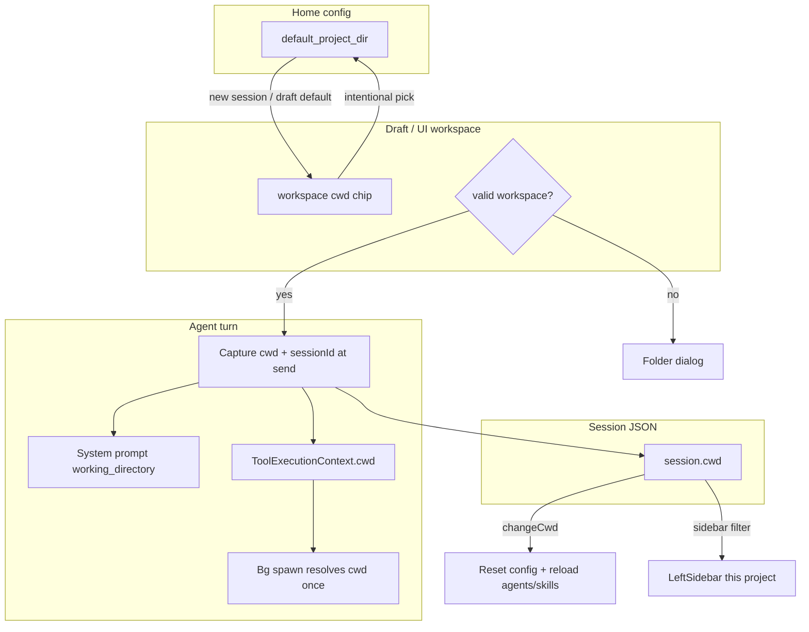

# feat: Per-session working directory and project-scoped session sidebar

## Summary

Give every Electron session an absolute working directory, stop treating process launch cwd as the project root, and make new sessions inherit a sticky home-config default with a folder gate when none is valid. Thread that cwd through chat prompts and tools (never `process.chdir`), reload project config/agents/skills when the workspace changes, keep existing background commands on their original spawn cwd, and scope the left session rail to the current workspace with an expand for other projects.

---

## Problem Frame

The Electron app currently uses a single process-global `process.cwd()` for system prompts, file/process tools, AST/RAG, and project-scoped agents/skills. Sessions have no stored project path, so switching chats does not switch workspace, new sessions can silently inherit an unrelated launch directory (e.g. app install path), and the left sidebar mixes every repo into one recency list.

---

## Requirements

- R1. Each session persists an absolute `cwd` (working/project directory).
- R2. New sessions inherit a sticky home-config `default_project_dir` when that path is valid; they must not default to Electron launch `process.cwd()` for user-facing project work.
- R3. When no valid sticky default exists (first run, missing/invalid path), the user must choose a folder before the agent can run (send blocked / gate).
- R4. Intentional folder selection (gate picker, open folder, session `/cd` / change-cwd) updates both the session (or draft) workspace and `default_project_dir`. Merely loading an old session does not rewrite the sticky default.
- R5. Changing a session’s cwd reloads project config (`.orchid.json` merge) and project agents/skills for that path immediately. Existing background commands keep the cwd they were spawned with.
- R6. Tools, system prompt `<working_directory>`, and related project-root features resolve against the turn’s session cwd (captured at turn start), not live “whatever is active” at tool completion.
- R7. Never call `process.chdir` for session workspace changes.
- R8. Left sidebar lists sessions for the current workspace by default (date groups inside that set); other projects are behind an explicit expand control; search covers all sessions.
- R9. Legacy sessions without `cwd` remain loadable and appear under Other/Unknown until a path is bound.
- R10. Path comparisons use a normalized absolute form (resolve + realpath when the path exists); v1 membership is exact-path match, not parent/child nesting.

---

## Scope Boundaries

- Electron app only (`electron/`); Python TUI multi-cwd parity is out of scope.
- Path sandboxing / restricting tools to project root remains deferred (existing known gap).
- Multi-window independent workspaces beyond “active session has a cwd” not required.
- Nested “include children of project” session matching deferred.
- Recent-projects MRU list beyond sticky default deferred (unless trivial alongside U2).
- Agent-facing `change_working_directory` tool deferred; user IPC + `/cd` + folder dialog are in scope.
- Session-as-workspace IDE (Monaco, file tree) out of scope.

### Deferred to Follow-Up Work

- Python TUI parity for per-session cwd.
- Recent project chips (last N paths).
- Optional “include subfolders” session filter.
- Agent tool to change cwd with confirmation.
- Path sandbox / permission system (R20).

---

## Context & Research

### Relevant Code and Patterns

- Session domain: `electron/src/shared/types/session.ts` — no `cwd` today; v1 JSON via `sessionToStorageDict` / `sessionFromStorageDict`.
- Manager: `electron/src/main/session/manager.ts` — `create`, `switchTo`, `clearActive`, `changeModel` pattern for mutable fields + save.
- Storage list: `electron/src/main/session/storage.ts` — partial head read for id/name/model; extend for `cwd` (serialize `cwd` near top of JSON).
- Session IPC: `electron/src/main/ipc/session.ts`, preload `window.orchid.session`, types in `electron/src/shared/types/ipc.ts` and `ipc-boundary.ts`.
- Draft / first send: `clearActive` + `ensureActiveSession` in `electron/src/main/ipc/chat.ts`; renderer `useSession.enterDraft` / `onCreated`.
- Chat state cwd chrome: `ChatStateEvent.cwd` already exists but is always `process.cwd()`.
- Tools: `ToolHandler = (input) => …` with no context (`electron/src/main/tools/types.ts`); dual paths `createExecuteFn` (chat) and `executeToolCall` (orchestrator).
- Config: `electron/src/main/config/schema.ts` + `loader.ts` — home `~/.orchid/config.json`, project `.orchid.json` under `projectDir`; `ConfigManager.load` caches first result; `reset()` required before re-merge for a new project dir.
- Agents/skills: `loadAgents` / `loadSkills` accept `projectDir` but only wired at startup from process cwd.
- Background: `background-store.ts` resolves `cwd` at spawn with `path.resolve` — already sticky per process; default `'.'` must become session cwd at spawn.
- Sidebar: `electron/src/renderer/components/LeftSidebar.tsx` — recency buckets only; `SessionSummary` lacks path.
- Empty source dir `electron/src/main/project/` plus orphaned `electron/dist/main/project/*` (path inspect/canonicalize helpers) — useful design reference; reimplement as first-class TypeScript source, do not depend on dist.

### Institutional Learnings

- `docs/solutions/` has no learnings specific to session cwd; only unrelated MCP runner note.

### External References

- None required — local Electron patterns are sufficient.

---

## Key Technical Decisions

| Decision | Choice | Rationale |
|----------|--------|-----------|
| Storage field | Session `cwd: string` (absolute) once bound | Matches existing chat/prompt vocabulary; one field for tools and UI |
| Sticky default | Home config `default_project_dir: string \| null` | Survives restarts; not project-local (would be circular) |
| New session default | Valid sticky default only; never launch cwd as product default | Avoids install/launcher directory confusion |
| Gate | Block `chat:send` (and show UI) when workspace unbound | Draft mode can hold `draftCwd` before session file exists |
| Sticky update policy | Update on intentional pick / change-cwd; not on session load | Prevents jitter when browsing old repos |
| Tool context | Extend handlers with `ToolExecutionContext { cwd, sessionId? }` | Explicit > `process.chdir` or racey active-session reads |
| Turn capture | Freeze `cwd` (+ sessionId) when turn starts; pass into stream/execute | Mid-turn session switch must not rebind tools |
| Project reload | On bind/change: `ConfigManager.reset()` + `load({ projectDir })`, reload agents/skills with that `projectDir` | Matches confirmed product rule |
| Bg commands | Keep spawn-time resolved cwd; pass sessionId when spawning | Existing store already sticky; improves multi-session visibility |
| Sidebar filter key | Normalized absolute path equality to current workspace | Exact match for v1 |
| Current workspace for list | Draft cwd if set → else active session cwd → else valid sticky default | One chip drives both gate and filter |
| Legacy sessions | `cwd` missing → Other/Unknown group | No silent migration to launch cwd |
| Normalization | Absolute path; `realpath` when path exists; store canonical absolute | Symlinks / trailing slash stability |

---

## Open Questions

### Resolved During Planning

- **Default for new sessions:** sticky `default_project_dir`, not process cwd.
- **Gate vs always pick:** gate only when sticky missing/invalid.
- **Reload project layers:** immediately on cwd change.
- **Bg processes:** keep original cwd.
- **Sidebar:** current project first + expand other projects; search all.
- **Load old session:** do not rewrite sticky default.
- **Electron-only:** yes.

### Deferred to Implementation

- Exact UI copy for gate and “Show other projects (N)”.
- Whether `/cd` is a slash-command in the existing command registry or a small composer control (prefer command registry if `/model`-style patterns already exist).
- Whether home `config:save` should strip project-only fields when writing sticky default (existing merge/save behavior already writes the merged home object — keep consistent with current config IPC unless a clean home-only patch path is easy).
- How aggressively to surface missing session cwd on load (banner vs modal) — minimum: block tools that need a root and offer re-link folder.

---

## High-Level Technical Design

> *This illustrates the intended approach and is directional guidance for review, not implementation specification. The implementing agent should treat it as context, not code to reproduce.*



**Workspace resolution (read path):**

```
resolveWorkspace():
  if draftCwd bound → use it
  else if activeSession?.cwd → use it
  else if valid(default_project_dir) → use it
  else → unbound
```

**Write paths that update sticky default:** folder gate, open-folder, `session:change_cwd` / `/cd`.

**Write paths that do not:** `session:load` of another project’s session (session becomes active with its own cwd; sticky unchanged).

---

## Implementation Units

### U1. Path helpers and sticky default config

**Goal:** Shared path validation/normalization and home-config sticky project directory.

**Requirements:** R2, R3, R7, R10

**Dependencies:** None

**Files:**
- Create: `electron/src/main/project/path.ts` (and barrel if useful)
- Modify: `electron/src/main/config/schema.ts`
- Modify: `electron/src/shared/types/ipc-boundary.ts` (`Config`)
- Modify: `electron/src/main/config/loader.ts` (only if defaults/docs comments need updates)
- Test: `electron/tests/unit/project-path.test.ts`
- Test: `electron/tests/unit/config.test.ts` (extend)

**Approach:**
- Implement `inspectProjectDirectory` / `canonicalizeProjectDirectory` / `getProjectDirectoryStatus` (`unbound` | `valid` | `missing`) using absolute paths, existence, directory check, and readable/executable access; prefer realpath when present.
- Add optional `default_project_dir: string | null` (or empty string treated as null) to config schema with default `null`.
- Do not invent sticky default from `process.cwd()` on first load.

**Patterns to follow:**
- Orphaned design in `electron/dist/main/project/path.js` (reimplement in source).
- Zod defaults and `configSchema.strict()` in `schema.ts`.

**Test scenarios:**
- Happy path: absolute existing directory → `valid` + canonical path.
- Edge case: relative path rejected or resolved then re-validated as absolute-only (prefer reject relative at API boundary).
- Edge case: missing path → `missing`, not silently remapped to process cwd.
- Happy path: config parse accepts `default_project_dir` null and a valid absolute string.
- Error path: non-directory path → not valid.

**Verification:**
- Unit tests pass; config defaults remain valid without the field set.

---

### U2. Session `cwd` domain, persistence, and summaries

**Goal:** Sessions store absolute cwd; list metadata includes cwd for sidebar filtering.

**Requirements:** R1, R9, R10

**Dependencies:** U1

**Files:**
- Modify: `electron/src/shared/types/session.ts`
- Modify: `electron/src/shared/types/ipc-boundary.ts` (`SessionSummary`)
- Modify: `electron/src/main/session/manager.ts`
- Modify: `electron/src/main/session/storage.ts`
- Test: `electron/tests/unit/session-persistence.test.ts`
- Test: `electron/tests/parity/sessions.test.ts` (if assertions on summary shape)

**Approach:**
- Add `cwd: string | null` on `Session` (null = unbound/legacy).
- Serialize `cwd` near top of JSON (after id/name/model) so partial list reads pick it up.
- `sessionFromStorageDict`: missing `cwd` → `null` (legacy).
- `SessionManager.create(model, options?)`: set `cwd` from caller-supplied absolute path or null; do not call `process.cwd()` as silent default.
- `changeCwd(id, cwd)` (or active-only): validate via U1 helpers, store canonical absolute path, update `updatedAt`, save.
- `listSavedSessions`: extract `cwd` in partial read; include on `SessionSummary` as `cwd: string | null`.

**Patterns to follow:**
- `changeModel` / `rename` mutate-and-save pattern in `manager.ts`.
- Partial head extractors in `storage.ts`.

**Test scenarios:**
- Happy path: create with cwd → disk JSON contains cwd → load restores it.
- Happy path: list summary includes cwd without full parse when present in head.
- Edge case: legacy file without cwd → load yields `cwd: null`; list summary `cwd: null`.
- Happy path: `changeCwd` persists and is visible on reload.
- Error path: `changeCwd` to missing path fails without corrupting prior cwd (define: reject vs allow missing-for-rebind — prefer reject for change, allow explicit re-link flow to set only after pick of valid dir).

**Verification:**
- Persistence and list tests cover create/load/list/change; no process cwd written into new sessions unless explicitly passed.

---

### U3. Workspace binding IPC, draft state, folder gate, sticky updates

**Goal:** Main + renderer can resolve workspace, pick folders, change session cwd, gate send when unbound, and update sticky default only on intentional picks.

**Requirements:** R2, R3, R4, R7

**Dependencies:** U1, U2

**Files:**
- Modify: `electron/src/main/ipc/session.ts`
- Modify: `electron/src/main/ipc/chat.ts` (`ensureActiveSession`, `chat:send` gate)
- Modify: `electron/src/shared/types/ipc.ts` (channels, `OrchidAPI`, payloads)
- Modify: `electron/src/preload/index.ts`
- Modify: `electron/src/renderer/hooks/useSession.ts`
- Modify: `electron/src/renderer/hooks/useChat.ts` (send preconditions / surface errors)
- Create or modify: main dialog helper (e.g. `session:pick_project_dir` using `dialog.showOpenDialog`)
- Test: `electron/tests/unit/chat-ipc.test.ts` and/or new `session-workspace-ipc.test.ts`

**Approach:**
- Main holds optional **draft workspace** (window-scoped or process-scoped singleton consistent with single-window today) set by pick/clear; cleared or promoted on session create.
- IPC surface (names indicative):
  - `session:get_workspace` → `{ cwd, source: 'draft' | 'session' | 'default' | 'unbound', status }`
  - `session:pick_project_dir` → native directory dialog → validate → set draft or active session + update sticky
  - `session:change_cwd` → `{ id, cwd }` validate + `changeCwd` + sticky update
  - Event `session:workspace_changed` for UI refresh
- `ensureActiveSession`: when creating, require valid workspace (draft or sticky); set session.cwd from it; if unbound, fail send with a clear error status instead of creating.
- `chat:send`: if unbound after resolution, return structured failure / do not start stream.
- `session:load`: activate session cwd for tools/UI; **do not** write `default_project_dir`.
- Persist sticky via home config update (patch `default_project_dir` + save path consistent with existing config persistence).

**Patterns to follow:**
- Zod-validated session handlers in `session.ts`.
- Lazy create + `SESSION_CREATED` in `chat.ts`.
- Preload allowlists for invoke/event channels.

**Test scenarios:**
- Happy path: sticky valid → draft/new session create uses it without dialog.
- Happy path: intentional pick updates sticky and draft/session cwd.
- Happy path: load session in other project does not change sticky.
- Error path: `chat:send` with unbound workspace does not create session / does not stream.
- Integration: pick → create on first send → session JSON has that cwd.

**Verification:**
- IPC tests cover gate, sticky policy, and load-without-sticky-update.

---

### U4. Tool execution context and replace process.cwd for agent work

**Goal:** Prompts and tools use the turn’s session cwd.

**Requirements:** R5 (tool side), R6, R7

**Dependencies:** U2, U3

**Files:**
- Modify: `electron/src/main/tools/types.ts`
- Modify: `electron/src/main/llm/tool-dispatch.ts`
- Modify: `electron/src/main/ipc/chat.ts` (`createStreamFn`, `createExecuteFn`, `CHAT_STATE` cwd)
- Modify: `electron/src/main/agents/subagent-runner.ts`
- Modify: filesystem tools under `electron/src/main/tools/filesystem/`
- Modify: `electron/src/main/tools/search/grep.ts`
- Modify: `electron/src/main/tools/process/execute-command.ts`
- Modify: `electron/src/main/tools/process/background-store.ts` usage (pass sessionId + resolved cwd)
- Modify: AST/RAG tools and indexers call sites that hardcode `process.cwd()`
- Modify: `electron/src/main/ipc/ast.ts` (and rag IPC if present) to use active workspace
- Test: `electron/tests/unit/file-tools.test.ts`
- Test: `electron/tests/unit/search-process-tools.test.ts`
- Test: `electron/tests/unit/llm-orchestrator.test.ts` / tool-dispatch coverage as needed

**Approach:**
- Introduce `ToolExecutionContext { cwd: string; sessionId?: string }`.
- Change `ToolHandler` to `(input, ctx) => …`. Prefer a registry adapter so any remaining one-arg handlers fail loudly in tests rather than silently using process cwd.
- **Three call paths must pass the same frozen turn context:** (1) `executeToolCall` in the orchestrator, (2) `createExecuteFn` in chat IPC, (3) `tool:execute` IPC if it runs built-in tools outside a turn (resolve active workspace there or reject if unbound).
- Resolve relative tool paths with `path.resolve(ctx.cwd, userPath)`; leave absolute paths absolute.
- Default `execute_command` working directory and bg spawn cwd to `ctx.cwd` when omitted; pass `sessionId` into background-store spawn options.
- System prompt context: `cwd` from session/turn, not `process.cwd()`.
- `CHAT_STATE.cwd` reports active workspace for UI chrome.
- Subagent runner inherits parent session cwd.
- MCP tool wrappers: no filesystem root unless a server config sets `cwd`; optional follow-up to default MCP stdio `cwd` to session cwd when spawning servers (do not block U4).
- Prefer a small `resolvePath(ctx.cwd, p)` helper used by file tools to avoid one-off bugs.
- Grep-driven completion: zero remaining `process.cwd()` in agent-facing tool/chat/subagent paths (config loader default arg may remain as last-resort only if never hit for product flows).

**Patterns to follow:**
- Existing `ToolDispatchOptions.sessionId` for offload paths.
- `path.resolve` usage in `execute-command` / background-store.

**Test scenarios:**
- Happy path: relative read under session cwd finds file; same relative path fails or differs under another cwd.
- Happy path: execute_command without working_directory runs in session cwd.
- Happy path: system prompt / stream context receives session cwd.
- Edge case: mid-test active session switch does not change an in-flight turn’s frozen ctx (unit-level by capturing ctx at start).
- Integration: bg spawn keeps original cwd when session `changeCwd` happens after spawn (document + light test if store exposes entry cwd).
- Integration: both orchestrator dispatch and chat `createExecuteFn` paths receive ctx (regression if either still calls handler with one arg only).

**Verification:**
- Grep gate clean for agent-facing `process.cwd()`; both dispatch paths unit-covered.

---

### U5. Project config / agents / skills reload on workspace change

**Goal:** When workspace binds or session cwd changes, project layers refresh immediately.

**Requirements:** R5

**Dependencies:** U1, U3, U4 (can start after U3; should land before claiming feature complete)

**Files:**
- Modify: `electron/src/main/config/loader.ts` / callers (`ConfigManager.reset` + `load({ projectDir })`)
- Modify: `electron/src/main/agents/registry.ts` usage sites
- Modify: `electron/src/main/skills/registry.ts` usage sites
- Modify: `electron/src/main/index.ts` startup load to use sticky/default workspace if available
- Create: small `applyWorkspaceProjectLayers(projectDir: string)` helper (location under `electron/src/main/project/` or config)
- Test: `electron/tests/unit/agent-skill-loading.test.ts` (extend)
- Test: config reload tests in `config.test.ts` or new workspace reload test

**Approach:**
- Centralize: reset config cache → load with `projectDir` → reload agents/skills with that projectDir (home dirs unchanged).
- Call from: successful folder pick, `changeCwd`, session activate when cwd differs from last applied project dir, app startup when sticky valid.
- Track `lastAppliedProjectDir` to avoid redundant reloads.
- Do not terminate existing background commands on reload.

**Patterns to follow:**
- Existing `loadAgents({ projectDir })` / `loadSkills({ projectDir })` option shapes.
- `ConfigManager.reset` after `config:save`.

**Test scenarios:**
- Happy path: switching projectDir causes project `.orchid.json` overrides to apply after reset+load.
- Happy path: project agents/skills under `.orchid/agents|skills` become visible after switch.
- Edge case: reload is no-op when path unchanged (optional).
- Error path: missing project config file still loads home+defaults successfully.

**Verification:**
- Tests show project-local skill/agent or config key appears only after applying that projectDir.

---

### U6. Project-scoped session sidebar and workspace chrome

**Goal:** Left rail defaults to current workspace sessions; other projects expandable; search global; workspace visible and changeable.

**Requirements:** R8, R3, R4

**Dependencies:** U2, U3

**Files:**
- Modify: `electron/src/renderer/components/LeftSidebar.tsx`
- Modify: `electron/src/renderer/components/ChatView.tsx` / `Sidebar.tsx` as needed for workspace chip and gate empty state
- Modify: `electron/src/renderer/hooks/useSession.ts` (workspace state, events)
- Modify: command registry if adding `/cd` (`electron/src/renderer/commands/registry.ts` and/or main commands)
- Test: `electron/tests/integration/chat-sidebar.test.ts` or new renderer-focused unit test if patterns exist
- Optional: component-level tests if the repo has a pattern for them

**Approach:**
- Resolve `currentWorkspace` from main workspace API / session + sticky.
- Split summaries: `inProject` vs `other` by normalized cwd equality; null cwd → other/unknown.
- Default render: date-group `inProject` only.
- Control: “Show other projects (N)” expands sections grouped by directory basename or full path, then date within group.
- Search non-empty: include all sessions; show path hint on other-project rows.
- Always surface active session if it would be filtered out (pin or auto-include).
- Unbound empty state: prompt + Open folder button calling pick IPC.
- Composer/send: disable or intercept when unbound.
- Workspace chip shows truncated path + change action.

**Patterns to follow:**
- Existing `groupSessions` date buckets in `LeftSidebar.tsx`.
- Session search filter already in sidebar.

**Test scenarios:**
- Happy path: two sessions different cwds → only matching current workspace visible by default.
- Happy path: expand shows other count and sessions.
- Happy path: search finds session in other project while collapsed.
- Edge case: legacy null cwd appears only in other/unknown.
- Edge case: active session outside filter still visible or workspace chip follows session on select (prefer: selecting a session sets UI workspace to that session’s cwd without updating sticky).

**Verification:**
- Manual or integration check: filter, expand, search, unbound gate UI.

---

## System-Wide Impact

- **Interaction graph:** Chat send, session create/load/clear, config load, agent/skill registries, tool dispatch (both paths), subagent runner, AST/RAG IPC, left sidebar, right status cwd, background process store.
- **Error propagation:** Unbound workspace and invalid change-cwd should return structured IPC errors the renderer can show without throwing unhandled invoke failures.
- **State lifecycle risks:** Draft cwd vs session cwd vs sticky default must stay consistent across `clearActive`, first send, and load; config cache must reset when projectDir changes or project overrides stick forever.
- **API surface parity:** Preload allowlists, shared IPC types, and any renderer command palette entries must stay in sync.
- **Integration coverage:** Gate + sticky + tool path resolution cannot be proven by pure unit tests alone — include at least one cross-layer test for create-with-cwd and tool relative path.
- **Unchanged invariants:** Session UUIDs and chain message format; bg process isolation by sessionId (improved, not removed); no `process.chdir`; path sandbox still not enforced.

---

## Risks & Dependencies

| Risk | Mitigation |
|------|------------|
| Dual tool execution paths miss context | Update `createExecuteFn`, `executeToolCall`, and `tool:execute`; grep for `handler(` / `process.cwd()` |
| Handler signature churn across all builtins | Single `ToolExecutionContext` type + mechanical updates; fail tests if any builtin ignores ctx |
| Config cache serves wrong project | Always `reset()` before `load({ projectDir })`; track last applied dir |
| Draft cwd lost on renderer reload | Prefer main-process draft workspace keyed by windowId over renderer-only state |
| Partial list read misses `cwd` | Serialize cwd early; fallback full parse if missing from head |
| Sticky default points at deleted folder | Treat as invalid → gate; do not fall back to launch cwd |
| `config:save` writes merged project keys into home | Stay consistent with existing behavior; only add `default_project_dir` carefully |
| Large tool registry churn | Shared path helper + mechanical ctx pass; keep handler body changes minimal |
| Orphan dist/project confusion | Implement real source under `src/main/project/`; ignore dist as runtime source of truth |

---

## Documentation / Operational Notes

- User-facing: sessions are tied to a project folder; new chats reuse last project; change via chip / `/cd` / Open folder.
- No migration script required: missing session `cwd` is null/legacy.
- Optional note in Electron README or in-app empty state explaining first-run folder pick.

---

## Phased Delivery

### Phase A — Foundation (U1–U3)

Path helpers, sticky default, session persistence, IPC, gate. UI can still show global list temporarily if needed, but send/create must be workspace-correct.

### Phase B — Correctness (U4–U5)

Tools/prompt/subagents + project layer reload. Feature is behaviorally correct even if sidebar is still flat.

### Phase C — Navigation UX (U6)

Project-scoped sidebar, expand other projects, workspace chrome polish.

---

## Sources & References

- Conversation decisions (confirmed synthesis): per-session cwd, sticky default, gate, reload project layers, bg cwd sticky, project-scoped sidebar.
- Related prior work: `docs/plans/2026-07-08-002-fix-migration-regressions-batch-1-plan.md` (U12 process cwd display only).
- Related code: `electron/src/main/session/*`, `electron/src/main/ipc/chat.ts`, `electron/src/main/tools/*`, `electron/src/renderer/components/LeftSidebar.tsx`, `electron/src/main/config/*`.
)
