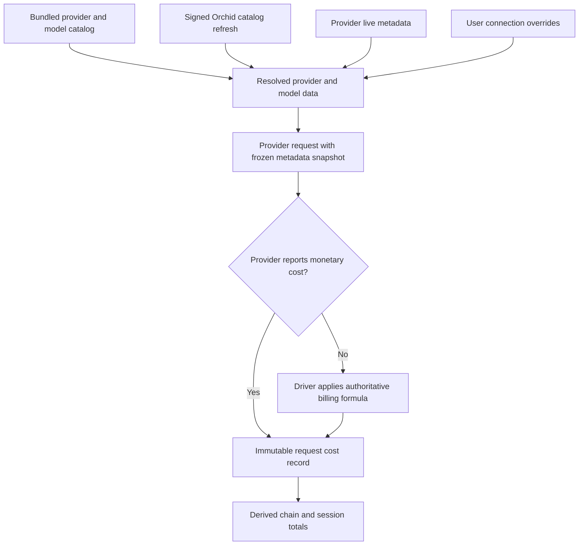
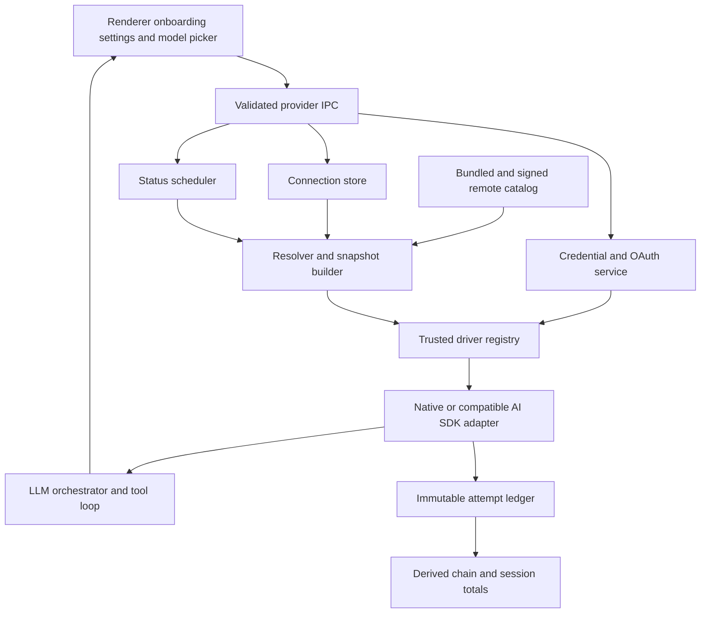
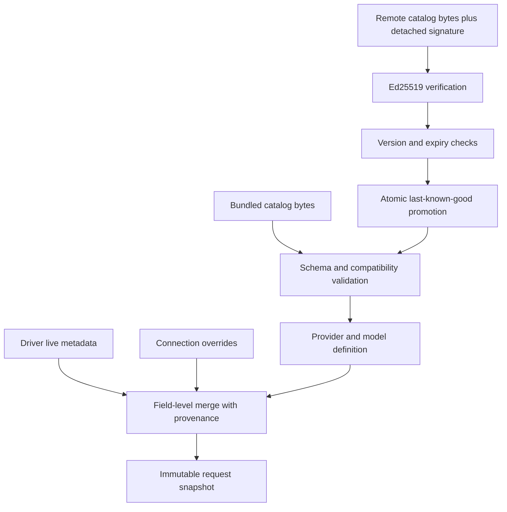
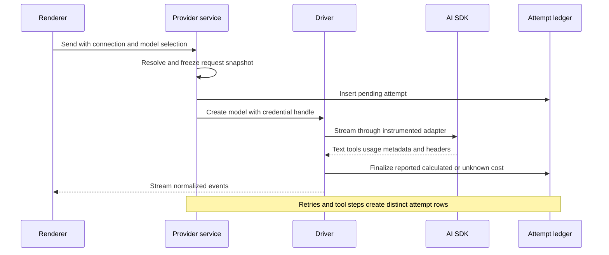
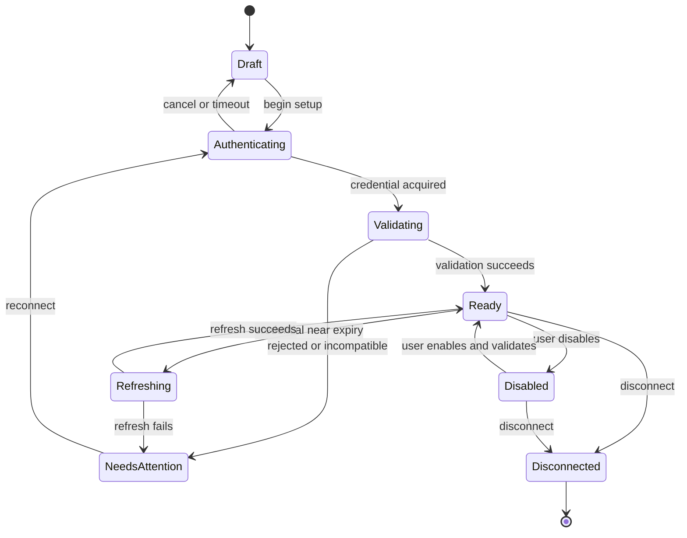

# Provider System Refactor - Plan

## Goal Capsule

- **Objective:** Replace Orchid's development-era provider configuration with a provider system that has no preconfigured provider, supports trusted provider-specific authentication and protocols, maintains current model and provider metadata, and records authoritative request costs for later analytics.
- **Product authority:** This Product Contract defines user-visible provider onboarding, connections, model metadata, authentication, costing, and live status behavior.
- **Execution profile:** Deep cross-cutting refactor in the Electron main process, shared IPC contracts, persistence, and renderer, delivered through U1-U9 in dependency order.
- **Open blockers:** None for implementation start. Release enablement still requires the OAuth registrations, provider contract checks, catalog publication path, and Lilac supply-discount source named under Planning Contract prerequisites.

---

## Product Contract

### Summary

Orchid will use trusted, app-shipped provider drivers with a bundled catalog and signed, data-only remote updates.
Users connect one or more provider accounts through API credentials or supported subscription login flows, while Orchid records immutable per-request usage and cost data and exposes informational provider status.

### Problem Frame

Orchid currently ships an OpenCode endpoint as its default provider and represents providers as loosely typed configuration records.
The resolver recognizes several provider names, but the runtime factory only instantiates OpenAI and OpenAI-compatible clients, so the configuration surface promises broader support than the request path delivers.

Provider setup also assumes bearer-style API credentials and static model metadata.
It cannot represent subscription login, multiple accounts for one provider, mixed protocols within a provider, live subscription discounts, quota state, or energy-based billing.
Existing token usage is persisted, but monetary cost and the pricing evidence used to derive it are not.

This prevents individuals from using subscription entitlements where available, deciding whether current variable pricing is attractive, and building reliable cost analytics later.

### Key Decisions

- **No configured provider by default.** A fresh installation does not silently select or connect OpenCode or any other provider.
- **Trusted code, remotely refreshed data.** Provider drivers that handle credentials and requests ship with Orchid; signed remote catalog updates may change data and compatibility state but never execute new code.
- **Provider definitions and user connections are separate.** A provider describes capabilities and available authentication methods, while each connection represents one independently selectable account or endpoint.
- **Cost is authoritative or unknown.** Orchid uses a provider-reported monetary charge when present; otherwise a trusted provider driver applies an authoritative billing formula to provider-reported usage and the request's pricing snapshot.
- **Historical cost is immutable.** Catalog and status refreshes never recalculate completed requests.
- **Dynamic status is informational.** Price, quota, supply, uptime, latency, and availability metadata may inform users but never block, reroute, or delay a request.
- **`models.dev` is a seed, not a runtime dependency.** Its current dataset may be copied to create the initial catalog; later catalog changes are maintained by Orchid or obtained through provider-specific live sources.
- **Development configuration is not migrated.** The refactor does not preserve the current provider configuration format or untouched shipping OpenCode default.

The system has distinct data authorities and keeps their provenance through request completion:



### Actors

- A1. **End user:** Connects provider accounts, selects models, views current provider information, and expects requests to use the selected account and pricing context.
- A2. **Orchid provider driver:** Owns trusted authentication, protocol selection, request adaptation, usage normalization, cost extraction or calculation, and provider-specific status integration.
- A3. **Orchid catalog service:** Supplies signed provider and model data updates without distributing executable code.
- A4. **External provider:** Authenticates the user, serves inference requests, and may expose models, usage, cost, quota, pricing, or operational status.

### Initial Provider Coverage

| Provider | Initial authentication | Protocol behavior | Provider-specific metadata |
|---|---|---|---|
| OpenAI | API key | Native OpenAI APIs | Models, capabilities, limits, and token pricing |
| ChatGPT/Codex | Compatible subscription login with refreshable OAuth credentials | OpenAI/Codex subscription request behavior | Entitlement and usage-limit information when available |
| Anthropic | API key | Native Anthropic Messages API | Models, capabilities, limits, cache pricing, and token pricing |
| Google Gemini | API key | Native Google Generative AI API | Models, capabilities, limits, and token pricing |
| xAI | API key | Native xAI API | Models, capabilities, limits, and token pricing |
| Grok subscription | Compatible subscription login with refreshable OAuth credentials | xAI/Grok subscription request behavior | Entitlement and usage-limit information when available |
| OpenCode Go | API key | Per-model OpenAI-compatible or Anthropic Messages routing | Curated models, limits, and subscription-denominated token rates |
| Lilac | API key | OpenAI-compatible API | Live model performance, supply state, subscription discounts, models, and pricing |
| Neuralwatt | API key | OpenAI-compatible API with Neuralwatt extensions | Models, capabilities, quota, accounting method, token pricing, and per-request energy |
| Generic OpenAI-compatible | API key, environment credential, or no credential as configured | Configurable OpenAI-compatible endpoint | User-defined models plus optional endpoint discovery |
| Generic Anthropic-compatible | API key, environment credential, or no credential as configured | Configurable Anthropic Messages-compatible endpoint | User-defined models plus optional endpoint discovery |

### Requirements

**Provider foundations and configuration**

- R1. Orchid must ship with provider definitions and model metadata but no configured provider connection or selected default model.
- R2. Provider definitions must be separate from user-created connections so multiple connections can reference the same provider independently.
- R3. Each connection must have a stable user-visible name and independently selectable credentials, endpoint settings, available models, and usage attribution.
- R4. Removing or disabling one connection must not modify another connection for the same provider.
- R5. Orchid must reject provider configurations whose declared protocol or authentication method is not supported by the selected trusted driver.
- R6. Generic OpenAI-compatible and Anthropic-compatible connections must allow custom endpoints and models without requiring a named provider driver.
- R7. Provider and model selection must identify the connection as well as the model so requests cannot silently switch accounts.

**Onboarding and disconnected behavior**

- R8. First-run onboarding must guide the user through selecting a provider preset, creating a connection, authenticating it, and choosing an initial model.
- R9. The user may skip provider setup and enter Orchid without a provider connection.
- R10. With no usable provider connection, Orchid must keep local project browsing, session/history viewing, configuration, and provider setup available while disabling LLM-backed actions.
- R11. Disabled LLM actions must explain that a provider connection is required and offer a direct path to provider setup.
- R12. Completing or repairing a provider connection must enable LLM-backed actions without requiring the user to recreate the workspace or session.

**Authentication and credential lifecycle**

- R13. Each provider driver must declare the authentication methods it supports so onboarding and settings only present valid choices.
- R14. API credentials must support secure local storage and environment-variable references without persisting plaintext secrets in ordinary configuration or session data.
- R15. OAuth-capable drivers must support the provider's compatible browser callback or device-code flow, including state and PKCE protections where applicable.
- R16. Refreshable credentials must be renewed before or after expiry without exposing access or refresh tokens to the renderer, catalog service, logs, or persisted request records.
- R17. A failed, expired, revoked, or upstream-incompatible subscription login must disable only the affected connection and provide a reconnect path.
- R18. Disconnecting an account must remove Orchid's stored credentials and explain any upstream authorization or generated credential that the user must revoke separately.
- R19. Compatible subscription login must be labeled as a versioned integration whose availability can change when the upstream provider changes its client or entitlement behavior.

**Catalog and model metadata**

- R20. Orchid must include a bundled offline catalog containing the initial provider set and predefined model metadata.
- R21. The initial catalog may copy provider, model, capability, limit, and pricing data from a pinned snapshot of `models.dev/api.json` without retaining `models.dev` as an update dependency.
- R22. Orchid must refresh catalog data from an Orchid-controlled signed remote source and retain the bundled or last-known-good catalog when refresh fails.
- R23. Remote catalog payloads must be authenticated, validated, and applied atomically before becoming visible to users or requests.
- R24. Remote catalog data may add, update, deprecate, disable, or annotate provider and model definitions but must not add executable authentication or request logic.
- R25. Predefined model metadata must represent display identity, provider model ID, protocol family, input and output modalities, tool and reasoning capabilities, context and output limits, lifecycle status, and supported pricing dimensions.
- R26. Model pricing must support input, output, cached input, cached output or cache write, reasoning, context tiers, currency, and effective timestamps when the provider distinguishes them.
- R27. A provider driver may augment catalog data from public or authenticated provider model endpoints and must retain the source and observation time of each dynamic field.
- R28. Explicit user overrides must win over catalog defaults for custom connection behavior, while Orchid must visibly distinguish overridden values from catalog or provider-reported values.
- R29. Every inference request must freeze the resolved provider, model, capability, and pricing data it uses so an in-flight refresh cannot change request semantics or accounting.

**Protocol and request execution**

- R30. Provider drivers must instantiate the correct native or compatible Vercel AI SDK adapter instead of routing recognized non-OpenAI providers through the OpenAI client.
- R31. A provider driver must be able to select a protocol per model, as required by OpenCode Go's mix of OpenAI-compatible and Anthropic Messages models.
- R32. Drivers may normalize provider-specific request fields, response envelopes, usage details, and streaming quirks while preserving Orchid's common stream and tool-call behavior.
- R33. Provider retries or multi-step tool loops must preserve the connection and frozen request context selected for the turn.
- R34. Each billable provider attempt must be attributable even when it is a retry, fails after partial delivery, or belongs to a multi-step tool loop, whenever authoritative usage or cost data is available.

**Usage and cost accounting**

- R35. Orchid must persist an immutable record for each attributable provider request containing its session, chain, provider definition, connection, model, timestamps, outcome, and normalized usage dimensions.
- R36. A request record must store monetary cost, currency, billing method, calculation source, pricing version or snapshot, and provider-specific billing units used in the calculation.
- R37. Provider-reported monetary request cost must take precedence over any locally calculated value.
- R38. When monetary cost is not reported, the trusted driver may calculate it only from authoritative provider-reported usage and the pricing formula frozen for that request.
- R39. Token accounting formulas must support separate rates for input, output, cache read, cache write, reasoning, and context-dependent tiers when applicable.
- R40. Non-token accounting formulas may use authoritative units such as Neuralwatt's measured charged energy and the applicable energy rate or multiplier.
- R41. Orchid must record cost as unknown when the provider neither reports a monetary charge nor supplies enough authoritative data for its driver to calculate one.
- R42. Orchid must not treat subscription access, quota consumption, promotional credits, or an absent monetary charge as zero cost unless the provider explicitly reports a zero charge or the frozen pricing formula resolves to zero.
- R43. Chain and session totals must be derived from immutable request records rather than maintained as independent mutable accounting sources.
- R44. Catalog, pricing, or status changes must not rewrite historical request cost or derived historical totals.
- R45. Usage and cost records must never contain API keys, access tokens, refresh tokens, authorization codes, or other reusable credentials.

**Provider status and dynamic information**

- R46. Provider drivers may expose public operational status and authenticated account status as timestamped, provider-specific metadata.
- R47. Normalized status must support availability, staleness, quota or balance, subscription state, reset windows, pricing state, and model performance where the provider supplies them.
- R48. Lilac integration must capture model throughput, time to first token, uptime, subscription supply state, discount, multiplier, and the provider's update timestamp.
- R49. Neuralwatt integration must capture account accounting method, credit or subscription quota, token and energy usage, rate-limit tier, and model pricing/capability metadata.
- R50. Status refresh cadence must be independent of inference execution and must respect provider-documented freshness and rate limits.
- R51. Missing, stale, unauthorized, or failed status refreshes must be represented honestly and must not make an otherwise usable provider connection unavailable.
- R52. Status and dynamic pricing are informational only and must not automatically block, delay, reroute, or recommend whether to send a request.

### Key Flows

- F1. Provider setup during onboarding
  - **Trigger:** A1 opens Orchid with no usable provider connection.
  - **Actors:** A1, A2, A4.
  - **Steps:** Orchid presents the provider catalog; A1 selects a provider and authentication method; the driver completes authentication and validates the connection; A1 selects an initial model.
  - **Outcome:** Orchid enables LLM-backed actions using the new connection without having preselected a provider on the user's behalf.
  - **Covered by:** R1, R2, R8-R12, R13-R19.

- F2. Skip onboarding and connect later
  - **Trigger:** A1 skips provider setup.
  - **Actors:** A1.
  - **Steps:** Orchid opens the workspace with local features available; LLM-backed controls explain why they are disabled; A1 later opens provider setup and creates a connection.
  - **Outcome:** Existing local work remains usable and LLM actions become available after connection without recreating the session.
  - **Covered by:** R9-R12.

- F3. Catalog refresh
  - **Trigger:** Orchid checks for a newer remote catalog.
  - **Actors:** A2, A3.
  - **Steps:** Orchid retrieves the signed payload, verifies and validates it, applies it atomically, and retains its provenance; failure leaves the current catalog intact.
  - **Outcome:** Provider/model data stays current without remotely changing executable provider logic.
  - **Covered by:** R20-R29.

- F4. Subscription login and refresh
  - **Trigger:** A1 chooses ChatGPT/Codex or Grok subscription login.
  - **Actors:** A1, A2, A4.
  - **Steps:** The driver begins the compatible browser or device flow; Orchid stores returned credentials securely; the driver refreshes them as required; upstream incompatibility disables only that connection.
  - **Outcome:** The selected subscription account can serve requests or presents a clear reconnect state.
  - **Covered by:** R13, R15-R19.

- F5. Provider request and accounting
  - **Trigger:** An LLM-backed action sends a provider request.
  - **Actors:** A2, A4.
  - **Steps:** Orchid freezes connection/model metadata; the driver selects the correct protocol; the provider returns content and usage; Orchid uses reported cost or applies the authoritative driver formula; Orchid persists the request record.
  - **Outcome:** The response and its accounting evidence are attributable to one connection and remain stable after future catalog changes.
  - **Covered by:** R29-R45.

- F6. Informational provider status refresh
  - **Trigger:** Provider status reaches its refresh interval or A1 requests a refresh.
  - **Actors:** A2, A4.
  - **Steps:** The driver fetches public and authorized status, normalizes common fields, retains provider-specific fields and timestamps, and marks stale or failed data without changing request eligibility.
  - **Outcome:** A1 can inspect current pricing, quota, supply, or performance without Orchid making the send decision.
  - **Covered by:** R46-R52.

### Acceptance Examples

- AE1. **Covers R1, R8-R12.** Given a fresh install with no provider connection, when the user skips onboarding, then local browsing, history, and settings remain available while sending messages and other LLM-backed actions remain disabled with a provider-setup path.
- AE2. **Covers R2-R4, R7.** Given personal and work OpenAI connections, when the user selects the work connection and a model, then the request, usage record, and cost are attributed only to the work connection.
- AE3. **Covers R15-R19.** Given an expired ChatGPT subscription credential with a valid refresh token, when Orchid prepares a request, then the driver refreshes the credential without exposing it to the renderer; if refresh fails, only that connection requires reconnection.
- AE4. **Covers R22-R24.** Given a remote catalog payload with an invalid signature or invalid structure, when refresh runs, then Orchid rejects the entire update and continues using its last-known-good or bundled catalog.
- AE5. **Covers R29, R37, R44.** Given a provider response that reports a monetary request charge, when the catalog price changes afterward, then the reported charge and request snapshot remain unchanged.
- AE6. **Covers R38-R43.** Given an Anthropic request that reports input, output, cache-read, and cache-write usage but no monetary charge, when the request completes, then Orchid calculates cost from the frozen rates for each category and includes the record in chain and session totals.
- AE7. **Covers R40-R42, R49.** Given a Neuralwatt energy-accounted connection whose response and account metadata provide the authoritative charged-energy inputs and rate, when a request completes without a monetary charge, then Orchid calculates the billed cost from those inputs; if any required input is unavailable, cost is unknown rather than token-priced or zero.
- AE8. **Covers R31-R34.** Given an OpenCode Go model declared as Anthropic Messages and another declared as OpenAI-compatible, when each is selected, then the same provider connection routes each request through its declared protocol and accounts for each provider attempt.
- AE9. **Covers R46-R52.** Given Lilac status showing a surplus discount and current model performance, when the data refreshes, then Orchid stores and exposes the timestamped information but does not alter whether or when the user can send.
- AE10. **Covers R41-R43.** Given a subscription request with usage-limit data but neither a provider-reported charge nor an authoritative monetary formula, when it completes, then Orchid records its usage and quota metadata with unknown monetary cost and excludes unknown values from monetary totals without treating them as zero.
- AE11. **Covers R6, R20, R25.** Given a custom Anthropic-compatible endpoint whose model is absent from the catalog, when the user defines its model limits and capabilities, then Orchid can use the model through the generic driver while preserving that the metadata came from the user.

### Success Criteria

- A fresh user can connect any initial provider through the authentication methods declared by its driver and send a first request without editing JSON.
- Every initial provider reaches its native or compatible protocol through a real provider adapter rather than falling through to OpenAI accidentally.
- Every attributable provider request persists normalized usage plus authoritative cost or an explicit unknown-cost state with provenance.
- Chain and session totals reconcile exactly with their underlying known-cost request records.
- Catalog refresh remains useful offline and cannot introduce executable credential or request behavior.
- Removing all connections returns Orchid to the local-only state without making projects, history, or settings inaccessible.
- Provider-specific status failures never interrupt an otherwise valid inference connection.
- The persisted records are sufficient for a later analytics view without migrating away from lossy aggregate-only data.

### Scope Boundaries

**Deferred for later**

- AWS Bedrock, Azure OpenAI, Google Vertex AI, and additional named first-party or managed-cloud drivers.
- A dedicated cost and usage analytics view, including trends, budgets, forecasts, and provider comparisons.
- Automatic provider/model selection based on price, quota, performance, availability, or environmental impact.
- Spend limits, warnings, request scheduling, and recommendations to wait for better dynamic pricing.
- Remotely distributed executable provider plugins.
- Automatic ongoing synchronization from `models.dev` after the initial catalog seed.

**Outside this refactor**

- Migrating or preserving the current development-era provider configuration.
- Treating OpenCode or any other provider as Orchid's endorsed or automatic default.
- Inventing monetary estimates when provider-reported cost and authoritative billing inputs are unavailable.

### Dependencies and Assumptions

- Orchid must operate an authenticated remote catalog publication path and protect its signing keys.
- Provider subscription login flows may rely on compatible behavior intended for official clients and may change without a stable third-party contract.
- Provider terms, user consent, and credential-revocation behavior must be reviewed for each compatible subscription driver before release.
- Vercel AI SDK adapters or equivalent native protocol support must exist for the initial direct providers; provider-specific response metadata may require driver-level extraction.
- Lilac's public status endpoint remains the authority for live performance and subscription supply metadata.
- Neuralwatt must expose enough authoritative per-request or account pricing inputs to calculate energy-billed cost; otherwise the affected request cost remains unknown.
- A pinned `models.dev` snapshot is a research and seed input whose copied data must retain its capture date and upstream provenance.

### Outstanding Questions

**Resolve Before Planning**

- None.

**Deferred to Planning**

- Choose the catalog signing, versioning, rollback, cache, and publication mechanism.
- Define the persistent identities and storage representation for provider definitions, connections, model snapshots, request records, and derived totals.
- Verify the current ChatGPT/Codex and Grok subscription request and refresh behavior against OpenCode and each provider's published terms before implementation.
- Determine exact provider-status refresh cadences, caching rules, and manual-refresh behavior from each provider's documented limits.
- Determine how Vercel AI SDK normalized usage and provider metadata map to every cost dimension without double-counting cached or reasoning tokens.
- Capture and normalize the pinned `models.dev/api.json` seed for the approved initial provider set.

### Sources and Research

- Current Orchid provider resolution and factory: `electron/src/main/llm/providers.ts`, `electron/src/main/llm/providers-factory.ts`.
- Current Orchid config, keychain hydration, model metadata, and usage persistence: `electron/src/main/config/`, `electron/src/main/llm/model-metadata.ts`, `electron/src/shared/types/message.ts`.
- OpenCode provider authentication and compatible subscription flows: [provider auth service](https://github.com/anomalyco/opencode/blob/dev/packages/opencode/src/provider/auth.ts), [OpenAI/Codex integration](https://github.com/anomalyco/opencode/blob/dev/packages/core/src/plugin/provider/openai.ts), [xAI/Grok integration](https://github.com/anomalyco/opencode/blob/dev/packages/opencode/src/plugin/xai.ts).
- OpenCode catalog and cost behavior: [models.dev integration](https://github.com/anomalyco/opencode/blob/dev/packages/core/src/models-dev.ts), [request cost calculation](https://github.com/anomalyco/opencode/blob/dev/packages/opencode/src/session/session.ts).
- OpenCode Go model protocols, limits, and prices: [OpenCode Go documentation](https://opencode.ai/docs/go/).
- Lilac compatibility, status, model metadata, and dynamic subscription pricing: [OpenAI compatibility](https://docs.getlilac.com/inference/openai-compatibility), [status API](https://docs.getlilac.com/inference/status), [supported models](https://docs.getlilac.com/inference/models), [subscription rates](https://docs.getlilac.com/billing/subscription-rates).
- Neuralwatt per-request energy, models, quota, and accounting: [usage and energy](https://portal.neuralwatt.com/docs/api/usage), [models](https://portal.neuralwatt.com/docs/api/models), [quota](https://portal.neuralwatt.com/docs/api/quota), [energy methodology](https://portal.neuralwatt.com/docs/energy-methodology).
- OpenAI's documented Codex subscription access: [Using Codex with your ChatGPT plan](https://help.openai.com/en/articles/11369540-using-codex-with-chatgpt).
- Initial model catalog seed: [models.dev API](https://models.dev/api.json).

---

## Planning Contract

### Product Contract Preservation

Product Contract unchanged. The implementation plan preserves R1-R52, F1-F6, and AE1-AE11 without narrowing the initial provider set. Lilac supply state, discount, and multiplier remain required provider-specific metadata under R48; unavailable data is represented honestly under R51 rather than inferred.

### Resolution of Product Contract Planning Questions

- Catalog signing, versioning, rollback, caching, and publication are resolved by KTD5-KTD6 and U2.
- Provider, connection, model-snapshot, request-record, and total identities/storage are resolved by KTD1-KTD3, KTD7, KTD14, U1, and U7.
- ChatGPT/Codex and Grok subscription behavior is resolved as a versioned driver contract by KTD11 and U5, with live enablement held to the release prerequisites rather than deferred to implementation design.
- Provider-status refresh cadence and caching are resolved by KTD12 and the Status Refresh Policy.
- AI SDK usage and provider metadata mapping is resolved by KTD8-KTD9, the Usage Normalization Rules, and U7.
- The pinned `models.dev` capture and normalization path is resolved by U2; the capture date and hash are produced by the seed pipeline.

### Key Technical Decisions

- KTD1. **Use typed connection-scoped model selections.** Replace `alias/model` strings with a serializable `{ connectionId, modelId }` value throughout config, sessions, chains, subagents, IPC, and renderer state. Model IDs may contain `/`, and the connection ID is the stable attribution boundary required by R7.
- KTD2. **Keep provider execution in the Electron main process.** Trusted drivers, credentials, catalog verification, request snapshots, status fetches, and accounting stay outside the sandboxed renderer. IPC exposes validated redacted DTOs and intent-based operations, following the boundary in `electron/src/shared/types/ipc-boundary.ts`, `electron/src/main/ipc/config.ts`, and `electron/src/preload/index.ts`.
- KTD3. **Separate configuration, connection metadata, credentials, and accounting.** General preferences retain nullable default and tier selections; `~/.orchid/providers.json` stores non-secret connection records; `~/.orchid/credentials.json` stores only encrypted credential blobs; `~/.orchid/accounting.db` stores immutable attempt records. The home directory and JSON/database/WAL files use restrictive permissions. Session JSON stores selection and display snapshots, not credentials or mutable cost totals.
- KTD4. **Fail closed for credential persistence.** Replace the plaintext fallback in `electron/src/main/config/keychain.ts` with asynchronous Electron `safeStorage` operations and treat Linux `basic_text`, temporary unavailability, or failed encryption as unavailable secure storage. API-key environment references remain usable. A pasted API key crosses the renderer boundary only in a one-shot secret-submission invocation, is immediately cleared from form state, and is never returned; OAuth access/refresh tokens never cross into renderer memory.
- KTD5. **Sign exact catalog bytes and enforce monotonic freshness.** Orchid publishes a UTF-8 catalog plus detached Ed25519 signatures. The app verifies the exact downloaded bytes with an app-bundled keyring before parsing, rejects non-increasing versions, expired incoming catalogs, incompatible schema/app ranges, oversized payloads, and partial writes, then atomically promotes the verified catalog. A rollback is a newly signed higher-version catalog containing the prior good data; offline clients retain bundled or last-known-good data marked stale.
- KTD6. **Remote data cannot redirect credentials.** Built-in driver API origins, OAuth issuers, callback behavior, and credential-bearing request paths are code-owned allowlists. Catalog data may select only protocols and capabilities declared by the driver. Generic connections may use user-entered endpoints after URL validation, but remote catalog updates cannot change them. A generic credential handle is bound to its driver, authentication method, and normalized origin; changing any binding invalidates the handle and requires a new one-shot credential submission or environment reference confirmation.
- KTD7. **Freeze a resolved request context before every model call.** The snapshot contains provider definition, connection, model, protocol, capabilities, pricing version, effective rates, field provenance, and catalog/status observation times. Retries and tool-loop steps reuse the turn's connection identity while each billable provider attempt receives its own immutable accounting record.
- KTD8. **Capture attempts below the agent loop.** Put attempt accounting inside Orchid's retry middleware so every `doGenerate` or `doStream` invocation creates one row, and set AI SDK built-in retries to zero to avoid an unobservable second retry layer. An instrumented driver fetch captures response status and allowlisted billing headers. AI SDK `onStepEnd` supplies normalized usage, provider metadata, and response identifiers for successful steps; stream/error/abort hooks finalize partial attempts without inventing usage.
- KTD9. **Represent money as exact decimal text and make usage dimensions non-overlapping.** Add `decimal.js`; persist currency and canonical decimal strings for prices and request amounts. Store provider totals alongside classified cache/reasoning subsets, but each driver declares which mutually exclusive dimensions its formula bills. Provider-reported monetary charges win, otherwise a driver formula may calculate from frozen authoritative usage and rates. Display rounding is separate from stored values, and totals are derived by exact decimal summation of known records.
- KTD10. **Use native AI SDK adapters by protocol.** Add the matching AI SDK packages for Anthropic, Google Generative AI, and xAI; retain OpenAI and OpenAI-compatible adapters; use the Anthropic adapter with a custom base URL for Anthropic-compatible endpoints. A driver validates the selected model protocol before constructing the adapter, including OpenCode Go's per-model split.
- KTD11. **Treat compatible subscription login as versioned trusted code.** ChatGPT/Codex and Grok drivers implement OAuth state, PKCE or device authorization, refresh single-flight, account headers, endpoint rewriting, and connection-scoped failure. Live catalog enablement requires Orchid-owned client registration, terms review, and contract smoke tests; OpenCode client identifiers are research references and are never copied.
- KTD12. **Make status independent and informational.** A status scheduler owns per-driver TTLs, minimum manual-refresh intervals, `Retry-After`, staleness, and cached observations. Status failures never mutate connection usability. Lilac's driver must ingest performance plus supply state, discount, multiplier, and provider timestamp from its authoritative live source; Neuralwatt prefers provider-reported request cost and retains energy/accounting metadata as evidence.
- KTD13. **Preserve local history without migrating provider configuration.** Legacy `providers` config and string defaults are ignored with a visible reset notice, not transformed into connections. Version-1 sessions remain readable; their string model is retained as a historical display label while the executable selection is null until the user chooses a connection/model.
- KTD14. **Promote SQLite accounting to core infrastructure.** Move `better-sqlite3` from optional to required Electron dependencies, use WAL, foreign keys, transactions, schema migrations, idempotent unique attempt IDs, and startup recovery that marks abandoned pending attempts interrupted. Accounting failure prevents a new provider attempt from starting because R35 requires durable attribution.
- KTD15. **Distinguish disable from disconnect during active work.** Disabling a connection blocks new turns but lets already frozen attempts and tool-loop steps finish. Disconnecting is a destructive credential action: the UI identifies active turns, confirmation cancels them, waits for attempt finalization, then deletes vault entries and marks the connection disconnected.

### Usage Normalization Rules

| Normalized field | Relationship | Cost rule |
|---|---|---|
| Input total | Provider-reported aggregate input | Evidence only when classified dimensions are billed separately; never add it to its own subsets |
| Uncached input | Explicit provider value, otherwise input total minus cache-read when both are authoritative | Bill at input rate when the driver's pricing schema defines the fallback relationship |
| Cache read | Subset of input total unless the driver contract states otherwise | Bill once at cache-read rate |
| Cache write | Provider-specific dimension that may be included in or additional to input total | Driver schema must declare inclusion semantics before a cache-write rate can be applied |
| Output total | Provider-reported aggregate output | Evidence only when reasoning/text subsets are billed separately; otherwise the billable output dimension |
| Reasoning output | Subset of output total unless provider documentation defines a separate unit | Bill separately only when the frozen pricing schema declares an exclusive reasoning rate |
| Raw usage | Sanitized provider payload | Retained as evidence; never directly summed into cost |

If the adapter cannot prove a dimension's inclusion semantics, the driver records the normalized usage it knows and leaves locally calculated cost unknown.

### Status Refresh Policy

| Status source | Background cadence | Manual minimum | Failure behavior |
|---|---|---|---|
| Lilac performance and supply pricing | Five minutes using the provider's `5m` observation window | Thirty seconds | Keep the prior timestamped observation as stale; missing supply-discount fields remain unavailable |
| Neuralwatt quota/accounting | Five minutes, shortened to sixty seconds while its settings/status view is open | Thirty seconds and never above the documented one-request-per-second ceiling | Honor `Retry-After`; unauthorized status does not invalidate an otherwise usable inference credential |
| Subscription entitlement/limits | On connect, token refresh, explicit refresh, and provider-reported limit changes | Thirty seconds | Preserve last observation as stale and keep monetary cost unknown unless a charge/formula is authoritative |
| Other provider operational status | Only when the trusted driver declares a documented source and TTL | Driver-declared, no less than thirty seconds | Show unavailable/stale without changing request eligibility |

### High-Level Technical Design

#### Component Topology



#### Catalog Resolution Data Flow



#### Request and Accounting Sequence



#### Connection Lifecycle



### Output Structure

```text
electron/
  assets/providers/
    catalog.json
  scripts/provider-catalog/
    seed-models-dev.ts
    validate.ts
    sign.ts
  src/shared/types/
    provider.ts
    accounting.ts
  src/main/providers/
    index.ts
    connection-store.ts
    resolver.ts
    catalog/
      schema.ts
      store.ts
      updater.ts
      trust.ts
    credentials/
      vault.ts
      oauth-flow.ts
      refresh.ts
    drivers/
      types.ts
      registry.ts
      native.ts
      compatible.ts
      codex.ts
      grok-subscription.ts
      opencode-go.ts
      lilac.ts
      neuralwatt.ts
    accounting/
      schema.ts
      store.ts
      cost.ts
      middleware.ts
    status/
      service.ts
      cache.ts
  src/main/ipc/
    providers.ts
  src/renderer/components/Providers/
    ConnectionWizard.tsx
    ConnectionList.tsx
    ProviderStatus.tsx
  src/renderer/hooks/
    useProviders.ts
  tests/
    unit/provider-*.test.ts
    integration/provider-*.test.ts
    smoke/provider-live.ts
```

The tree declares the intended boundaries. Existing provider resolution, config, session, orchestration, onboarding, preferences, and model-picker files are modified or retired by the units below.

### Sequencing

1. Establish typed identities and storage before any driver work so every later surface uses the final connection boundary.
2. Land catalog trust and credential custody before enabling network-backed drivers.
3. Add core native/compatible drivers, then subscription and provider-specific drivers against the same contract suite.
4. Integrate attempt accounting before routing production chat through the new registry.
5. Replace renderer configuration and onboarding only after the main-process IPC contract is stable.
6. Remove the development-era provider path after end-to-end parity and disconnected-mode verification pass.

### Assumptions and Release Prerequisites

- Orchid controls an HTTPS catalog origin and keeps signing keys outside the application repository and CI logs. The app bundles only public verification keys.
- Orchid obtains its own authorized OAuth client registrations or equivalent provider approval for ChatGPT/Codex and Grok subscription flows before those catalog entries are enabled in a release.
- Lilac supplies an authoritative live contract for supply state, discount, and multiplier. If the currently public status response omits them, implementation still lands behind the driver contract and release verification waits for the provider source rather than substituting estimates.
- `better-sqlite3` is available in packaged Electron builds and is rebuilt for each target ABI; a failed accounting-store preflight disables provider requests while leaving local-only features available.
- No legacy provider connection is inferred from `config.json`; only unrelated preferences and legacy session/history content are preserved.

---

## Implementation Units

### U1. Establish provider identities, connection storage, and legacy-safe selection

- **Goal:** Introduce the provider domain model and replace string model routing with stable connection-scoped selections across config, sessions, chains, subagents, and renderer-facing summaries.
- **Requirements:** R1-R7, R10-R12, R29; F1, F2, F5; AE1, AE2, AE11.
- **Dependencies:** None.
- **Files:**
  - Create: `electron/src/shared/types/provider.ts`, `electron/src/main/providers/connection-store.ts`, `electron/src/main/providers/resolver.ts`, `electron/tests/unit/provider-domain.test.ts`, `electron/tests/unit/provider-connection-store.test.ts`
  - Modify: `electron/src/shared/types/ipc-boundary.ts`, `electron/src/shared/types/session.ts`, `electron/src/shared/types/chain.ts`, `electron/src/shared/types/subagent.ts`, `electron/src/main/config/schema.ts`, `electron/src/main/config/loader.ts`, `electron/src/main/config/merge.ts`, `electron/src/main/config/validation.ts`, `electron/src/main/project/runtime.ts`, `electron/src/main/session/storage.ts`, `electron/src/main/session/manager.ts`, `electron/src/main/agents/manager.ts`, `electron/src/main/agents/subagent-runner.ts`, `electron/src/main/tools/index.ts`, `electron/src/main/tools/subagent/delegate.ts`, `electron/src/renderer/utils/session-workspace.ts`, `electron/tests/unit/config.test.ts`, `electron/tests/unit/session-persistence.test.ts`, `electron/tests/unit/subagent-runtime.test.ts`
- **Approach:** Define Zod-backed `ModelSelection`, provider definition, connection, auth descriptor, effective-model, provenance, and connection-health DTOs. Store non-secret connections as a versioned atomic JSON document with serialized writes and stable UUIDs. Make default/tier/session/chain selections nullable typed values. Preserve legacy session model strings only as display snapshots; sanitize legacy provider config keys with a visible reset diagnostic while preserving unrelated settings. Connection deletion invalidates future resolution but does not mutate other connections or an already frozen in-flight snapshot.
- **Patterns to follow:** Atomic JSON and file permissions in `electron/src/main/config/loader.ts`; forward-compatible session deserialization in `electron/src/shared/types/session.ts`; serialized mutation locks in `electron/src/main/config/keychain.ts` and `electron/src/main/ipc/config.ts`.
- **Test scenarios:**
  1. Covers F1 / AE2. Create two OpenAI connections, select the work connection and a model containing `/`, serialize and reload config/session/chain state, and preserve the exact connection and model IDs.
  2. Covers R4. Disable or remove one connection and verify the sibling connection record and credential reference remain unchanged.
  3. Covers F2 / AE1. Load with zero connections and null defaults; local config and session history deserialize while provider resolution returns a typed `provider-required` result.
  4. Load a version-1 session with a string model; preserve the historical label, return a null executable selection, and resave in the new version without losing chains, todos, or cwd.
  5. Load a legacy config containing provider entries and string defaults; ignore those provider values, retain theme/RAG/MCP preferences, and emit a non-secret reset diagnostic.
  6. Reject duplicate IDs, unsupported auth/protocol declarations, empty names, malformed environment references, and connection/model selections that point to different definitions.
  7. Force two concurrent connection mutations and verify the second observes the first rather than losing an entry.
- **Verification:** Every runtime call site uses `ModelSelection` or an explicit null state; connection files contain no reusable credentials; legacy sessions remain browsable; no new request can resolve from a legacy alias string.

### U2. Build the bundled and signed provider catalog pipeline

- **Goal:** Supply offline provider/model definitions and safely refresh them from an Orchid-controlled signed data source without allowing remote executable behavior.
- **Requirements:** R20-R29; F3; AE4, AE5, AE11.
- **Dependencies:** U1.
- **Files:**
  - Create: `electron/assets/providers/catalog.json`, `electron/scripts/provider-catalog/seed-models-dev.ts`, `electron/scripts/provider-catalog/validate.ts`, `electron/scripts/provider-catalog/sign.ts`, `electron/src/main/providers/catalog/schema.ts`, `electron/src/main/providers/catalog/trust.ts`, `electron/src/main/providers/catalog/store.ts`, `electron/src/main/providers/catalog/updater.ts`, `electron/tests/unit/provider-catalog.test.ts`, `electron/tests/integration/provider-catalog-refresh.test.ts`, `electron/tests/fixtures/provider-catalog/`
  - Modify: `electron/package.json`, `electron/package-lock.json`, `electron/electron-builder.yml`, `electron/src/main/index.ts`, `electron/tests/unit/auto-update.test.ts`
- **Approach:** Normalize a pinned `models.dev/api.json` capture into Orchid's stricter catalog schema, retaining capture date, upstream URL, and content hash. The catalog envelope declares schema version, monotonically increasing catalog version, issuance/expiry, compatible app range, provider/model data, and field provenance. Publish exact catalog bytes with detached Ed25519 signatures; verify size, trusted key, signature, version, expiry, app compatibility, and schema before an atomic last-known-good promotion. Keep built-in API/auth origins and supported protocols in driver code. Dual-sign during key rotation; restore prior data only through a newly signed higher version.
- **Execution note:** Start with signature, rollback, and atomicity tests using committed test-only keys before creating the production seed.
- **Patterns to follow:** Bundled asset copying in `electron/scripts/copy-defaults.js`; atomic persistence in `electron/src/main/config/loader.ts`; updater lifecycle isolation in `electron/src/main/updater.ts`.
- **Test scenarios:**
  1. Covers F3 / AE4. Accept a valid higher-version signed catalog and atomically expose it only after full validation.
  2. Covers AE4. Reject invalid signatures, unknown signing keys, malformed schemas, duplicate identifiers, unsupported protocol declarations, oversized payloads, incompatible app ranges, and truncated downloads while retaining the prior catalog.
  3. Reject equal/lower versions and expired incoming data; accept a higher-version rollback payload and retain its new provenance.
  4. Simulate a crash before rename and verify startup chooses the intact last-known-good or bundled catalog, never the temporary file.
  5. Start offline with no cache and resolve the bundled initial provider/model set; start with an expired cache and use it as stale last-known-good data without treating it as fresh.
  6. Covers AE5. Resolve a request snapshot, promote a new pricing catalog, and verify the frozen snapshot is byte-for-byte unchanged.
  7. Verify a remote catalog cannot introduce a new driver, auth method, executable module, or credential destination outside the trusted registry.
  8. Run the seed transform twice against the same pinned input and produce deterministic normalized output and provenance.
- **Verification:** Packaged builds contain a validated offline catalog; only verified monotonic catalogs become active; signature/private-key material is absent from the app bundle and repository.

### U3. Replace credential storage and implement connection-scoped authentication

- **Goal:** Provide secure API-key, environment-reference, OAuth callback/device, refresh, reconnect, and disconnect lifecycles without exposing reusable credentials beyond the main process.
- **Requirements:** R13-R19, R45; F1, F4; AE3.
- **Dependencies:** U1, U2.
- **Files:**
  - Create: `electron/src/main/providers/credentials/vault.ts`, `electron/src/main/providers/credentials/oauth-flow.ts`, `electron/src/main/providers/credentials/refresh.ts`, `electron/tests/unit/provider-credential-vault.test.ts`, `electron/tests/unit/provider-oauth-flow.test.ts`, `electron/tests/integration/provider-auth-lifecycle.test.ts`
  - Modify: `electron/src/main/config/keychain.ts`, `electron/src/main/config/runtime.ts`, `electron/src/main/ipc/config.ts`, `electron/src/main/logging.ts`, `electron/src/main/index.ts`, `electron/tests/unit/keychain.test.ts`, `electron/tests/unit/file-logging.test.ts`, `electron/package.json`, `electron/package-lock.json`
- **Approach:** Store opaque encrypted blobs keyed by connection and credential generation; connection records hold only credential handles or environment-variable names. Use async `safeStorage`, detect insecure/temporarily unavailable backends, support re-encryption on key rotation, and never fall back to plaintext. OAuth pending state is in-memory, bound to connection/driver/state/PKCE verifier and expiry; callback servers bind loopback only and shut down on completion, cancellation, or timeout. Refresh is single-flight per connection and atomically rotates access/refresh tokens. Disconnect deletes all local generations and returns driver-specific upstream revocation guidance.
- **Patterns to follow:** Main-process-only credential access in `electron/src/main/config/keychain.ts`; log redaction in `electron/src/main/logging.ts`; IPC payload validation in `electron/src/main/ipc/config.ts`.
- **Test scenarios:**
  1. Store and retrieve an API key with a secure backend, rotate the encrypted blob when requested, and verify neither plaintext nor full token appears in connection/config/session files.
  2. Report secure storage unavailable for Linux `basic_text` or temporary failure; reject persisted-key and OAuth setup while allowing an environment reference without reading its value in the renderer.
  3. Reject invalid OAuth state, missing/expired pending flow, callback on a non-loopback address, reused authorization code, and provider/connection mismatch.
  4. Covers F4 / AE3. Refresh an expired token once under concurrent requests, atomically persist the replacement, and supply the new access token only to the target driver.
  5. Covers R17. Fail refresh with revoked credentials; mark only that connection `needs_attention`, preserve sibling connections, and expose a reconnect action without token details.
  6. Cancel browser and device flows; release callback port, timers, polling, and in-memory PKCE/state without creating a credential record.
  7. Disconnect an account and verify all local credential generations are removed, upstream revocation instructions are returned, and reusable secrets are absent from logs and IPC events.
  8. Disable a connection during a tool loop and let the frozen turn finish while blocking new turns; disconnect during an active turn, confirm cancellation, finalize its attempt as interrupted, then delete credentials.
  9. Submit an API key once through IPC, clear renderer form state after settlement, and verify no config/get/list/event path returns it; complete OAuth and verify access/refresh tokens never enter renderer fixtures.
- **Verification:** Provider responses, events, and retained renderer state contain no secret fields; the one-shot API-key submission is never logged or replayed; insecure storage cannot persist secrets; auth failures are connection-scoped; redaction tests cover errors, headers, URLs, and structured log metadata.

### U4. Implement the trusted driver registry and native/generic adapters

- **Goal:** Route OpenAI, Anthropic, Google Gemini, xAI, generic OpenAI-compatible, and generic Anthropic-compatible selections through validated driver-owned protocols and AI SDK adapters.
- **Requirements:** R5-R7, R13, R20, R25, R27-R34; F5; AE2, AE8, AE11.
- **Dependencies:** U1-U3.
- **Files:**
  - Create: `electron/src/main/providers/drivers/types.ts`, `electron/src/main/providers/drivers/registry.ts`, `electron/src/main/providers/drivers/native.ts`, `electron/src/main/providers/drivers/compatible.ts`, `electron/tests/unit/provider-driver-registry.test.ts`, `electron/tests/integration/provider-native-adapters.test.ts`, `electron/tests/integration/provider-compatible-adapters.test.ts`
  - Modify: `electron/src/main/llm/providers.ts`, `electron/src/main/llm/providers-factory.ts`, `electron/src/main/llm/middleware/index.ts`, `electron/src/main/llm/middleware/provider-quirks.ts`, `electron/src/main/llm/response-unwrap.ts`, `electron/src/main/rag/embedder.ts`, `electron/tests/unit/providers-factory.test.ts`, `electron/tests/unit/llm-middleware.test.ts`, `electron/tests/unit/embedding-api.test.ts`, `electron/package.json`, `electron/package-lock.json`
- **Approach:** Define one driver contract for supported auth/protocols, model resolution, adapter construction, request normalization, response/usage metadata extraction, cost/status hooks, and endpoint allowlists. Add direct `@ai-sdk/anthropic`, `@ai-sdk/google`, and `@ai-sdk/xai` dependencies matching the installed AI SDK major. Generic connections accept user-defined models/endpoints and explicit protocol family; validate `http`/`https`, reject credentials embedded in URLs, allow loopback HTTP with a warning, and require confirmation for non-loopback plaintext HTTP. Retire URL/name inference and OpenAI fallback. Apply the same typed selection to API embeddings while preserving local ONNX embeddings.
- **Test scenarios:**
  1. Instantiate each named provider through its native adapter and assert model ID, allowed base origin, credential injection, and driver metadata without making a live network request.
  2. Covers R5. Attempt unsupported auth/protocol pairs for every driver and fail before credential retrieval or network I/O.
  3. Covers AE11. Configure an uncatalogued Anthropic-compatible model with explicit user limits/capabilities and route it through the Anthropic protocol while retaining user provenance.
  4. Configure an OpenAI-compatible endpoint with a model ID containing `/`; preserve the complete model ID and use only the selected connection endpoint.
  5. Reject remote built-in endpoint overrides, URLs containing userinfo, unsupported schemes, and silent OpenAI fallback for unknown providers.
  6. Change a generic connection's normalized origin, protocol, or auth method and verify its prior credential handle is invalidated before any request can reach the new destination.
  7. Run the shared stream/tool contract suite against deterministic fake OpenAI, Anthropic, Google, xAI, and compatible HTTP fixtures; normalize text, reasoning, tool calls, finish reasons, usage, and errors consistently.
  8. Resolve API embeddings from a connection/model selection and keep local ONNX embedding behavior unchanged when no API selection is configured.
- **Verification:** Every core provider is constructed by the intended native/compatible adapter; unknown or incompatible selections fail explicitly; no production path uses provider-name or URL inference.

### U5. Implement versioned ChatGPT/Codex and Grok subscription drivers

- **Goal:** Add compatible subscription authentication and request behavior as isolated, versioned drivers with explicit release enablement gates.
- **Requirements:** R13, R15-R19, R30, R32-R34, R41-R42, R45, R47; F4, F5; AE3, AE10.
- **Dependencies:** U3, U4.
- **Files:**
  - Create: `electron/src/main/providers/drivers/codex.ts`, `electron/src/main/providers/drivers/grok-subscription.ts`, `electron/tests/unit/provider-codex-driver.test.ts`, `electron/tests/unit/provider-grok-subscription-driver.test.ts`, `electron/tests/integration/provider-subscription-contracts.test.ts`
  - Modify: `electron/src/main/providers/drivers/registry.ts`, `electron/assets/providers/catalog.json`, `electron/src/main/llm/middleware/error-classification.ts`, `electron/tests/unit/llm-middleware.test.ts`
- **Approach:** Implement each flow from Orchid-owned registration data supplied at build/release time, with state/PKCE, browser callback and documented device path where supported, account/entitlement extraction, refresh, request-origin headers, endpoint transformation, and model allowlists confined to that driver. Catalog compatibility records include integration version and enabled/disabled reason. Subscription usage/quota metadata is informational; monetary cost remains unknown unless the provider explicitly reports a charge or exposes a complete authoritative formula. Do not copy OpenCode client IDs, claim stable third-party support, or apply subscription transport options to standard API-key connections.
- **Test scenarios:**
  1. Covers F4 / AE3. Complete browser OAuth with valid state/PKCE, persist tokens in the vault, refresh before expiry, attach the account identifier only to the Codex request, and never expose tokens to renderer events.
  2. Complete supported device authorization with pending/slow-down polling semantics, cancellation, expiry, and clean timeout behavior.
  3. Route API-key OpenAI/xAI and subscription connections through separate driver instances; subscription headers, endpoints, and model filters never affect API-key requests.
  4. Simulate an upstream contract/version mismatch; disable only the affected subscription connection and provide a reconnect/update explanation.
  5. Covers AE10. Complete a subscription request with quota usage but no monetary charge/formula; persist unknown cost and exclude it from monetary totals without storing zero.
  6. Reject release enablement when client registration, terms-review metadata, integration version, or live contract fixture is absent.
- **Verification:** Mock contract suites pass without real credentials; opt-in live smoke tests use Orchid-owned registrations; standard API providers remain unaffected when subscription drivers are installed or disabled.

### U6. Add OpenCode Go, Lilac, Neuralwatt, and informational status services

- **Goal:** Implement the named compatible providers with per-model routing, provider-specific metadata/cost extraction, and independently refreshed live status.
- **Requirements:** R20, R25-R28, R30-R32, R34, R36-R42, R46-R52; F5, F6; AE7-AE10.
- **Dependencies:** U2-U4.
- **Files:**
  - Create: `electron/src/main/providers/drivers/opencode-go.ts`, `electron/src/main/providers/drivers/lilac.ts`, `electron/src/main/providers/drivers/neuralwatt.ts`, `electron/src/main/providers/status/service.ts`, `electron/src/main/providers/status/cache.ts`, `electron/tests/unit/provider-specialized-drivers.test.ts`, `electron/tests/unit/provider-status-service.test.ts`, `electron/tests/integration/provider-status-contracts.test.ts`
  - Modify: `electron/src/main/providers/drivers/registry.ts`, `electron/src/main/providers/resolver.ts`, `electron/assets/providers/catalog.json`, `electron/src/main/index.ts`
- **Approach:** OpenCode Go consumes the catalog/model endpoint protocol declaration and selects OpenAI-compatible chat completions or Anthropic Messages per model. Lilac uses its OpenAI-compatible inference path and merges catalog pricing with live performance, supply, discount, multiplier, and provider timestamp; pricing provenance records whether an effective rate came from provider-reported live data or the signed catalog. Neuralwatt captures request-cost headers first, then normalized token, cache, energy, multiplier, quota, accounting method, and model metadata. The status scheduler persists timestamped redacted observations, uses driver TTL/minimum intervals and `Retry-After`, coalesces concurrent refreshes, and never feeds request eligibility or automatic routing.
- **Test scenarios:**
  1. Covers AE8. Select OpenCode Go models declared for each protocol and execute the shared tool/stream contract through the matching adapter with the same connection identity.
  2. Parse OpenCode Go context-tier pricing and cache-read/write dimensions from a versioned fixture; freeze the chosen tier in the request snapshot.
  3. Covers AE9. Parse Lilac throughput, first-token latency, uptime, supply state, discount, multiplier, and provider timestamp; expose the observation without changing send eligibility or timing.
  4. Treat absent Lilac supply/discount fields as unavailable and stale timestamps as stale; never infer a discount from performance, demand, or marketing text.
  5. Freeze a Lilac effective price, refresh to a different multiplier during the request, and retain the original request price/cost while the UI shows the newer status separately.
  6. Prefer Neuralwatt's explicit request-cost header over local token/energy calculation and retain energy plus accounting fields as billing evidence.
  7. Covers AE7. When Neuralwatt omits reported cost, calculate only if charged energy, multiplier, applicable rate, and currency are all authoritative; otherwise record unknown rather than token-pricing or zero.
  8. Covers F6. Coalesce concurrent status refreshes, enforce TTL/manual minimums and `Retry-After`, persist provider timestamps, and represent unauthorized/network/schema failures without disabling inference.
  9. Redact API keys, bearer tokens, request bodies, and account identifiers from status cache errors and diagnostics.
- **Verification:** All three providers pass shared protocol tests plus provider-specific fixture tests; Lilac supply discount is present when the authoritative source supplies it; status changes never trigger request blocking, delay, rerouting, or recommendation.

### U7. Persist immutable attempt usage and authoritative cost

- **Goal:** Record every attributable provider attempt with frozen evidence and derive exact chain/session totals without mutable aggregates.
- **Requirements:** R29, R33-R45; F5; AE2, AE5-AE8, AE10.
- **Dependencies:** U1, U2, U4-U6.
- **Files:**
  - Create: `electron/src/shared/types/accounting.ts`, `electron/src/main/providers/accounting/schema.ts`, `electron/src/main/providers/accounting/store.ts`, `electron/src/main/providers/accounting/cost.ts`, `electron/src/main/providers/accounting/middleware.ts`, `electron/tests/unit/provider-accounting-store.test.ts`, `electron/tests/unit/provider-cost.test.ts`, `electron/tests/integration/provider-attempt-accounting.test.ts`
  - Modify: `electron/src/shared/types/message.ts`, `electron/src/shared/usage.ts`, `electron/src/main/llm/orchestrator.ts`, `electron/src/main/llm/providers-factory.ts`, `electron/src/main/llm/middleware/retry.ts`, `electron/src/main/ipc/chat.ts`, `electron/src/main/session/manager.ts`, `electron/src/main/index.ts`, `electron/tests/unit/usage.test.ts`, `electron/tests/unit/llm-orchestrator.test.ts`, `electron/tests/unit/chat-ipc.test.ts`, `electron/package.json`, `electron/package-lock.json`
- **Approach:** Create a versioned SQLite schema for requests/attempts with unique IDs, session/chain/turn/AI-SDK-call correlation, provider/connection/model/protocol snapshots, outcome/timestamps, normalized usage dimensions, sanitized provider evidence, price snapshot, billing units, cost state/source/currency/decimal amount, and integration/catalog versions. Insert pending before network I/O; provider-call middleware/fetch instrumentation owns attempt boundaries; `onStepEnd` finalizes normalized success data; error/abort/recovery finalizes failed/interrupted attempts. Cost precedence is reported, calculated, unknown. Totals query immutable known-cost rows and preserve per-currency separation.
- **Execution note:** Build the ledger and cost calculator test-first, then route orchestrator traffic through them; provider requests must not begin if the pending record cannot be committed.
- **Patterns to follow:** WAL/transaction setup in `electron/src/main/ast/store.ts`; retry behavior and no-retry-after-content guard in `electron/src/main/llm/middleware/retry.ts`; multi-step usage capture in `electron/src/main/llm/orchestrator.ts`.
- **Test scenarios:**
  1. Covers F5 / AE5. Persist a provider-reported monetary charge with request/model/pricing snapshots, change the catalog, reload the database, and preserve every historical field and amount.
  2. Covers AE6. Calculate Anthropic input, output, cache-read, and cache-write dimensions independently with exact decimal arithmetic and the frozen context tier.
  3. Covers AE7. Calculate Neuralwatt from complete authoritative charged-energy evidence and return unknown when any required unit/rate/multiplier is absent.
  4. Covers AE10. Store quota/subscription usage with unknown monetary cost; known totals omit the amount but report unknown-record count rather than treating it as zero.
  5. Fail the first transport attempt, retry successfully, and persist two attempt rows with distinct outcomes under one turn; repeat for a multi-step tool loop and preserve one connection across all steps.
  6. Abort after partial content and persist an interrupted attempt with available response/usage evidence; never synthesize missing token or cost fields.
  7. Crash with pending rows, restart, mark them interrupted idempotently, and avoid duplicate rows when a completion callback is replayed.
  8. Sum decimal costs exactly by chain/session and currency from request rows; deleting or editing a session display record does not rewrite ledger history.
  9. Search serialized rows, logs, session JSON, and IPC payloads for fixture secrets and find none.
  10. Feed usage where cache-read and reasoning are subsets of provider totals and verify formulas bill each exclusive dimension once; feed ambiguous inclusion semantics and record cost as unknown.
  11. Trigger Orchid's retry middleware before content delivery and verify each inner model invocation creates one attempt; configure an accidental AI SDK retry and have the architecture test reject the double-retry setup.
- **Verification:** Every AI SDK provider invocation has a durable attempt row; retries/tool steps reconcile to the expected counts; historical records are append-only; exact totals match fixture calculations and expose unknown counts.

### U8. Replace provider IPC, onboarding, settings, selection, and disconnected UX

- **Goal:** Give users a complete connection-centered UI while keeping local-only Orchid usable with no provider.
- **Requirements:** R1-R19, R25, R27-R29, R46-R52; F1, F2, F4, F6; AE1-AE3, AE9, AE11.
- **Dependencies:** U1-U7.
- **Files:**
  - Create: `electron/src/main/ipc/providers.ts`, `electron/src/renderer/hooks/useProviders.ts`, `electron/src/renderer/components/Providers/ConnectionWizard.tsx`, `electron/src/renderer/components/Providers/ConnectionList.tsx`, `electron/src/renderer/components/Providers/ProviderStatus.tsx`, `electron/tests/unit/provider-ipc.test.ts`, `electron/tests/unit/provider-view-model.test.ts`, `electron/tests/integration/provider-onboarding.test.ts`
  - Modify: `electron/src/main/ipc/index.ts`, `electron/src/shared/types/ipc.ts`, `electron/src/preload/index.ts`, `electron/src/renderer/App.tsx`, `electron/src/renderer/components/Onboarding/OnboardingScreen.tsx`, `electron/src/renderer/components/Onboarding/ProviderDetector.tsx`, `electron/src/renderer/components/Preferences/ProvidersTab.tsx`, `electron/src/renderer/components/Preferences/GeneralTab.tsx`, `electron/src/renderer/components/Preferences/TierModelsTab.tsx`, `electron/src/renderer/components/ConfigView.tsx`, `electron/src/renderer/components/ModelPicker.tsx`, `electron/src/renderer/components/ChatView.tsx`, `electron/src/renderer/components/InputArea.tsx`, `electron/src/renderer/components/Footer.tsx`, `electron/src/renderer/commands/registry.ts`, `electron/src/renderer/utils/models.ts`, `electron/src/renderer/styles/chat.css`, `electron/src/renderer/styles/index.css`, `electron/tests/integration/preferences-onboarding.test.ts`, `electron/tests/integration/app-shell.test.ts`, `electron/tests/unit/config-ipc.test.ts`
- **Approach:** Expose provider list/connect/secret-submit/auth-start/auth-complete/validate/update/disable/disconnect/model-list/status-refresh operations with Zod validation and redacted result types. Environment detection and credential resolution run in the main process. Trigger onboarding from absence of a usable connection rather than absence of sessions. The wizard selects a preset, valid auth method, connection name, authentication, validation, and initial model; skip opens the workspace in local-only mode. Model options carry typed selections and show connection/provider identity, capability/provenance, and unavailable reasons. Chat composer and other LLM actions display a provider-required state with a direct setup action while project browsing, history, local commands, settings, indexing, and connection management remain active.
- **Patterns to follow:** IPC allowlists in `electron/src/shared/types/ipc.ts`; context bridge in `electron/src/preload/index.ts`; keyboard/focus patterns in `electron/src/renderer/keyboard/`; DaisyUI component conventions already used by `electron/src/renderer/components/ModelPicker.tsx` and `electron/src/renderer/components/Preferences/ProvidersTab.tsx`.
- **Test scenarios:**
  1. Covers F1. Fresh install shows the bundled provider catalog, only driver-supported auth methods, connection naming, authentication, validation, and initial typed model selection; completion enables send without recreating the workspace.
  2. Covers F2 / AE1. Skip onboarding and verify browsing/history/settings/local slash commands remain usable while send is disabled with an accessible setup action.
  3. Add a connection later or repair a `needs_attention` connection and enable LLM actions in the existing session without losing messages, todos, cwd, or draft input.
  4. Covers AE2. Render two connections for the same provider distinctly, select the work account, and send the exact connection/model selection through IPC.
  5. Present secure-storage-unavailable guidance with environment reference as the usable credential path; never send pasted keys or OAuth tokens back through renderer state.
  6. Exercise OAuth browser/device pending, cancel, timeout, success, refresh-failure, reconnect, disconnect, and upstream-revocation guidance states with correct focus and keyboard behavior.
  7. Covers AE9. Display Lilac supply/discount/performance and Neuralwatt quota/accounting observations with source timestamp and stale/unavailable labels; status never disables the send control.
  8. Reject malformed or unauthorized provider IPC payloads, unknown connection IDs, unsupported auth methods, and renderer attempts to supply credential handles or driver endpoints.
  9. Load a legacy session model label with no connection; show history and an unavailable selection prompt rather than auto-selecting a provider.
  10. Disable an active connection and explain that the current turn may finish; disconnect it only after confirmation cancels active work and accounting finalization completes.
  11. Use the wizard at a narrow desktop width and entirely by keyboard; preserve focus order, announce asynchronous auth/validation/status changes, restore focus after cancel/success, and keep all fields and actions reachable without horizontal clipping.
- **Verification:** A user can connect every enabled initial driver without editing JSON; no-provider mode preserves all local surfaces; OAuth tokens and stored credential values never enter renderer responses/events/snapshots, and a submitted API key exists only in the one-shot request before immediate form clearing.

### U9. Harden rollout, contract fixtures, packaging, and operator documentation

- **Goal:** Prove the complete provider system across restarts, failures, packaging targets, and current upstream contracts before removing the development-era path.
- **Requirements:** R1-R52 and all success criteria; F1-F6; AE1-AE11.
- **Dependencies:** U1-U8.
- **Files:**
  - Create: `electron/tests/integration/provider-end-to-end.test.ts`, `electron/tests/smoke/provider-live.ts`, `electron/docs/provider-catalog-operations.md`, `electron/docs/provider-driver-contract.md`, `electron/docs/provider-release-checklist.md`
  - Modify: `electron/package.json`, `electron/package-lock.json`, `electron/electron-builder.yml`, `electron/README.md`, `README.md`, `electron/src/main/index.ts`, `electron/src/main/llm/providers.ts`, `electron/src/main/llm/providers-factory.ts`, `electron/src/renderer/utils/provider-renames.ts`, `electron/tests/parity/config.test.ts`, `electron/tests/parity/sessions.test.ts`, `electron/tests/integration/architecture-validation.test.ts`
  - Delete after parity gates pass: obsolete alias/provider discovery and plaintext-key paths in `electron/src/main/llm/providers.ts`, `electron/src/main/llm/providers-factory.ts`, `electron/src/renderer/components/Onboarding/ProviderDetector.tsx`, and `electron/src/renderer/utils/provider-renames.ts` as determined by U1-U8 imports
- **Approach:** Add a deterministic end-to-end harness with local fake provider servers for every protocol and provider extension, test fixtures captured with provenance, restart/crash scenarios, and opt-in live smoke tests guarded by environment credential references. Validate catalog signing/publication, OAuth registration metadata, Lilac supply-discount source, Neuralwatt cost evidence, and packaged native SQLite ABI per release target. Remove old routing only when architecture tests prove no fallback imports or default provider remain. Document driver authoring, catalog publication/key rotation/rollback, fixture refresh, OAuth compatibility review, and incident recovery.
- **Execution note:** Keep live-provider tests opt-in and non-destructive; the deterministic fixture suite remains the CI release gate.
- **Test scenarios:**
  1. Execute AE1-AE11 through the public main/preload/renderer contracts using local provider fixtures and persisted temp homes.
  2. Start, stream, invoke tools, retry, interrupt, restart, reconnect, refresh status/catalog, and reconcile accounting without losing connection attribution or rewriting historical cost.
  3. Package a target build, launch with an empty home offline, skip onboarding, reopen, connect a fixture provider, and verify bundled catalog plus accounting native module initialization.
  4. Scan the production bundle, persisted fixtures, renderer source maps, logs, and IPC snapshots for test secrets, private signing keys, OAuth client secrets, and copied third-party client IDs.
  5. Run opt-in live contract smoke tests for enabled initial providers; assert only protocol/auth/status/cost contract fields and avoid brittle model-content assertions.
  6. Refuse release enablement for subscription drivers or Lilac supply discount when their authoritative contract/registration checks fail, while leaving the driver code and other providers usable.
  7. Verify source/import scans find no shipping OpenCode default, URL-based provider inference, generic OpenAI fallback, plaintext credential fallback, or mutable aggregate cost source.
- **Verification:** Deterministic acceptance coverage passes in CI; each release-enabled provider passes a current live contract smoke; packaged builds initialize catalog, vault, and ledger correctly; operational docs identify owners and recovery procedures.

---

## System-Wide Impact

- **Data lifecycle:** Provider definitions and status remain mutable with provenance; connection identities remain stable; request snapshots and attempt records become immutable. Session display data may be deleted independently, but accounting history is retained until an explicit future retention policy is defined.
- **Security boundary:** Credential access, OAuth, endpoint selection, signature verification, and cost evidence move behind main-process services. Renderer IPC becomes intent-based and redacted. Catalog signing protects data integrity but does not replace code-owned endpoint/auth allowlists.
- **Agent execution:** Main agents, subagents, auto-naming, tool loops, retries, and API embeddings consume the same typed selection and frozen connection context. No agent or tool gains credential-management authority.
- **Configuration:** Provider records leave layered project configuration. Project config may choose nullable default/tier selections by stable connection ID but cannot define credentials or trusted drivers.
- **Persistence:** Session format advances while remaining read-compatible. A new global accounting database becomes required, and connection/vault/status files gain atomic write and permission requirements.
- **Operations:** Orchid must operate catalog publication/signing, OAuth registrations, provider contract fixtures, and release-time live validation. Upstream incompatibility can disable one catalog entry or connection without disabling local-only Orchid.

---

## Risks and Mitigations

| Risk | Impact | Mitigation |
|---|---|---|
| Subscription OAuth/request contracts change or disallow third-party clients | ChatGPT/Codex or Grok connection fails or creates terms risk | Orchid-owned registrations, explicit integration versions, contract smoke tests, catalog compatibility disablement, and connection-scoped reconnect state |
| Catalog signing key compromise or replayed metadata | Malicious/stale provider data could alter pricing or compatibility | Offline root keyring, dual-sign rotation, detached Ed25519 verification, monotonic versions, expiry, size/schema/app checks, and higher-version rollback publication |
| Remote catalog endpoint data exfiltrates credentials | Secrets could be sent to an attacker-controlled host | Driver-owned API/OAuth origins and protocol allowlists; catalog cannot change credential destinations |
| A compromised renderer rebinds an existing generic credential to a new endpoint | An API key could be sent to an attacker-controlled origin | Bind credential handles to driver/auth/normalized origin, invalidate on binding changes, require one-shot resubmission, and validate all provider IPC intents |
| Linux secure storage falls back to weak protection | API/OAuth credentials become recoverable from disk | Treat `basic_text` and unavailable encryption as unsupported; offer environment references; never persist plaintext |
| AI SDK/provider usage semantics double-count cache or reasoning tokens | Historical costs become wrong and immutable | Preserve raw sanitized evidence, driver-specific normalization, mutually exclusive dimensions, exact decimal fixtures, and reported-cost precedence |
| Retries or partial streams escape accounting | Request totals and attribution become incomplete | Pending row before I/O, per-attempt middleware/fetch instrumentation, idempotent finalization, recovery of abandoned pending rows |
| SQLite native ABI/package failure | Provider requests cannot meet durable accounting contract | Promote dependency to required, rebuild per Electron target, packaging smoke tests, and local-only fallback with clear diagnostics |
| Lilac supply-discount contract is unavailable or changes | R48 cannot be verified live | Keep fields and parser in the driver contract, preserve unavailable/stale states, maintain provider fixtures, and block release enablement until the authoritative source passes |
| Status polling exceeds provider limits | Account endpoints throttle or status becomes misleading | Driver TTLs, coalescing, manual minimums, `Retry-After`, provider timestamps, stale display, and no inference coupling |
| Refactor touches every model-selection call site | A hidden string path silently selects the wrong account | Typed selections, architecture source scans, parity tests across agents/subagents/sessions/RAG/UI, and removal of fallback resolution |

---

## Documentation and Operational Notes

- `electron/docs/provider-driver-contract.md` documents trusted driver capabilities, endpoint ownership, auth methods, normalized usage/cost hooks, status hooks, and shared fixture expectations.
- `electron/docs/provider-catalog-operations.md` documents seed provenance, validation, detached signing, public-key rotation, monotonic rollback publication, last-known-good recovery, and signing-key incident response.
- `electron/docs/provider-release-checklist.md` records per-provider OAuth/terms approval, current integration version, fixture capture date, live smoke result, catalog enablement, and Lilac supply-discount availability.
- User documentation explains no-provider mode, secure-storage limitations, environment credential references, reconnect/disconnect and upstream revocation, status staleness, reported/calculated/unknown cost, and why subscription quota is not monetary zero.

---

## Sources and Research

- Existing Orchid seams: `electron/src/main/llm/providers.ts`, `electron/src/main/llm/providers-factory.ts`, `electron/src/main/llm/orchestrator.ts`, `electron/src/main/config/keychain.ts`, `electron/src/main/config/schema.ts`, `electron/src/main/session/storage.ts`, `electron/src/shared/types/message.ts`, `electron/src/renderer/components/Onboarding/OnboardingScreen.tsx`, and `electron/src/renderer/components/Preferences/ProvidersTab.tsx`.
- AI SDK 7 exposes native provider adapters, per-step normalized usage, provider metadata, response headers/body, and model-call hooks: [AI SDK providers](https://ai-sdk.dev/providers/ai-sdk-providers), [streamText reference](https://ai-sdk.dev/docs/reference/ai-sdk-core/stream-text).
- OpenCode's current Go documentation is the authority for its per-model OpenAI-compatible versus Anthropic Messages split and pricing dimensions: [OpenCode Go](https://opencode.ai/docs/go/).
- OpenCode's compatible Codex flow is research input for state/PKCE, refresh, account headers, and endpoint behavior, but its client identity and zero-cost override are not copied: [OpenCode Codex driver](https://github.com/anomalyco/opencode/blob/dev/packages/opencode/src/plugin/codex.ts).
- Electron documents weak Linux `basic_text` behavior and recommends its async safe-storage API: [Electron safeStorage](https://www.electronjs.org/docs/latest/api/safe-storage).
- The catalog design borrows rollback/freeze principles from [The Update Framework](https://theupdateframework.github.io/specification/) while using a smaller detached-signature format appropriate to a single Orchid-controlled data target. Ed25519 verification uses [Node.js crypto](https://nodejs.org/api/crypto.html).
- Lilac's public status contract supplies provider timestamps and model performance; supply-discount support remains an explicit authoritative-source dependency: [Lilac status](https://docs.getlilac.com/inference/status), [Lilac models](https://docs.getlilac.com/inference/models), [Lilac subscription rates](https://docs.getlilac.com/billing/subscription-rates).
- Neuralwatt documents OpenAI compatibility, per-request energy, request-cost headers, model pricing, accounting methods, quota state, and charged-versus-consumed energy: [API overview](https://portal.neuralwatt.com/docs/api/overview), [models](https://portal.neuralwatt.com/docs/api/models), [usage and energy](https://portal.neuralwatt.com/docs/api/usage), [quota](https://portal.neuralwatt.com/docs/api/quota), [allowances](https://portal.neuralwatt.com/docs/guides/allowances).
- The initial data-only seed retains provenance to the pinned [models.dev API](https://models.dev/api.json); runtime refreshes come only from Orchid's signed catalog service.

---

## Verification Contract

| Gate | Command or evaluation | Applies to | Done signal |
|---|---|---|---|
| Type safety | `npm run typecheck` from `electron/` | U1-U9 | Main, preload, shared, and renderer contracts compile with no errors |
| Static quality | `npm run lint` from `electron/` | U1-U9 | No lint errors, secret-bearing debug code, or deprecated provider callbacks remain |
| Automated tests | `npm test` from `electron/` | U1-U9 | Existing suite plus provider unit/integration/acceptance coverage passes |
| Production build | `npm run build` from `electron/` | U2-U9 | Catalog asset, new provider modules, preload bridge, and renderer bundle build successfully |
| Provider architecture | `electron/tests/integration/architecture-validation.test.ts` | U4-U9 | No default provider, URL inference, OpenAI fallback, plaintext storage, renderer secret type, or mutable cost aggregate path remains |
| Acceptance | `electron/tests/integration/provider-end-to-end.test.ts` | U8-U9 | AE1-AE11 pass through public contracts with deterministic provider fixtures |
| Contract freshness | Opt-in `electron/tests/smoke/provider-live.ts` | U5, U6, U9 | Every release-enabled provider passes auth/protocol/usage/cost/status assertions using environment credentials; Lilac supplies discount data |
| Packaging | Existing target packaging scripts plus launch smoke | U2, U7, U9 | Bundled catalog verifies, secure-storage diagnostics work, and required SQLite ABI loads on each release target |
| Security inspection | Bundle/persistence/log/IPC secret scan | U2-U9 | No fixture secret, private signing key, OAuth client secret, access/refresh token, or copied third-party client ID is present |
| Accounting reconciliation | Ledger fixture audit | U7-U9 | Attempt counts match retries/tool steps and exact per-currency chain/session totals match immutable known-cost rows with unknown counts separate |

---

## Definition of Done

- The artifact's Product Contract remains satisfied, including Lilac supply-discount support, all initial provider drivers, local-only disconnected operation, and no configured default provider.
- U1-U9 meet their verification outcomes and every feature-bearing test file named in the plan contains the specified happy, boundary, failure, and integration scenarios.
- Every request and retry/tool-loop attempt is connection-attributed, durably recorded before network execution, and finalized with authoritative reported/calculated cost or explicit unknown state.
- OAuth tokens, stored credential values, and signing private keys never cross into renderer responses or retained state and never appear in ordinary config, sessions, accounting evidence, caches, logs, fixtures, or production bundles. A pasted API key crosses only in the one-shot submission defined by KTD4 and is immediately cleared.
- Catalog refresh rejects tampering, rollback, incompatibility, and malformed data while bundled/last-known-good offline behavior remains functional.
- Removing all connections returns an existing workspace/session to local-only operation; adding or repairing a connection re-enables LLM actions without data recreation.
- Release-enabled ChatGPT/Codex and Grok integrations use Orchid-owned registrations and have documented terms/contract approval; release-enabled Lilac passes the authoritative supply-discount live contract.
- Current provider config is not migrated or silently selected; version-1 session history remains readable with an explicit unavailable selection until the user chooses a connection.
- `npm run typecheck`, `npm run lint`, `npm test`, `npm run build`, deterministic AE1-AE11 coverage, packaging smoke, and required live provider contract checks are green.
- Operational documents cover catalog publication/key rotation/rollback, provider driver maintenance, OAuth compatibility failures, status staleness, ledger recovery, and release enablement.
- Obsolete development-era provider code, dead adapters, temporary migration shims not required for session readability, experimental branches, debug logs, and abandoned-attempt code are removed before completion.
