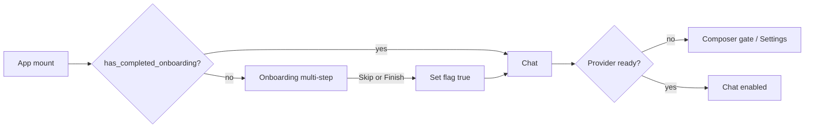

# feat: Expanded first-run onboarding

## Summary

Expand Orchid’s first-run wizard from providers + models into a multi-step setup that also covers theme, personality, optional sticky project directory, RAG embedding model, and opt-in recommended MCP servers. Stop shipping context7 as the default `mcp_servers` entry; surface it (and a small code-owned recommended list) for selection during onboarding. Gate the wizard with a new `has_completed_onboarding` flag so skip/finish never auto-reopen the full flow, with an upgrade migration so existing installs are not forced through the new wizard.

---

## Problem Frame

Onboarding today only connects providers and assigns models. First-run users never set appearance, workspace, RAG embeddings, or MCP — and every fresh install still gets context7 preconfigured. Opening the wizard solely when no connection is `ready` also re-prompts users after credential/health failures, which is the wrong recovery path for multi-step prefs.

---

## Requirements

- R1. Onboarding collects: providers, models, theme, personality, optional project dir, RAG embedding model, recommended MCP server selection.
- R2. Default `mcp_servers` is empty (`{}`); context7 is not auto-installed.
- R3. Onboarding offers a recommended MCP list (initially context7) for multi-select; unselected servers are not written.
- R4. Recommended list is code-owned and easy to extend later (no remote catalog in this work).
- R5. Add `has_completed_onboarding` (boolean, default `false` for new installs).
- R6. Finish and Skip both set `has_completed_onboarding: true` and do not auto-reopen the wizard.
- R7. Project-dir step is optional; pick uses the existing intentional folder-pick path (current workspace + sticky `default_project_dir`); skip leaves unbound.
- R8. RAG step configures embedding model only (local ONNX and/or provider embedding selection); no chunking/top_k/resource knobs.
- R9. Existing installs upgrade without being forced through the new multi-step wizard.
- R10. After completion, missing/unhealthy providers use existing Settings / composer “Set up provider” paths — not full onboarding.

---

## Scope Boundaries

- Auto-detect Ollama / env API keys / welcome marketing cards / seed-preview / done celebration (orphaned CSS may stay unused).
- Advanced RAG (chunk size, overlap, top_k, threads, batch size).
- Skills / agents / personalities CRUD in onboarding.
- Tool limits, timeouts, ignored dirs, MCP timeout knobs.
- Remote/marketplace MCP catalog or install-from-URL during onboarding.
- Requiring a project directory to finish.
- Changing provider connection store semantics beyond existing wizard reuse.

### Deferred to Follow-Up Work

- Growing the recommended MCP list beyond context7.
- Optional “Reset onboarding” affordance in Settings.
- Behavioral (non-source-string) onboarding component tests if the suite later adopts renderer test harnesses.

---

## Context & Research

### Relevant Code and Patterns

- Wizard shell: `electron/src/renderer/components/Onboarding/OnboardingScreen.tsx` (steps `providers` | `models`; finish saves `default_model` + `tier_models`).
- Open gate: `electron/src/renderer/App.tsx` — `!overview.connections.some(c => c.health === 'ready')`.
- Config schema/defaults: `electron/src/main/config/schema.ts` — `mcp_servers` defaults to context7; booleans mirror `always_expand_tool_groups`.
- Boundary type: `electron/src/shared/types/ipc-boundary.ts` `Config`.
- Save path: `window.orchid.config.save({ updates })` → `electron/src/main/ipc/config.ts` + `mergeConfigUpdates` deep-merge for `mcp_servers` / `rag`.
- Home seed: `ensureHomeConfig()` writes full `defaults()` only when `~/.orchid/config.json` is missing.
- Theme: `electron/src/renderer/themes/index.ts` + `applyTheme` / `orchid:set-theme`.
- Personality: home `~/.orchid/personalities/*.md`; list via config personalities IPC; `GeneralTab` select pattern.
- Project dir: intentional pick via `session.pickProjectDir` / workspace IPC; sticky write in `electron/src/main/project/workspace.ts` — never invent `process.cwd()`.
- RAG embedding UI: `electron/src/renderer/components/Preferences/RAGTab.tsx` (local list + provider embedding filter).
- MCP UI: free-form `MCPServersTab`; no recommended catalog today.
- Orphaned multi-step CSS: `electron/src/renderer/styles/chat.css` (`.onb-*`); progress currently DaisyUI `steps`.
- Tests asserting current behavior: `electron/tests/integration/provider-onboarding.test.ts`, `preferences-onboarding.test.ts`, `electron/tests/unit/config.test.ts`, `electron/tests/parity/config.test.ts`.

### Institutional Learnings

- `docs/solutions/` has almost no onboarding/config learnings; only MCP shutdown lifecycle (`runtime-errors/mcp-runner-cancellederror-skips-aclose.md`) — enabling MCP should not invent new shutdown paths; rely on existing project MCP registry invalidation after `config:save`.

### External References

- None required; local patterns for config booleans, deep-merge, and existing pickers are sufficient.

---

## Key Technical Decisions

- **Open gate:** show onboarding when `has_completed_onboarding === false` only. Provider readiness no longer opens the full wizard after completion.
- **Upgrade migration:** if on-disk home config exists and lacks `has_completed_onboarding`, treat as completed (`true`) so existing users are not re-onboarded. New installs (file created with schema defaults) keep `false`.
- **Skip vs Finish:** both set `has_completed_onboarding: true`. Skip does not require models/theme/MCP. Providers already created mid-flow remain (connection store writes immediately). Unsaved step drafts (theme, personality, RAG, MCP selection, model assignments) are discarded on skip unless already persisted.
- **Theme live preview:** applying theme in the appearance step should preview immediately; persist with finish (and optionally live-save theme only if product prefers instant stickiness — prefer **persist on finish** with live preview via `applyTheme` / non-persisting set-theme, matching ConfigView’s `persist: false` pattern when already written elsewhere).
- **Step order:** `providers` → `models` → `appearance` (theme + personality) → `project` → `rag` → `mcp` → finish.
- **MCP defaults:** schema default `mcp_servers: {}`. Existing home files that already contain context7 keep it (no forced uninstall). Onboarding writes only the selected recommended entries into `mcp_servers` on finish (merge/replace strategy: **set selected recommended keys; do not wipe unrelated user servers** if any exist).
- **Recommended MCP catalog:** small shared constant (e.g. `electron/src/shared/mcp/recommended-servers.ts` or under `renderer` + main if validation needed) with id, display name, short description, and stdio/SSE config payload. Initial entry: context7 (`npx` + `@upstash/context7-mcp`). Designed so adding entries is a list edit only.
- **Project step:** call existing pick IPC; optional Continue without project. Document in UI that this sets the sticky default for new sessions (same as Open project folder).
- **RAG step:** reuse RAGTab’s embedding-model interaction surface (extract shared control if duplication is high; otherwise thin onboarding panel calling the same local list + provider embedding options). Save nested `{ rag: { embedding_model, embedding_api_model } }` only.
- **Finish payload:** single `config.save` with accumulated updates: `default_model`, `tier_models`, `theme`, `personality`, optional nested `rag`, optional `mcp_servers` merge for selected recommendations, `has_completed_onboarding: true`. Project dir is already sticky via pick IPC when chosen.
- **Models step gate:** still requires at least one ready connection to enter/finish model assignment (keep current product constraint for chat). User may skip entire onboarding earlier from providers step without models.
- **Navigation:** Back/Next between steps; Skip onboarding available from early steps (at least providers); Escape continues to skip (current behavior) and now persists completion flag.

---

## Open Questions

### Resolved During Planning

- Skip marks completed: **yes**.
- Project dir required: **no** (optional).
- RAG depth: **embedding model only**.
- Sticky default vs current project: **same intentional pick path** updates both current workspace and sticky default.

### Deferred to Implementation

- Exact visual density of multi-step progress (DaisyUI `steps` vs reuse orphaned `.onb-progress*`) — pick whichever matches existing DaisyUI usage without large CSS rewrite.
- Whether appearance step live-saves theme before finish or only previews — prefer preview + finish persist; adjust if flicker/rehydrate is awkward.
- Exact merge semantics when finish selects context7 and home already has other MCP servers — implement as per-alias merge of selected recommended keys only.

---

## High-Level Technical Design

> *Directional guidance for review, not implementation specification.*

```text
App mount
  load config
  if !has_completed_onboarding → open OnboardingScreen
  else → chat (provider gates stay in composer/Settings)

OnboardingScreen steps:
  providers  → ConnectionWizard (unchanged create path)
  models     → ModelAssignments (unchanged)
  appearance → theme select + personality select
  project    → pick folder | continue without
  rag        → local / API embedding choice
  mcp        → multi-select recommended catalog (default none selected)

Skip any time early:
  config.save({ has_completed_onboarding: true }) → close

Finish:
  config.save({
    default_model, tier_models, theme, personality,
    rag?: { embedding_model, embedding_api_model },
    mcp_servers?: { ...selectedRecommended },
    has_completed_onboarding: true,
  })
  dispatch config-updated / theme events as needed → close
```



---

## Implementation Units

- U1. **Config: completion flag + empty MCP defaults + upgrade migration**

**Goal:** Schema and load path support `has_completed_onboarding` and empty default `mcp_servers`, without re-onboarding existing installs.

**Requirements:** R2, R5, R9

**Dependencies:** None

**Files:**
- Modify: `electron/src/main/config/schema.ts`
- Modify: `electron/src/shared/types/ipc-boundary.ts`
- Modify: `electron/src/main/config/loader.ts` (or merge path) for missing-key upgrade behavior
- Modify: `electron/tests/unit/config.test.ts`
- Modify: `electron/tests/parity/config.test.ts`
- Optional doc: `electron/CLAUDE.md` config table

**Approach:**
- Add `has_completed_onboarding: z.boolean().default(false)`.
- Change `mcp_servers` default to `{}`.
- When reading raw home JSON, if key `has_completed_onboarding` is absent and the home file already existed as a user config (not a brand-new seed of the new defaults-only shape), set completed `true` before/after parse so upgrades skip the wizard. Document the rule in a short comment near the migration.
- Keep deep-merge behavior for `mcp_servers` unchanged.

**Patterns to follow:**
- `always_expand_tool_groups` boolean end-to-end
- Existing `defaults()` / `ensureHomeConfig` seeding

**Test scenarios:**
- Happy path: `defaults()` has `has_completed_onboarding === false` and `mcp_servers` equal to `{}` (no context7).
- Happy path: parse accepts `has_completed_onboarding: true`.
- Edge case: raw home JSON without the key from a pre-existing file → loaded config has `true` (upgrade).
- Edge case: brand-new home seed → `false` and empty MCP map.
- Edge case: existing home JSON that already includes context7 keeps context7 after load (default change does not wipe file contents).
- Parity: `EXPECTED_FIELDS` includes the new boolean; context7-default assertion removed or inverted.

**Verification:**
- Unit + parity config tests pass; new installs empty MCP; upgrades not forced into onboarding via flag alone.

---

- U2. **Recommended MCP catalog (shared, extensible)**

**Goal:** Code-owned recommended MCP list starting with context7, consumable by onboarding UI and tests.

**Requirements:** R3, R4

**Dependencies:** None (can parallel U1)

**Files:**
- Create: `electron/src/shared/mcp/recommended-servers.ts` (or equivalent shared module)
- Test: `electron/tests/unit/recommended-mcp-servers.test.ts` (or fold into config/onboarding tests)

**Approach:**
- Export a readonly list of recommended server descriptors: stable id (`context7`), title, short description, config payload matching existing MCP server shape (`command`/`args` or `url`).
- No network fetch. Adding a server later = append list entry.
- Validate ids match server-name rules (`^[a-z0-9-]+$`) in unit test.

**Patterns to follow:**
- Existing context7 default payload previously in schema
- MCP name validation in `electron/src/main/config/validation.ts` / mcp schema

**Test scenarios:**
- Happy path: catalog includes context7 with npx/@upstash/context7-mcp shape.
- Edge case: every id matches allowed server name pattern.
- Edge case: catalog is non-empty and serializable to `mcp_servers` map entries.

**Verification:**
- Unit test pins initial catalog content; no schema default dependency on context7.

---

- U3. **App open/close gate uses completion flag**

**Goal:** Onboarding opens only when onboarding is incomplete; skip/finish paths mark complete.

**Requirements:** R5, R6, R10

**Dependencies:** U1

**Files:**
- Modify: `electron/src/renderer/App.tsx`
- Modify: `electron/tests/integration/provider-onboarding.test.ts`
- Modify: `electron/tests/integration/preferences-onboarding.test.ts` as needed

**Approach:**
- On mount, `config.get()` → open if `!has_completed_onboarding`.
- Remove readiness-based auto-open (keep provider list usage for other UX if still needed elsewhere).
- `onComplete` / `onSkip` close overlay; both ensure flag is true (skip may save flag here or inside OnboardingScreen — one clear owner).
- Composer/Settings provider setup remains the recovery path when completed but disconnected.

**Patterns to follow:**
- Existing `onboardingOpen` / `onboardingChecked` lifecycle in `App.tsx`

**Test scenarios:**
- Happy path: source/contract test expects completion-flag gate (update former “connection readiness” assertions).
- Happy path: skip path persists `has_completed_onboarding: true`.
- Integration: finish path includes the flag in save payload.
- Unchanged invariant: composer still exposes “Set up provider” when providers unavailable after onboarding complete.

**Verification:**
- Integration source tests updated and green; no readiness-only open comment remains inaccurate.

---

- U4. **Expand OnboardingScreen steps and finish/skip persistence**

**Goal:** Multi-step wizard implements appearance, project, RAG embedding, MCP recommendations; finish saves full prefs; skip marks complete.

**Requirements:** R1, R3, R6, R7, R8

**Dependencies:** U1, U2, U3 (UI can start after U1/U2; wire gate with U3)

**Files:**
- Modify: `electron/src/renderer/components/Onboarding/OnboardingScreen.tsx`
- Optional extract: small presentational pieces under `electron/src/renderer/components/Onboarding/` (e.g. appearance / mcp / rag panels) if the main file grows too large
- Reuse: `ConnectionWizard`, `ModelAssignments`, theme helpers, RAG local model list / provider embedding filter, `session.pickProjectDir` (or equivalent workspace pick API already used in ChatView/ConfigView)
- Modify: `electron/src/renderer/styles/chat.css` only if step UI needs light adjustments
- Modify: `electron/tests/integration/provider-onboarding.test.ts`
- Modify: `electron/tests/integration/preferences-onboarding.test.ts`

**Approach:**
- Extend step union and DaisyUI steps indicator.
- **providers / models:** keep current behavior and ready-connection gate for models.
- **appearance:** theme dropdown from `THEME_NAMES`/`THEMES`; personality dropdown from `config.listPersonalities` (or existing IPC used by ConfigView). Preview theme live without requiring finish for visual feedback; include theme/personality in finish save.
- **project:** primary button opens folder picker; secondary continues without; show selected path when set.
- **rag:** embedding-only controls (local select + optional provider embedding models when connections exist). Default to current schema local embedding model.
- **mcp:** multi-select checklist from recommended catalog; none selected by default; short copy that servers can be changed later in Settings.
- **finish:** validate default model still required when finishing from models path; save aggregated updates + flag; dispatch `orchid:config-updated` and theme event if theme changed; keep `orchid:provider-selection-created` when default model set.
- **skip:** save `{ has_completed_onboarding: true }` (and nothing else required).

**Patterns to follow:**
- Current finish/save error handling and focus trap in `OnboardingScreen`
- ConfigView theme event / GeneralTab select styling (`select config-control`)
- RAGTab embedding selection semantics (`embedding_api_model` null when local)

**Test scenarios:**
- Happy path: step list includes providers, models, appearance, project, rag, mcp (source or unit-level step enum).
- Happy path: finish save payload includes flag + theme/personality + models; includes `rag` when embedding changed; includes selected MCP map entries only.
- Happy path: skip save payload is completion flag (or superset that still sets flag true).
- Edge case: Next to models disabled without ready connection (existing).
- Edge case: finish disabled without default model (existing).
- Edge case: MCP step with zero selections → finish does not inject context7.
- Edge case: project continue-without does not call pick IPC.
- Integration: CSS/structure tests updated if they still assert 6-step marketing classes as required product surface — align assertions with real steps.

**Verification:**
- Manual: new profile walks all steps; skip once never returns; finish persists prefs visible in Settings.
- Automated integration/unit tests updated for gate, defaults, and save payloads.

---

- U5. **Docs + residual test/doc alignment**

**Goal:** Keep developer docs and residual assertions consistent with empty MCP defaults and expanded onboarding.

**Requirements:** R2, R4

**Dependencies:** U1–U4

**Files:**
- Modify: `electron/CLAUDE.md` config table (mcp_servers default, new flag, onboarding description)
- Grep-fix any remaining “context7 default” / “6-step onboarding” / readiness-only onboarding claims in tests or README that this change invalidates

**Approach:**
- Update documented defaults and first-run description.
- Fix leftover assertions only where this feature makes them false.

**Test expectation:** none beyond doc/assertion consistency — behavior covered in U1–U4.

**Verification:**
- Docs match schema; no test still requires default context7 or readiness-only open gate.

---

## System-Wide Impact

- **Interaction graph:** `config:save` invalidates project MCP managers — selecting MCP on finish may start servers on next project-bound turn. Theme events update root UI immediately.
- **Error propagation:** finish/skip save failures should surface in-wizard (existing alert pattern); failed skip must not silently leave flag false if user believes they dismissed onboarding — retry or keep overlay with error.
- **State lifecycle risks:** mid-flow provider creates persist even if user later skips (acceptable). Partial theme preview without save should rehydrate from config if user skips after preview — on skip, re-apply config theme if preview diverged.
- **API surface parity:** Settings remains full editor for all fields; onboarding is a subset. No new IPC channels required if personalities list and project pick already exist.
- **Integration coverage:** config unit/parity + onboarding integration source tests; no full Electron E2E assumed.
- **Unchanged invariants:** typed `{connectionId, modelId}` selections; connection store separate from config; project dir never invented from `process.cwd()`; API keys remain one-shot write-only in ConnectionWizard.

---

## Risks & Dependencies

| Risk | Mitigation |
|------|------------|
| Existing users forced through new wizard | U1 missing-key migration → completed true |
| Existing users lose context7 unexpectedly | Do not rewrite home `mcp_servers` on load; only change schema default for new seeds |
| Long wizard drop-off | Skip always available; steps optional where agreed; defaults sensible |
| Theme preview stuck after skip | Re-apply config theme on skip if preview changed |
| MCP start noise after first finish | Reuse existing registry lifecycle; no new shutdown design |
| Source-string tests brittle | Update integration tests in same PR as UI strings/step names |

---

## Documentation / Operational Notes

- Document empty MCP default and recommended onboarding opt-in in `electron/CLAUDE.md`.
- No data migration tooling beyond load-time flag defaulting for missing key.
- After ship, consider compounding a short learning in `docs/solutions/` (onboarding gate + MCP default change).

---

## Sources & References

- Related code: `electron/src/renderer/components/Onboarding/OnboardingScreen.tsx`, `electron/src/renderer/App.tsx`, `electron/src/main/config/schema.ts`
- Related plans: `docs/plans/2026-07-12-001-refactor-provider-system-plan.md` (U8 provider onboarding), `docs/plans/2026-07-10-001-feat-session-working-directory-plan.md` (sticky project dir)
- Related requirements: `docs/brainstorms/ts-electron-desktop-migration-requirements.md` (historical first-run notes)
