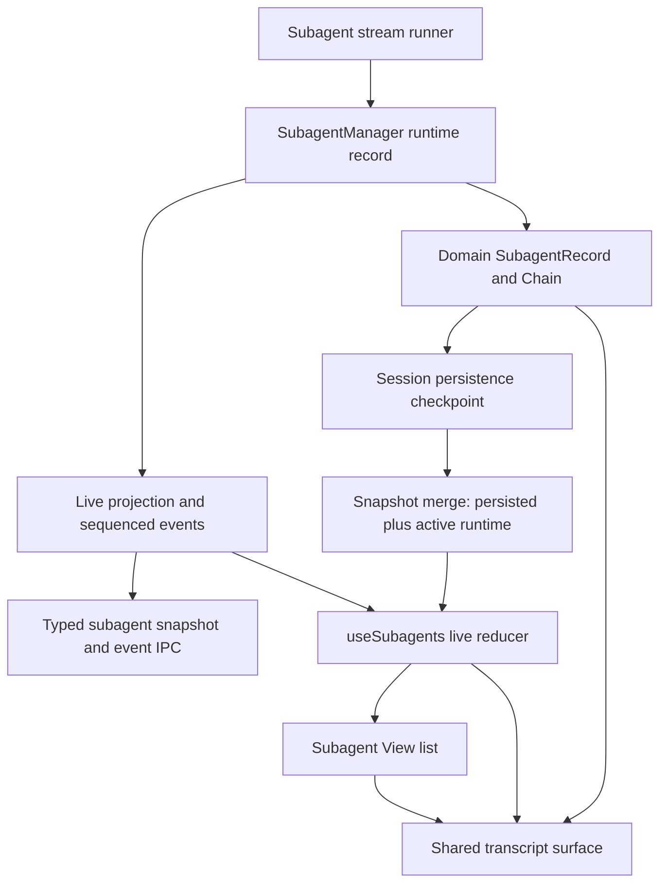
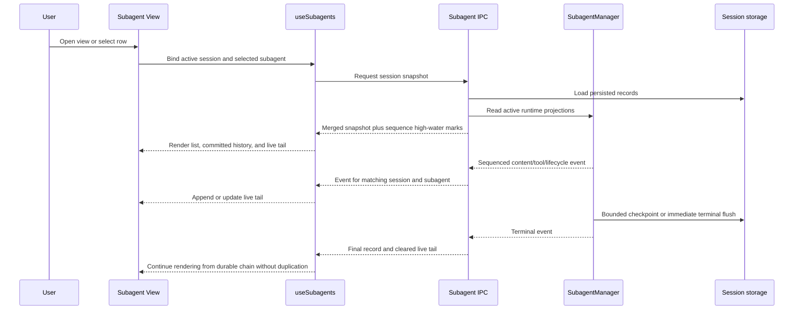
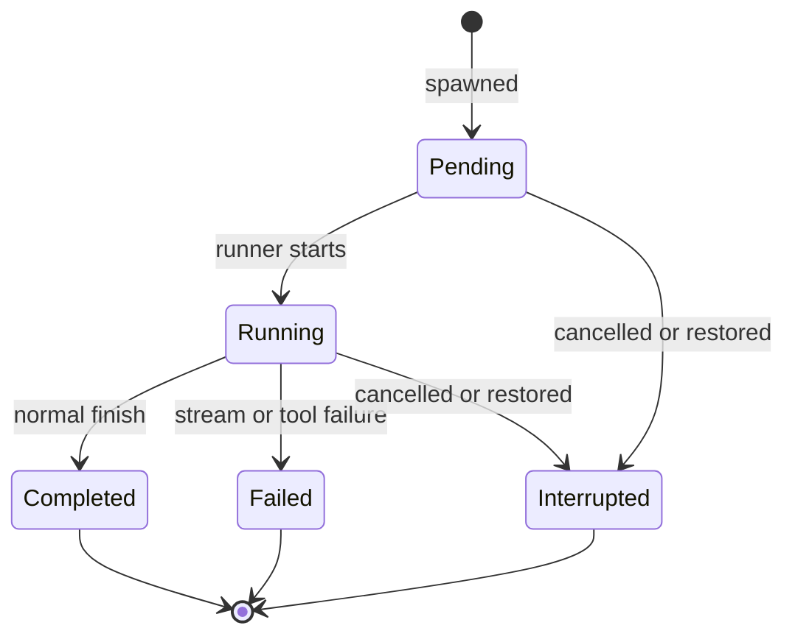

# Subagent Live Output View - Plan

## Goal Capsule

- **Objective:** Give users a session-scoped Subagent View that lists running and ended subagents and shows each subagent's transcript while it is working and after it ends.
- **Authority:** The confirmed Product Contract and session-settled KTDs override implementation convenience; current Electron session, chat-stream, and renderer-style contracts govern the remaining choices.
- **Execution profile:** Standard cross-process Electron feature spanning subagent runtime state, typed IPC, renderer state, shared transcript rendering, and session persistence.
- **Stop conditions:** Stop for product direction if implementation would expose system prompts or hidden messages, turn the view into a cross-session activity center, or require redesigning the existing three-panel shell.
- **Tail ownership:** The implementation owner carries all units through focused tests, renderer contract checks, typecheck, lint, build, and browser QA.

---

## Product Contract

### Summary

Add a dedicated center-pane Subagent View for the active session. It groups running and ended subagents, opens a selected subagent's user-visible transcript, follows live output without forcing the user's scroll position, and retains completed or interrupted transcripts through normal session persistence.

### Problem Frame

Orchid already persists each subagent as a `SubagentRecord` containing a full `Chain`, and the right inspector already lists running and terminal records. The current UI only expands compact metadata in the inspector. More importantly, `SubagentManager` accumulates content chunks in a local variable and does not publish them until a tool boundary, interruption, failure, or completion, so the existing session refresh signal cannot show ordinary assistant text while a subagent is working.

The feature must therefore add both a navigable list/detail surface and a low-latency live-output path. Disk persistence remains necessary for ended history and recovery, but it must not be the renderer's per-token transport.

### Actors

- A1. **Orchid user** — watches delegated work, inspects tool activity and assistant output, switches among subagents, and revisits ended work in the active session.

### Requirements

#### Discovery and navigation

- R1. The active session has a dedicated Subagent View reachable from the compact Subagents section in the right inspector.
- R2. The view lists every subagent belonging to the active session and separates pending/running records from completed, failed, and interrupted records.
- R3. Running records appear before ended records; records within each group use a deterministic newest-first order.
- R4. Opening the view from a specific inspector row selects that subagent, while opening the general entry selects the newest running record or newest ended record when available.
- R5. Session tabs and the session header remain available while the Subagent View replaces the center chat/composer content; returning to chat does not alter the subagent or session lifecycle.

#### Output and lifecycle

- R6. Selecting a subagent shows its task, status, elapsed time, tier, token usage when known, assistant messages, and tool activity using the main chat's presentation conventions.
- R7. Assistant text, provider-visible thinking, tool generation, tool completion, usage, and lifecycle changes update while the selected subagent runs without waiting for completion or a disk reload.
- R8. Live and persisted segments preserve chronological text/tool ordering and do not duplicate content when a live run becomes terminal.
- R9. Completed, failed, and interrupted transcripts remain readable after switching sessions and after restarting Orchid.
- R10. A restored pending or running record follows the existing recovery rule: it becomes interrupted and retains the last durable partial transcript. While output is changing, checkpoints bound crash-only transcript loss to at most two seconds; completion, failure, interruption, and orderly shutdown flush immediately.

#### Interaction and isolation

- R11. New output auto-follows only while the user remains near the bottom; scrolling upward suspends auto-follow and exposes a jump-to-latest control.
- R12. Switching sessions while the Subagent View is open keeps the view mode but replaces its list and selection with the newly active session's data.
- R13. Events from non-active sessions, stale snapshots, duplicate sequences, and events from an older run cannot mutate the visible active-session view.
- R14. Loading, empty, missing-record, and recoverable IPC-error states render inside the view without crashing or falling back to another session's data. A recoverable IPC error exposes a named Retry control that requests a fresh snapshot for the currently bound session and accepts it only after session-affinity validation.
- R15. The list/detail surface supports keyboard focus, named controls, status text independent of color, and existing renderer focus conventions.

#### Scope and parity

- R16. The feature is observational: it does not add interrupt, delete, re-run, or subagent-execution retry actions to the Subagent View. Retrying a failed view-data snapshot is allowed because it does not change subagent lifecycle.
- R17. No new agent tool is required because agents already delegate, wait, interrupt, and receive subagent state through existing runtime context; the new capability closes a human observability gap over the same durable records.
- R18. New renderer markup follows the primitives-as-API styling contract and does not introduce direct DaisyUI roots in feature JSX or new rules in frozen `chat.css`.

### Key Flows

- F1. **Open and inspect a running subagent**
  - **Trigger:** A1 opens Subagents from the inspector or chooses a specific running row.
  - **Steps:** Orchid opens the center-pane view, groups the active session's records, selects the requested or newest running record, hydrates its current live snapshot, and renders its transcript.
  - **Outcome:** A1 sees current output immediately and receives subsequent output in order.
  - **Covered by:** R1-R8, R14-R15

- F2. **Read while output continues**
  - **Trigger:** New content arrives while A1 is viewing the selected subagent.
  - **Steps:** Sequenced events update the live tail; the transcript follows while near the bottom; scrolling upward preserves A1's reading position until jump-to-latest is chosen.
  - **Outcome:** Streaming remains visible without fighting manual reading.
  - **Covered by:** R7-R8, R11, R13

- F3. **Revisit ended work**
  - **Trigger:** A1 selects a completed, failed, or interrupted record now or after reload.
  - **Steps:** Orchid renders the persisted chain, terminal status, result/error context, and usage without requiring an active runtime record.
  - **Outcome:** Ended subagent output remains a durable part of the session.
  - **Covered by:** R2-R3, R6, R9-R10

- F4. **Switch sessions while viewing subagents**
  - **Trigger:** A1 changes the active session tab while the Subagent View is open.
  - **Steps:** Renderer affinity rebinds before hydration, the prior list is replaced atomically, the new session snapshot seeds sequence high-water marks, and buffered events are accepted only for the new session.
  - **Outcome:** No prior-session record or output leaks into the selected session.
  - **Covered by:** R12-R14

### Acceptance Examples

- AE1. **Live text before completion**
  - **Covers:** F1, R7-R8
  - **Given:** A running subagent has emitted text but has not called a tool or completed.
  - **When:** A1 opens that subagent.
  - **Then:** The emitted text is visible from the live snapshot and subsequent chunks append without duplicate bubbles.

- AE2. **Interleaved tool activity**
  - **Covers:** F1-F2, R6-R8
  - **Given:** A subagent emits text, starts and completes a tool, then emits more text.
  - **When:** A1 watches the transcript and later reopens it after completion.
  - **Then:** Both views preserve text → tool → result → text ordering with equivalent presentation.

- AE3. **Manual reading position**
  - **Covers:** F2, R11
  - **Given:** A1 has scrolled more than the existing near-bottom threshold from the live tail.
  - **When:** New output arrives.
  - **Then:** The scroll position stays put and jump-to-latest appears; activating it resumes following.

- AE4. **Restart during work**
  - **Covers:** F3, R9-R10
  - **Given:** A running subagent is continuously producing output and Orchid exits abruptly between bounded checkpoints.
  - **When:** The session is loaded after restart.
  - **Then:** The record is interrupted, its durable partial transcript is readable, and no more than the final two seconds of output are absent.

- AE5. **Stale event after session switch**
  - **Covers:** F4, R12-R14
  - **Given:** Session A has a running subagent and A1 switches to session B while an A event is in flight.
  - **When:** The stale A event arrives after B hydration begins.
  - **Then:** The event is rejected and B's list, selection, and transcript remain unchanged.

### Scope Boundaries

#### In scope

- Active-session list and transcript inspection for running and ended subagents.
- Low-latency live events plus snapshot hydration and durable session checkpoints.
- Center-pane navigation, smart auto-scroll, accessibility, and renderer-style compliance.

#### Deferred to Follow-Up Work

- Transcript virtualization or pagination for unusually large subagent histories.
- Search, filtering, export, annotated diff review, or multi-subagent result comparison.
- Subagent controls such as interrupt, retry, delete, pin, or re-run.

#### Outside this feature

- A global cross-session subagent activity center.
- Changes to delegation prompts, agent definitions, model selection, tool permissions, or recursive subagent behavior.
- Redesign of session navigation, the three-panel shell, settings, or onboarding.

---

## Planning Contract

### Key Technical Decisions

- KTD1. **Scope the view to the active session.** `(session-settled: user-approved — chosen over a global cross-session list: the requested history belongs with the session that spawned it.)` Runtime and renderer queries carry an explicit session ID even though the visible scope is the active session.
- KTD2. **Use a dedicated center-pane list/detail view with the inspector as its compact entry.** `(session-settled: user-approved — chosen over expanding full transcripts inside the inspector: output needs reading space without changing shell topology.)` Session tabs and the session header stay mounted; chat/composer content returns through an explicit back action.
- KTD3. **Render assistant messages and tool activity with the main chat's visual conventions.** `(session-settled: user-approved — chosen over a result-only text panel: users need to understand work in progress, not only the final answer.)` Hidden messages and system prompts remain filtered by existing message visibility rules.
- KTD4. **Use smart auto-follow with a jump-to-latest escape hatch.** `(session-settled: user-approved — chosen over forced scrolling on every update: live monitoring must not interrupt manual reading.)` The existing 100-pixel chat threshold is the shared behavior contract.
- KTD5. **Separate live transport from durable history.** Session `SubagentRecord.chain` remains the canonical completed/recovery artifact, while an in-memory live projection carries uncommitted text, thinking, tool snapshots, usage, lifecycle, and a sequence number. Disk reads are not placed on the per-chunk rendering path.
- KTD6. **Mirror the main chat's snapshot-plus-sequenced-event affinity model.** A typed snapshot supports opening mid-run and hydration after session switches; delta events carry `sessionId`, `subagentId`, and monotonic per-run sequence identity so the renderer can reject wrong-session, duplicate, and stale updates. This follows `electron/src/main/ipc/chat.ts` and `electron/src/renderer/hooks/useChat.ts` rather than creating an unguarded broadcast stream.
- KTD7. **Keep live notification cadence and disk checkpoint cadence independent.** Renderer events coalesce to at most one delivery per animation frame with a 50-millisecond maximum latency. Dirty running records checkpoint at least once every two seconds, with one write in flight per session and a retained dirty flag scheduling another bounded checkpoint when output arrives during a write. Completion, failure, interruption, and orderly shutdown bypass both delays and flush immediately. Continuous token flow therefore cannot postpone durable partial output or cause one disk write per token.
- KTD8. **Share transcript behavior below the session-chain orchestration layer.** Extract or reuse chronological message/tool rendering and smart-scroll primitives, while leaving main-chat chain collapsing and footers in `ChatStream`. This avoids cloning presentation logic without forcing subagent output into session-only abstractions.
- KTD9. **Keep agent action parity unchanged.** This surface reads the same durable subagent objects already available to orchestration. No new agent tool or prompt context is needed; verification instead proves lifecycle and state parity between runtime, session storage, and the human view.

### High-Level Technical Design

#### Component and data ownership

The runtime manager owns stream ordering and lifecycle. The session record owns durable history. The renderer hook merges one snapshot with later events and exposes a stable list/detail model; UI components do not read session files or global manager state directly.

#### Open-mid-run and live update sequence

Hydration buffers same-session events until the snapshot establishes a sequence high-water mark, matching the race protection already used by main chat session switching.

#### Lifecycle and restart behavior

All three terminal states remain listed under Ended. A process restart never resumes a prior live stream; persisted pending/running records use the existing interrupted migration and preserve their latest checkpoint.

### Sequencing

1. Establish runtime live projection and event identity before exposing new IPC.
2. Add snapshot/event transport and persistence cadence before renderer subscription.
3. Build the renderer reducer and affinity guard before the view consumes it.
4. Share transcript and auto-scroll behavior before composing the list/detail surface.
5. Wire navigation and complete cross-layer/browser verification last.

### System-Wide Impact

- **Runtime lifecycle:** `SubagentManager` gains user-visible live projection responsibilities but remains transport-agnostic; the wiring layer owns Electron delivery and persistence scheduling.
- **Session data:** The persisted schema remains compatible. In-flight checkpoints materialize only ordinary chain messages and existing status fields, so older sessions remain readable.
- **IPC/security boundary:** New invoke/event channels require typed payloads, Zod validation, preload exposure, and allowlist coverage. Renderer code receives no privileged manager object.
- **Renderer state:** Active-session affinity becomes explicit for subagents, preventing the broad current `SESSION_SUBAGENTS_CHANGED` broadcast from causing stale cross-session repaint.
- **Performance:** Live deltas avoid repeatedly sending or parsing an ever-growing full transcript. Snapshot payloads are bounded to explicit hydration, and disk writes use a separate bounded cadence.
- **Agent-native parity:** Delegation, waiting, interruption, and prompt context remain unchanged. The user and agents observe the same lifecycle records; only the human-readable projection becomes richer.

### Risks and Mitigations

| Risk | Mitigation |
|---|---|
| Snapshot and live events race during view open or session switch | Buffer target-session events during hydration, seed sequence high-water marks from the snapshot, then discard stale or duplicate events. |
| Live tail duplicates text or tools when committed to the chain | Give each segment/tool stable identity and test live-to-terminal handoff for text-only, tool-interleaved, failure, and interruption paths. |
| Per-token persistence causes disk or IPC amplification | Send compact deltas on a coalesced renderer cadence; checkpoint a projected chain on a slower bounded cadence and flush terminal transitions immediately. |
| A continuous stream starves a trailing-only debounce | Use throttle-with-trailing or a maximum checkpoint interval rather than resetting one debounce forever. |
| Global manager records leak across sessions | Require session IDs in snapshot/event contracts, target eligible windows by selected session, and filter again in the renderer. |
| Shared transcript extraction regresses main chat | Keep chain collapsing/footer ownership in `ChatStream` and extend existing chat rendering contract tests around only the extracted behavior. |
| Large ended histories make initial rendering expensive | Sort and render the confirmed scope now; keep virtualization/pagination explicitly deferred and avoid full-history payloads on every live event. |

### Patterns and Research

- `electron/src/main/agents/manager.ts` — current runtime ordering, terminal flush, and domain conversion.
- `electron/src/main/agents/wire-subagents.ts` and `electron/src/main/agents/persist-subagent-chains.ts` — current persistence and renderer notification seam.
- `electron/src/main/ipc/chat.ts` — proven session/turn sequence identity, live snapshots, targeted recipients, and stream-segment/tool projections.
- `electron/src/renderer/hooks/useChat.ts` — snapshot hydration buffering, affinity rejection, and live segment reducers.
- `electron/src/renderer/hooks/useSubagents.ts` and `electron/src/renderer/components/Sidebar.tsx` — existing session list state, elapsed ticker, status grouping, and compact inspector presentation.
- `electron/src/renderer/components/ChatStream.tsx`, `MessageWidget.tsx`, `ToolCallBlock.tsx`, and `ToolActivityGroup.tsx` — chronological transcript, tool grouping, and smart auto-scroll conventions.
- `electron/src/shared/types/session.ts` and `electron/src/shared/types/subagent.ts` — durable ended-history and restore semantics.
- `electron/src/renderer/styles/README.md` — three-panel layout preservation and primitives-as-API constraints.

---

## Implementation Units

### U1. Model live subagent stream state in the runtime

- **Goal:** Make every subagent's current text/tool/lifecycle projection queryable and emit ordered change events before the run ends.
- **Requirements:** R7-R10, R13, KTD5-KTD7
- **Dependencies:** None
- **Files:**
  - Modify: `electron/src/main/agents/manager.ts`
  - Modify: `electron/src/shared/types/subagent.ts`
  - Modify: `electron/src/main/llm/message-factories.ts` only if stable live-message identity cannot be expressed without a narrow factory extension
  - Test: `electron/tests/unit/subagent-runtime.test.ts`
- **Approach:** Add a runtime-only live projection to each manager record with chronological text/thinking/tool segments, tool snapshots, aggregate usage, and a monotonic sequence. Replace the undifferentiated callback payload with typed change metadata containing the owning session and record. Keep `runtimeToDomain` backward-compatible, but let checkpoint conversion materialize the current uncommitted tail as ordinary messages without mutating the canonical in-memory committed list. Terminal transition commits once, clears the live tail, resolves waiters, and emits the final change.
- **Patterns to follow:** `ActiveAgent.streamSegments`, tool snapshot helpers, and `nextEventIdentity` in `electron/src/main/ipc/chat.ts`; existing interruption/failure finalization in `electron/src/main/agents/manager.ts`.
- **Test scenarios:**
  1. Covers AE1. A runner emits two content chunks and pauses before finish; the record's live projection exposes their combined ordered text and emits increasing sequences while the durable committed chain is still valid.
  2. Covers AE2. Text → tool start/delta/call/result → text produces stable chronological segments and tool identity.
  3. Usage updates change the live aggregate without creating duplicate assistant messages.
  4. Thinking events remain separate from assistant text and follow existing visibility semantics.
  5. Completion projects the same transcript into the terminal chain exactly once and clears transient state.
  6. Failure and interruption preserve partial output, terminal status, error context, and tool results already received.
  7. Two concurrent subagents maintain independent sequence counters and session ownership.
- **Verification:** Runtime tests can observe content before completion, terminal records retain existing serialization shape, and current wait/cancel/tool tests remain green.

### U2. Add typed snapshot/event IPC and bounded persistence

- **Goal:** Deliver low-latency subagent deltas to the correct renderer and hydrate an exact mid-run snapshot without using disk reloads as the stream transport.
- **Requirements:** R7-R10, R12-R14, R18, KTD5-KTD7
- **Dependencies:** U1
- **Files:**
  - Create: `electron/src/main/ipc/subagents.ts`
  - Modify: `electron/src/main/agents/wire-subagents.ts`
  - Modify: `electron/src/main/agents/persist-subagent-chains.ts`
  - Modify: `electron/src/main/ipc/payload-schemas.ts`
  - Modify: `electron/src/main/index.ts`
  - Modify: `electron/src/shared/types/ipc.ts`
  - Modify: `electron/src/shared/types/ipc-boundary.ts` if the repository keeps renderer-facing snapshot DTOs there
  - Modify: `electron/src/preload/index.ts`
  - Create: `electron/tests/unit/subagent-ipc.test.ts`
  - Modify: `electron/tests/integration/app-shell.test.ts`
- **Approach:** Add an explicit snapshot invoke accepting a validated session ID and a discriminated live-event channel carrying session, subagent, sequence, and event data. Snapshot creation merges persisted ended records with active runtime records by ID, with runtime state winning for active runs. Before every replacement sync, persistence independently merges the session's existing stored records with runtime records by ID, again with runtime state winning, so a post-restart checkpoint cannot erase restored ended history that is absent from the process-local manager. Target renderer delivery to windows whose selected session matches the event owner, while preserving renderer-side filtering as defense in depth. Coalesce renderer delivery to one event per animation frame with a 50-millisecond maximum latency. Checkpoint dirty running records no less often than every two seconds, allow one write in flight per session, and retain dirtiness when updates arrive during a write so another bounded checkpoint follows. Completion, failure, interruption, and orderly shutdown bypass the delays. Preserve the existing `SESSION_SUBAGENTS_CHANGED` contract only for durable-list compatibility until all callers have migrated.
- **Patterns to follow:** Chat snapshot/event types and recipient targeting in `electron/src/main/ipc/chat.ts`; preload listener cleanup and channel allowlists in `electron/src/shared/types/ipc.ts` and `electron/src/preload/index.ts`; session-scoped persistence in `electron/src/main/agents/persist-subagent-chains.ts`.
- **Test scenarios:**
  1. Snapshot for a session with persisted ended records and one active runtime record returns one merged list with the runtime version winning for the duplicate ID.
  2. An ended record restored from session storage but absent from the runtime manager survives a later active run's periodic checkpoint, terminal flush, and reload.
  3. Snapshot request with an invalid or missing session ID is rejected by the main-process schema.
  4. A live event is sent only to eligible, non-destroyed web contents and contains increasing sequence identity.
  5. Events from concurrent sessions retain their owner IDs and are never persisted into the currently selected but non-owning session.
  6. Fake-timer coverage proves continuous chunks flush renderer updates within 50 milliseconds, checkpoint within two seconds, retain a dirty follow-up when a write is in flight, and do not cause one disk write per chunk.
  7. Completion, failure, interruption, and orderly shutdown trigger an immediate durable flush and terminal event.
  8. Covers AE4. A continuously changing running transcript reloads as interrupted with no more than two seconds of output absent.
  9. IPC invoke/event allowlists and preload unsubscribe functions include the new contract without overlap.
- **Verification:** IPC unit tests prove validation, targeting, merge precedence, and cadence; app-shell contract recognizes every new channel and preload method.

### U3. Build the renderer subagent snapshot/event reducer

- **Goal:** Present one race-safe active-session list and selected live transcript to renderer components.
- **Requirements:** R2-R4, R7-R14, KTD5-KTD7
- **Dependencies:** U2
- **Files:**
  - Modify: `electron/src/renderer/hooks/useSubagents.ts`
  - Create: `electron/src/renderer/utils/subagent-stream.ts`
  - Create: `electron/tests/unit/use-subagents-live.test.ts`
  - Modify: `electron/tests/unit/sidebar-subagents.test.ts`
- **Approach:** Move event acceptance, snapshot seeding, record merge, stable grouping, and selection fallback into pure reducer/affinity helpers. On session change, synchronously bind the target session and buffer matching events until snapshot hydration finishes. Seed each active record's sequence high-water mark from the snapshot, replay only newer events, and drop wrong-session or wrong-subagent updates. Expose persisted messages and a distinct live tail to rendering, preserving the current usage aggregation and elapsed ticker. Keep an existing selection only while its record remains in the same session; otherwise choose newest running, then newest ended.
- **Patterns to follow:** `acceptChatEvent`, hydration buffering, snapshot seeding, and stale-while-revalidate behavior in `electron/src/renderer/hooks/useChat.ts`; current `useSubagents` list/usage APIs.
- **Test scenarios:**
  1. Initial snapshot groups pending/running under Running and terminal statuses under Ended, each newest first.
  2. A general open chooses newest running; a requested valid ID wins; a missing requested ID falls back deterministically.
  3. Content, thinking, tool, usage, and terminal deltas update only the matching subagent.
  4. Duplicate and out-of-order sequence numbers are rejected per subagent.
  5. Covers AE5. Session A events buffered or delivered after rebinding to B cannot mutate B; newer B events replay after B's snapshot.
  6. A snapshot response from a superseded session request is discarded.
  7. Terminal transition keeps the selected ID and swaps from live tail to durable chain without duplicate content.
  8. Empty and recoverable error snapshots preserve explicit interaction states and never retain stale prior-session rows.
- **Verification:** Pure reducer tests cover all race branches without a browser DOM, and existing usage/sidebar tests continue to pass.

### U4. Share transcript rendering and smart auto-scroll

- **Goal:** Render persisted and live subagent output with the same chronological message/tool behavior as main chat.
- **Requirements:** R6-R8, R11, R15, R18, KTD3-KTD4, KTD8
- **Dependencies:** U3
- **Files:**
  - Create: `electron/src/renderer/components/SubagentTranscript.tsx`
  - Create: `electron/src/renderer/hooks/useSmartAutoScroll.ts`
  - Modify: `electron/src/renderer/components/ChatStream.tsx`
  - Reuse: `electron/src/renderer/components/MessageWidget.tsx`
  - Reuse: `electron/src/renderer/components/ToolCallBlock.tsx`
  - Reuse: `electron/src/renderer/components/ToolActivityGroup.tsx`
  - Modify: `electron/tests/unit/chat-rendering-contract.test.ts`
  - Create: `electron/tests/unit/subagent-transcript.test.ts`
- **Approach:** Extract the near-bottom detector, follow/suspend state, and jump-to-latest behavior into a shared hook while preserving the existing 100-pixel contract. Build `SubagentTranscript` from the existing leaf renderers and chronological grouping helpers; do not reuse session-only empty states, chain collapsing, or main-chain footer logic. Render the durable chain as committed history and the reducer's live segments as a separate tail, de-duplicating stable tool and segment identities at terminal handoff. Display terminal error/interruption context as status metadata rather than inventing assistant text.
- **Patterns to follow:** History/live-tail memoization and `foldStreamActivityGroups` in `electron/src/renderer/components/ChatStream.tsx`; flat message presentation in `MessageWidget`; explicit tool failure rendering in `ToolCallBlock`.
- **Test scenarios:**
  1. Covers AE2. Persisted text/tool/result plus a live text tail renders in chronological order with no DaisyUI chat wrappers.
  2. Hidden messages do not render; provider-visible thinking uses the existing collapsible thought treatment.
  3. Tool generating/running/success/error states match main-chat widgets and explicit `is_error` semantics.
  4. Covers AE3. Near-bottom updates follow; scrolled-away updates do not move the viewport and expose jump-to-latest; activation scrolls once and resumes following.
  5. Switching selected subagents resets the scroll-away state and anchors to the selected transcript's latest content.
  6. Terminal handoff does not render a live segment already present in the durable chain.
  7. Existing `ChatStream` threshold, memoization, chain footer, and flat-message contracts remain unchanged after extraction.
- **Verification:** Static-render and pure-scroll tests prove presentation and behavior; the main chat contract suite stays green.

### U5. Compose the dedicated Subagent View and shell entry

- **Goal:** Add the active-session list/detail UI, inspector entry, and center-pane navigation without changing the shell topology.
- **Requirements:** R1-R6, R11-R18, KTD1-KTD4, KTD8-KTD9
- **Dependencies:** U3, U4
- **Files:**
  - Create: `electron/src/renderer/components/SubagentView.tsx`
  - Modify: `electron/src/renderer/components/ChatView.tsx`
  - Modify: `electron/src/renderer/components/Sidebar.tsx`
  - Modify: `electron/src/renderer/styles/components.css`
  - Modify: `electron/src/renderer/styles/shell.css` only for center-pane sizing that belongs to the preserved shell
  - Create: `electron/tests/unit/subagent-view.test.ts`
  - Modify: `electron/tests/unit/sidebar-subagents.test.ts`
  - Modify: `electron/tests/integration/app-shell.test.ts`
  - Modify: `electron/tests/integration/renderer-style-contract.test.ts`
- **Approach:** Add a `chat | subagents` center-content mode in `ChatView`; session tabs and header stay mounted, and the chat stream/composer/footer subtree also remains mounted so local composer state survives. While Subagent View is active, hide that subtree behind the existing state-preservation pattern, mark it inert and `aria-hidden`, and gate `InputArea` global shortcut handlers so hidden chat controls cannot receive focus or act on keys. Mount `SubagentView` as the visible center content. At a component/container width of 720 pixels or more, use a two-region list/detail layout within the existing main pane. Below 720 pixels, show one screen at a time: the grouped list first, then the selected detail with a named Back to subagents control; preserve the selected record and transcript scroll state when returning to the list. Both modes retain Running and Ended headings, status badges, concise task labels, selected-row semantics, metadata header, transcript body, and back-to-chat action. The inspector remains compact: preserve its running/terminal summary and add clear “view all” and row-specific open actions instead of mounting transcript content there. Switching sessions keeps the mode, resets record selection through U3, and renders the new session's loading/empty state. A recoverable IPC-error state includes a named Retry control; it requests a fresh snapshot for the currently bound session, disables itself while pending, and atomically replaces list/detail data only when the response still matches renderer session affinity. Use `components/ui/` primitives and `orchid-*` composites only.
- **Patterns to follow:** `ChatView` center composition and session-switch ownership; `Sidebar` collapse/status patterns; `Panel`, `SectionHeader`, `StatusBadge`, `Button`, `IconButton`, `Spinner`, and `StateMessage` renderer primitives; `electron/src/renderer/styles/README.md`.
- **Test scenarios:**
  1. Covers F1. “View all” opens the center view and selects the newest running record; a row-specific action opens the requested record.
  2. Running and Ended groups include pending/running and completed/failed/interrupted statuses respectively, with visible non-color status text.
  3. Selecting another row changes the transcript and metadata without changing session or subagent lifecycle.
  4. Back returns to the prior chat with messages and an unsent composer draft preserved; while Subagent View is visible, the hidden chat subtree is inert, absent from accessibility navigation, and cannot react to composer-global shortcuts.
  5. Covers F4. Switching session tabs while the view is open keeps the mode and replaces list/detail data atomically.
  6. Draft/no-session, empty, loading, and missing selected record states render an accessible recovery surface.
  7. A recoverable IPC error exposes Retry, disables it while pending, discards a response after an intervening session switch, and atomically installs a still-affine response without leaving Subagent View.
  8. At 720 pixels and wider, list and detail remain visible together; below 720 pixels, selection replaces the list with detail, Back to subagents restores the list, and selection plus transcript scroll state survive the round trip.
  9. Keyboard traversal reaches back, list rows, Retry, and jump-to-latest with stable labels and focus indicators.
  10. Renderer style contract finds no direct DaisyUI root in new feature JSX, no arbitrary utility regression, no raw color, and no `chat.css` growth.
  11. Browser QA with multiple concurrent subagents confirms responsive list updates, readable narrow/wide layouts, and no shell resize or composer leakage.
- **Verification:** Component/static contracts, app-shell checks, renderer styling checks, and real Electron browser QA cover the complete user journey.

---

## Verification Contract

Run commands from `electron/`.

| Gate | Command | Proves |
|---|---|---|
| Runtime and IPC focus | `npm test -- tests/unit/subagent-runtime.test.ts tests/unit/subagent-ipc.test.ts` | Live projection, event ordering, persistence cadence, snapshot merge, and terminal flush. |
| Renderer state focus | `npm test -- tests/unit/use-subagents-live.test.ts tests/unit/sidebar-subagents.test.ts` | Active-session affinity, stale-event rejection, grouping, and selection behavior. |
| Transcript and view focus | `npm test -- tests/unit/subagent-transcript.test.ts tests/unit/subagent-view.test.ts tests/unit/chat-rendering-contract.test.ts` | Chronological output, terminal handoff, smart scroll, accessibility, and main-chat non-regression. |
| Shell and style contracts | `npm test -- tests/integration/app-shell.test.ts tests/integration/renderer-style-contract.test.ts` | Typed IPC allowlists, preload surface, shell preservation, and primitives-as-API compliance. |
| Existing subagent regression | `npm test -- tests/unit/subagent-tools.test.ts tests/unit/subagent-runner.test.ts tests/unit/session-persistence.test.ts` | Delegation, waiting, interruption, model/runtime behavior, storage compatibility, and restore semantics. |
| Static quality | `npm run typecheck` and `npm run lint` | Type and lint correctness across main, preload, shared, and renderer layers. |
| Build | `npm run build` | Main, preload, defaults, and renderer compile together. |
| Full regression | `npm test` | Repository-wide Electron behavior remains green. |

### Browser QA

1. Start one subagent that emits text without tools, open Subagent View mid-run, and verify text appears before completion.
2. Start multiple concurrent subagents with tool use; switch among them and verify independent ordering, status, elapsed time, and usage.
3. Scroll an active transcript upward, wait for output, then use jump-to-latest and verify follow behavior resumes.
4. Switch session tabs while subagents continue in both sessions and verify list/output isolation.
5. Complete, fail, and interrupt separate runs; reload their session and verify each remains under Ended with its transcript and status.
6. Restart Orchid between checkpoints while a subagent continuously emits output and verify the restored record is interrupted with no more than two seconds of output absent.
7. Type an unsent composer draft, enter and leave Subagent View, and verify the draft survives while hidden composer controls never receive focus or react to shortcuts.
8. Exercise the Subagent View above and below its 720-pixel container breakpoint; verify the wide two-region layout and narrow list-to-detail/back flow preserve selection and transcript scroll state.
9. Force a recoverable snapshot failure, retry it, then switch sessions before a retry response and verify only the still-affine session can replace visible data.
10. Exercise all supported themes; confirm the existing shell tracks, session tabs, header, inspector, and focus states remain coherent.

---

## Definition of Done

- The active-session Subagent View lists every running and ended record, opens from the inspector, and renders a selected transcript live and after completion.
- Live text is visible before tool boundaries or completion, and live-to-durable handoff produces no duplicated or reordered text/tool content.
- Snapshot hydration and sequence affinity reject wrong-session, stale, duplicate, and superseded-run events.
- Continuous streams update the renderer within 50 milliseconds, receive durable partial checkpoints at least every two seconds, retain dirty follow-up work across in-flight writes, and flush terminal or orderly-shutdown states immediately.
- Replacement persistence merges stored and runtime records by ID so restored ended transcripts survive later checkpoints and reloads.
- Entering Subagent View preserves the mounted composer draft while making hidden chat controls inert and shortcut-inactive.
- The view has a testable 720-pixel list/detail transition and an affinity-safe Retry path for recoverable snapshot failures.
- Smart auto-follow, jump-to-latest, keyboard navigation, status text, loading/empty/error states, and session-switch behavior satisfy the acceptance examples.
- No new subagent controls, global history surface, prompt/tool permission changes, shell redesign, direct feature-level DaisyUI roots, or `chat.css` growth enter the diff.
- Focused tests, existing subagent/session regressions, typecheck, lint, build, full Electron tests, and browser QA pass.
- Abandoned stream-projection, duplicate event-channel, or alternate layout experiments are removed from the final diff.
