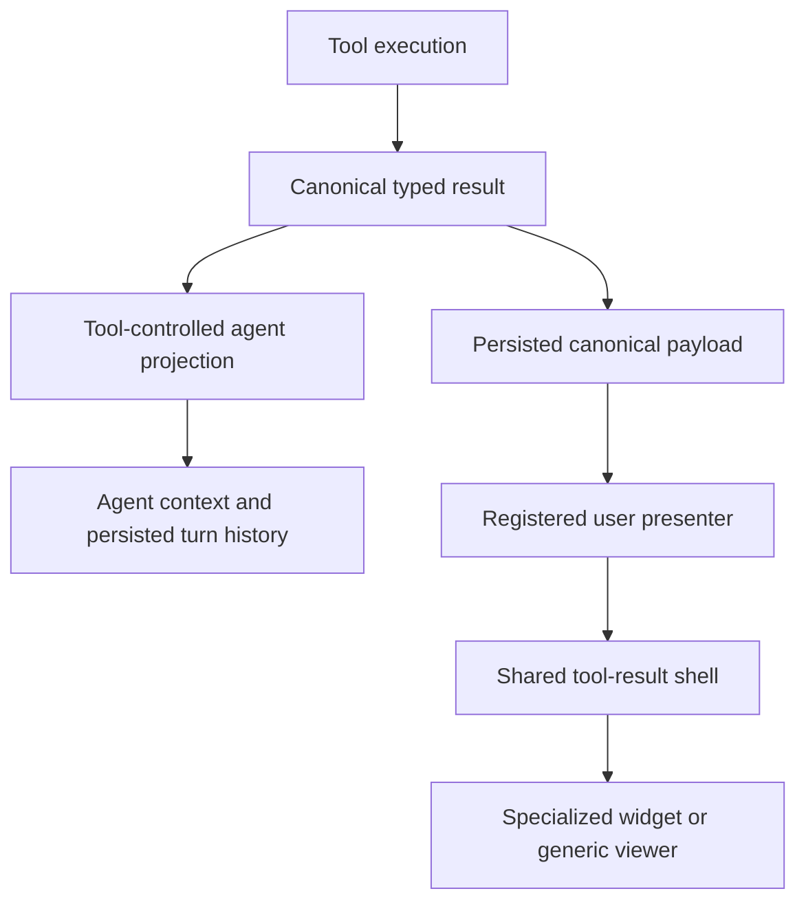
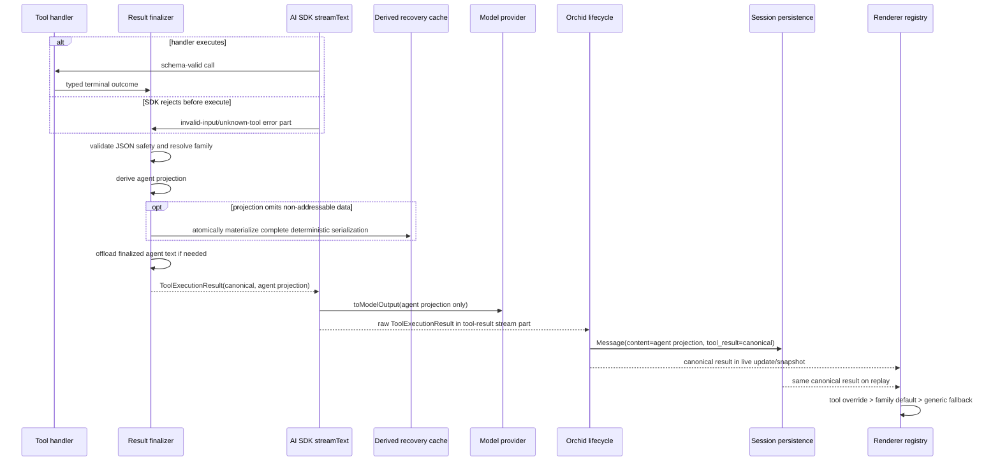

# Canonical Tool Results - Plan

## Goal Capsule

- **Objective:** Give every newly generated tool result separate agent-facing and user-facing representations derived from one authoritative typed result, beginning with rich filesystem-tool widgets.
- **Product authority:** The canonical result owns the facts; tool-specific projections control how those facts are communicated to the agent and user.
- **Authority order:** Product Contract requirements and acceptance examples, then session-settled Key Technical Decisions, then Implementation Units, then executor judgment for local details.
- **Execution profile:** Deep, dependency-ordered code change spanning tool execution, provider projection, IPC, persistence, main-agent and subagent replay, and renderer presentation.
- **Stop conditions:** Stop for a contradiction that would send canonical display data to the model, discard an accepted canonical result, make a partial agent projection unrecoverable, permit arbitrary executable renderer output, or expand into legacy migration or SQLite storage work.
- **Tail ownership:** The implementing workflow owns code, focused and full verification, Electron UI smoke testing, removal of superseded single-string paths, and repository-standard review/landing work.
- **Open blockers:** None.

---

## Product Contract

### Summary

Orchid will represent tool outcomes as canonical typed results and derive separate tool-controlled projections for agents and users.
The first rich presentation milestone covers filesystem tools, while every other tool receives the new contract and a generic structured display fallback.

### Problem Frame

Tool outcomes currently share one string across model context, live display, persisted history, and output offloading.
That coupling makes results hard to scan and can hide useful information through generic truncation or agent-oriented formatting.
Improving one audience's representation therefore risks degrading the other audience's result.

### Key Decisions

- **Canonical result with derived projections** (session-settled: user-approved — chosen over independently authored agent and display outputs: one authoritative result prevents factual drift and information loss). Each tool retains control over its agent and user representations without duplicating the underlying facts.
- **Tool-specific control with family defaults** (session-settled: user-approved — chosen over fully bespoke widgets or one universal viewer: shared behavior should stay consistent while each tool can select specialized projections). Exceptional tools may override both projections within the common result contract.
- **Progressive rich-widget rollout** (session-settled: user-directed — chosen over purpose-built widgets for every tool immediately: establish the platform contract broadly and concentrate the first presentation milestone on filesystem work). Tools without specialized bodies use the generic structured viewer.
- **Exact inline replay** (session-settled: user-directed — chosen over managed artifact references or post-acceptance display limits: every result accepted by the canonical validation contract should retain its complete display data until session storage moves to SQLite). Session-size growth before that future storage change is an accepted trade-off.
- **Prospective compatibility only** (session-settled: user-directed — chosen over fallback rendering or migration for legacy results: older sessions and outputs do not need compatibility guarantees). The new contract applies to newly generated results.

The canonical source-of-truth relationship is:

### Actors

- A1. **User** scans, expands, copies, and replays tool outcomes without losing information to silent truncation.
- A2. **Agent** receives a compact result suited to reasoning and knows when information was omitted and how it can be retrieved.
- A3. **Tool author** defines authoritative result data and controls audience-specific projections through shared defaults or explicit overrides.
- A4. **Orchid runtime** validates, persists, transports, and replays result data without changing its meaning.

### Requirements

**Canonical result contract**

- R1. Every newly generated built-in tool result must have a typed, versioned canonical representation that is authoritative for facts, status, completeness, and errors.
- R2. Agent and user projections must derive factual values from the canonical result rather than maintain independent copies of those values.
- R3. Every built-in tool must support both projections when this capability ships, even when its user projection initially uses the generic structured viewer.
- R4. Dynamic or otherwise unknown tool results must enter a generic canonical envelope and remain usable without a specialized Orchid widget.
- R5. Projection failures must fall back to a readable generic representation without changing a successful tool execution into a tool failure; fallback diagnostics may record only result metadata, never tool arguments, canonical data, projections, user input, or rendered output.

**Agent projection**

- R6. Each tool must control its agent projection through a shared family default, tool-specific configuration, or an explicit custom projection.
- R7. Agent projections must prioritize reasoning-relevant information and may summarize or select records to control context usage.
- R8. A partial agent projection must identify itself as partial and provide a working, deterministic recovery path. If omitted canonical data is not independently addressable, Orchid must materialize a complete canonical-derived serialization in the session tool-output cache and provide its exact read/grep path.
- R9. Agent projection optimization must not remove the canonical result or reduce what the user can inspect.

**User projection and shared behavior**

- R10. Each tool must control its user projection through a shared family widget, tool-specific configuration, or a registered custom presentation.
- R11. User projections must preserve all canonical information; collapsing, pagination, and progressive disclosure are allowed, but silent discard is not.
- R12. Every tool result must distinguish loading, empty, error, partial, cancelled, and complete states when those states apply; loading is the user-facing umbrella for the `generating` and `running` lifecycle substates.
- R13. The shared result shell must provide consistent identity, status, summary, expansion, complete-copy, and completeness behavior while allowing specialized bodies.
- R14. User presentations must be registered Orchid renderers or safe generic representations rather than arbitrary executable UI supplied through tool output. Dynamic/MCP data remains inert and visibly identified by origin.

**Persistence and replay**

- R15. Newly generated sessions must persist the complete canonical result and the agent projection actually used for that turn.
- R16. Display data must remain inline with the persisted session until a future storage project moves sessions to SQLite.
- R17. Reopening a new-contract session must reproduce the original result data without reading the current filesystem or rerunning the tool.
- R18. A future session-storage replacement must preserve the canonical result and projection semantics established here.
- R19. Legacy sessions and legacy single-string tool results require no migration, compatibility adapter, or rich rendering guarantee.

**Filesystem-first rich milestone**

- R20. The first specialized widget milestone must cover `edit`, `write`, `read`, `read_directory`, `glob`, and `grep`.
- R21. `edit` must present structured file changes as a readable diff with complete hunks and change statistics.
- R22. `write` must present the created or replaced file outcome without hiding the resulting content or change summary.
- R23. `read` must present navigable code or text with source range and completeness information.
- R24. `read_directory` must present directory entries in a structure that preserves hierarchy and file metadata returned by the tool.
- R25. `glob` and `grep` must present scan-friendly result collections that preserve paths, locations, counts, and truncation state.
- R26. Filesystem widgets must use the shared result shell while retaining tool-specific bodies and controls.

**Cross-cutting execution and interaction contract**

- R27. Loading results and newly terminal complete, partial, empty, error, or cancelled results must initially render expanded unless the user explicitly changed that tool call's expansion state; the explicit state survives live-to-hydrated transitions and session switches during the app session, but is UI state rather than canonical result data.
- R28. The shell's copy action must copy the complete deterministic user serialization derived from canonical data, never only the visible page or the bounded agent projection.
- R29. Result shells and specialized bodies must be keyboard and screen-reader operable, communicate state without relying on color, preserve focus through paging/expansion, and remain usable in narrow chat and subagent layouts.
- R30. Dynamic/MCP results must be JSON-safe before canonical acceptance. Invalid or non-serializable output becomes an explicit canonical error; Orchid never silently truncates an accepted canonical result.
- R31. Invalid-input and unknown-tool failures emitted by the AI SDK before a handler runs must still produce one deduplicated canonical error for Orchid while preserving the exact SDK model-facing error projection used for turn history.

### Key Flows

- F1. **Generate and project a result**
  - **Trigger:** A tool finishes or enters a terminal failure state.
  - **Actors:** A2, A3, A4
  - **Steps:** Orchid either finalizes a handler outcome or adapts an AI SDK pre-execution failure, validates the canonical result, creates the agent projection, creates or selects the user projection, and persists the result with the turn.
  - **Outcome:** The agent and user receive representations suited to them without creating two sources of truth.
  - **Covered by:** R1-R18, R31

- F2. **Inspect a filesystem result**
  - **Trigger:** A filesystem tool result appears or a user changes its progressive-disclosure controls.
  - **Actors:** A1, A4
  - **Steps:** The expanded shared shell exposes status and summary, then the specialized body presents the complete persisted result through scan-friendly internal paging; explicit user expansion state is preserved.
  - **Outcome:** The result is immediately readable, and every persisted fact remains reachable and copyable.
  - **Covered by:** R10-R14, R20-R29

- F3. **Replay a persisted result**
  - **Trigger:** A user reopens a session created under the new contract.
  - **Actors:** A1, A4
  - **Steps:** Orchid restores the canonical result and recorded agent projection, then renders the appropriate specialized or generic user presentation without rerunning the tool.
  - **Outcome:** Historical result data remains stable even when the workspace has changed.
  - **Covered by:** R15-R19

- F4. **Render an unknown result**
  - **Trigger:** A dynamic tool has no specialized projection or widget.
  - **Actors:** A1, A2, A4
  - **Steps:** Orchid validates JSON safety, wraps the outcome in the generic canonical envelope, frames its agent projection as untrusted tool-provided data with deterministic recovery when bounded, and gives the user an inert origin-labelled structured or text viewer.
  - **Outcome:** Extensibility does not depend on Orchid knowing every tool in advance and does not grant tool output instruction authority.
  - **Covered by:** R4-R5, R8, R11-R14, R28-R30

### Acceptance Examples

- AE1. **Covers R1-R3, R6-R11, R21.** Given an `edit` changes four lines and removes one, when its projections are produced, then both representations derive the same `+4 -1` facts while the user receives the complete diff and the agent receives a reasoning-oriented change report.
- AE2. **Covers R8, R11, R13, R25.** Given `grep` finds more matches than should enter agent context, when the result is projected, then the agent sees an explicit partial result with retrieval guidance while the user can inspect every persisted match.
- AE3. **Covers R12, R23.** Given a `read` result is partial because the requested range does not cover the full file, when it is displayed, then both audiences can identify the returned range and the fact that more content exists.
- AE4. **Covers R15-R18.** Given a new-contract session contains a filesystem result and the underlying file later changes, when the session is reopened, then Orchid presents the original persisted result rather than reconstructing it from the changed file.
- AE5. **Covers R4-R5, R14.** Given an MCP tool returns an unfamiliar structured outcome, when no custom presentation exists, then the call remains successful and Orchid displays it through the safe generic viewer.
- AE6. **Covers R19.** Given a session contains only legacy single-string tool outputs, when the new capability ships, then Orchid is not required to migrate or reinterpret those outputs.
- AE7. **Covers R8, R28.** Given a large unknown structured result cannot be fully included in model context, when Orchid projects it, then the agent receives an exact cache path whose deterministic complete serialization can be read or grepped, while Copy result still copies that complete serialization on replay.
- AE8. **Covers R12, R27-R29.** Given a running command or newly completed filesystem result is shown in a narrow keyboard-only session, when it transitions, expands, pages, and copies, then its state is announced, focus remains stable, controls stay visible, and the complete canonical-derived copy is produced.
- AE9. **Covers R30.** Given an MCP tool returns JSON-safe instruction-shaped data, when it is displayed and sent to the model, then it remains successful, exact, inert, origin-labelled, and framed as untrusted tool data; given it returns non-serializable data, Orchid returns an explicit canonical error without accepting a truncated success.
- AE10. **Covers R31.** Given the AI SDK rejects invalid input or an unknown tool before handler execution, when stream and step-finish events are reconciled, then Orchid persists one canonical error by tool-call ID and turn history retains the exact SDK model error projection.

### Success Criteria

- A user can reveal every item persisted in a filesystem result; no generic line or character limit silently removes display information.
- An agent can distinguish complete projections from partial projections and follow the supplied recovery path for omitted data.
- Tests can verify that agent and user projections agree with the same canonical facts for every built-in tool.
- New-contract sessions replay filesystem results without consulting mutable external state.
- Unknown tools remain readable through the generic fallback.
- Newly terminal results are readable without an extra expansion action, complete-copy never depends on the visible page, and accessibility semantics are consistent across every rendering surface.

### Scope Boundaries

**Included**

- The canonical result and dual-projection capability for all built-in tools.
- A safe generic result path for dynamic and not-yet-specialized tools.
- Specialized user presentations for the six filesystem tools in R20.
- Exact inline persistence for new-contract results.
- Deterministic agent-recovery cache artifacts for partial projections when canonical data has no independently addressable source.
- Dynamic/MCP trust framing and JSON-safety validation at the canonical boundary.

**Deferred for later**

- Specialized widgets for process, RAG, AST, todo, subagent, skill, web, and MCP tool families.
- Moving session storage from JSON to SQLite.
- A third-party presentation extension protocol for MCP tools.

**Outside this scope**

- Migrating, upgrading, or guaranteeing rich rendering for legacy sessions and tool outputs.
- Reconstructing historical display results from current workspace state.
- Credential detection, redaction, masking, or any other credential-specific handling of user inputs, tool arguments, tool results, projections, or persisted result data.
- Tool-result or content-search controls, search indexing, and special `Ctrl+F` integration.

Agent recovery guidance may invoke Orchid's existing `read`/`grep` tools against a derived cache file; that is a model retrieval path, not a new user-facing result-search control, index, or `Ctrl+F` behavior.

### Dependencies and Assumptions

- Existing tool input schemas, lifecycle events, and shared tool-block rendering provide the baseline integration points.
- Inline persistence is acceptable until the separately planned SQLite session-storage change.
- Existing provider-vault protection and application-owned diagnostic logging behavior are unchanged by this feature.
- New result-finalization and renderer-fallback diagnostics are metadata-only by construction and do not inspect or record result contents.

### Sources and Research

- `docs/brainstorms/ts-electron-desktop-migration-requirements.md` establishes schema-driven tool rendering, native tool widgets, and explicit partial/error states as prior product requirements.
- `electron/src/main/tools/types.ts` contains the current structured result and unused output-schema seams.
- `electron/src/main/tools/result.ts` shows the current normalization into one model/UI content string.
- `electron/src/shared/types/message.ts` and `electron/src/shared/types/ipc-schemas.ts` show the shared persisted and live string-result boundaries.
- `electron/src/renderer/components/ToolCallBlock.tsx` contains the generic display and truncation behavior that currently hides information.
- `electron/src/main/llm/middleware/provider-quirks.ts` contains the current large-output offloading boundary shared by agent and display output.

> Product Contract clarified: credential-specific handling and tool-result/content search are explicitly outside scope. The confirmed implementation synthesis and technical decisions are recorded below.

---

## Planning Contract

### Confirmed Implementation Synthesis

This plan covers the complete Product Contract. It replaces the single-string result boundary across main-agent, subagent, direct renderer tool execution, live IPC, persistence, and replay; keeps large-output controls on the model-facing projection only; and ships rich filesystem renderers on top of the same contract used by every other built-in and dynamic tool.

### Key Technical Decisions

#### KTD1. Canonical result envelope is the only tool-result authority

**Decision:** Introduce a shared, Zod-validated `CanonicalToolResult` discriminated by schema version, terminal status, and result family. The envelope carries JSON-serializable domain data plus explicit completeness and retrieval metadata; summaries, diff text, titles, badges, and model text are projections derived from it.

**Status:** Session-settled: user-approved — chosen over independently authored agent and display outputs because duplicated facts can drift or be lost.

**Constraints:**

- Terminal statuses are `complete`, `partial`, `empty`, `error`, and `cancelled`; `generating` and `running` remain lifecycle states outside the terminal envelope.
- A partial result or partial agent projection must carry a usable retrieval instruction. Validation rejects a partial projection without one.
- Handler and transport failures produce canonical generic error or cancelled results. A projection or renderer-selection failure falls back to the generic projector/renderer without changing a successful canonical status.
- Canonical data must be JSON-safe before it crosses the AI SDK, IPC, or session-storage boundary.

#### KTD2. Family defaults are explicit registries with tool overrides

**Decision:** Every built-in tool declares a result family and an `outputDataSchema` for its canonical `data`. Orchid separately generates a `toolExecutionResultSchema` for the `{ canonical, agentProjection }` wrapper and supplies that wrapper schema to the AI SDK as `outputSchema`. Main-process agent projectors and renderer-side user presenters resolve in the same order: tool override, family default, then generic fallback. Family selection is explicit metadata, never inferred from a tool name.

**Status:** Session-settled: user-approved — chosen over fully bespoke tools or a universal viewer because shared families provide consistency while preserving tool-level control.

**Family baseline:**

| Family | First tools | Agent default | User default |
|---|---|---|---|
| `file-change` | `edit` | Change summary plus relevant unified hunks | Structured diff presentation with statistics and complete persisted hunks |
| `file-write` | `write` | Path, create/replace operation, byte/line counts, and a concise confirmation; content is included only when reasoning requires it | Content-first create/replace presentation with resulting content and metadata, not a synthesized full-replacement diff |
| `file-content` | `read` | Numbered requested range and explicit remaining-range guidance | Navigable code/text range with line gutter and completeness state |
| `directory-entries` | `read_directory` | Compact tree with depth/completeness note | Collapsible hierarchy with complete returned entries |
| `search-results` | `glob`, `grep` | Bounded scan-oriented matches with omitted-count/retrieval guidance | Grouped, paged collections retaining every persisted match |
| `generic` | All remaining built-ins and dynamic/MCP tools initially | Safe bounded text/JSON serialization | Safe text/JSON/block viewer with copy and progressive disclosure |

#### KTD3. AI SDK `toModelOutput` separates model context from raw execution output

**Decision:** Tool execution returns a `ToolExecutionResult` containing the canonical result and the finalized agent projection. AI SDK tool definitions expose that raw execution result to Orchid's stream, while `toModelOutput` maps only the finalized agent projection to the provider as `text` or `error-text`.

**Rationale:** AI SDK 7 supports both typed `outputSchema` and a `toModelOutput({ toolCallId, input, output })` hook. Its streamed tool-result part retains the tool execution output, so Orchid can transport the canonical result without sending it to the model. See the official [AI SDK tool contract](https://ai-sdk.dev/docs/reference/ai-sdk-core/tool) and [streamText result contract](https://ai-sdk.dev/docs/reference/ai-sdk-core/stream-text).

**Consequences:**

- `executeToolCall` returns an execution record rather than manufacturing a `Message` early.
- The dispatcher validates the canonical result, derives the agent projection, then applies the existing offload safety net only to the agent text. The canonical result remains inline and complete.
- Subsequent model turns use the persisted `Message.content`, which is the exact finalized agent projection used during the original turn; canonical data is never included by `messageToApiFormat`.
- Both `fullStream` and `onStepFinish` parse the same execution-record shape and continue deduplicating by tool-call ID.
- AI SDK invalid-input and unknown-tool `tool-error` parts can occur before `execute`; the orchestration adapter converts them to canonical generic errors for Orchid, preserves the exact SDK model-facing error text as the recorded agent projection, and deduplicates them through the same call-ID ledger.
- `outputDataSchema` validates a handler's canonical data before projection. The AI SDK `outputSchema` validates the generated `toolExecutionResultSchema`; tests must prove a valid wrapper with invalid family data is still rejected by Orchid's finalizer.

#### KTD4. Persist one canonical payload beside the exact model projection

**Decision:** A tool-result `Message` stores the exact agent projection in `content` and the canonical envelope in a dedicated `tool_result` field. Session serialization, live snapshots, and subagent projections carry the canonical object without converting it back into a display string.

**Status:** Session-settled: user-directed — chosen over artifact references or display limits because new sessions must replay complete result data inline until session storage moves to SQLite.

**Consequences:**

- Canonical status replaces `is_error` as the terminal tool-result authority; lifecycle statuses mirror it instead of sniffing or duplicating error facts.
- Main chat and subagent live tool snapshots use the same canonical result type.
- The persisted result is written once. Renderer pagination/windowing controls DOM cost but does not create truncated persisted copies.
- Rehydration renders the stored canonical payload and never reads the current workspace to reconstruct a historical result.

#### KTD5. All execution entry points use one result finalization path

**Decision:** Registry-dispatched agent calls, renderer-initiated read-only calls, skill-specific registries, and dynamic MCP calls all pass through the same validation and projection finalizer. Direct IPC no longer invokes a handler and normalizes it independently. AI SDK pre-execution errors enter through a narrow orchestration adapter because no handler finalizer has run, then converge on the same canonical execution-record and deduplication boundary.

**Rationale:** Keeping a second result path would immediately recreate inconsistent output, error, and fallback semantics. Dynamic MCP results are captured as safe JSON/text/content-block data in the generic canonical family rather than collapsed into a UI-oriented string before finalization.

**Fallback telemetry:** Projection, schema, or renderer fallback logs contain only tool-call ID, registered tool name, family, terminal status, schema path, counts, exception class, and failure stage. They never include tool arguments, user input, canonical data, agent projection, rendered output, or serialized content; sentinel tests enforce this omission without introducing credential detection or result rewriting.

#### KTD6. Renderer selection is code-owned and safe

**Decision:** Refactor `ToolCallBlock` into a shared lifecycle/result shell that delegates terminal bodies to an Orchid-owned renderer registry. Tool overrides and family defaults return registered component identifiers/functions; tool output cannot supply JSX, HTML, CSS, or executable renderer code.

**Status:** Session-settled: user-approved — chosen over arbitrary tool-supplied UI because result display must remain safe and reviewable.

**Shared shell responsibilities:** tool identity, lifecycle/terminal status, concise derived summary, expansion, completeness indicator, complete-copy action, keyboard and screen-reader behavior, narrow-layout containment, and generic fallback. Specialized bodies own only result-specific layout and controls.

#### KTD7. Filesystem results are structured at execution time

**Decision:** Filesystem handlers return structured facts rather than preformatted display strings.

- `edit` records path, operation, complete structured hunks, old/new line coordinates, change counts, and the resulting content required by the tool contract. Unified diff text is derived from those hunks for the agent and complete-copy action.
- `write` records path, create/replace operation, resulting content, byte and line counts, and a concise change summary. It does not manufacture a full-file delete/add diff merely to reuse the edit presentation.
- `read` records path, returned numbered lines, requested/returned range, total line count, language hint, and completeness/retrieval information.
- `read_directory` records recursive entries with stable hierarchy, kind, relative path, and depth-limit completeness.
- `glob` records root, pattern, ordered path matches, counts, and available file metadata used for ordering.
- `grep` records root, pattern, structured path/line/text matches, counts, and whether the tool-level maximum was reached.

The existing diff helper is refactored from string-first output to structured hunks with context lines; the string serializer and statistics both derive from those hunks.

#### KTD8. Ship prospectively as one coordinated contract change

**Decision:** Build the platform in dependency order, but enable the new contract only after all built-ins, main/subagent transports, and renderer paths compile and pass together. Do not add a compatibility adapter, storage migration, or rich-rendering promise for legacy results.

**Status:** Session-settled: user-directed — chosen over backwards compatibility and migration work because older sessions and outputs are explicitly outside scope.

#### KTD9. Use an Orchid-native diff renderer

**Decision:** Render structured diff hunks with Orchid React components, dual line-number gutters, addition/removal/context rows, change statistics, paging by complete hunk/line windows, and full-copy controls. Reuse existing syntax-highlight styles where practical; do not add Monaco solely for this feature.

**Status:** Session-settled: user-approved — chosen over adding Monaco because the result family needs a focused read-only viewer rather than an editor runtime.

The hunk model is generated with a direct, maintained `diff` package dependency rather than the current quadratic `computeLCS`. `edit` computes and validates all hunks and canonical facts before mutating the file, then uses the existing atomic-write discipline; any diff/finalization failure leaves the original file unchanged. CRLF, no-final-newline, empty, adjacent, separated, and large-file cases are contract tests.

#### KTD10. Partial agent projections have guaranteed deterministic recovery

**Decision:** Before a projector bounds agent text, it creates or identifies a deterministic complete retrieval serialization derived only from the canonical result. If omitted records have a stable native address, guidance may use exact read offsets, grep paths/patterns, or rerun parameters. Otherwise Orchid writes the complete serialization to the session tool-output cache before emitting the partial projection and includes the exact cache path plus read/grep instructions.

**Consequences:**

- The cache artifact is derived and disposable, not a second persisted user projection or canonical authority.
- Cache filenames are stable by session/tool-call ID and family, and writes are atomic with restrictive existing cache permissions.
- A cache artifact is written and verified before its path enters a partial projection; recovery after external cache deletion is outside this feature's contract.
- A cache write failure cannot yield a partial projection that claims recoverability; finalization instead returns an explicit canonical error or selects a genuinely complete bounded projection.

#### KTD11. The shared shell owns complete-copy, expansion, accessibility, and live-command continuity

**Decision:** Generating/running and every newly terminal result start expanded. An explicit user collapse/expand choice keyed by session and tool-call ID wins over defaults and survives live-to-terminal hydration plus session switches during the app process; it is renderer UI state and is not stored in canonical or session-domain data.

The shell's primary copy action always uses a complete deterministic canonical-derived serializer: full unified diff for `edit`; resulting content plus path/operation/count metadata for `write`; the complete returned range for `read`; all persisted nodes/matches for collections; and complete deterministic text/JSON for generic data. It never copies only the current page or the agent projection.

Accessibility and layout are part of the shell contract: `aria-expanded`/`aria-controls` relationships, polite lifecycle/terminal announcements, semantic tree/treeitem structure, explicit added/removed/context labels independent of color, line-number gutters hidden from screen readers, paging announcements, focus preservation, `min-width: 0` containment, persistent visible controls, body-only horizontal scrolling, deep-tree indentation limits, and wrapped grep text.

`execute_command` keeps a registered tool override backed by `LiveCommandInline` behavior. Its canonical start result carries command ID, command text/description, background/running state, and persisted start facts. Active live calls may poll by structured command ID; replayed terminal history never restarts polling or recovers command metadata by parsing result strings.

#### KTD12. Dynamic/MCP results are admitted and framed as untrusted tool data

**Decision:** Dynamic/MCP output remains exact and inert once accepted. Acceptance is preceded by JSON-safety and serializability validation; invalid output yields an explicit canonical `error` with validation metadata and no accepted/truncated success. This feature introduces no fixed serialized-size, structural-depth, node-count, or finalization-time limits.

Agent projections retain the tool-result role and are framed as tool-provided untrusted data, not system/developer instructions. User presentations show dynamic/MCP origin and render text/JSON/content-block metadata inertly. Instruction-shaped content receives no authority, and existing approval gates remain required for any later side effect.

### High-Level Technical Design

The critical invariant is that the model path and user path split only after canonical validation. A projection may select or summarize canonical facts, but it cannot replace or mutate the canonical payload.

### Sequencing and Integration Constraints

1. Establish the shared contract and resolver rules before changing dispatch or storage.
2. Separate AI SDK model output from raw execution output before transporting larger canonical payloads.
3. Change main-agent and subagent live/persisted types together so no intermediate string-only route remains.
4. Migrate all generic built-ins and direct/MCP execution before making the registry require result metadata.
5. Build filesystem schemas/projectors and renderer infrastructure in parallel after the shared contract stabilizes.
6. Enable specialized filesystem bodies, remove superseded parsers/truncation, then prove replay, accessibility, live-command continuity, complete-copy, and narrow-layout behavior.

### Alternative Approaches Considered

- **Two independently authored strings:** Rejected because agent and user facts can diverge and neither remains an authoritative replay source.
- **Return the full canonical envelope directly to the provider:** Rejected because complete display data would consume model context and recreate the coupling this feature removes.
- **Keep direct IPC and MCP normalization separate:** Rejected because tools would have different error, validation, and fallback behavior depending on their caller.
- **Allow result payloads to name arbitrary HTML/JS renderers:** Rejected because it crosses Orchid's renderer trust boundary and makes replay unsafe.
- **Add Monaco for the first diff widget:** Rejected because a read-only structured diff body can meet the interaction contract with substantially less bundle and lifecycle complexity.

### System-Wide Impact

- **Model context:** Only the agent projection enters the provider request. Tool-specific projectors can be concise, and the existing cache-file offload remains a final safety net with explicit recovery guidance.
- **Session data:** JSON session files grow because complete accepted canonical results remain inline. This is an accepted temporary storage posture; avoid writing additional full user-projection copies beside canonical data. Derived recovery-cache files follow the existing session-cache lifecycle.
- **IPC and memory:** Terminal updates can be large. Send one canonical terminal payload per tool call, retain sequence/deduplication rules, validate dynamic data for JSON safety, and page/window rendering without truncating accepted payloads.
- **Main/subagent parity:** Both runtimes use identical execution records, event types, snapshots, message factories, and terminal renderer selection.
- **Security:** Generic rendering treats unknown data as inert text/JSON/content blocks, labels its origin, and keeps MCP payloads in an untrusted tool-result frame. Existing session permissions and approval gates remain authoritative; this feature does not introduce executable output.
- **Tool authorship:** A new built-in tool must declare `outputDataSchema` and family, or explicitly choose the generic family. Orchid generates the execution-wrapper schema; registry tests enforce both layers.

### Risks and Mitigations

| Risk | Mitigation |
|---|---|
| The provider accidentally receives the canonical payload | Contract-test `toModelOutput` and persisted history conversion with a canonical-only sentinel that must never appear in model messages |
| Large inline results make session files, IPC, hydration, or renderer memory expensive | Persist accepted canonical data once, avoid duplicate display blobs, emit one terminal event, and page presentation without silently truncating accepted data |
| Projection facts drift from canonical facts | Projectors accept only the canonical object; shared statistics and unified-diff serializers derive from structured data |
| A projector or specialized renderer throws | Catch selection/projection errors, emit metadata-only diagnostics, and fall back to the generic safe representation while preserving canonical success/error status |
| An agent projection omits data that cannot actually be retrieved | Materialize and verify a deterministic complete cache serialization before emitting the partial projection |
| AI SDK invalid-input/unknown-tool errors bypass handler finalization | Adapt pre-execution error parts at the orchestrator boundary, preserve the exact SDK model projection, and share tool-call-ID deduplication |
| Main and subagent behavior diverges | Reuse shared types/factories and add parity scenarios for live updates, durable messages, hydration, and replay |
| Current string parsers remain reachable | Remove `parseToolPayload`, `deepParse` result handling, and `truncateResult` after all new paths render canonical objects; add source/contract assertions |
| Structured diff generation is quadratic or mutates before validation | Replace `computeLCS` with the direct `diff` dependency, compute/validate canonical hunks before atomic mutation, and cover create, replace, delete-only, adjacent, separated, CRLF, empty-file, and large-file cases |
| Live background-command behavior regresses during shell unification | Keep a structured `execute_command` renderer override, poll only active calls, persist start facts, and prohibit replay-time polling/string parsing |
| Unknown MCP content attempts to act like instructions | Preserve it exactly but keep it in an origin-labelled, untrusted tool-result frame and retain all later side-effect approval gates |

---

## Implementation Units

### U1. Define the canonical result and family contract

**Goal:** Establish the shared versioned result envelope, filesystem family data schemas, handler outcome types, and deterministic family/tool fallback rules.

**Requirements:** R1-R8, R10, R12, R14, R28, R30; F1, F4; AE1, AE2, AE5, AE7, AE9.

**Dependencies:** None.

**Files:**

- Create `electron/src/shared/types/tool-result.ts`.
- Create `electron/src/shared/types/tool-result-filesystem.ts`.
- Modify `electron/src/main/tools/types.ts`.
- Modify `electron/src/main/tools/result.ts`.
- Modify `electron/src/main/tools/registry.ts`.
- Create `electron/tests/unit/tool-result-contract.test.ts`.
- Modify `electron/tests/unit/tool-result-normalize.test.ts`.
- Modify `electron/tests/unit/tool-registry.test.ts`.

**Approach:**

- Define Zod schemas and inferred TypeScript types for version, terminal status, family, completeness, deterministic retrieval descriptors, generic data, and filesystem data, including distinct `file-change`, `file-write`, and `file-content` families.
- Replace `StructuredToolResultLike` with typed handler outcomes and a `ToolExecutionResult` that holds canonical plus agent projection.
- Extend `ToolDefinition` with result-metadata support: `outputDataSchema`, family, and optional agent-projector override. Generate a separate `toolExecutionResultSchema` around each definition's canonical data for the AI SDK `outputSchema`; keep metadata optional during U1 so existing built-ins compile while U2-U3 establish the shared path, then make it mandatory in U4.
- Implement main-process family projectors and the precedence rule from KTD2. Make the generic projector able to serialize any JSON-safe canonical result.
- Centralize partial-projection validation so `partial` without retrieval guidance is impossible to finalize.
- Define deterministic complete-copy/retrieval serializers independently from the bounded agent projectors.
- Define metadata-only fallback diagnostic fields and a logger boundary that accepts no content-bearing values.
- Keep a deliberate dynamic-tool adapter that wraps unknown MCP output in the generic family; do not treat it as legacy built-in compatibility.

**Patterns to follow:** Existing Zod input validation in `electron/src/main/tools/registry.ts` and shared Zod-backed IPC/domain types.

**Test scenarios:**

- A complete typed result validates and round-trips without losing nested JSON data.
- Each terminal status accepts its required fields and rejects contradictory status/completeness combinations.
- A partial agent projection without retrieval guidance is rejected; adding guidance succeeds.
- Tool override wins over family default; family default wins over generic fallback.
- Projector failure returns the generic projection while preserving canonical status and data.
- A valid execution wrapper whose canonical `data` violates `outputDataSchema` is rejected; valid family data produces a valid generated `toolExecutionResultSchema`.
- Complete-copy and retrieval serializers are deterministic and include every canonical record even when the agent projector is partial.
- A canonical-only/content sentinel cannot appear in fallback diagnostic records.
- Non-JSON-safe output is rejected before dispatch/IPC persistence.

**Verification:** The shared types compile in main and renderer contexts, all resolver precedence tests pass, and no built-in result is normalized by content sniffing.

### U2. Separate raw tool execution from model output

**Goal:** Make AI SDK streaming retain the canonical execution result while providers receive only the finalized agent projection.

**Requirements:** R1-R9, R15, R28, R31; F1; AE1, AE2, AE7, AE10.

**Dependencies:** U1.

**Files:**

- Modify `electron/src/main/llm/tool-dispatch.ts`.
- Modify `electron/src/main/llm/orchestrator.ts`.
- Modify `electron/src/main/llm/middleware/provider-quirks.ts`.
- Modify `electron/src/main/llm/history.ts`.
- Create `electron/src/main/tools/result-retrieval.ts` or an equivalently focused derived-cache helper.
- Modify `electron/src/main/session/storage.ts`.
- Modify `electron/tests/unit/llm-orchestrator.test.ts`.
- Modify `electron/tests/unit/message-factories.test.ts` as needed for the changed dispatch boundary.
- Modify `electron/tests/unit/session-persistence.test.ts`.

**Approach:**

- Change `executeToolCall` to finalize and return `ToolExecutionResult` rather than a `Message`.
- Convert invalid arguments, missing tools/cwd, handler exceptions, timeouts, and parent cancellation into typed terminal results before projection.
- Add an orchestrator-owned adapter for AI SDK invalid-input and unknown-tool error parts that occur before `execute`; create one canonical generic error, retain the exact SDK model-facing error projection, and feed both stream and step-finish delivery through the existing call-ID dedupe ledger.
- Before any agent projector omits non-addressable canonical data, atomically write and verify the deterministic complete retrieval serialization in the session tool-output cache. Use exact native range/rerun guidance only for schemas that are independently addressable. A missing session/cache-write failure may not produce a false recovery promise.
- Run `maybeOffloadToolOutput` only on the already-finalized agent projection text. Persist the returned pointer text as the actual projection when offloading occurs; this context-size offload is separate from the complete-retrieval cache contract.
- In every AI SDK tool map, set `outputSchema` to the generated execution-wrapper schema and configure `toModelOutput`; emit `error-text` only for canonical error status and normal `text` for other terminal statuses.
- Replace `parseToolExecuteOutput`'s string collapse with execution-record validation used by both streamed and step-finish result paths.
- Keep call/result deduplication and idle-timeout pause/resume behavior unchanged.

**Patterns to follow:** Current `fullStream` plus `onStepFinish` deduplication and existing cache-file recovery messages.

**Test scenarios:**

- Covers AE1. An edit execution exposes one canonical change record to Orchid while `toModelOutput` contains only its derived agent diff/summary.
- Covers AE2. A bounded grep agent projection identifies omitted matches and tells the agent how to retrieve them.
- A canonical-only sentinel never appears in the model output or history API payload.
- An oversized agent projection is offloaded while the in-memory canonical result remains complete.
- A large non-addressable generic/MCP result gets a verified complete cache serialization before the partial projection is emitted.
- Timeout, invalid input, handler throw, and cancellation produce the correct typed status and model-output kind.
- SDK pre-execution invalid-input and unknown-tool failures bypass no canonical path, preserve the exact model projection, and execute no handler.
- Full-stream and step-finish delivery produce one identical tool-result event per tool-call ID.

**Verification:** Provider-facing messages contain only exact finalized agent projections, and Orchid stream events retain canonical results for every terminal path.

### U3. Carry canonical results through messages, IPC, sessions, and subagents

**Goal:** Preserve canonical tool data and the exact agent projection across live updates, session JSON, hydration, replay, and subagent transcripts.

**Requirements:** R8, R12, R15-R19, R27; F1, F3; AE3, AE4, AE6, AE7, AE10.

**Dependencies:** U1, U2.

**Files:**

- Modify `electron/src/shared/types/message.ts`.
- Modify `electron/src/shared/types/ipc.ts`.
- Modify `electron/src/shared/types/ipc-schemas.ts`.
- Modify `electron/src/shared/types/subagent.ts`.
- Modify `electron/src/main/llm/message-factories.ts`.
- Modify `electron/src/main/agents/xstate/events.ts`.
- Modify `electron/src/main/agents/xstate/agent-machine.ts`.
- Modify `electron/src/main/agents/manager.ts`.
- Modify `electron/src/main/ipc/chat.ts`.
- Modify `electron/src/renderer/hooks/useChat.ts`.
- Modify `electron/tests/unit/domain.test.ts`.
- Modify `electron/tests/unit/chat-ipc.test.ts`.
- Modify `electron/tests/unit/session-persistence.test.ts`.
- Modify `electron/tests/unit/subagent-ipc.test.ts`.
- Modify `electron/tests/unit/subagent-runtime.test.ts`.
- Modify `electron/tests/unit/use-chat-affinity.test.ts`.

**Approach:**

- Add `tool_result` to tool-result messages; keep `content` as the exact agent projection. Do not serialize a second user-display string.
- Replace terminal string `result`/`error` fields in chat and subagent snapshots/events with a canonical result object; lifecycle state continues to represent generating/running.
- Derive terminal status from canonical status and remove `is_error` as a competing authority after all callers migrate.
- Update message factories, storage dictionaries, IPC Zod schemas, XState events/context, active snapshots, and subagent live projections in one coordinated change.
- Update `ToolBlock` hydration to retain the canonical object. Preserve turn affinity, sequence ordering, deduplication, and chronological segment behavior.
- Treat an absent canonical field in an old record as unsupported/null so session loading remains bounded; add no migration, reinterpretation, or rich-display guarantee.

**Patterns to follow:** Existing message/chain storage serialization and chat snapshot sequence-affinity handling.

**Test scenarios:**

- Covers AE4. A tool-result message round-trips through session JSON with byte-equivalent canonical data and exact agent projection.
- Provider history serialization omits `tool_result` while session serialization retains it.
- Live update, snapshot hydration, and persisted history yield the same canonical result and terminal status.
- Main-agent and subagent tool results use the same type and replay behavior.
- A failed and a cancelled result remain distinguishable without inspecting content text.
- A pre-execution SDK error round-trips once with its exact agent/model projection and canonical error payload.
- An unsupported legacy result does not trigger migration or filesystem reconstruction.

**Verification:** Main and subagent sessions replay new-contract results from persisted data alone, and IPC validation accepts no terminal string-only result on new paths.

### U4. Migrate generic built-ins, direct IPC, and dynamic MCP results

**Goal:** Put every non-filesystem built-in and dynamic execution path on the canonical dual-projection contract with the safe generic family.

**Requirements:** R1-R6, R8-R14, R19, R28, R30; F1, F4; AE5-AE7, AE9.

**Dependencies:** U1-U3.

**Files:**

- Modify `electron/src/main/tools/index.ts` and built-in handlers/definitions under `electron/src/main/tools/ast/`, `mcp/`, `process/`, `rag/`, `skill/`, `subagent/`, `todo/`, and `web/`.
- Modify `electron/src/main/mcp/manager.ts`.
- Modify `electron/src/main/tools/result.ts` and the derived-retrieval helper from U2.
- Modify `electron/src/main/ipc/tool.ts`.
- Modify `electron/tests/unit/tool-ipc.test.ts`.
- Modify `electron/tests/unit/skill-mcp-tools.test.ts`.
- Modify `electron/tests/unit/search-process-tools.test.ts`.
- Modify `electron/tests/unit/todo-web-tools.test.ts`.
- Modify `electron/tests/unit/subagent-tools.test.ts`.
- Modify `electron/tests/unit/ast-index-tool.test.ts`.
- Modify `electron/tests/unit/tool-registry.test.ts`.

**Approach:**

- Declare an `outputDataSchema` and explicit `generic` family for each remaining built-in, using narrower data schemas where the handler already returns structured records.
- Make result metadata required for built-in registration at the end of this unit, and enable the all-built-ins registry assertion only after every built-in has migrated.
- Replace display/content pairs with canonical handler outcomes; the generic family projector derives readable agent text.
- Route renderer-initiated safe tools through the shared execution finalizer instead of calling handlers and `normalizeToolHandlerResult` directly.
- Validate dynamic/MCP data for JSON safety and serializability before canonical acceptance. Preserve accepted text, structured content, and inert content-block metadata exactly in a generic canonical record; invalid data yields a canonical error, never a truncated success.
- Frame dynamic/MCP agent projections as untrusted tool-provided data in the tool-result role, never concatenate them into system/developer content, and retain the exact origin for the renderer. Instruction-shaped payload text remains data and cannot bypass later approval gates.
- Guarantee the KTD10 retrieval artifact for bounded generic projections whose omitted data has no native address.
- Emit only KTD5 metadata fields for schema/projector/dynamic-validation fallback diagnostics.
- Add a registry contract test that fails when any built-in lacks result metadata or returns output outside its schema.

**Patterns to follow:** Tool registration aggregation in `electron/src/main/tools/index.ts` and the MCP namespacing/cancellation logic already in `electron/src/main/mcp/manager.ts`.

**Test scenarios:**

- Covers AE5. An unfamiliar MCP structured result succeeds, validates as generic, projects bounded model text, and retains all accepted structured data exactly for the user.
- Every registered built-in declares a family and `outputDataSchema`, and its generated execution wrapper satisfies the AI SDK `outputSchema`.
- Direct read-only IPC and agent dispatch produce equivalent canonical results for the same handler output.
- Existing process timeout, subagent wait, todo mutation, web failure, AST, RAG, skill, and MCP cancellation semantics map to correct canonical statuses.
- Non-text MCP blocks remain inert metadata and cannot select executable UI; the generic user model exposes an MCP/dynamic origin badge.
- Instruction-shaped MCP text remains inside an untrusted tool-result frame and cannot acquire system/developer authority or bypass an approval gate.
- JSON-safe MCP data is accepted without loss, while non-serializable data becomes an explicit canonical error with no partial accepted data.
- Unknown large MCP data receives a complete, byte-stable recovery serialization before any partial agent projection is emitted.
- Sentinel tool arguments, canonical values, projections, and rendered strings never enter fallback diagnostic records.

**Verification:** No registered built-in relies on the old display/content normalization contract, and unknown tools remain usable through generic projections.

### U5. Produce structured filesystem results and agent projections

**Goal:** Convert the six filesystem-first tools to rich canonical data while preserving or improving the agent information needed for follow-up work.

**Requirements:** R1-R13, R20-R25, R28; F1, F2; AE1-AE3, AE7.

**Dependencies:** U1, U2.

**Files:**

- Modify `electron/src/main/tools/filesystem/edit.ts`.
- Modify `electron/src/main/tools/filesystem/write.ts`.
- Modify `electron/src/main/tools/filesystem/read.ts`.
- Modify `electron/src/main/tools/filesystem/read-directory.ts`.
- Modify `electron/src/main/tools/filesystem/glob.ts`.
- Modify `electron/src/main/tools/search/grep.ts`.
- Modify `electron/src/main/tools/ast/utils.ts` to remove the quadratic diff helper and create a focused structured-diff helper under `electron/src/main/tools/filesystem/`.
- Modify `electron/package.json` and `electron/package-lock.json` to add `diff` as a direct dependency.
- Modify `electron/tests/unit/file-tools.test.ts`.
- Modify `electron/tests/unit/search-process-tools.test.ts`.
- Create `electron/tests/unit/filesystem-tool-results.test.ts`.

**Approach:**

- Capture canonical facts before/after mutation so replay never depends on rereading the file.
- For `edit`, derive structured hunks from the maintained `diff` package, validate coordinates/counts and the candidate canonical success data, and only then perform the atomic file mutation. A diff or pre-mutation validation failure leaves the original byte content unchanged.
- For `write`, emit the dedicated `file-write` data shape: path, create/replace operation, resulting content, UTF-8 byte count, line count, and concise summary. Do not create a full-file replacement diff.
- Represent read ranges and directory/search collections as arrays/trees rather than formatted lines.
- Give each family a projector optimized for reasoning. If it selects fewer canonical records, mark the projection partial and include exact read/grep/rerun or cache-file guidance.
- Preserve tool-level partiality independently from projection partiality: a grep stopped at `max_results` is canonically partial even if the agent receives every returned match.
- Generate complete-copy and cache-retrieval serializations from canonical data, never from a currently visible page or bounded projection.

**Patterns to follow:** Existing atomic write behavior, path resolution, read limits, grep ignored-directory rules, and explicit handler error returns.

**Test scenarios:**

- Covers AE1. Edit hunk data, derived unified diff, and agent/user statistics agree for additions and removals.
- Write distinguishes create from replace, retains resulting content, reports exact bytes/lines, and does not synthesize an edit-style full replacement diff.
- Covers AE3. Read reports requested/returned/total ranges and retrieval guidance when more lines exist; empty and out-of-range cases retain distinct statuses.
- Directory results preserve hierarchy, entry kinds, hidden-file policy, and depth-limit partiality.
- Glob preserves ordered paths/counts; grep preserves path/line/text records and marks `max_results` truncation.
- Diff tests cover empty files, create/delete-only changes, multiple separated hunks, adjacent edits, CRLF input, final-newline changes, and a large characterization case.
- Injected diff/validation failure before edit mutation leaves the source file byte-identical; successful edits retain existing atomic-write semantics.
- A bounded family projector never drops canonical collection items and always reports how omitted agent items can be inspected.

**Verification:** Each filesystem tool validates against its family schema, produces no display/content pair, and supplies enough agent detail or retrieval guidance to continue work.

### U6. Build the shared result shell, renderer registry, and generic viewer

**Goal:** Replace string parsing and silent truncation with one safe renderer platform shared by live chat, history, grouped activity, and subagent transcripts.

**Requirements:** R4-R5, R10-R14, R26-R30; F2-F4; AE5, AE7-AE9.

**Dependencies:** U1, U3.

**Files:**

- Modify `electron/src/renderer/components/ToolCallBlock.tsx`.
- Create `electron/src/renderer/components/ToolResults/ToolResultShell.tsx`.
- Create `electron/src/renderer/components/ToolResults/GenericToolResult.tsx`.
- Create `electron/src/renderer/components/ToolResults/registry.tsx`.
- Create `electron/src/renderer/components/ToolResults/ResultPager.tsx` or an equivalent shared progressive-disclosure primitive.
- Modify `electron/src/renderer/components/ChatStream.tsx`.
- Modify `electron/src/renderer/components/MessageWidget.tsx`.
- Modify `electron/src/renderer/components/ToolWidgets/LiveCommandInline.tsx`.
- Modify `electron/src/renderer/hooks/useLiveCommandOutput.ts`.
- Modify `electron/src/renderer/components/ToolActivityGroup.tsx`.
- Modify `electron/src/renderer/components/SubagentTranscript.tsx`.
- Modify `electron/src/renderer/styles/components.css` and theme-safe component styles as needed.
- Create `electron/tests/unit/tool-result-rendering.test.ts`.
- Modify `electron/tests/unit/chat-rendering-contract.test.ts`.
- Modify `electron/tests/unit/subagent-transcript.test.ts`.
- Modify `electron/tests/unit/execute-command-shell.test.ts` and `electron/tests/unit/chat-rendering-contract.test.ts`.

**Approach:**

- Keep tool-call argument generation/running states in `ToolCallBlock`, share the shell's expansion/announcement semantics there, and delegate terminal canonical results to `ToolResultShell`.
- Implement renderer resolution with tool override, family default, and generic fallback. Catch unknown renderer/family cases at the boundary.
- Derive titles, status badges, completeness labels, and complete-copy text from canonical data. Copy result must serialize all canonical-derived user data even when the body is paged, then announce success/failure accessibly.
- Start generating/running and every newly terminal result expanded. Store explicit user expansion choices in renderer UI state keyed by session/tool-call ID so they survive live-to-hydrated transitions and session switches during the app process without entering canonical/session-domain persistence.
- Render generic strings as text and structured data as inert recursive JSON/content blocks with bounded internal node expansion, explicit counts, origin badges for dynamic/MCP results, and user-controlled paging.
- Remove double-JSON parsing, display/content regex recovery, 12-line truncation, and whole-body click-to-collapse behavior that makes selection/copy difficult.
- Add `aria-expanded`/`aria-controls`, polite generating/running/terminal announcements, focus-preserving pager behavior, and state text that does not depend on color. Preserve selectable bodies by making only the disclosure control toggle expansion.
- Enforce `min-width: 0` through shell/host flex containers, keep header controls visible, confine horizontal scrolling to code/diff bodies, cap deep-tree indentation, and wrap grep/generic prose in narrow chat and subagent panels.
- Register an `execute_command` user-presenter override that consumes structured canonical command ID/text/description/background state. Reuse `LiveCommandInline` presentation and throttled live output only while the call is active; persisted/replayed terminal starts show stored facts and never poll or parse command IDs from result strings.
- Reuse existing `Button`, `StatusBadge`, `Spinner`, icon, focus, and DaisyUI theme primitives.

**Patterns to follow:** Existing flat chat presentation, tool grouping, shared UI primitives, and `LiveCommandInline` as precedent for a code-owned specialized body.

**Test scenarios:**

- Tool override, family default, unknown family, and throwing renderer select the expected body/fallback.
- Generic nested JSON and text remain inert, selectable, fully copyable, and progressively revealable without a silent line/character cap.
- Empty, error, partial, cancelled, complete, generating, and running states have distinct accessible labels.
- History, live chat, grouped activity, fallback message rendering, and subagent transcript pass the same canonical object to the same shell.
- Keyboard expansion and body text selection/copy do not collapse the result accidentally.
- New results start expanded; an explicit collapse survives running-to-terminal replacement, hydration, and away/back session switches, while an untouched replay uses the expanded default.
- `aria-expanded` targets the rendered body, lifecycle/terminal transitions are announced once, paging preserves focus and announces its new range, and copy success/failure is announced.
- At narrow widths, shell controls remain reachable, only body content scrolls horizontally, deep trees remain within the panel, and grep/generic text wraps.
- Copy result returns the complete canonical-derived serializer for paged generic and collection fixtures, never the visible slice or agent projection.
- An active structured background command polls and updates; its replay fixture performs no poll and requires no `parseBackgroundCommand`/string recovery.
- Source contracts confirm old display/content parsers and `truncateResult` are gone.

**Verification:** Every terminal tool block renders through the registry and shared shell, with complete generic fallback data and no executable result-supplied presentation.

### U7. Add file-change and file-content presentations

**Goal:** Deliver readable native presentations for `edit`, `write`, and `read` using the structured filesystem families.

**Requirements:** R11-R13, R20-R23, R26-R29; F2, F3; AE1, AE3, AE4, AE8.

**Dependencies:** U5, U6.

**Files:**

- Create `electron/src/renderer/components/ToolResults/FileChangeToolResult.tsx`.
- Create `electron/src/renderer/components/ToolResults/FileWriteToolResult.tsx`.
- Create `electron/src/renderer/components/ToolResults/FileContentToolResult.tsx`.
- Modify `electron/src/renderer/components/ToolResults/registry.tsx`.
- Modify `electron/src/renderer/styles/components.css` and code-highlight styles as needed.
- Modify `electron/tests/unit/tool-result-rendering.test.ts`.
- Create focused pure helpers/tests under `electron/src/renderer/components/ToolResults/` and `electron/tests/unit/` if hunk paging or line modeling warrants them.

**Approach:**

- Render edit diff rows with old/new gutters, addition/removal/context styling, explicit semantic row labels, hunk headers, file path, operation, and derived `+/-` counts. Mark purely visual line-number gutters `aria-hidden` so screen readers do not repeat them.
- Page or progressively reveal complete edit-hunk windows; never slice the underlying canonical hunk collection. The shell serializer copies the full unified diff.
- Render writes through a distinct content-first body: create/replace identity, resulting content, UTF-8 bytes, line count, and concise summary. Do not present the entire old file as removals and new file as additions.
- Render reads with stable line-number gutter, source range/total, language-aware classes using existing highlight infrastructure where safe, full-range copy, and a visible partial/remaining-lines cue.
- Keep controls usable in narrow chat and subagent panels with horizontal scrolling confined to code/diff bodies.

**Patterns to follow:** Existing code styling in `MarkdownContent.tsx`, theme variables, and shared tool shell controls.

**Test scenarios:**

- Covers AE1. An edit with four additions and one removal shows the same statistics and complete hunks as canonical data.
- Edit create/delete-only, empty file, CRLF, and no-final-newline hunks render with stable semantic rows/gutters and exact full-diff copy text.
- Write create/replace/empty content renders through `FileWriteToolResult`, exposes exact bytes/lines and resulting content, and copies the complete write representation without a synthesized full replacement diff.
- Covers AE3. A partial read visibly shows returned and total ranges and retains every returned line.
- Paging between hunks/line windows neither duplicates nor drops canonical lines.
- Error and empty filesystem results stay inside the shared shell rather than entering specialized success layouts.
- Screen readers receive added/removed/context semantics without duplicate gutter numbers; narrow-width, focus, keyboard, and source-selection contracts remain intact.

**Verification:** The three tools no longer render as generic `<pre>` output, `edit` and `write` retain distinct presentations, all canonical content is reachable/copyable, and no Monaco dependency is added.

### U8. Add directory/search presentations and prove exact replay

**Goal:** Complete the filesystem milestone for `read_directory`, `glob`, and `grep`, then verify live/history/subagent parity and immutable replay end to end.

**Requirements:** R11-R18, R20, R24-R29; F2-F4; AE2, AE4, AE5, AE7, AE8.

**Dependencies:** U4-U7.

**Files:**

- Create `electron/src/renderer/components/ToolResults/DirectoryToolResult.tsx`.
- Create `electron/src/renderer/components/ToolResults/SearchToolResult.tsx`.
- Modify `electron/src/renderer/components/ToolResults/registry.tsx`.
- Modify `electron/src/renderer/styles/components.css` as needed.
- Modify `electron/tests/unit/tool-result-rendering.test.ts`.
- Modify `electron/tests/unit/chat-ipc.test.ts`.
- Modify `electron/tests/unit/session-persistence.test.ts`.
- Modify `electron/tests/unit/subagent-transcript.test.ts`.
- Create `electron/tests/integration/tool-result-replay.test.ts`.

**Approach:**

- Render directory entries as a semantic `tree`/`treeitem` hierarchy with stable path/kind/depth information, keyboard expansion, bounded visual indentation, and explicit depth-limit completeness.
- Render glob as a path collection and grep grouped by file with line locations and wrapped match text; page groups/rows without discarding stored matches or moving focus unexpectedly.
- Make counts, truncation/partial state, complete-copy, and retrieval instructions visible in the shell and body. Complete-copy serializes every persisted node/match regardless of the active page.
- Add an integration fixture that executes/persists a filesystem result, mutates or removes the source path, reloads the session, and asserts the restored canonical payload and renderer model are unchanged.
- Exercise the same persisted fixture through main-chat and subagent conversion helpers and a generic unknown-tool fixture.

**Patterns to follow:** Existing session temp-directory tests, chat hydration buffers, and pure transcript/render-model helpers.

**Test scenarios:**

- Directory hierarchy expansion preserves ordering, entry identity, and all persisted nodes.
- Glob paging preserves newest-first canonical ordering and exact counts.
- Covers AE2. Grep groups matches by path, retains every canonical match, and shows agent-projection omission/retrieval state separately from tool-level truncation.
- Covers AE4. Replaying after the source file changes or disappears yields the original data without a filesystem read.
- Main-agent live, hydrated, persisted, grouped, and subagent views select the same specialized renderer.
- Directory tree semantics, keyboard traversal, paging announcements/focus, complete collection copy, and narrow-layout containment pass accessibility contracts.
- Covers AE5. An unknown structured tool replays through the generic viewer without becoming an error.

**Verification:** All six filesystem tools have specialized bodies, every other tool has generic display, and replay tests prove historical rendering is independent of current workspace state.

---

## Verification Contract

Run commands from `electron/`.

### Focused Contract Gates

1. `npm test -- tests/unit/tool-result-contract.test.ts tests/unit/tool-result-normalize.test.ts tests/unit/tool-registry.test.ts`
   - Proves canonical/data and execution-wrapper schemas, projector precedence, partial guidance, metadata-only fallback diagnostics, and built-in declaration coverage.
2. `npm test -- tests/unit/llm-orchestrator.test.ts tests/unit/message-factories.test.ts tests/unit/domain.test.ts tests/unit/session-persistence.test.ts`
   - Proves AI SDK/model separation, pre-execution error adaptation, exact SDK error projection, offload behavior, deterministic recovery-cache creation, API-history exclusion, and durable message serialization.
3. `npm test -- tests/unit/chat-ipc.test.ts tests/unit/subagent-ipc.test.ts tests/unit/subagent-runtime.test.ts tests/unit/use-chat-affinity.test.ts`
   - Proves main/subagent live events, snapshots, sequencing, hydration, deduplication, recovery metadata, and cancellation/error status.
4. `npm test -- tests/unit/file-tools.test.ts tests/unit/filesystem-tool-results.test.ts tests/unit/search-process-tools.test.ts`
   - Proves filesystem canonical facts, direct-`diff` structured hunks, pre-mutation/atomic edit behavior, distinct write data, collection completeness, and agent projectors.
5. `npm test -- tests/unit/tool-result-rendering.test.ts tests/unit/chat-rendering-contract.test.ts tests/unit/subagent-transcript.test.ts tests/unit/execute-command-shell.test.ts tests/integration/tool-result-replay.test.ts`
   - Proves renderer resolution, default/user-controlled expansion, complete-copy, accessibility/narrow-layout contracts, live-command continuity, no silent display truncation, shared-surface parity, and exact replay.

### Repository Quality Gates

1. `npm run typecheck`
2. `npm run lint`
3. `npm test`
4. `npm run build`

There is no repository `release:validate` script, so the production build is the final automated packaging-adjacent gate for this plan.

### Behavioral Evaluation

Run the Electron app with `npm run dev` and exercise one success plus one empty/partial/error case where applicable:

- `edit`: inspect multi-hunk diff, semantic row labels, non-repeated line gutters, statistics, hunk paging, selection, and complete unified-diff copy.
- `write`: inspect content-first create and replace results, exact byte/line metadata, resulting content, and complete copy without a synthesized whole-file diff.
- `read`: inspect a partial range and verify range/total/retrieval presentation.
- `read_directory`: navigate the semantic tree by keyboard, expand/collapse nested entries, and verify deep-tree/depth-limit behavior.
- `glob` and `grep`: page/group results, copy all, and distinguish projection omission from canonical/tool truncation.
- Invoke at least one generic built-in and one configured/synthetic MCP result containing instruction-shaped text to verify inert origin-labelled fallback and unchanged approval gates; exercise invalid non-serializable output through automated coverage.
- Start a background `execute_command`, confirm live structured-ID polling/output, switch sessions, and replay it to confirm history performs no new polling or string parsing.
- Confirm generating/running and newly complete/empty/partial/error/cancelled results begin expanded; explicitly collapse one and verify that choice survives its terminal transition and an away/back session switch.
- Page a large result, use the shell copy action, and compare it with the complete canonical-derived serialization rather than the visible page.
- Switch away from and back to a live session, then reload a persisted session after changing the underlying file; the result must remain identical.
- Inspect a subagent transcript containing a filesystem result and confirm it uses the same shell/body as main chat.
- Use a narrow window plus keyboard/screen-reader inspection to verify announcements, focus, expansion relationships, paging, copy feedback, persistent controls, wrapped grep text, bounded tree indentation, and body-only horizontal code scrolling.

### Failure Conditions

Verification fails if canonical-only data reaches provider messages; an AI SDK pre-execution failure bypasses canonical persistence or is duplicated; a new terminal result crosses IPC as a display string; any built-in lacks `outputDataSchema`/family metadata; an accepted result or complete-copy serialization is silently sliced; a partial agent projection has a stale/unusable recovery path when emitted; an edit mutates before valid hunks exist; replay consults the workspace or restarts command polling; main/subagent renderers diverge; fallback diagnostics contain content; invalid or non-serializable dynamic/MCP data is accepted, dynamic/MCP content gains instruction authority, or tool output injects executable presentation; or accessibility/narrow-layout contracts fail.

---

## Definition of Done

### Global Completion Criteria

- Every new built-in result is a validated versioned canonical envelope with explicit family, terminal status, and completeness.
- The model receives only the finalized agent projection, and persisted `Message.content` matches what the model actually received.
- Session JSON stores the complete canonical result inline once; live, hydrated, historical, grouped, and subagent views consume that same data.
- All built-ins support dual projections; unknown/dynamic tools use the safe generic family.
- `edit`, `write`, `read`, `read_directory`, `glob`, and `grep` use specialized shared-shell presentations with no silent display truncation.
- `edit` uses validated direct-library hunks before atomic mutation; `write` uses a distinct content-first result and presentation.
- Partial agent projections identify omitted information and provide a working deterministic recovery path that is verified before the projection is emitted.
- SDK pre-execution invalid-input/unknown-tool errors persist once with the exact model-facing projection.
- New results default expanded, explicit user choices survive live/hydrated session switches, and complete-copy never depends on the visible page or agent projection.
- Accessibility semantics/announcements/focus and narrow-layout containment are verified across all shared surfaces; live background commands retain structured active polling without replay-time polling.
- Accepted dynamic/MCP data remains exact, JSON-safe, inert, origin-labelled, and untrusted; invalid output is an explicit canonical error, and fallback diagnostics remain metadata-only.
- Replaying a new-contract session never rereads or reruns the original tool.
- Targeted tests, full tests, typecheck, lint, build, and Electron behavioral evaluation pass.
- Superseded display/content parsing, error-content inference, result-body truncation, and duplicate terminal string paths are removed.
- Experimental or abandoned implementation code and unused styles/components are removed before completion.
- No legacy migration, SQLite storage work, arbitrary renderer protocol, Monaco dependency, or new specialized non-filesystem family rollout beyond preserving the existing `execute_command` override has entered the diff.

### Per-Unit Completion Criteria

- **U1:** Canonical data schemas, generated execution-wrapper schemas, typed outcomes, resolver precedence, deterministic serializers, metadata-only fallback, and partial-guidance enforcement are tested and exported safely.
- **U2:** AI SDK raw/model separation, pre-execution error adaptation, agent-only context offloading, and guaranteed complete retrieval artifacts are proven for success, partial, error, timeout, invalid/unknown, and cancellation paths.
- **U3:** Main/subagent messages, IPC, storage, snapshots, hydration, replay, and deduplication carry canonical objects with no competing error authority.
- **U4:** Every generic built-in, direct IPC call, and dynamic MCP call uses the shared finalizer, JSON-safety/trust boundary, metadata-only telemetry, and registry coverage.
- **U5:** Six filesystem handlers emit valid structured facts and reasoning-sufficient agent projections; edits are prevalidated/atomic and writes are content-first.
- **U6:** Every result surface uses the shared shell/registry with expanded defaults, remembered user state, complete-copy, accessibility/narrow-layout behavior, inert generic fallback, and structured live-command continuity.
- **U7:** Edit/write/read presentations satisfy distinct diff/content semantics, complete-copy, paging, accessibility, completeness, and narrow-layout behavior.
- **U8:** Directory/glob/grep presentations are complete, accessible, and exact replay/main-subagent parity is proven end to end.
