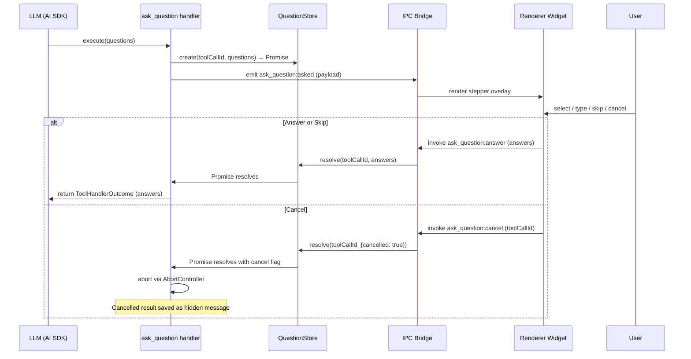
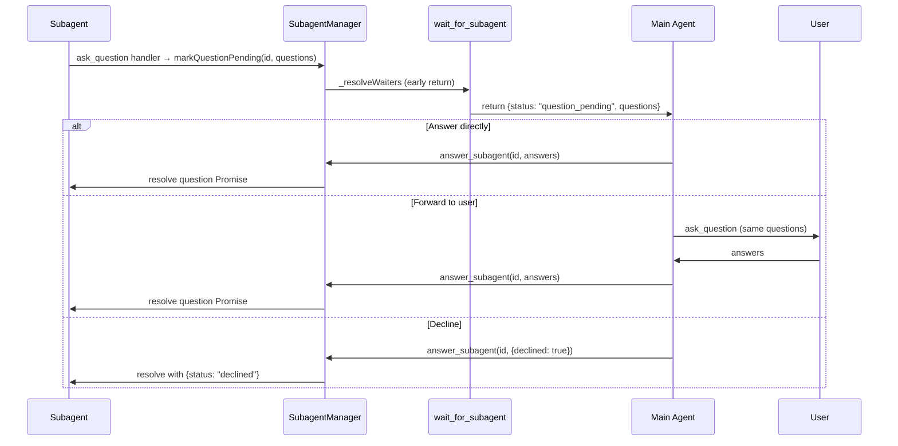

# feat: Add ask_question tool with interactive stepper widget

## Summary

Add an `ask_question` tool that pauses an agent's turn to present the user with a stepper of single/multi-choice questions (each with optional descriptions and a free-text field). The widget overlays the input area, blocking message sends until answered or cancelled. A parallel subagent escalation path lets subagents route questions to the main agent via `wait_for_subagent` early return, a new `answer_subagent` tool, and a dynamic system prompt section.

## Problem Frame

The agent currently has no mechanism to pause and ask the user a structured question mid-turn. When the agent needs clarification or a decision, it can only ask in free-form text and hope the user's next message answers it — losing the turn's context and forcing a new round-trip. A structured question tool with an interactive widget enables the agent to get precise answers without ending its turn, and enables subagents to escalate decisions to the main agent without completing blindly.

## Requirements

Carried from origin: `docs/brainstorms/2026-07-21-ask-question-tool-requirements.md`

**Question model**

- R1. The tool accepts an array of one or more questions. Each question has a type (single-choice or multi-choice), a title, an optional description, and an array of options. Each option has a label and an optional description.
- R2. Every question includes a free-form text input. The agent receives both the selection(s) and the free text.
- R3. The tool result is structured: for each question, the selected option labels, the free text (or null), and a skipped flag.

**Widget behavior**

- R4. Multiple questions render as a stepper: one question at a time, Next/Back navigation, Submit on the last question.
- R5. Single-choice questions allow exactly one selection. Multi-choice questions allow multiple selections.
- R6. The widget overlays the input area. The user can navigate the UI and browse chat history but cannot send a message until the questions are answered or cancelled.
- R7. The user can skip an individual question (returns "skipped", advances the stepper).
- R8. The user can cancel the entire question set. Cancelling saves a cancelled tool result to session history (hidden from LLM context) and aborts the current turn/chain.
- R9. After answering, the completed widget persists in chat history showing what was selected and written.

**Subagent escalation**

- R10. When a subagent calls `ask_question` while the main agent is in `wait_for_subagent`, the wait returns early with the pending question.
- R11. When the main agent calls or is in `wait_for_subagent` and a target subagent has a pending question, the wait returns immediately regardless of whether the question arrived before or during the wait.
- R12. When a subagent calls `ask_question` and the main agent is not in `wait_for_subagent`, the question queues. The dynamic system prompt reflects pending questions on the main agent's next turn.
- R13. A new `answer_subagent` tool lets the main agent answer a subagent's pending question or decline it.
- R14. The main agent can forward a subagent's question to the user by calling `ask_question` itself, then relaying the answer via `answer_subagent`.
- R15. A declined question resolves the subagent's `ask_question` with `{ status: "declined" }`. The subagent continues without an answer.
- R16. Multiple subagents can have pending questions simultaneously.

## Key Technical Decisions

- **Promise-based question store**: The tool handler awaits a Promise stored in a per-session question store. The renderer's answer IPC invoke resolves the Promise. This mirrors the existing `SubagentManager._resolveWait` waiter pattern and requires no changes to the AI SDK tool execution model.
- **Cancel = abort + hidden persistence**: Cancel triggers the existing `AbortController` to abort the stream (first tool that can terminate a turn from within). The cancelled tool result is saved to `turnMessages` with `hidden: true` so it persists in session history but is filtered from LLM context by `toApiMessages`.
- **Subagent questions resolve existing waiters**: When a subagent asks a question, `SubagentManager` stores the question on the record and calls `_resolveWaiters` — the same mechanism used for completion. The `wait()` caller distinguishes "completed" from "has pending question" by checking the record state. No parallel notification channel needed.
- **Widget is a new interactive tool result renderer**: Registered in the existing `ToolResults/registry.tsx` pattern. First interactive widget in the codebase — sets the pattern for future interactive tool results.
- **IPC uses a dedicated channel pair**: `ask_question:asked` (main→renderer event) pushes the question payload. `ask_question:answer` (renderer→main invoke) submits the answer. Follows the existing 4-file IPC pattern (shared/types/ipc.ts, preload/index.ts, main/ipc/, renderer hook).

## High-Level Technical Design





## Implementation Units

### U1. Tool definition and Zod schema

- **Goal:** Define the `ask_question` tool with input/output schemas and register it in the tool registry.
- **Requirements:** R1, R2, R3
- **Dependencies:** None
- **Files:**
  - `electron/src/main/tools/ask-question/ask-question.ts` (create)
  - `electron/src/main/tools/ask-question/index.ts` (create)
  - `electron/src/main/tools/index.ts` (modify — register tool)
  - `electron/src/main/agents/AGENT.md` (modify — add to main agent's allowed tools)
- **Approach:**
  - Input schema: `{ questions: z.array(z.object({ type: z.enum(['single', 'multi']), title: z.string(), description: z.string().optional(), options: z.array(z.object({ label: z.string(), description: z.string().optional() })) })) }`
  - Output data schema: `{ answers: z.array(z.object({ selected: z.array(z.string()), text: z.string().nullable(), skipped: z.boolean() })) }`
  - Result family: `'generic'`
  - Handler is a stub initially (returns empty answers) — fleshed out in U2.
- **Patterns to follow:** `electron/src/main/tools/todo/create.ts` for tool definition shape; `electron/src/main/tools/index.ts` for registration.
- **Test files:** `electron/tests/unit/ask-question-schema.test.ts`
- **Test scenarios:**
  - Schema validates a well-formed multi-question input
  - Schema rejects missing type, empty options array, empty title
  - Tool appears in registry after registration
  - Tool is in main agent's allowed tools list
- **Verification:** Tool is registered, schema validates/rejects correctly, stub handler returns a result.

### U2. Question store, IPC channels, and tool handler

- **Goal:** Implement the Promise-based question store, IPC channels for bidirectional communication, and the full tool handler that awaits user answers.
- **Requirements:** R1, R2, R3, R8
- **Dependencies:** U1
- **Files:**
  - `electron/src/main/tools/ask-question/store.ts` (create — QuestionStore)
  - `electron/src/main/tools/ask-question/ask-question.ts` (modify — full handler)
  - `electron/src/shared/types/ipc.ts` (modify — add channels)
  - `electron/src/preload/index.ts` (modify — add bridge methods)
  - `electron/src/main/ipc/ask-question.ts` (create — IPC handlers)
  - `electron/src/main/ipc/index.ts` (modify — register handlers)
- **Approach:**
  - `QuestionStore`: per-session Map of `toolCallId → { questions, resolve, reject }`. Methods: `create(toolCallId, questions)` returns a Promise; `answer(toolCallId, answers)` resolves it; `cancel(toolCallId)` resolves with cancel flag; `cleanup(toolCallId)` removes entry. The store extends `EventEmitter` — on `create()`, it emits a `'question-asked'` event with `{ sessionId, toolCallId, questions }`.
  - `ToolExecutionContext` carries `sessionId`, `agentScopeId`, and `abortSignal` but NOT `webContents`. The tool handler cannot emit IPC events directly. Instead, the IPC layer (which has webContents access) subscribes to the store's `'question-asked'` event and forwards it to the renderer via `webContents.send`. The store is the bridge between the tool handler and the IPC layer.
  - Handler flow: validate input → `store.create()` (emits event, IPC layer forwards to renderer) → await Promise → on answer: return `ToolHandlerOutcome` with answers → on cancel: save hidden cancelled result to turnMessages, trigger abort via `ctx.abortSignal`.
  - IPC channels: `ask_question:asked` (main→renderer event, carries `{ sessionId, toolCallId, questions }`), `ask_question:answer` (renderer→main invoke, carries `{ toolCallId, answers }`), `ask_question:cancel` (renderer→main invoke, carries `{ toolCallId }`).
- **Patterns to follow:** `SubagentManager._resolveWait` for the Promise waiter pattern; `electron/src/main/ipc/chat.ts` for IPC handler registration; `electron/src/shared/types/ipc.ts` for channel definition pattern (4-file change).
- **Test files:** `electron/tests/unit/ask-question-store.test.ts`, `electron/tests/unit/ask-question-handler.test.ts`
- **Test scenarios:**
  - `store.create()` returns a Promise that resolves when `store.answer()` is called
  - `store.cancel()` resolves the Promise with a cancel flag
  - `store.cleanup()` removes the entry; answering a cleaned-up entry is a no-op or error
  - Handler returns structured answers when store resolves with answers
  - Handler triggers abort when store resolves with cancel
  - IPC `ask_question:answer` handler resolves the correct store entry
  - IPC `ask_question:cancel` handler triggers cancel flow
- **Verification:** Full round-trip works in isolation: handler creates question → store holds Promise → IPC answer resolves it → handler returns result.

### U3. Renderer stepper widget

- **Goal:** Build the interactive question stepper widget that overlays the input area.
- **Requirements:** R4, R5, R6, R7, R8, R9
- **Dependencies:** U2
- **Files:**
  - `electron/src/renderer/components/ToolResults/AskQuestionToolResult.tsx` (create)
  - `electron/src/renderer/components/ToolResults/registry.tsx` (modify — register)
  - `electron/src/renderer/hooks/useAskQuestion.ts` (create — IPC subscription + state)
  - `electron/src/renderer/components/Footer.tsx` or input component (modify — overlay + input blocking)
- **Approach:**
  - `useAskQuestion` hook: subscribes to `ask_question:asked` event, holds active question state (`{ toolCallId, questions, currentIndex, answers[] }`), exposes `submitAnswer`, `skipQuestion`, `cancelAll` actions that call `window.orchid.askQuestion.answer/cancel`.
  - Widget component: renders when `useAskQuestion` has an active question. Stepper UI: question title + description, option list (radio for single, checkbox for multi), free-text textarea, Back/Next/Skip buttons, Submit on last question, Cancel button.
  - Overlay: the widget renders in the Footer/input area position, replacing the input. Chat history remains scrollable. The `useChat` send function is gated by `activeQuestion !== null`.
  - After answer/cancel: widget unmounts, input reappears. The terminal tool result renders in chat history via the standard `ToolResultShell` → registry path (showing a summary of selections).
  - Terminal (historical) rendering: a non-interactive summary showing each question's selected options and text. Registered as the `ask_question` tool renderer in `registry.tsx`.
- **Patterns to follow:** `LiveCommandInline.tsx` for a live widget with ongoing main-process contact; `ToolResultShell.tsx` for the shell contract; `Footer.tsx` for the input area layout; existing `useChat.ts` for IPC event subscription pattern (`onParsed`).
- **Test files:** `electron/tests/unit/ask-question-widget.test.ts`
- **Test scenarios:**
  - Single-choice question renders radio buttons; selecting one deselects others
  - Multi-choice question renders checkboxes; multiple selections allowed
  - Free-text input is always present below options
  - Stepper shows question N of M; Next advances, Back returns
  - Skip marks current question as skipped and advances
  - Submit on last question calls `ask_question:answer` with all answers
  - Cancel calls `ask_question:cancel`
  - Input area is blocked (send disabled) while question is active
  - After answer, widget unmounts and input reappears
  - Historical rendering shows a non-interactive summary
- **Verification:** Widget renders on `ask_question:asked` event, stepper navigation works, answer/cancel IPC calls fire correctly, input is blocked during active question.

### U4. Cancel flow and session persistence

- **Goal:** Implement the cancel path: save a cancelled tool result as a hidden message in session history and abort the turn.
- **Requirements:** R8
- **Dependencies:** U2, U3
- **Files:**
  - `electron/src/main/tools/ask-question/ask-question.ts` (modify — cancel handling)
  - `electron/src/main/ipc/chat.ts` (modify — hidden message persistence)
  - `electron/src/main/llm/history.ts` (verify/modify — filter hidden messages from LLM context)
- **Approach:**
  - When the handler receives a cancel from the store: create a `CanonicalToolResult` with `status: 'cancelled'`, push a `makeToolResultMessage` with `hidden: true` to `turnMessages`, then trigger the `AbortController.abort()`.
  - Verify `toApiMessages` in `history.ts` filters `hidden: true` messages. If not, add a filter at the top of the message loop.
  - The abort propagates through the existing stream cancellation path (agent machine CANCEL → interrupted state → `persistTurnConversation` with `ChainStatus.INTERRUPTED`).
  - The hidden cancelled result is already in `turnMessages` and gets persisted by the existing interrupt persistence path.
- **Patterns to follow:** `flushPartialTurnContent` in `chat.ts` for the interrupt persistence path; `history.ts:43-45` for the ERROR message filter pattern.
- **Test files:** `electron/tests/unit/ask-question-cancel.test.ts`
- **Test scenarios:**
  - Cancel saves a tool result message with `hidden: true` and `status: 'cancelled'`
  - `toApiMessages` excludes hidden messages from LLM context
  - Hidden message is present in persisted session history (visible on reload)
  - Abort terminates the stream; agent machine transitions to interrupted
  - Next turn's LLM context does not include the cancelled result
- **Verification:** Cancel persists a hidden cancelled result, aborts the turn, and the result is invisible to the LLM on subsequent turns.

### U5. SubagentManager question support

- **Goal:** Add pending question tracking to SubagentManager so subagent questions resolve waiters and are queryable.
- **Requirements:** R10, R11, R12, R15, R16
- **Dependencies:** U2
- **Files:**
  - `electron/src/main/agents/manager.ts` (modify — SubagentRecord + methods)
  - `electron/src/main/tools/ask-question/store.ts` (modify — subagent question routing)
- **Approach:**
  - Add to `SubagentRecord`: `pendingQuestion: { toolCallId: string, questions: Question[] } | null` and `questionResolve: ((answer: QuestionAnswer[] | { declined: true }) => void) | null`.
  - New method `markQuestionPending(subagentId, toolCallId, questions)`: stores the question on the record, then calls `_resolveWaiters(record)` to unblock any active `wait()`. The record stays in RUNNING state (not terminal).
  - New method `answerSubagentQuestion(subagentId, answers)`: resolves `questionResolve`, clears `pendingQuestion`, sets `questionResolve` to null.
  - New method `getPendingQuestions(sessionId)`: returns all records for the session with non-null `pendingQuestion`.
  - The subagent's `ask_question` handler detects it's running as a subagent (via `ctx.agentScopeId !== 'main'` or similar) and routes to `markQuestionPending` instead of the user-facing IPC path. The handler awaits a Promise that `answerSubagentQuestion` resolves.
  - If the subagent is cancelled while a question is pending, the question Promise rejects with an abort error (handled by existing cancel cleanup).
- **Patterns to follow:** `markCompleted` / `_resolveWaiters` in `manager.ts` for the waiter resolution pattern.
- **Test files:** `electron/tests/unit/subagent-question.test.ts`
- **Test scenarios:**
  - `markQuestionPending` stores question and resolves waiters
  - Record stays in RUNNING state after `markQuestionPending` (not terminal)
  - `answerSubagentQuestion` resolves the question Promise and clears pending state
  - `getPendingQuestions` returns only records with pending questions for the session
  - Multiple subagents can have pending questions simultaneously
  - Cancelling a subagent with a pending question rejects the question Promise
- **Verification:** Subagent question flow works: markQuestionPending → waiter resolves → answerSubagentQuestion → subagent handler gets answer.

### U6. answer_subagent tool

- **Goal:** New tool that lets the main agent answer or decline a subagent's pending question.
- **Requirements:** R13, R14, R15
- **Dependencies:** U5
- **Files:**
  - `electron/src/main/tools/subagent/answer.ts` (create)
  - `electron/src/main/tools/subagent/index.ts` (modify — export)
  - `electron/src/main/tools/index.ts` (modify — register)
  - `electron/src/main/agents/AGENT.md` (modify — add to main agent's allowed tools)
- **Approach:**
  - Input schema: `{ subagent_id: z.string(), answers: z.array(answerSchema).optional(), decline: z.boolean().optional() }`. Exactly one of `answers` or `decline: true` must be provided.
  - Handler: look up the subagent record via `SubagentManager`, verify it has a pending question, call `answerSubagentQuestion(id, answers)` or `answerSubagentQuestion(id, { declined: true })`.
  - Error cases: subagent not found, no pending question, both answers and decline provided, neither provided.
  - Only available to the main agent (not subagents — subagents can't answer other subagents' questions).
- **Patterns to follow:** `electron/src/main/tools/subagent/wait.ts` for the subagent tool shape and manager access pattern.
- **Test files:** `electron/tests/unit/answer-subagent.test.ts`
- **Test scenarios:**
  - Answering a subagent with a pending question resolves it
  - Declining resolves with `{ status: "declined" }`
  - Error when subagent has no pending question
  - Error when subagent not found
  - Error when both answers and decline provided
  - Tool is not available to subagents
- **Verification:** Main agent can answer or decline a subagent's pending question via the tool.

### U7. wait_for_subagent early return

- **Goal:** Modify `wait_for_subagent` to detect pending questions and return early with question data.
- **Requirements:** R10, R11, R16
- **Dependencies:** U5
- **Files:**
  - `electron/src/main/agents/manager.ts` (modify — `wait()` method)
  - `electron/src/main/tools/subagent/wait.ts` (modify — output format)
- **Approach:**
  - In `SubagentManager.wait()`: after `Promise.all(pending)` resolves (via `_resolveWaiters`), check each record for `pendingQuestion !== null`. If any have pending questions, return early with those records flagged.
  - Also check for pending questions BEFORE creating wait Promises: if a target subagent already has a pending question when `wait()` is called, return immediately without blocking (R11).
  - In `wait.ts` handler: after `manager.wait()` returns, check each record's state. For records with `pendingQuestion`, include a `<pending_question>` XML block in the output alongside the existing `<result>` / `<error>` blocks.
  - Output format for pending questions:
    ```xml
    <subagent id="..." name="..." status="question_pending">
      <task>...</task>
      <pending_question tool_call_id="...">
        <question type="single" title="...">
          <option label="..." description="..." />
        </question>
      </pending_question>
    </subagent>
    ```
- **Patterns to follow:** Existing `wait()` Promise race pattern in `manager.ts:324-414`; existing XML output format in `wait.ts:112-155`.
- **Test files:** `electron/tests/unit/wait-subagent-question.test.ts`
- **Test scenarios:**
  - `wait()` returns early when a subagent gets a pending question during the wait
  - `wait()` returns immediately when a target subagent already has a pending question
  - Output includes `<pending_question>` XML for question-pending subagents
  - Completed subagents in the same wait batch still show their results
  - Multiple pending questions from different subagents are all included
- **Verification:** `wait_for_subagent` returns early with question data when any target subagent has a pending question.

### U8. Dynamic system prompt section

- **Goal:** Add a `<pending_subagent_questions>` section to the dynamic system prompt so the main agent is aware of pending questions across turns.
- **Requirements:** R12
- **Dependencies:** U5
- **Files:**
  - `electron/src/main/llm/system-prompt.ts` (modify — SystemPromptContext + rendering)
  - `electron/src/main/llm/build-prompt-context.ts` (modify — populate field)
- **Approach:**
  - Add `pendingSubagentQuestions?: PendingSubagentQuestion[]` to `SystemPromptContext` interface.
  - In `buildDynamicSystemPrompt`: after the `<subagents>` block, render `<pending_subagent_questions>` with each question's subagent ID, name, and question summary. Follow the existing conditional section pattern.
  - In `buildSystemPromptContext`: call `SubagentManager.getPendingQuestions(sessionId)` and map to the context field.
  - The section is only present when there are pending questions (conditional, like `<subagents>`).
- **Patterns to follow:** The `<subagents>` section in `system-prompt.ts:134-143` for the conditional rendering pattern; `mapSubagents()` in `build-prompt-context.ts` for the data mapping pattern.
- **Test files:** `electron/tests/unit/build-prompt-context.test.ts` (extend existing)
- **Test scenarios:**
  - System prompt includes `<pending_subagent_questions>` when questions are pending
  - System prompt omits the section when no questions are pending
  - Each pending question includes subagent ID, name, and question titles
  - Section appears after `<subagents>` in the prompt
- **Verification:** Main agent's system prompt reflects pending subagent questions on each turn.

## Scope Boundaries

- No mid-turn interruption of the main agent for subagent questions — awareness comes via system prompt on the next turn.
- No direct user-to-subagent answering — always routed through the main agent.
- No conditional questions (show Q2 based on Q1's answer).
- No question timeout or auto-skip.
- No question validation (required fields).
- The `ask_question` tool is not available to subagents in this plan's initial units — U5 adds the routing infrastructure, but the tool's availability in subagent AGENT.md configs is a follow-up.

## Open Questions

Deferred to implementation:

- Exact widget rendering: how the overlay integrates with the existing Footer/input component layout.
- How the completed question widget renders in chat history (collapsed summary vs. full replay).
- Whether the main agent's `ask_question` call for forwarding should visually indicate it originated from a subagent.
- Subagent system prompt guidance for handling declined answers gracefully.
- How `wait_for_subagent` formats multiple pending questions from different subagents in a single early return.
- Whether `toApiMessages` already filters `hidden: true` messages or needs a new filter.
