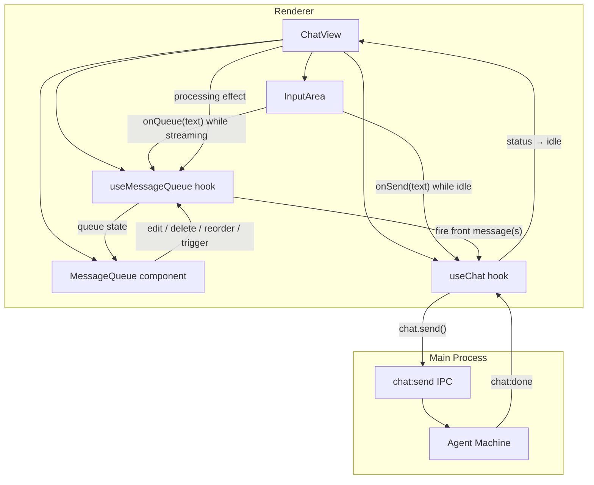

## Summary

Add a renderer-side message queue that lets users compose, manage, and auto-send messages while the agent is working. Queued messages appear above the input field with two trigger types ("with next request" and "after chain ends"), strict FIFO processing, inline editing, reordering, and auto-fire on chain termination.

## Problem Frame

While the agent is streaming or executing tools, the user's input is gated — `evaluateComposerSend` returns `'ignore'` during streaming (`src/renderer/lib/composer-send-lock.ts`). The user must wait for the agent to finish before sending the next message, losing their train of thought or forcing them to keep separate notes. The queue captures that intent and delivers it at the right moment.

## Requirements

Carried forward from origin (see origin: `docs/brainstorms/2026-07-22-message-queue-requirements.md`).

**Queue management**

- R1. The user can queue a message while the agent is streaming.
- R2. The user can edit a queued message's text inline; while editing, that message cannot fire.
- R3. The user can delete a queued message.
- R4. The user can reorder queued messages.
- R5. The user can change a queued message's trigger between "with next request" and "after chain ends."

**Trigger semantics**

- R6. "With next request" messages fire when the agent's current chain completes and the next LLM interaction begins.
- R7. "After chain ends" messages fire when the chain terminates for any reason (completed, interrupted, failed).
- R8. "With next request" messages whose trigger never arrives (chain ends without a subsequent request) fire at chain termination.
- R9. Consecutive "with next request" messages at the front of the queue batch into a single send.

**Queue processing**

- R10. The queue processes in strict FIFO order — a message must fire before the next is eligible.
- R11. Messages auto-send when their trigger fires; no confirmation prompt.
- R12. If the front message is being edited when its trigger fires, the queue holds until editing ends.

**Input field behavior**

- R13. While streaming, Enter queues the composed text instead of sending immediately.
- R14. While idle, Enter sends normally (existing behavior unchanged).

**UI**

- R15. Queued messages render above the input field, below the chat stream.
- R16. Each queue item shows a text preview, trigger badge, and controls for edit, delete, reorder, and trigger change.

---

## Key Technical Decisions

- **Renderer-only queue, no main-process changes**: The queue is ephemeral per-session UI state. Firing a queued message calls the existing `chat.send()` IPC — no new IPC channels or main-process logic needed. The main process already handles `chat:send` → chain creation → streaming → `chat:done` → idle.

- **Both triggers fire at the idle transition**: The AI SDK's `maxSteps` loop handles tool calls internally (`src/main/llm/orchestrator.ts`); we cannot inject user messages between SDK steps. "With next request" therefore fires at the earliest idle boundary (when `chat:done` or `chat:error` sets status to idle), which is functionally equivalent — the LLM sees the message as the next user turn in the conversation history.

- **Standalone `useMessageQueue` hook composed in ChatView**: Keeps queue logic separate from `useChat` (which owns stream state). ChatView wires them together: `useMessageQueue` for queue state, `useChat` for send/status, and a processing effect that bridges them.

- **InputArea receives an `onQueue` callback**: During streaming, `handleSend` in InputArea calls `onQueue(text)` instead of `onSend(text)`. The `evaluateComposerSend` gate changes from `'ignore'` to `'queue'` when streaming and an `onQueue` handler is present.

- **Batch = newline-joined content in a single `chat.send()`**: Consecutive "next-request" messages at the queue front are combined as `"msg1\n\nmsg2"` in one send call. This produces a single user message in the conversation, matching the batch semantics.

---

## High-Level Technical Design

**Queue processing loop** (runs on every `status` transition to idle):

1. Check queue front. If empty, stop.
2. If front message is being edited, stop (hold).
3. Collect consecutive "next-request" messages from the front → batch.
4. If front is "chain-end", take just that one message.
5. Remove fired messages from queue.
6. Call `chat.send()` with the batched content.
7. Status transitions to streaming → wait for next idle → repeat from 1.

---

## Implementation Units

### U1. Queue data model and state hook

- **Goal**: Define the `QueuedMessage` type and `useMessageQueue` hook with all queue operations.
- **Requirements**: R1, R2, R3, R4, R5, R10, R12
- **Dependencies**: None
- **Files**:
  - Create `electron/src/renderer/hooks/use-message-queue.ts`
  - Create `electron/src/shared/types/message-queue.ts`
  - Modify `electron/src/shared/types/index.ts` (barrel export)
- **Approach**:
  - `QueuedMessage`: `{ id: string, content: string, trigger: 'next-request' | 'chain-end', createdAt: number }`.
  - `useMessageQueue(sessionId)` returns: `queue`, `addToQueue(content, trigger)`, `removeFromQueue(id)`, `reorderQueue(fromIndex, toIndex)`, `updateContent(id, content)`, `changeTrigger(id, trigger)`, `editingId`, `setEditingId(id | null)`, `drainFront()`.
  - `drainFront()` implements the batch logic: returns `{ content: string, ids: string[] } | null`. Returns null if queue is empty or front message is being edited. Collects consecutive `next-request` messages; if front is `chain-end`, returns just that one. Removes drained messages from state.
  - Queue state resets when `sessionId` changes (per-session, in-memory).
  - Default trigger for new messages: `'next-request'`.
- **Patterns to follow**: `useTodos` hook (`src/renderer/hooks/useTodos.ts`) for per-session state management pattern.
- **Test scenarios**:
  - Add message → appears at end of queue with correct trigger
  - Remove message → disappears, indices shift
  - Reorder → message moves to new position
  - Edit content → content updates, editingId set
  - Change trigger → trigger updates
  - `drainFront` with empty queue → null
  - `drainFront` with front message being edited → null
  - `drainFront` with consecutive next-request → batched content joined with `\n\n`, all IDs returned
  - `drainFront` with chain-end at front → single message returned
  - `drainFront` with mixed [next-request, chain-end] → only next-request batched
  - Queue resets on sessionId change
- **Verification**: All hook operations work in isolation; `drainFront` correctly implements FIFO + batch + edit-hold.

### U2. MessageQueue UI component

- **Goal**: Render the queue above InputArea with inline editing, trigger badges, and controls.
- **Requirements**: R15, R16, R2, R3, R4, R5
- **Dependencies**: U1
- **Files**:
  - Create `electron/src/renderer/components/MessageQueue.tsx`
  - Modify `electron/src/renderer/styles/components.css` (queue styles in `@layer components`)
- **Approach**:
  - Component receives queue state and callbacks from `useMessageQueue` via props.
  - Each item: truncated text preview (2 lines max), trigger badge (`next` / `chain-end`), edit (pencil), delete (×), reorder (up/down arrows), trigger toggle.
  - Inline editing: clicking edit replaces the preview with a textarea (auto-focus, same font). Save on Enter or blur, cancel on Escape. While editing, `editingId` is set in the hook.
  - Reorder via up/down arrow buttons (no drag-and-drop — simpler, accessible).
  - Trigger toggle: clicking the badge cycles between `next-request` and `chain-end`.
  - Empty queue → component renders nothing (no wrapper div).
  - Use existing UI primitives from `src/renderer/components/ui/` where applicable. Follow the primitive-first rule from AGENTS.md.
- **Patterns to follow**: Existing component patterns in `src/renderer/components/`. Badge styling from existing badge primitives. Textarea styling from InputArea.
- **Test scenarios**:
  - Renders nothing when queue is empty
  - Renders one item per queued message with text preview and trigger badge
  - Edit button enters inline editing mode (textarea visible)
  - Save on Enter commits edited content
  - Cancel on Escape reverts content
  - Delete button removes the message
  - Up/down arrows call reorder with correct indices
  - Up arrow disabled on first item, down arrow disabled on last
  - Trigger badge click toggles trigger type
- **Verification**: Queue renders correctly above InputArea; all controls functional; empty queue invisible.

### U3. Composer queue-mode integration

- **Goal**: During streaming, Enter queues the composed text instead of being ignored.
- **Requirements**: R13, R14, R1
- **Dependencies**: U1
- **Files**:
  - Modify `electron/src/renderer/lib/composer-send-lock.ts` (add `'queue'` action)
  - Modify `electron/src/renderer/components/InputArea.tsx` (accept `onQueue` prop, route to it during streaming)
  - Modify `electron/src/renderer/components/ChatView.tsx` (pass `onQueue` to InputArea)
- **Approach**:
  - `evaluateComposerSend`: when `isStreaming` is true and `trimmed` is non-empty, return `{ action: 'queue' }` instead of `{ action: 'ignore' }`. Add `hasQueueHandler` to the input params.
  - InputArea: new optional prop `onQueue?: (text: string) => void`. In `handleSend`, when gate action is `'queue'`, call `onQueue(trimmed)`, clear input, reset textarea height. Same UX as send (clear input, reset height) but calls `onQueue` instead of `onSend`.
  - Send button: during streaming, show a queue icon/label instead of send icon. Visual distinction so the user knows they're queueing, not sending.
  - ChatView: pass `queue.addToQueue` as `onQueue` to InputArea.
- **Patterns to follow**: Existing `evaluateComposerSend` pattern in `composer-send-lock.ts`. InputArea's existing `handleSend` flow.
- **Test scenarios**:
  - `evaluateComposerSend` with `isStreaming: true`, `hasQueueHandler: true`, non-empty text → `{ action: 'queue' }`
  - `evaluateComposerSend` with `isStreaming: true`, `hasQueueHandler: false` → `{ action: 'ignore' }` (backward compat)
  - `evaluateComposerSend` with `isStreaming: false` → `{ action: 'send' }` (unchanged)
  - InputArea calls `onQueue` with trimmed text during streaming
  - InputArea clears input after queueing
  - InputArea does not call `onSend` during streaming
  - Send button shows queue affordance during streaming
- **Verification**: Typing and pressing Enter during streaming adds to queue; during idle, sends normally.

### U4. Queue auto-fire processing

- **Goal**: Wire queue processing into ChatView so queued messages auto-fire on idle transitions.
- **Requirements**: R6, R7, R8, R9, R10, R11, R12
- **Dependencies**: U1, U3
- **Files**:
  - Modify `electron/src/renderer/components/ChatView.tsx` (processing effect)
- **Approach**:
  - A `useEffect` in ChatView watches `chat.status`. When status transitions to `'idle'` (from `'streaming'` or `'error'`), call `queue.drainFront()`.
  - If `drainFront()` returns content, call `chat.send(content)` with the current session/model selection (same as `handleSend`).
  - Guard against re-entrant firing: use a ref (`isFiringRef`) to prevent double-fire from rapid status transitions.
  - The effect naturally loops: fire → status goes streaming → chain ends → status idle → effect fires again → next message.
  - On cancel (Esc): `chat.cancel()` sets status to idle → effect fires → queued messages drain. This satisfies R8 (next-request degrades to chain-end on interrupt).
  - Session switch: queue resets via `useMessageQueue(sessionId)`, so no stale messages fire into the wrong session.
- **Patterns to follow**: ChatView's existing `useEffect` patterns for status watching.
- **Test scenarios**:
  - Status idle + queue has next-request message → message fires via chat.send
  - Status idle + queue has chain-end message → message fires via chat.send
  - Status idle + queue has [next-request, next-request, chain-end] → first two batch, fire together; chain-end fires after their chain completes
  - Status idle + front message being edited → nothing fires
  - Editing ends + status still idle → front message fires
  - Cancel during streaming → status idle → queued messages fire
  - Error during streaming → status idle → queued messages fire
  - Session switch → queue clears, no stale fire
  - Empty queue + status idle → no-op
- **Verification**: Queued messages auto-fire in FIFO order on idle transitions; batching works; edit-hold works; cancel/error triggers fire.

### U5. Integration polish and edge cases

- **Goal**: Handle remaining edge cases, visual polish, and cross-cutting concerns.
- **Requirements**: R15, R16
- **Dependencies**: U2, U4
- **Files**:
  - Modify `electron/src/renderer/components/ChatView.tsx` (layout, toast for queue events)
  - Modify `electron/src/renderer/components/InputArea.tsx` (placeholder text during streaming)
- **Approach**:
  - InputArea placeholder: during streaming, change placeholder to "Type a message to queue…" to signal queue mode.
  - Queue position indicator: show position number on each queue item (1, 2, 3…).
  - Toast notification when a queued message fires: brief "Queued message sent" toast using ChatView's existing `notify()` pattern.
  - Keyboard: Escape during inline editing cancels the edit (already in U2). No global keyboard shortcuts for queue management.
  - Scroll: if queue grows beyond ~5 items, the queue container scrolls (max-height with overflow-y auto).
- **Patterns to follow**: ChatView's `notify()` toast pattern. Existing scroll containers in the app.
- **Test scenarios**:
  - Placeholder text changes during streaming
  - Queue items show position numbers
  - Toast appears when a queued message fires
  - Queue scrolls when exceeding max visible items
- **Verification**: Full end-to-end flow works: queue during streaming → see queue above input → edit/reorder/delete → agent finishes → messages auto-fire in order → toast confirms.

---

## Scope Boundaries

- **No main-process changes.** The queue is entirely renderer-side. Firing uses the existing `chat:send` IPC.
- **No persistence.** Queue is in-memory, per-session, lost on session switch or app restart.
- **No drag-and-drop reorder.** Up/down arrow buttons only.
- **No rich content.** Queued messages are plain text (same as the input field).
- **No queue limit.** No maximum number of queued messages.

## Open Questions

Deferred to implementation:

- Default trigger for newly queued messages — plan assumes `'next-request'`; confirm during implementation.
- Whether the send button icon changes to a queue icon during streaming, or keeps the same icon with a label change.
- Whether queued messages support the same multiline input (Shift+Enter for newline) as the normal input field.
- Behavior when a queued message's text is emptied during editing (auto-delete or prevent save).

## Risks & Dependencies

- **AI SDK step injection limitation**: "With next request" cannot inject between AI SDK `maxSteps` iterations. It fires at the idle boundary instead. Functionally equivalent for the user, but the message starts a new chain rather than joining the current one mid-tool-loop. If true mid-step injection is needed later, it requires AI SDK middleware or a custom multi-step loop.
- **Race between status transition and queue processing**: Rapid status changes (e.g., error immediately after streaming) could cause double-fire. Mitigated by `isFiringRef` guard in U4.
- **`components.css` growth**: Queue styles add to `components.css` (~1,963 lines, threshold ~2,000). Keep styles minimal; prefer Tailwind utilities and primitives.
