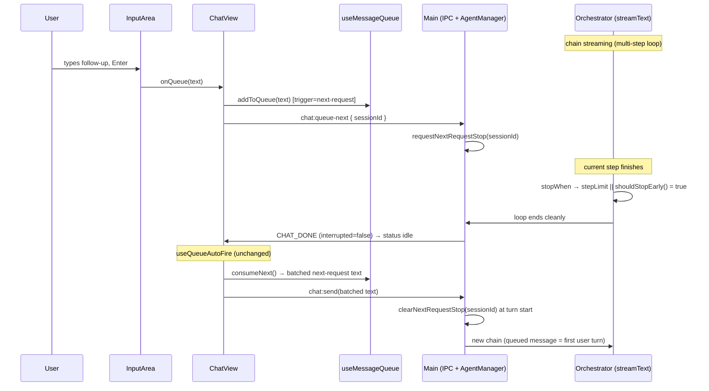

## Summary

Make "with next request" queued messages fire at the **next step boundary** instead of at the end of the chain. When a `next-request` message is queued mid-stream, the renderer asks the main process to stop the current chain at the next step boundary; the chain ends cleanly, goes idle, and the existing auto-fire sends the queued message as the first turn of a **new chain**. "After chain end" behavior is unchanged.

## Problem Frame

The shipped queue fires both trigger types on the same `streaming → idle` transition (`electron/src/renderer/hooks/useQueueAutoFire.ts`, `shouldAutoFire`). The trigger only changes batching (`selectBatch` in `electron/src/renderer/hooks/useMessageQueue.ts`), never timing. Because the AI SDK runs the whole multi-step loop in the main process (`stopWhen: isStepCount(maxSteps)` in `electron/src/main/llm/orchestrator.ts`) and the renderer only sees the terminal `CHAT_DONE → idle`, a `next-request` message cannot fire until the entire chain finishes — behaving identically to `chain-end`. This violates R6's intent ("sent at the next request, not at the end of the chain"). See the original implementation plan: `docs/plans/2026-07-22-001-feat-message-queue-plan.md`.

## Requirements

Carried from origin (`docs/brainstorms/2026-07-22-message-queue-requirements.md`), with R6 reinterpreted per the agreed **stop-and-new-chain** direction:

- **R6 (reinterpreted).** A `next-request` message queued during streaming causes the current chain to stop at the next step boundary; the message then starts a new chain and appears in the chat stream as a normal user message. (Original wording said "inject within the current chain"; the user chose stop-and-new-chain as the tractable interpretation — see Key Technical Decisions.)
- **R8.** Consecutive `next-request` messages still batch into a single send (one new chain). Unchanged — handled by the existing `selectBatch`.
- **R9.** If the chain ends naturally before the early stop takes effect, `next-request` messages still fire at the idle transition (degradation). Unchanged.
- **R7.** `chain-end` messages still fire only when the chain terminates. Unchanged — they never signal an early stop.
- **AE1–AE4.** Queue-during-streaming, batch injection, cancel-with-queue, and edit-hold flows continue to work; AE2's "injected before the next LLM API call" becomes "the current chain stops before its next step and the batch starts a new chain."

## Key Technical Decisions

- **Stop-and-new-chain, not mid-chain injection.** Instead of `prepareStep`-based injection into the in-flight chain (which needs message-format conversion, a mid-stream user-bubble event, and within-turn persistence), we end the current chain early at the next step boundary and let the queued message start a fresh chain. This reuses the already-built and tested `idle → useQueueAutoFire → consumeNext → chat.send` path for starting the new chain, and the normal `chat.send` optimistic-append + persistence path for rendering the user message. Trade-off: the agent pauses and restarts at a clean user-turn boundary (history preserved) rather than continuing with the instruction folded into its in-flight momentum.

- **Early stop via a custom `stopWhen` predicate.** AI SDK v7 `stopWhen` accepts a predicate `(context: StepContext) => boolean` (verified: `StepCondition = StandardStepCondition | ((context) => boolean | Promise<boolean>)`). The orchestrator composes a predicate that returns true when **either** the step-count limit is reached (delegating to `isStepCount(maxSteps)`) **or** the session's early-stop flag is set. `stopWhen` is a clean loop termination (not an abort), so the chain emits a normal `CHAT_DONE` with `interrupted: false` and the partial work is committed like any completed chain.

- **`stopWhen` timing = next step boundary.** `stopWhen` is evaluated after a step finishes, so "next request" means the next step boundary: a long in-flight tool completes first, and the agent finishes its current response before stopping. This is the closest achievable meaning of "before the next LLM API call."

- **Per-session early-stop signal owned by the agent layer.** A small signal (a `Map<sessionId, boolean>` or equivalent) lives on `AgentManager` (`electron/src/main/agents/manager.ts`). It is settable from the IPC handler (which has the manager) and readable from the per-session machine, which already holds `sessionId` and `manager` (`electron/src/main/agents/xstate/agent-machine.ts`). The machine builds `shouldStopEarly = () => manager.shouldStopNextRequest(this.sessionId)` in its streaming state and threads it into `orchestrateStream`.

- **Clear the flag at turn start.** The flag is cleared when a new turn begins (`AgentManager.sendMessage`), so the new chain started by the auto-fired message is not immediately stopped. This also makes stale flags harmless (e.g., a `queue-next` that arrives as the chain ends naturally).

- **New IPC channel `chat:queue-next`, payload `{ sessionId }`, fire-and-forget.** The message content stays in the renderer queue; main only needs to know "stop session X's current chain at the next boundary." The renderer sends the actual content later via the existing `chat.send`. Modeled on `chat:cancel` (`.catch(() => {})`, no result needed).

- **`useQueueAutoFire` is unchanged.** The early stop produces a normal `streaming → idle` transition, which the existing auto-fire already handles (including R8 batching and R9 degradation). The only renderer change is signaling `queue-next` when a `next-request` message is queued during streaming.

- **Renderer signals only while streaming.** `InputArea` only queues during streaming, and the signal is sent only when `chat.status === 'streaming'`, so `queue-next` is never sent against an idle session.

## High-Level Technical Design

## Implementation Units

### U1. IPC channel surface for `chat:queue-next`

- **Goal**: Define the `chat:queue-next` channel end-to-end (shared type, preload bridge, renderer client wrapper) so the renderer can signal an early stop.
- **Requirements**: R6
- **Dependencies**: None
- **Files**:
  - Modify `electron/src/shared/types/ipc.ts` (add `ChatQueueNextRequest`, extend `ChatApi`)
  - Modify `electron/src/preload/index.ts` (expose `queueNext` in `chatApi`)
  - Modify `electron/src/renderer/lib/chat.ts` (add `queueNext` wrapper)
- **Approach**:
  - `ChatQueueNextRequest = { sessionId: string }`. Add `queueNext: (request: ChatQueueNextRequest) => Promise<void>` to `ChatApi`, alongside `send`/`cancel`.
  - Preload: `queueNext: (request) => ipcRenderer.invoke('chat:queue-next', request).catch(() => {})` — fire-and-forget like `cancel`.
  - Renderer wrapper mirrors `cancel`: warn when `window.orchid?.chat` is missing, otherwise `void window.orchid.chat.queueNext(request)`.
- **Patterns to follow**: `ChatCancelRequest` + `cancel` across the same three files (`ipc.ts:421,451`, `preload/index.ts:21`, `lib/chat.ts:25-28`).
- **Test scenarios**:
  - `ChatApi` type includes `queueNext` with the `{ sessionId }` payload (compile-time).
  - Preload `chatApi.queueNext` invokes `chat:queue-next` and swallows rejection (mirror existing preload tests if present).
- **Verification**: `window.orchid.chat.queueNext({ sessionId })` is callable from the renderer and routes to a main-process handler (registered in U4).

### U2. Per-session early-stop signal in the agent layer

- **Goal**: Add a per-session early-stop flag that the IPC handler can set and the streaming machine can read, cleared at turn start.
- **Requirements**: R6, R9
- **Dependencies**: None
- **Files**:
  - Modify `electron/src/main/agents/manager.ts` (signal store + methods + clear at turn start)
  - Test `electron/tests/unit/agent-manager-next-request-stop.test.ts` (or nearest existing manager unit test)
- **Approach**:
  - Add a `Map<string, boolean>` keyed by sessionId (or a tiny controller) on `AgentManager`.
  - Methods: `requestNextRequestStop(sessionId)` (set true), `shouldStopNextRequest(sessionId)` (read, non-destructive), `clearNextRequestStop(sessionId)` (reset).
  - Clear the flag at the top of `sendMessage(sessionId, ...)` so a new turn always starts clean (prevents the auto-fired new chain from stopping immediately, and discards stale signals).
  - Subagent sessions are never signaled (renderer only signals top-level sessions), so their flags stay unset; clearing in `sendMessage` does not affect `runSubagent`'s separate path.
- **Patterns to follow**: Existing per-session bookkeeping on `AgentManager` (e.g., how it tracks machines/records by sessionId).
- **Test scenarios**:
  - `requestNextRequestStop(id)` → `shouldStopNextRequest(id)` is true.
  - `clearNextRequestStop(id)` → `shouldStopNextRequest(id)` is false.
  - `shouldStopNextRequest` is non-destructive (stays true until cleared).
  - `sendMessage` clears any pre-set flag for that session before running.
  - Unknown sessionId → `shouldStopNextRequest` is false (no throw).
- **Verification**: The signal is settable from outside the machine and readable via `manager` from within it; turn start always resets it.

### U3. Orchestrator early-stop via `stopWhen`

- **Goal**: Make the multi-step loop stop at the next step boundary when the session's early-stop flag is set.
- **Requirements**: R6
- **Dependencies**: U2
- **Files**:
  - Modify `electron/src/main/llm/orchestrator.ts` (compose custom `stopWhen`)
  - Modify `electron/src/main/agents/xstate/agent-machine.ts` (build + pass the predicate at the `orchestrateStream` call site)
  - Test `electron/tests/unit/orchestrator-early-stop.test.ts` (or extend an existing orchestrator unit test)
- **Approach**:
  - Add an optional `shouldStopEarly?: () => boolean` to the orchestrator input (alongside `abortSignal`/config).
  - Replace `stopWhen: isStepCount(maxSteps)` with a composed predicate: return true when the step-count limit is reached (delegate to `isStepCount(maxSteps)`) **or** `shouldStopEarly?.()` is true. Verify the exact composition against the AI SDK v7 `StepCondition` signature during implementation.
  - In the machine's `streaming` state (the `orchestrateStream` call at `agent-machine.ts:313`), pass `shouldStopEarly: () => this.manager.shouldStopNextRequest(this.sessionId)`.
  - Early stop is a clean termination: `interrupted` stays false, `CHAT_DONE` carries the committed partial content, and the renderer commits it like any completed chain.
- **Patterns to follow**: Existing `stopWhen: isStepCount(maxSteps)` and how `abortSignal` is threaded into `orchestrateStream`.
- **Test scenarios**:
  - `shouldStopEarly` unset/false → loop runs to the step-count limit (no behavior change).
  - `shouldStopEarly` returns true after step N → loop stops at the next boundary (after step N completes), not before.
  - Early stop produces a normal completion (not an interrupt): `interrupted` false, accumulated response present.
  - Step-count limit still honored when `shouldStopEarly` is false.
- **Verification**: A session whose flag is set stops its chain at the next step boundary and emits a clean `CHAT_DONE`.

### U4. Main IPC handler for `chat:queue-next`

- **Goal**: Handle `chat:queue-next` by setting the session's early-stop flag.
- **Requirements**: R6
- **Dependencies**: U1, U2
- **Files**:
  - Modify `electron/src/main/ipc/chat.ts` (add `handleChatQueueNext`, register it)
  - Test `electron/tests/unit/chat-queue-next.test.ts` (or extend an existing chat IPC unit test)
- **Approach**:
  - `handleChatQueueNext(event, request)`: resolve/validate `sessionId` (same affinity/ownership posture as `handleChatCancel`), then call `agents.requestNextRequestStop(sessionId)`. No return payload.
  - Register `ipcMain.handle('chat:queue-next', handleChatQueueNext)` in `registerChatHandlers`.
  - Idempotent: repeated signals for the same session just keep the flag true.
- **Patterns to follow**: `handleChatCancel` (`chat.ts:348`) and its registration (`chat.ts:1472`) — session resolution, manager access, fire-and-forget shape.
- **Test scenarios**:
  - `chat:queue-next` with a valid sessionId sets the early-stop flag (assert via `manager.shouldStopNextRequest`).
  - Unknown/invalid sessionId → no-op, no throw.
  - Repeated calls remain idempotent (flag stays true).
- **Verification**: Sending `chat:queue-next` from the renderer sets the flag that U3's `stopWhen` reads.

### U5. Renderer signals early stop when a `next-request` message is queued

- **Goal**: When a `next-request` message is queued during streaming, notify main to stop the current chain at the next boundary.
- **Requirements**: R6, R8, R9
- **Dependencies**: U1
- **Files**:
  - Modify `electron/src/renderer/components/ChatView.tsx` (wrap the `onQueue` callback)
  - Test `electron/tests/unit/chat-view-queue-next.test.tsx` (or extend an existing ChatView/queue test)
- **Approach**:
  - Replace `onQueue={messageQueue.addToQueue}` (`ChatView.tsx:1104`) with a wrapper: add to the queue (default trigger `next-request`), then, if `chat.status === 'streaming'`, call the `queueNext` client wrapper (U1) with the active session id.
  - `useQueueAutoFire` and `useMessageQueue` are unchanged — the early stop produces the `streaming → idle` transition the auto-fire already consumes (with R8 batching and R9 degradation).
  - Known edge case (accepted): if the user re-triggers the front message to `chain-end` after signaling, the chain still stops early and the message fires at the resulting idle. The message is still delivered; only the "wait for natural end" nuance is lost. Documented, not handled in this change.
- **Patterns to follow**: Existing `onQueue` wiring (`ChatView.tsx:1104`) and how ChatView reads `chat.status` / active session id for `handleSend`.
- **Test scenarios**:
  - Queueing during streaming calls `addToQueue` and `queueNext({ sessionId })`.
  - Queueing while not streaming calls `addToQueue` but not `queueNext`.
  - Multiple queued messages still batch via the unchanged auto-fire after the early stop.
  - A `chain-end` message queued during streaming still adds to the queue (trigger semantics in the queue are unchanged).
- **Verification**: Queueing a follow-up mid-stream stops the chain at the next boundary and the follow-up starts a new chain.

### U6. Tests, glossary, and docs alignment

- **Goal**: Cover the end-to-end behavior and update documentation that currently describes both triggers as firing at chain end.
- **Requirements**: R6, R8, R9, AE1–AE4
- **Dependencies**: U1–U5
- **Files**:
  - Modify `CONCEPTS.md` (Queue Trigger glossary entry)
  - Add/extend an integration-style test exercising queue-during-stream → early stop → new chain (nearest existing chat integration spec)
- **Approach**:
  - Update the `CONCEPTS.md` "Queue Trigger" entry: `next-request` now stops the current chain at the next step boundary and starts a new chain; `chain-end` fires when the chain terminates; note the step-boundary timing nuance.
  - Integration coverage: queue a `next-request` message mid-stream → assert the chain stops at the next boundary (clean `CHAT_DONE`, not interrupted) → assert the queued message is sent as the first turn of a new chain.
- **Patterns to follow**: Existing chat integration specs and the `CONCEPTS.md` glossary style.
- **Test scenarios**:
  - End-to-end: next-request queued mid-stream → early stop → new chain with the queued message as user turn.
  - Batch: two consecutive next-request messages → one early stop → one new chain with both batched.
  - Degradation: chain ends naturally before the stop takes effect → message still fires at idle.
  - chain-end message: no early stop; fires only at chain termination.
- **Verification**: Docs match behavior; the reported symptom ("next-request only sent at the end of the chain") no longer reproduces.

## Scope Boundaries

- **No `prepareStep` mid-chain injection.** The agent does not continue with the message folded into the in-flight chain; it stops and starts a new chain (the agreed direction).
- **No change to `useQueueAutoFire` or `useMessageQueue` internals.** The early stop reuses the existing idle-driven auto-fire and batching.
- **No handling of the re-trigger-to-chain-end edge case** (documented in U5); the message is still delivered.
- **No subagent queue support.** Signals target top-level sessions only.
- **No persistence of the signal.** It is in-memory per session, cleared at turn start.

## Open Questions

Deferred to implementation:

- Exact composition of the custom `stopWhen` predicate with `isStepCount(maxSteps)` under AI SDK v7 (verify the `StepCondition` call signature when wiring U3).
- Whether the early-stop signal lives as a `Map` on `AgentManager` or a dedicated small controller class (prefer the simplest `Map` unless manager tests suggest otherwise).
- Whether `handleChatQueueNext` needs the same session-ownership/affinity validation as `handleChatCancel` or can be a thinner setter (lean toward matching `handleChatCancel`'s posture).

## Risks & Dependencies

- **New chain immediately re-stopping.** If the early-stop flag is not cleared before the auto-fired new turn starts, the new chain would stop at its first boundary. Mitigated by clearing at turn start (U2) before `orchestrateStream` runs; covered by U2/U6 tests.
- **`stopWhen` composition correctness.** A malformed predicate could bypass the step-count limit or never stop. Mitigated by delegating to `isStepCount(maxSteps)` and covering both branches in U3 tests.
- **Step-boundary latency.** A long in-flight tool delays the early stop until the step completes. Accepted as the closest achievable "next request" semantics; documented in CONCEPTS.md (U6).
- **Race: signal arrives as the chain ends naturally.** The flag is set but unread; the message fires at idle (R9) and the flag is cleared at the next turn start. Harmless; covered by U2/U6.
- **Orchestration-loop risk.** Touching `stopWhen` affects every chain. The change is additive (OR with an opt-in flag defaulting false) and guarded by U3 tests for the unchanged path.

## Implementation Notes (post-execution)

The agent-layer wiring differed from the assumptions above. There is no `AgentManager`/`orchestrateStream`; the top-level turn lifecycle lives in `electron/src/main/ipc/chat.ts` (module-level `activeAgents`), and the orchestrator entry is `streamChat` in `electron/src/main/llm/orchestrator.ts`. As implemented:

- **U2** landed as a standalone module `electron/src/main/ipc/next-request-stop.ts` (`requestNextRequestStop` / `shouldStopNextRequest` / `clearNextRequestStop` over a module-private `Set`); the clear-at-turn-start call is in the `chat:send` handler in `chat.ts`.
- **U3** threads `shouldStopEarly` through `createProviderStreamFn` (chat.ts) → `StreamChatParams` → `streamChat`, composing `stopWhen` as `stepLimit(ctx) || shouldStopEarly()` only when a predicate is supplied (passthrough otherwise, so subagents and the existing default-path test are unaffected).
- **U4** handler lives in `registerChatIPC` (chat.ts); the channel value is `chat:queue_next` (underscore) to satisfy the `namespace:action` naming convention.
- **U5** calls `window.orchid?.chat?.queueNext({ sessionId })` directly from ChatView (there is no `lib/chat.ts` wrapper layer).
