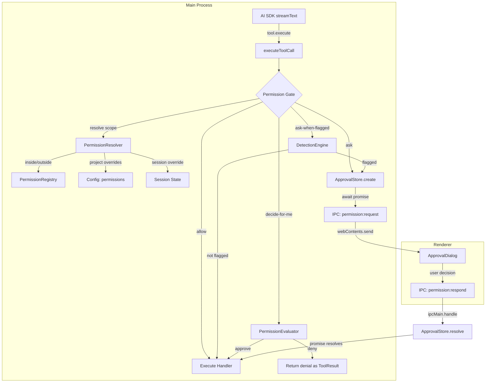

# feat: Tool Permission System

## Summary

Implement a permission middleware layer that gates every tool call before execution, with four modes (allow, ask, decide-for-me, ask-when-flagged), scope-aware path permissions for file tools, a destructive-command detection engine, a seed-tier evaluator agent, and full configuration UI (session selector + per-tool settings tab).

---

## Problem Frame

Every tool executes immediately when the LLM calls it. There is no approval gate, no destructive-command analysis, and no path containment beyond an ad-hoc check in `apply_patch`. The user has no mechanism to review, approve, or deny individual tool calls. (see origin: `docs/brainstorms/2026-07-22-tool-permission-system-requirements.md`)

---

## Requirements

**Permission model**

- R1. Every tool carries a permission mode: `allow`, `ask`, `decide-for-me`, `ask-when-flagged`.
- R2. Tools carry defaults by risk class: read-only → `allow`; mutation, execution, delegation, network, MCP → `ask`.
- R3. Each tool's permission is independently configurable, including MCP tools.

**Permission hierarchy**

- R4. Effective permission resolves: tool default → project config → session selector. Highest tier wins.
- R5. Project-level overrides live in a `permissions` section of `.orchid.json`.
- R6. Session selector sets a single mode for all tools in the current session.

**Risk-class floor**

- R7. In `decide-for-me`, tools resolving to `allow` execute without seed agent evaluation.
- R8. Session selector `ask` gates all tools regardless of risk class.
- R9. In `ask-when-flagged`, tools resolving to `allow` skip detection.

**Scope-aware path permissions**

- R10. File tools resolve paths against the working directory. The applicable permission is selected from the tool's `inside` or `outside` slot based on containment.
- R11. The `outside` slot defaults to `ask` for all file tools. No mode bypasses the scope check itself.
- R12. Inside defaults: read tools → `allow`, write tools → `ask`.
- R13. Shell commands are not path-contained. Gated solely by the permission system.

**Approval interaction**

- R14. Approval dialog shows tool name, full arguments, three actions: Approve, Deny, Deny with reason.
- R15. No argument editing before approval.
- R16. Denial returned to agent as tool result.
- R17. No approval memory in v1.

**Decide-for-me mode**

- R18. Gated calls sent to the `permission-evaluator` internal agent (seed tier).
- R19. Context packet: tool name, risk class, args, working directory, triggering message, last N tool calls.
- R20. N configurable via `permission_history_size` (default 10, range 0–50).
- R21. Evaluator returns approve/deny with optional reason. Denial feeds back as tool result.

**Ask-when-flagged mode**

- R22. Detection engine analyzes gated calls before prompting. Flagged → prompt; unflagged → execute.
- R23. Safe patterns checked first (allow), then destructive patterns (flag). No match = allow.
- R24. MCP tools always flagged. Unknown = dangerous.
- R25. File tools: inside uses inside permission; outside uses outside permission.
- R26. Detection engine structured as pack registry (filesystem + git core packs).

**Session selector**

- R27. Compact footer button (shield icon + mode label + chevron), popover with four modes + reset.
- R28. Leftmost in footer-end group, before ReasoningSelector.
- R29. Not disabled during streaming. Changes apply to the next tool call.
- R30. Shows inheritance state (session override vs inherited).

**Subagent behavior**

- R31. Subagent tool calls go through the same permission gate. Session selector applies uniformly.

**Configuration UI**

- R32. New "Permissions" tab in ConfigView (9th tab).
- R33. Tools grouped by risk class. Each tool shows inside/outside mode selectors for file tools, single selector for non-file tools.
- R34. MCP tools grouped under server name in a dedicated section.
- R35. Respects ScopeToggle (Global / Project).

---

## Key Technical Decisions

- **Gate in `executeToolCall` (tool-dispatch.ts):** Single choke-point for all tools (built-in, MCP, skill). The AI SDK's `execute` Promise doesn't resolve until permission is granted — the streamText loop pauses naturally. No XState state changes needed. (see origin: Resolved Q1)

- **Approval IPC follows QuestionStore pattern:** Promise-based main→renderer→main bridge. Main emits `permission:request`, renderer shows dialog, renderer invokes `permission:respond`, promise resolves. Identical architecture to `ask_question`. (see origin: Resolved Q1)

- **Scope-aware permissions replace hard boundary:** File tools have `inside`/`outside` permission slots instead of a hard path block. The scope check determines which slot applies; the permission system handles the rest. Eliminates the need for `allowed_write_paths` config. (see origin: Resolved Q1, path containment discussion)

- **Permission metadata as parallel registry, not ToolDefinition field:** A `PermissionRegistry` maps tool names to risk class + default inside/outside modes. Keeps `ToolDefinition` unchanged (it's shared with MCP tool construction). The registry is populated at tool registration time from a static mapping. (see origin: Resolved Q1)

- **Detection engine as standalone module with pack registry:** `DetectionEngine` class with `registerPack()`. Each pack has safe + destructive pattern arrays. Evaluation: safe-first, destructive-second, no-match = allow. Extensible without restructuring. (see origin: Resolved Q2)

- **Permission-evaluator as internal AGENT.md agent:** Defined at `electron/src/main/agents/defaults/permission-evaluator/AGENT.md` with `type: internal`, `tier: seed`. Invoked via a lightweight inline `streamChat` call (not full subagent spawn) to minimize latency. (see origin: Resolved Q5)

- **Session selector not disabled during streaming:** Permission mode is a safety control. Changes take effect on the next `executeToolCall` invocation. The selector reads/writes session state, not stream state. (see origin: Resolved Q4)

---

## High-Level Technical Design

---

## Implementation Units

### U1. Permission types and risk-class registry

- **Goal:** Define the permission type system and a static registry mapping every tool to its risk class and default permission slots.
- **Requirements:** R1, R2, R10, R11, R12
- **Dependencies:** None
- **Files:**
  - `electron/src/main/permissions/types.ts` (create)
  - `electron/src/main/permissions/registry.ts` (create)
  - `electron/src/main/permissions/index.ts` (create)
  - `electron/tests/permissions/registry.test.ts` (create)
- **Approach:**
  - `PermissionMode` union: `'allow' | 'ask' | 'decide-for-me' | 'ask-when-flagged'`
  - `RiskClass` union: `'read' | 'mutation' | 'execution' | 'delegation' | 'network' | 'mcp'`
  - `ToolPermission` type: `{ inside: PermissionMode; outside: PermissionMode }` for file tools; `{ mode: PermissionMode }` for non-file tools
  - `PermissionRegistry` class: static mapping populated from a declarative table of all 32 built-in tools + dynamic MCP entries (all MCP → `{ mode: 'ask' }`)
  - File tools identified by a `FILE_TOOLS` set: `read`, `write`, `edit`, `apply_patch`, `glob`, `read_directory`, `get_file_skeleton`, `get_function`, `find_symbol_references`
  - Read file tools: inside `allow`, outside `ask`. Write file tools: inside `ask`, outside `ask`
- **Patterns to follow:** `ToolRegistry` class pattern in `electron/src/main/tools/registry.ts`
- **Test scenarios:**
  - Every built-in tool has a registry entry
  - Risk class defaults match R2
  - File tools have inside/outside slots; non-file tools have single mode
  - MCP tool names (`mcp::*`) resolve to `ask`
  - Unknown tool names fall back to `ask`
- **Verification:** Registry covers all 32 built-in tools. Type exports compile cleanly.

### U2. Config schema extension

- **Goal:** Add permission configuration fields to the config schema with project-level override support.
- **Requirements:** R5, R20
- **Dependencies:** U1
- **Files:**
  - `electron/src/main/config/schema.ts` (modify)
  - `electron/src/shared/types/ipc-boundary.ts` (modify)
  - `electron/tests/config/schema.test.ts` (modify or create)
- **Approach:**
  - Add `permissions` field: `Record<string, PermissionMode | { inside: PermissionMode; outside: PermissionMode }>` — keyed by tool name, default `{}`
  - Add `permission_history_size`: `z.number().int().min(0).max(50).default(10)`
  - Both fields participate in `deepPartial()` for project config overrides
  - Update the `Config` interface in `ipc-boundary.ts` to match
- **Patterns to follow:** Existing `tier_models` record pattern for the permissions record; `rag` nested object for structure reference
- **Test scenarios:**
  - Default config has empty permissions and history size 10
  - Partial parse accepts `{ permissions: { write: "allow" } }`
  - Partial parse accepts `{ permissions: { read: { inside: "allow", outside: "decide-for-me" } } }`
  - Invalid permission mode rejected
  - History size clamped to 0–50
- **Verification:** `parsePartial` accepts valid permission overrides. Existing config tests still pass.

### U3. Permission resolution engine

- **Goal:** Core logic that resolves the effective permission for a tool call given the full hierarchy and path scope.
- **Requirements:** R4, R6, R7, R8, R9, R10, R11, R25
- **Dependencies:** U1, U2
- **Files:**
  - `electron/src/main/permissions/resolver.ts` (create)
  - `electron/tests/permissions/resolver.test.ts` (create)
- **Approach:**
  - `resolvePermission(toolName, args, cwd, sessionOverride, projectConfig)` → `{ mode: PermissionMode; scope: 'inside' | 'outside' | null }`
  - Resolution order: tool default (from registry) → project config override → session selector override
  - For file tools: extract path from args, resolve against cwd, determine inside/outside, select the applicable slot before applying hierarchy
  - Risk-class floor: if resolved mode is `decide-for-me` or `ask-when-flagged` and the tool's base default (after tool default + project config, before session) is `allow`, return `allow`
  - Session selector `ask` overrides everything (R8)
  - Path extraction: each file tool has known arg shapes (`file_path`, `directory_path`, `path`, `pattern` for glob). A `extractPaths(toolName, args)` helper returns all path arguments for scope checking
- **Patterns to follow:** Pure function, no side effects. Similar to `getTierModelSelection` in config/loader.ts for resolution simplicity
- **Test scenarios:**
  - Tool default applies when no overrides exist
  - Project config overrides tool default
  - Session selector overrides project config
  - Session `ask` gates read-only tools (R8)
  - File tool inside project uses inside slot
  - File tool outside project uses outside slot
  - Relative paths resolved against cwd correctly
  - `..` traversal detected as outside
  - Risk-class floor: read tool in decide-for-me → allow
  - Risk-class floor: write tool in decide-for-me → decide-for-me (passes floor)
  - Glob pattern paths: directory_path checked for scope
- **Verification:** All resolution paths covered by unit tests. No I/O in the resolver.

### U4. Approval IPC bridge

- **Goal:** Promise-based main→renderer→main round-trip for user approval decisions.
- **Requirements:** R14, R15, R16, R17
- **Dependencies:** U1
- **Files:**
  - `electron/src/main/permissions/approval-store.ts` (create)
  - `electron/src/main/ipc/permissions.ts` (create)
  - `electron/src/preload/index.ts` (modify)
  - `electron/src/shared/types/ipc.ts` (modify)
  - `electron/tests/permissions/approval-store.test.ts` (create)
- **Approach:**
  - `ApprovalStore` class (EventEmitter + Promise bridge), modeled directly on `QuestionStore` in `electron/src/main/tools/ask-question/store.ts`
  - `create(requestId, sessionId, toolName, args, riskClass, scope)` → `Promise<ApprovalDecision>` where `ApprovalDecision = { approved: true } | { approved: false; reason?: string }`
  - Emits `'approval-requested'` event → IPC layer sends `permission:request` to renderer via `webContents.send`
  - Renderer responds via `ipcRenderer.invoke('permission:respond', { requestId, decision })`
  - `ipcMain.handle('permission:respond')` resolves the pending promise
  - Abort support: if the agent turn is cancelled, pending approvals are rejected (abort → deny)
  - New IPC channels added to `IPC_CHANNELS` and the preload allowlists
  - Preload API: `window.orchid.permissions = { respond, onRequest, onSettled }`
- **Patterns to follow:** `QuestionStore` (`electron/src/main/tools/ask-question/store.ts`), `registerAskQuestionIPC` (`electron/src/main/ipc/ask-question.ts`), preload `askQuestion` namespace
- **Test scenarios:**
  - `create()` returns a promise that resolves on `respond()`
  - Multiple concurrent approvals tracked independently
  - Abort rejects pending promises
  - Unknown requestId returns `{ ok: false }`
  - Event emission on create and settle
- **Verification:** Store resolves/rejects correctly. IPC channels registered in preload allowlists.

### U5. Permission gate in tool dispatch

- **Goal:** Wire the resolution engine, approval store, detection engine, and evaluator into `executeToolCall` as the single permission checkpoint.
- **Requirements:** R4, R7, R8, R9, R16, R22, R31
- **Dependencies:** U3, U4, U7, U8
- **Files:**
  - `electron/src/main/llm/tool-dispatch.ts` (modify)
  - `electron/src/main/permissions/gate.ts` (create)
  - `electron/tests/permissions/gate.test.ts` (create)
- **Approach:**
  - New `permissionGate(toolName, args, cwd, sessionId, sessionOverride, projectConfig, historyBuffer)` function in `gate.ts`
  - Called inside `executeToolCall` after Zod validation (step 5) and before handler execution (step 8)
  - Gate flow: resolve permission (U3) → branch on mode:
    - `allow` → return `{ proceed: true }`
    - `ask` → call `ApprovalStore.create()`, await decision
    - `decide-for-me` → check risk-class floor, then call evaluator (U8)
    - `ask-when-flagged` → check risk-class floor, then run detection engine (U7); if flagged → approval store; else proceed
  - On denial: return a `ToolExecutionResult` with the denial message (same shape as a tool error, so the agent receives it as a tool result)
  - Session override passed via `ToolDispatchOptions` (extended with `sessionPermissionOverride` and `permissionHistory`)
  - The orchestrator's `buildToolMap` passes session state through `ToolDispatchOptions`
  - Subagent tool calls use the same gate (R31) — session override is inherited from the parent session
- **Patterns to follow:** Existing validation-then-execute structure in `executeToolCall`. The gate is a pure insertion between existing steps.
- **Test scenarios:**
  - Allow mode: handler executes, no approval requested
  - Ask mode: approval store called, approve → handler executes
  - Ask mode: deny → denial returned as tool result, handler not called
  - Ask mode: deny with reason → reason included in tool result
  - Decide-for-me + read tool: risk-class floor → executes without evaluator
  - Decide-for-me + write tool: evaluator called
  - Ask-when-flagged + safe command: executes without prompt
  - Ask-when-flagged + destructive command: approval requested
  - Ask-when-flagged + MCP tool: always flagged
  - Session override `ask`: read tool gated
  - Abort during pending approval: denial returned
- **Verification:** All four modes exercised. Denial produces valid tool result. No handler execution on denial.

### U6. Approval dialog UI

- **Goal:** Renderer component that displays pending tool call approvals and captures user decisions.
- **Requirements:** R14, R15
- **Dependencies:** U4
- **Files:**
  - `electron/src/renderer/components/ApprovalDialog.tsx` (create)
  - `electron/src/renderer/hooks/usePermissionApproval.ts` (create)
  - `electron/src/renderer/App.tsx` or layout root (modify — mount the dialog)
- **Approach:**
  - `usePermissionApproval` hook: subscribes to `window.orchid.permissions.onRequest`, manages pending approval state
  - `ApprovalDialog` component: modal overlay (similar to `AskQuestionOverlay` positioning) showing:
    - Tool name + risk class badge
    - Scope indicator (inside/outside project) for file tools
    - Full arguments in a scrollable code block
    - Three buttons: Approve (primary), Deny (secondary), Deny with reason (opens text input)
  - On decision: calls `window.orchid.permissions.respond({ requestId, decision })`
  - Multiple pending approvals: queue them, show one at a time (FIFO)
  - Dialog is non-dismissable (no outside-click close, no Escape) — user must explicitly decide
- **Patterns to follow:** `AskQuestionOverlay` (`electron/src/renderer/components/AskQuestionOverlay.tsx`) for overlay positioning and IPC subscription pattern. `ToolCallBlock` for tool name/args display styling.
- **Test scenarios:**
  - Dialog appears on approval request
  - Approve sends `{ approved: true }`
  - Deny sends `{ approved: false }`
  - Deny with reason shows text input, sends `{ approved: false, reason }`
  - Multiple requests queued, shown sequentially
  - Dialog not dismissable via Escape or outside click
- **Verification:** Dialog renders with correct tool info. Decisions reach main process via IPC.

### U7. Destructive command detection engine

- **Goal:** Pattern-based detection engine with pack registry for flagging dangerous shell commands.
- **Requirements:** R22, R23, R24, R25, R26
- **Dependencies:** U1
- **Files:**
  - `electron/src/main/permissions/detection/engine.ts` (create)
  - `electron/src/main/permissions/detection/packs/filesystem.ts` (create)
  - `electron/src/main/permissions/detection/packs/git.ts` (create)
  - `electron/src/main/permissions/detection/types.ts` (create)
  - `electron/tests/permissions/detection.test.ts` (create)
- **Approach:**
  - `DetectionPack` type: `{ name: string; safe: Pattern[]; destructive: Pattern[] }` where `Pattern = { regex: RegExp; description: string }`
  - `DetectionEngine` class: `registerPack(pack)`, `evaluate(command: string): DetectionResult` where `DetectionResult = { flagged: boolean; reason?: string; pack?: string }`
  - Evaluation: iterate packs, check safe patterns first (match → `{ flagged: false }`), then destructive (match → `{ flagged: true, reason }`). No match across all packs → `{ flagged: false }`
  - Filesystem pack safe patterns: `rm` in `/tmp`, `/var/tmp`, `node_modules/.cache`, `.next/cache`
  - Filesystem pack destructive patterns: `rm -r`/`-rf`/`--recursive` outside temp, `find -delete`/`-exec rm`, `truncate`, `shred`, `unlink` non-temp, `mkfs`, `dd of=/dev/`
  - Git pack safe patterns: `checkout -b`, `restore --staged`, `clean -n`/`--dry-run`, `push --force-with-lease`
  - Git pack destructive patterns: `reset --hard`, `checkout -- <path>`, `restore <path>` (no `--staged`), `clean -f`, `push --force`/`-f`, `branch -D`, `stash drop`, `stash clear`
  - Non-shell tools: MCP → always flagged (R24). File tools → scope determines (R25). Other non-shell tools → not flagged.
- **Patterns to follow:** Standalone module, no dependencies on Electron or IPC. Pure regex evaluation.
- **Test scenarios:**
  - `rm -rf /` flagged (filesystem pack)
  - `rm -rf /tmp/build` not flagged (safe pattern)
  - `rm -rf node_modules/.cache/webpack` not flagged (safe pattern)
  - `find . -name "*.log" -delete` flagged
  - `git reset --hard HEAD~3` flagged
  - `git checkout -b feature` not flagged (safe)
  - `git push --force-with-lease` not flagged (safe)
  - `git push --force origin main` flagged
  - `git stash clear` flagged
  - `npm test` not flagged (no match)
  - `git clean -n` not flagged (safe)
  - `git clean -fd` flagged
  - MCP tool always flagged regardless of arguments
- **Verification:** All core patterns from both packs tested. Safe-first ordering verified.

### U8. Permission-evaluator agent

- **Goal:** Define the internal seed-tier agent for decide-for-me evaluation and wire it into the permission gate.
- **Requirements:** R18, R19, R20, R21
- **Dependencies:** U1
- **Files:**
  - `electron/src/main/agents/defaults/permission-evaluator/AGENT.md` (create)
  - `electron/src/main/permissions/evaluator.ts` (create)
  - `electron/tests/permissions/evaluator.test.ts` (create)
- **Approach:**
  - AGENT.md: `type: internal`, `tier: seed`, `allowed_tools: []`, `allowed_skills: []`. System prompt instructs approve/deny with JSON output format.
  - `evaluator.ts`: `evaluateToolCall(context: EvaluationContext, config: Config): Promise<EvaluationResult>`
  - `EvaluationContext`: `{ toolName, riskClass, args, cwd, triggeringMessage, recentToolCalls }`
  - Builds a user message with the context packet, calls `streamChat` with the seed model selection (via `getTierModelSelection(config, 'seed')`), parses JSON response
  - `recentToolCalls` sourced from a ring buffer (size = `permission_history_size`) maintained per-session in the orchestrator
  - Args truncated to ~200 chars each in the context packet
  - Timeout: if evaluator doesn't respond within 10s, default to `ask` (prompt the user)
  - Not a full subagent spawn — inline `streamChat` call for minimal latency
- **Patterns to follow:** `session-namer` AGENT.md format (internal, seed, no tools). `subagent-runner.ts` for model selection resolution.
- **Test scenarios:**
  - Evaluator returns `{ decision: 'approve' }` → gate proceeds
  - Evaluator returns `{ decision: 'deny', reason }` → denial with reason
  - Malformed response → fallback to `ask` (prompt user)
  - Timeout → fallback to `ask`
  - History size 0 → no recent calls in context
  - History size 10 → last 10 calls included
  - Args truncated at 200 chars
- **Verification:** Agent loads from registry. Evaluator produces valid decisions. Fallback paths work.

### U9. Session selector UI

- **Goal:** Footer permission selector following the ReasoningSelector interaction pattern.
- **Requirements:** R27, R28, R29, R30
- **Dependencies:** U1
- **Files:**
  - `electron/src/renderer/components/PermissionSelector.tsx` (create)
  - `electron/src/renderer/components/Footer.tsx` (modify)
  - `electron/src/renderer/hooks/usePermissionMode.ts` (create)
- **Approach:**
  - `PermissionSelector` component: ghost button `size="xs"` with shield icon + mode label + chevron-down
  - Popover: four mode options (allow / ask / decide-for-me / ask-when-flagged) with descriptions + "Reset to default" button
  - Controlled/uncontrolled open state, outside-click + Escape close (same as ReasoningSelector)
  - `usePermissionMode` hook: manages session-level override state, communicates to main via IPC (`permission:set-session-mode`)
  - Inheritance display: if override active, show dot indicator; label shows effective mode
  - Placement in Footer: leftmost in `orchid-chat-footer-end`, before ReasoningSelector
  - NOT disabled during streaming (R29)
  - Mode change IPC: `ipcMain.handle('permission:set-session-mode')` stores override in session state, accessible to the permission gate on next tool call
- **Patterns to follow:** `ReasoningSelector` (`electron/src/renderer/components/ReasoningSelector.tsx`) — identical popover mechanics, button styling, controlled/uncontrolled pattern
- **Test scenarios:**
  - Renders with default mode label
  - Popover opens on click, closes on outside click and Escape
  - Selecting a mode updates the label and sends IPC
  - Reset to default clears session override
  - Inheritance indicator shows when override active
  - Remains interactive during streaming
  - Positioned before ReasoningSelector in footer
- **Verification:** Selector renders in footer. Mode changes propagate to main process.

### U10. Permissions configuration tab

- **Goal:** New "Permissions" tab in ConfigView for per-tool permission configuration.
- **Requirements:** R3, R32, R33, R34, R35
- **Dependencies:** U1, U2
- **Files:**
  - `electron/src/renderer/components/Preferences/PermissionsTab.tsx` (create)
  - `electron/src/renderer/components/ConfigView.tsx` (modify — add tab)
- **Approach:**
  - Add `{ id: 'permissions', label: 'Permissions' }` to `TABS` array in ConfigView
  - Add `renderTab` case for permissions
  - `PermissionsTab` component:
    - Sections by risk class: Read-only, Mutation, Execution, Delegation, Network, MCP
    - Each tool row: name + risk badge + mode selector
    - File tools: two selectors (inside / outside)
    - Non-file tools: single selector
    - MCP section: tools grouped under collapsible server name headers
    - Mode selector: 4-option dropdown or segmented control
    - "Reset all to defaults" button in section header
  - Reads/writes `permissions` field in config draft via `updateDraft`
  - ScopeToggle: Global (home config) / Project (`.orchid.json`)
  - Data loading: `config:get` returns current permissions; tool list from a new IPC or derived from the permission registry
- **Patterns to follow:** `TierModelsTab.tsx` for record-based config editing. `AgentsTab.tsx` for ScopeToggle usage. `MCPServersTab.tsx` for server-grouped layout.
- **Test scenarios:**
  - Tab appears in ConfigView navigation
  - Tools grouped correctly by risk class
  - File tools show inside/outside selectors
  - Changing a selector updates the draft
  - Save persists to config
  - Reset all clears overrides
  - MCP tools listed under server names
  - ScopeToggle switches between global/project
- **Verification:** Tab renders with all tools. Config save/load round-trips correctly.

---

## Scope Boundaries

**In scope:** Permission middleware, four modes, scope-aware path permissions, approval UX, detection engine (filesystem + git packs), evaluator agent, session selector, permissions tab, project config support.

**Out of scope:** Approval memory, per-pattern session memory, tool call editing, network containment, shell sandboxing, audit logging, per-directory rules, graduated response/confidence scoring, extended detection packs (docker, k8s, cloud CLIs, databases).

---

## Risks and Dependencies

- **AI SDK pause behavior:** The gate relies on `tool.execute()` awaiting indefinitely. If AI SDK has internal timeouts on tool execution, long approval waits could trigger errors. Mitigation: verify AI SDK timeout behavior; the existing `ask_question` tool already awaits user input indefinitely, proving this works.
- **MCP tool path extraction:** MCP tools have arbitrary arg schemas. Path scope checking only applies to built-in file tools. MCP tools skip scope analysis and use their single `mode` slot.
- **Evaluator latency:** Seed agent call adds latency to every gated tool call in decide-for-me mode. Mitigation: 10s timeout with fallback to `ask`. Seed tier is the fastest model.
- **Config schema strictness:** Schema is `.strict()`. Adding fields requires updating both the zod schema and the `Config` interface in `ipc-boundary.ts`.

---

## Sources and Research

- Origin: `docs/brainstorms/2026-07-22-tool-permission-system-requirements.md`
- `QuestionStore` pattern: `electron/src/main/tools/ask-question/store.ts` — promise-based main→renderer→main bridge
- `ReasoningSelector`: `electron/src/renderer/components/ReasoningSelector.tsx` — footer popover interaction pattern
- `executeToolCall`: `electron/src/main/llm/tool-dispatch.ts` — single tool dispatch choke-point
- `ToolRegistry`: `electron/src/main/tools/registry.ts` — tool registration and filtering
- Config schema: `electron/src/main/config/schema.ts` — zod schema with `.strict()` and `deepPartial()`
- Agent definitions: `electron/src/main/agents/defaults/` — AGENT.md format with frontmatter
- `destructive_command_guard`: https://github.com/Dicklesworthstone/destructive_command_guard — pack-based pattern system reference
