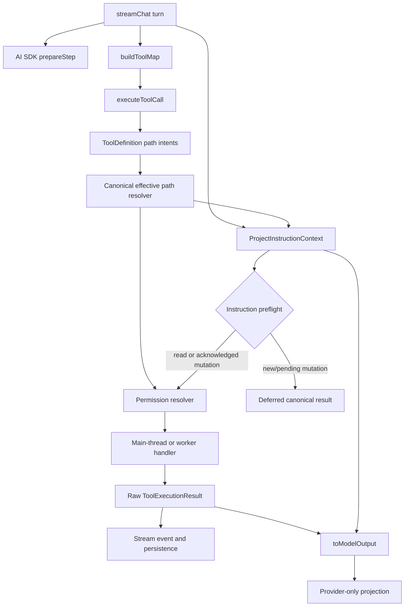
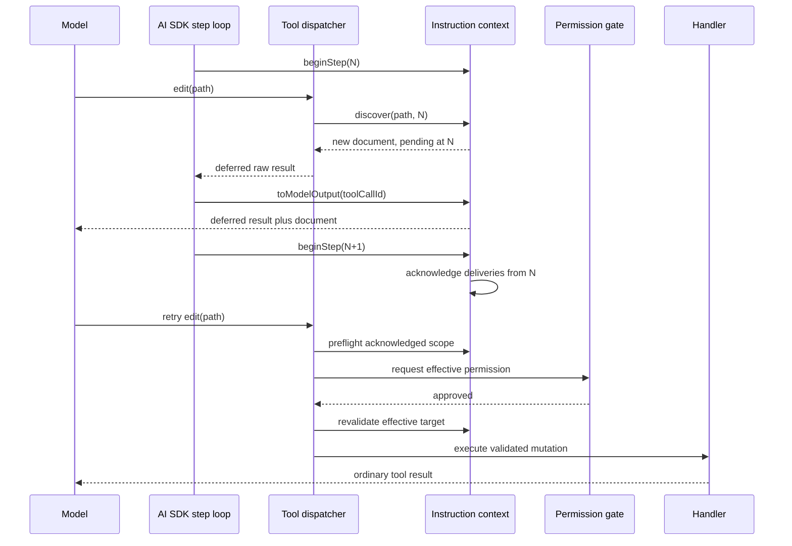
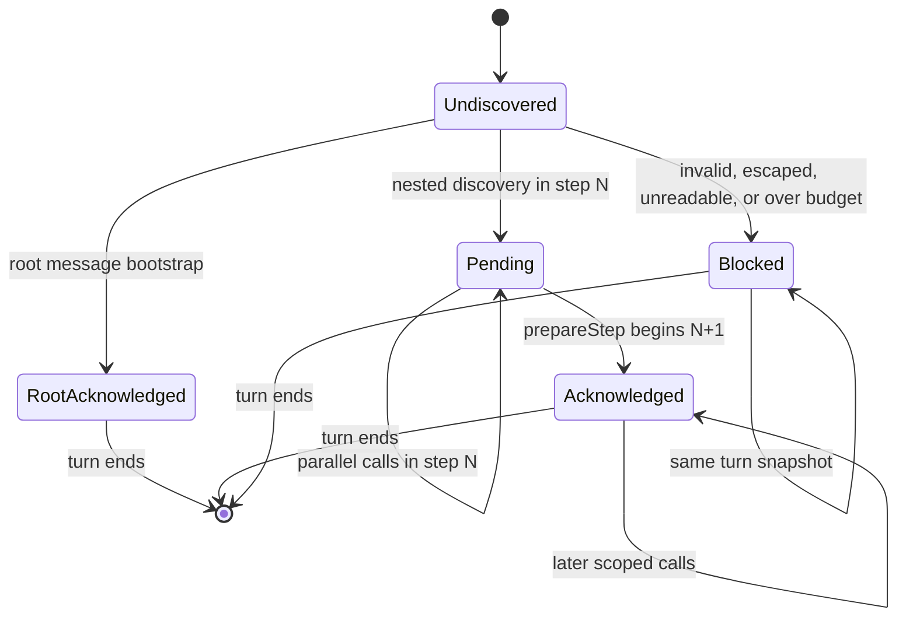
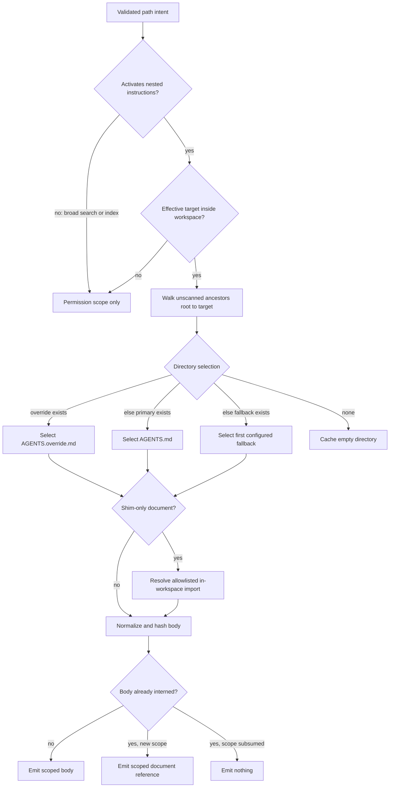

# Hierarchical Agent Instruction Loading - Plan

## Goal Capsule

- **Objective:** Make Orchid honor workspace-scoped `AGENTS.md`, override files, and configured compatibility aliases before agents read or mutate files in each directory scope.
- **Authority:** Orchid application instructions and the active user request remain above project instructions; broader project instructions apply before more-specific directory instructions.
- **Execution profile:** Add a turn-scoped instruction resolver, declarative tool path intents, step-aware mutation deferral, model-only context injection, configuration controls, and a preview/apply symbol-rename contract.
- **Stop conditions:** Do not mutate when applicable instructions are newly delivered, unreadable, outside the workspace, over budget, or based on a changed effective target.
- **Tail ownership:** Implementation must finish the complete verification contract, update the documented configuration/tool architecture, and leave no handler-local instruction-loading path.

---

## Product Contract

### Summary

Orchid will load workspace-root instructions at turn start and nested instructions just in time for path-aware tools. Deterministic filename precedence, canonical directory scope, scope-preserving deduplication, step-boundary acknowledgement, and transient model delivery prevent both missed rules and repeated context.

### Problem Frame

Orchid currently gives agents a frozen workspace, project runtime, tool registry, and permission policy, but it never loads repository agent instructions automatically. An agent can therefore read or change a file without seeing `AGENTS.md`, `CLAUDE.md`, `GEMINI.md`, or a more-specific directory rule that governs the target.

Loading instructions inside individual handlers would not solve the problem consistently because several file tools run in workers with a reduced context. Loading every possible instruction file at turn start would add unbounded filesystem and token cost, while adding instructions after a mutation would be too late to affect the model's decision.

The feature needs one lifecycle shared by main agents and subagents: root context before the first model step, nested discovery before path-aware tool execution, and deferral before the first mutation in a newly discovered scope.

### Actors

- A1. The user configures instruction aliases and asks Orchid to work in a selected workspace.
- A2. The main agent reads and mutates files through Orchid's built-in tools.
- A3. A subagent performs the same actions in an isolated model context over the same workspace.

### Key Decisions

- **Alias and shim scope:** Support primary/override files, configured filename aliases, and single-directive shim imports in this release. `(session-settled: user-approved — chosen over path-glob rule systems: alias compatibility solves the requested duplication problem without importing Claude or Copilot rule-engine semantics.)` Governs R3-R5.
- **Guarantee boundary:** Guarantee preflight behavior for path-aware built-in tools only. `(session-settled: user-approved — chosen over shell-command parsing and opaque MCP inference: those surfaces cannot declare affected paths reliably today.)` Governs R9, R15.
- **Symbol rename correctness:** Include a preview/apply refactor for cross-file renames. `(session-settled: user-approved — chosen over retaining one opaque mutation call: the dispatcher must know every affected file before permission and mutation.)` Retain a required definition-file anchor. `(session-settled: user-approved — chosen over unanchored workspace-wide matching: identical symbol names can represent unrelated definitions.)` Governs R14.
- **Resource-limit precedence:** Make the instruction payload budget and shim-import depth configurable in both home and project configuration. `(session-settled: user-directed — project values may raise or lower home values under Orchid's normal merge precedence; absolute schema bounds, rather than a user-level ceiling, preserve bounded execution.)` Governs R16.

### Requirements

#### Turn and hierarchy lifecycle

- R1. Before its first model step, every model stream for a bound workspace either receives the selected workspace-root instruction document or a typed diagnostic that blocks mutations governed by an unreadable, invalid, escaped, or over-budget root scope.
- R2. Main agents and subagents receive independent turn-scoped instruction state even when they share a workspace and project runtime.
- R3. A directory selects at most one instruction-family document in this order: `AGENTS.override.md`, `AGENTS.md`, then the first configured fallback filename that exists.
- R4. Fallback filenames default to `CLAUDE.md` and `GEMINI.md`, remain user/project configurable, and reject paths, reserved primary names, and duplicates.
- R5. A selected document whose only semantic content is one `@relative-path` directive may import another allowlisted instruction document within the workspace, with cycle and depth protection; imported content keeps the selecting shim's directory scope rather than inheriting the target file's location.
- R6. Nested instructions are discovered from the canonical workspace root through the effective target directory, emitted broad-to-specific, and retain their directory scope when several targets are involved.
- R7. Instruction discovery never walks above the canonical workspace or follows an instruction/source symlink outside it.

#### Deduplication and activation

- R8. A turn deduplicates selected aliases, canonical paths, normalized content bodies, import identities, scanned directories, and per-step delivery without losing scope applicability.
- R9. `read`, `read_directory`, file-specific AST reads, `write`, `edit`, `replace_symbol`, `apply_patch`, and symbol-rename tools activate applicable nested instructions; broad `grep`, `glob`, RAG, and index operations do not.
- R10. A read may execute while attaching newly discovered valid instructions to its model-only result, and the same body is not emitted again during that agent turn.
- R11. A mutation that encounters applicable instructions not acknowledged before its model step returns a non-mutating deferred result; it may execute only from a later model step after acknowledgement.
- R12. A multi-target mutation preflights the union of every source and destination scope and defers the whole operation when any target has pending instructions.

#### Context integrity and mutation safety

- R13. Root and nested instruction payloads are escaped, explicitly delimited, lower-authority ephemeral model context: they do not alter the persisted user message, canonical tool result, user projection, or replayed session history.
- R14. Cross-file symbol rename requires a definition-file anchor, has a read-only preview that identifies every affected path, and has an apply call that validates a self-contained manifest before writing.
- R15. Orchid makes no nested-instruction guarantee for `execute_command`, background processes, or MCP tools until those surfaces declare intended filesystem paths.
- R16. Instruction loading has a user/project-configurable total rendered-payload budget, defaulting to 131,072 UTF-8 bytes per agent turn, covering document bodies, scope references, and diagnostics. Shim-import depth is independently user/project configurable and defaults to five. Project values may raise or lower home values within absolute schema bounds. Unreadable, invalid, escaped, cyclic, depth-exceeded, and over-budget sources produce explicit diagnostics, and a source that would exceed the remaining budget is rejected as a whole rather than truncated.
- R17. Configuration and instruction documents are frozen once captured or scanned for a turn; edits made by built-in tools become active on the next turn, not retroactively.
- R18. Instruction preflight occurs before permission approval and worker dispatch; a mutation revalidates its effective targets after a delayed approval and refuses stale scope decisions.
- R19. Automatic instruction discovery is an app-managed workspace-context read, exempt from per-tool read approval only for selected canonical instruction sources inside the workspace. It records source identity, selection, and diagnostic metadata without logging instruction bodies, and it never bypasses mutation approval.

### Key Flows

- F1. **Root turn bootstrap**
  - **Trigger:** The main agent or a subagent starts a model stream for a bound workspace.
  - **Actors:** A2 or A3
  - **Steps:** Select the root document; either expand, freeze, prefix, and acknowledge valid content for the first step, or prefix a typed diagnostic and mark the affected root scope blocked.
  - **Outcome:** The first model decision has valid root project context, or a typed blocked-scope diagnostic, without changing stored chat history.
  - **Covered by:** R1-R5, R13, R16-R17
- F2. **Nested read discovery**
  - **Trigger:** An agent calls a path-aware read in an unscanned directory.
  - **Actors:** A2 or A3
  - **Steps:** Resolve path intents, walk missing ancestor scopes, execute the read, and decorate only the provider-facing tool output with new documents.
  - **Outcome:** The next model step sees both the read result and applicable nested instructions.
  - **Covered by:** R6-R10, R13
- F3. **Nested mutation deferral**
  - **Trigger:** An agent calls a mutation in a scope whose instructions were not acknowledged before that model step.
  - **Actors:** A2 or A3
  - **Steps:** Discover and deliver the instructions, return a deferred result before permission or handler execution, acknowledge at the next AI SDK step boundary, then preflight and approve a retry.
  - **Outcome:** No mutation is based on unseen rules.
  - **Covered by:** R11-R13, R18
- F4. **Multi-target mutation**
  - **Trigger:** `apply_patch` touches files in multiple directory branches or moves a file.
  - **Actors:** A2 or A3
  - **Steps:** Parse the canonical patch grammar, resolve all source/destination intents, union their instruction chains, and treat discovery or failure on any branch as applying to the whole call.
  - **Outcome:** The patch either reaches permission/execution with every scope acknowledged or changes nothing.
  - **Covered by:** R6-R8, R11-R12, R18
- F5. **Cross-file symbol rename**
  - **Trigger:** An agent requests a project-wide symbol rename.
  - **Actors:** A2 or A3
  - **Steps:** Preview the AST-indexed changes, discover instructions for every reported file, return a hashed manifest, then validate all paths/content before the apply call reaches permission and writes.
  - **Outcome:** Rename permissions and instructions cover the real write set.
  - **Covered by:** R12, R14, R18

### Acceptance Examples

- AE1. Given root `AGENTS.md` and `CLAUDE.md`, when a turn starts, then only `AGENTS.md` is loaded and `CLAUDE.md` is reported as shadowed without duplicating its body.
- AE2. Given root `AGENTS.md`, `electron/CLAUDE.md`, and `electron/src/AGENTS.override.md`, when a tool targets `electron/src/main/index.ts`, then the three selected documents are delivered root-to-leaf with their distinct scopes.
- AE3. Given identical instruction content in two sibling scopes, when both scopes are accessed, then the content body is emitted once and the second scope receives a reference to the interned document.
- AE4. Given a nested instruction first discovered by `read`, when the model invokes a mutation in the following step, then the mutation may proceed through permission without a redundant deferral.
- AE5. Given a nested instruction first discovered by `edit`, when `edit` is called, then the file remains byte-identical and the model receives a `project_instructions_pending` result; a retry from the next step may mutate it.
- AE6. Given parallel reads and mutations in the same model step, when they discover the same instruction, then every applicable mutation defers until the next step regardless of callback ordering.
- AE7. Given an `apply_patch` whose source is under one nested scope and move destination is under another, when either branch has unseen instructions, then no file is created, changed, deleted, or moved.
- AE8. Given an instruction symlink or shim target that resolves outside the workspace, when a path-aware tool reaches that scope, then no outside content is loaded and a mutation cannot run.
- AE9. Given a built-in mutation creates or edits an instruction document, when later tools run in the same turn, then they retain the existing directory snapshot; a new turn observes the new content.
- AE10. Given a symbol-rename preview and a source file that changes before apply, when the manifest is applied, then the rename rejects the stale manifest and writes no affected file.
- AE11. Given `grep`, `glob`, or `rag_search` traverses nested packages, when results span many directories, then no nested instructions activate solely because of those matches.
- AE12. Given a subagent starts after the main agent already loaded root instructions, when the subagent runs, then it independently receives root instructions and does not inherit the main agent's loaded/acknowledged set.
- AE13. Given read permissions normally require approval, when a turn loads a selected in-workspace instruction source, then no tool-read approval is requested, source/diagnostic metadata is recorded without its body, and any later mutation still follows the configured approval policy.
- AE14. Given home configuration sets one payload budget and shim depth, when project configuration supplies higher or lower values within the absolute bounds, then the frozen turn uses the project values; invalid values fail configuration validation.

### Success Criteria

- Every path-aware built-in uses declarative path intent metadata rather than permission-only argument-name parsing.
- A newly scoped built-in mutation cannot reach its handler before relevant instructions have been delivered in a prior model step.
- Root and nested instruction content is absent from persisted messages and canonical tool results.
- Main-agent, subagent, worker-offloaded, multi-target patch, and cross-file rename tests prove the same hierarchy contract.

### Scope Boundaries

#### Included

- Exact instruction-family filenames, configured fallback filenames, and shim-only relative imports.
- Workspace-root startup loading and just-in-time nested discovery for path-aware built-ins.
- Configuration in home and project settings.
- Shared permission/path resolution and preview/apply symbol rename.

#### Deferred to Follow-Up Work

- `.github/copilot-instructions.md`, `NAME.instructions.md`, `.claude/rules/*.md`, and any path-glob rule engine.
- Declared filesystem intents for shell commands, background processes, and MCP tools.
- Filesystem interception or OS-level sandbox hooks that could enforce unknown third-party mutations.
- Full inline `@path` expansion inside otherwise substantive instruction documents.

#### Non-goals

- Wildcard matching such as `*AGENT*.md`.
- Semantic or fuzzy deduplication of similar prose.
- Loading instruction files above the selected Orchid workspace.
- Persisting instruction content in `ProjectRuntime` or session history.

---

## Planning Contract

### Key Technical Decisions

- KTD1. **Own instruction state in `streamChat()`.** Each call to the shared orchestrator is one main-agent or subagent model stream, so constructing the context there guarantees per-agent isolation without duplicating setup in chat and subagent entry points.
- KTD2. **Keep project instructions below application instructions.** Prefix root instructions to the current user/task model message in a structured, lower-authority block instead of concatenating repository content into Orchid's trusted system prompt.
- KTD3. **Use AI SDK `prepareStep` as the acknowledgement boundary.** Documents actually emitted through provider-facing tool outputs in step N remain pending for all parallel calls in that step and become acknowledged only when step N+1 begins. Discovery or registration alone never counts as acknowledgement.
- KTD4. **Declare input and result path intents on `ToolDefinition`.** Validated input intents drive permission scope and pre-execution discovery; optional result intents let read-only planning tools expose dynamically discovered affected paths without loading instructions inside handlers.
- KTD5. **Use root-at-start plus just-in-time nested discovery.** Scan only ancestor directories needed by actual path intents, cache each directory's selection for the turn, and avoid a recursive workspace scan.
- KTD6. **Share canonical effective paths with permissions.** Extract nearest-existing-parent and realpath containment helpers from the permission resolver so instructions and approvals classify symlinks, missing targets, and move destinations identically.
- KTD7. **Intern bodies while preserving scopes.** Canonical paths and content hashes suppress repeated bodies without assigning emission ownership during asynchronous discovery. The first successful provider projection atomically claims the full-body emission; a compact reference is allowed only after that body has been placed earlier in the same ordered provider payload or acknowledged in a prior step, so concurrent completion cannot produce a dangling reference.
- KTD8. **Recognize only shim-only imports.** A trimmed document containing one `@relative-path` directive may import another allowlisted instruction filename; all other `@` text stays ordinary content. Expansion substitutes content into the selecting document, so the shim's scope remains authoritative even when the imported file lives elsewhere.
- KTD9. **Decorate only `toModelOutput`.** Store instruction batches by tool-call ID, append them idempotently when AI SDK asks for provider output, and mark them delivered only at that boundary. Leave the raw `ToolExecutionResult` consumed by stream events and persistence unchanged.
- KTD10. **Preview symbol renames before applying them.** `(session-settled: user-approved — chosen over retaining one opaque mutation call: R14 requires the write set to be visible before instructions and permissions.)` A read-only preview requires the definition-file anchor established by the Product Contract, then returns paths, source hashes, and replacement metadata; apply recomputes and validates the manifest before per-file atomic writes.
- KTD11. **Fail closed only where mutation safety requires it.** Valid new documents cause one-step deferral; invalid or escaped instruction sources return stable diagnostics and block mutations in that scope, while read-only tools may still return their ordinary result with the diagnostic.
- KTD12. **Keep instruction content out of `ProjectRuntime`.** The frozen runtime supplies configuration, while live per-turn instruction state owns content and directory snapshots so runtime cache invalidation does not control instruction freshness.
- KTD13. **Treat instruction discovery as app-managed context loading.** Root and nested instruction reads must happen before the model can request or approve them, so they do not enter the per-tool read-permission flow. This exemption is limited to selected canonical in-workspace instruction sources, records metadata rather than bodies, and leaves every mutation approval unchanged.

### High-Level Technical Design

#### Component topology

#### Nested mutation protocol

#### Document lifecycle

#### Discovery decisions

### Sequencing

1. Establish configuration and declarative path contracts.
2. Build and test the pure instruction resolver against those contracts.
3. Integrate step-aware discovery into dispatch and provider projection.
4. Refactor symbol rename onto result/input path intents.
5. Prove cross-surface behavior and update repository documentation.

### System-Wide Impact

- **Agent context:** Main agents and subagents gain the same project-instruction visibility while retaining isolated acknowledgement state.
- **Permissions:** Path extraction and canonicalization move to a shared declarative contract; selected in-workspace instruction sources load as app-managed context without a tool-read prompt, while mutation prompts occur only after instruction deferral clears.
- **Workers:** Worker payloads stay unchanged because discovery and mutation gating complete in the main process before worker dispatch.
- **Persistence:** Canonical results and stored messages remain unchanged; only provider-facing projections carry nested instruction payloads.
- **Cancellation and retries:** Registered-but-unprojected batches remain unacknowledged after cancellation; repeated provider projection for the same tool-call ID is idempotent and cannot create a second delivery record.
- **Auditability:** Instruction loading records canonical source identity, selection/shadowing, and diagnostics through existing logging seams, but excludes instruction bodies and provider-only envelopes.
- **Configuration/UI:** Home and project settings gain fallback-filename, payload-budget, and shim-import-depth controls; project values may raise or lower home values within schema bounds.
- **Tool API:** Symbol rename becomes a preview/apply workflow and default agent allowlists gain the preview tool.
- **Performance:** Directory scans are demand-driven and memoized per turn; instruction content is bounded independently of ordinary tool-output offloading.

### Agent-Native Scope

- **Now:** Main agents and subagents have action and context parity for every path-aware built-in read/edit/mutation tool.
- **Later:** Shell, background, and MCP tools gain parity only after they expose explicit filesystem intents.
- **Human-only:** Permission approval remains a user control; project instructions must not bypass or answer approval prompts.

### Risks and Dependencies

- **AI SDK lifecycle coupling:** The design depends on AI SDK 7's `prepareStep` and `toModelOutput({ toolCallId })` contracts. Orchestrator tests must pin both behaviors so an SDK upgrade cannot silently collapse the acknowledgement boundary.
- **Prompt compatibility:** Prefixing ephemeral instructions to the latest user/task content must preserve tool-call pairing and provider message constraints across all configured providers.
- **Concurrent discovery:** Parallel tool callbacks can race on the same directory or body. Promise memoization and step-stamped delivery must make selection and emission deterministic.
- **Context pressure:** Orchid's current root `AGENTS.md` is larger than 32 KiB. The 128 KiB default accommodates it plus nested rules, while accounting for the complete rendered instruction envelope prevents body deduplication from being defeated by unbounded scope references or diagnostics. Projects may intentionally raise the merged limit up to the absolute 1 MiB schema ceiling, increasing provider context usage for that workspace.
- **Scope-preserving deduplication:** Global content-hash suppression without scope references would incorrectly drop identical rules in sibling directories.
- **Filesystem races:** Revalidation after approval closes the long approval-window race, but a residual OS-level symlink race remains without descriptor-based filesystem operations.
- **Rename drift:** Preview manifests can become stale between steps. Apply must verify hashes and the recomputed affected-path set before any write.
- **Configuration breadth:** Adding fields requires synchronized schema, IPC patch, home/project editor, parity, and draft-merge coverage.

### Sources and Research

- The architecture analysis in `docs/hierarchical-agent-instruction-loading-analysis.md`.
- Dispatcher and provider projection patterns in `electron/src/main/llm/tool-dispatch.ts` and `electron/src/main/llm/orchestrator.ts`.
- Frozen tool/runtime context in `electron/src/main/tools/types.ts` and `electron/src/main/project/runtime.ts`.
- Canonical path containment in `electron/src/main/permissions/resolver.ts`.
- Persistence boundaries in `electron/src/main/llm/message-factories.ts` and `electron/src/main/llm/history.ts`.
- AI SDK 7 local type contracts in `electron/node_modules/ai/src/generate-text/prepare-step.ts` and `electron/node_modules/@ai-sdk/provider-utils/src/types/tool.ts`.
- [OpenAI Codex agent-loop description](https://openai.com/index/unrolling-the-codex-agent-loop/) for broad-to-specific `AGENTS.override.md`/`AGENTS.md` conventions.
- [Claude Code memory documentation](https://code.claude.com/docs/en/memory) for parent-at-start, nested-on-demand, and compatibility shim conventions.
- [Gemini CLI context documentation](https://github.com/google-gemini/gemini-cli/blob/main/docs/cli/gemini-md.md) for configurable filenames and just-in-time discovery.
- [GitHub custom-instruction documentation](https://docs.github.com/en/copilot/how-tos/copilot-on-github/customize-copilot/add-custom-instructions/add-repository-instructions) for hierarchical agent-file compatibility and the separate path-scoped rule formats deferred here.

---

## Implementation Units

### U1. Instruction configuration and settings

- **Goal:** Add validated fallback-filename, payload-budget, and shim-import-depth configuration to home and project settings.
- **Requirements:** R3-R5, R16-R17
- **Dependencies:** None
- **Files:**
  - `electron/src/main/config/schema.ts`
  - `electron/src/main/ipc/config.ts`
  - `electron/src/shared/types/ipc-boundary.ts`
  - `electron/src/shared/types/ipc.ts`
  - `electron/src/renderer/components/Preferences/GeneralTab.tsx`
  - `electron/src/renderer/components/ConfigView.tsx`
  - `electron/src/renderer/components/ProjectConfigView.tsx`
  - `electron/src/renderer/utils/config-draft.ts`
  - `electron/tests/unit/config.test.ts`
  - `electron/tests/parity/config.test.ts`
  - `electron/tests/unit/config-form-contracts.test.ts`
  - `electron/tests/unit/config-ipc.test.ts`
  - `electron/tests/unit/project-config-view.test.tsx`
- **Approach:**
  1. Add `project_instruction_fallback_filenames` with default `["CLAUDE.md", "GEMINI.md"]`, `project_instruction_max_bytes` with default `131072` and bounds `4096..1048576`, and `project_instruction_max_import_depth` with default `5` and bounds `1..32`.
  2. Validate fallback entries as simple filenames: non-empty basename only, bounded list/length, case-insensitive uniqueness, and no `AGENTS.md` or `AGENTS.override.md`.
  3. Carry all three keys through `Config`, `ConfigPatch`, home save, project allowlisting, draft application, and immutable runtime snapshots. Preserve normal merge precedence so a valid project budget or depth replaces the home value whether it is higher or lower.
  4. Add a comma-separated filename editor plus numeric payload-budget and shim-depth fields to global and project General settings without introducing new component-root classes.
- **Patterns to follow:** Existing `ignored_dirs` string-list handling, numeric config helpers in `electron/src/renderer/utils/config-draft.ts`, and project-key allowlisting in `electron/src/main/ipc/config.ts`.
- **Test scenarios:**
  1. Parsing an empty config returns all three defaults.
  2. Valid custom aliases preserve order because the first existing fallback wins.
  3. Entries containing `/`, `\`, `.`/`..`, reserved names, empty strings, or case-insensitive duplicates are rejected.
  4. The byte budget rejects values below 4 KiB, non-integers, and values above 1 MiB while accepting the 128 KiB default.
  5. Shim depth rejects zero, negative, non-integer, and values above 32 while accepting the default depth of five.
  6. Project configuration can raise or lower both home resource values, and the resulting merged values are frozen for the turn.
  7. Home and project saves retain all three fields and invalidate future runtime snapshots without changing an active turn.
  8. Global and project editors render, edit, clear, and persist the fields through typed `ConfigPatch` handling.
- **Verification:** The configuration parity inventory, form key-alignment assertion, project allowlist, and renderer tests all recognize the new fields.

### U2. Declarative tool path-intent contract

- **Goal:** Replace name-based argument parsing with per-tool path metadata shared by permission scope and instruction discovery.
- **Requirements:** R6-R9, R12, R18
- **Dependencies:** None
- **Files:**
  - `electron/src/main/tools/types.ts`
  - `electron/src/main/tools/filesystem/read.ts`
  - `electron/src/main/tools/filesystem/read-directory.ts`
  - `electron/src/main/tools/filesystem/write.ts`
  - `electron/src/main/tools/filesystem/edit.ts`
  - `electron/src/main/tools/filesystem/apply-patch.ts`
  - `electron/src/main/tools/filesystem/apply-patch-parser.ts`
  - `electron/src/main/tools/filesystem/glob.ts`
  - `electron/src/main/tools/search/grep.ts`
  - `electron/src/main/tools/ast/get-file-skeleton.ts`
  - `electron/src/main/tools/ast/get-function.ts`
  - `electron/src/main/tools/ast/find-symbol-references.ts`
  - `electron/src/main/tools/ast/replace-symbol.ts`
  - `electron/src/main/permissions/resolver.ts`
  - `electron/src/main/permissions/gate.ts`
  - `electron/src/main/project/path.ts`
  - `electron/src/shared/types/permission.ts`
  - `electron/tests/unit/tool-registry.test.ts`
  - `electron/tests/parity/tools.test.ts`
  - `electron/tests/unit/permission-resolver.test.ts`
- **Approach:**
  1. Add typed input path intents and optional canonical-result path intents to `ToolDefinition`; each intent identifies its path, file/directory target, access posture, and whether it activates nested instructions.
  2. Populate intents from Zod-validated inputs. File reads/mutations activate, `read_directory` activates through the requested directory, and `grep`/`glob` participate in scope permission without nested activation.
  3. Reuse `parsePatch()` to derive every add, update, delete, source, and move-destination intent instead of maintaining a second regex grammar in permissions.
  4. Extract canonical workspace/effective-target helpers from the permission resolver into the project path module, including nearest-existing-parent handling for new paths.
  5. Resolve intents once in dispatch and pass the resulting scope to permission policy, preserving the shared `FILE_TOOLS` inventory only as the renderer/config catalogue.
- **Patterns to follow:** `ToolDefinition` metadata and Zod validation in `electron/src/main/tools/types.ts`, the existing apply-patch parser, and fail-closed realpath handling in `electron/src/main/permissions/resolver.ts`.
- **Test scenarios:**
  1. Every entry in `FILE_TOOLS` has input path-intent metadata or a documented result-intent planning phase.
  2. Relative, absolute, missing, symlinked-inside, symlinked-outside, dangling, and workspace-symlink targets produce the same scope as the current permission contract.
  3. `apply_patch` returns intents for all operation types and both sides of a move; malformed patches fail before permission.
  4. `find_symbol_references` activates only when `file_path` is present.
  5. `grep` and `glob` still classify inside/outside permission scope but explicitly decline nested instruction activation.
  6. Passing pre-resolved scope through every permission mode preserves allow/ask/evaluator/ask-when-flagged behavior.
- **Verification:** Permission tests no longer depend on private tool-name argument extraction, and the tool registry contract fails if a future path-aware tool omits intent metadata.

### U3. Turn-scoped hierarchical instruction resolver

- **Goal:** Implement deterministic selection, hierarchy, shim expansion, scope-preserving deduplication, and diagnostics as a pure turn-scoped service.
- **Requirements:** R1-R8, R10, R12, R16-R17
- **Dependencies:** U1, U2
- **Files:**
  - `electron/src/main/project/instructions.ts` (create)
  - `electron/src/main/project/path.ts`
  - `electron/tests/unit/project-instructions.test.ts` (create)
- **Approach:**
  1. Create a `ProjectInstructionContext` from canonical workspace, frozen config, and one agent stream; do not attach it to `ProjectRuntime`.
  2. Select one alias-family file per directory in override/primary/configured-fallback order and record shadowed candidates as compact diagnostics.
  3. Discover only unscanned ancestors between workspace root and each effective target directory; memoize in-flight directory scans so parallel calls share one result.
  4. Treat a single trimmed `@relative-path` line as a shim only when the target basename is allowlisted, the real path remains inside the workspace, depth does not exceed the frozen merged configuration value, and the canonical import graph is acyclic; substitute the imported body under the selecting shim's scope.
  5. Normalize BOM and line endings for hashing while preserving substantive text; intern bodies by cryptographic hash and record non-subsumed duplicate scopes without choosing which asynchronous discovery owns the full-body emission.
  6. Track root-acknowledged, step-pending, acknowledged, blocked, scanned-directory, body-emission, and tool-call delivery state with deterministic depth/path ordering.
  7. Enforce the total rendered UTF-8 byte budget across bodies, scope references, shadow notices, and diagnostics without partial truncation; return typed diagnostics that distinguish a one-step deferral from a persistent blocked scope.
- **Patterns to follow:** Frozen turn ownership in `electron/src/main/tools/types.ts`, bounded caches in `electron/src/main/permissions/resolver.ts`, and XML escaping helpers in `electron/src/main/llm/system-prompt.ts`.
- **Test scenarios:**
  1. Root-only, nested-only, and three-level mixed-alias chains select broad-to-specific documents.
  2. Override shadows primary; primary shadows every fallback; configured fallback order is stable.
  3. A shim imports an internal allowlisted document once under the shim directory's scope, while outside imports, non-allowlisted basenames, missing targets, cycles, and configured-depth overflow return diagnostics.
  4. Canonical aliases deduplicate symlinked paths without loading outside content.
  5. Identical parent/child content emits no redundant narrower body when the parent scope subsumes it.
  6. Identical sibling content emits one body plus a scope reference for the sibling.
  7. Concurrent discovery of the same directory/body yields one selected snapshot without assigning a body owner until ordered provider projection.
  8. A scanned directory remains frozen after an instruction edit/create/delete during the turn; a fresh context observes the change.
  9. The default 128 KiB budget accepts the repository's current root instruction file and blocks a body, chain, or accumulated scope-reference/diagnostic envelope that exceeds the configured total without truncation.
  10. Fresh contexts honor project resource values both above and below their home values, including configured shim-depth boundaries.
- **Verification:** The resolver can be tested without an LLM, session, worker, or permission UI and returns stable structured discoveries for all hierarchy cases.

### U4. Step-aware dispatch and transient model delivery

- **Goal:** Wire root and nested instructions into every model stream before handler execution while keeping persisted history and canonical tool results clean.
- **Requirements:** R1-R2, R9-R13, R16-R19
- **Dependencies:** U2, U3
- **Files:**
  - `electron/src/main/llm/orchestrator.ts`
  - `electron/src/main/llm/tool-dispatch.ts`
  - `electron/src/main/permissions/gate.ts`
  - `electron/tests/unit/llm-orchestrator.test.ts`
  - `electron/tests/unit/tool-instruction-dispatch.test.ts` (create)
  - `electron/tests/unit/tool-permission-dispatch.test.ts`
  - `electron/tests/unit/history.test.ts`
  - `electron/tests/unit/message-factories.test.ts`
  - `electron/tests/unit/filesystem-tool-results.test.ts`
  - `electron/tests/unit/chat-ipc.test.ts`
  - `electron/tests/unit/subagent-runner.test.ts`
- **Approach:**
  1. Construct one instruction context inside each `streamChat()` invocation, prepare root delivery, and prefix its structured block to the latest user/task model message without mutating `Message[]`.
  2. Call the context from AI SDK `prepareStep`; step zero acknowledges root delivery, and each later step promotes only prior-step nested deliveries that were actually emitted through `toModelOutput`.
  3. Add the context to `ToolDispatchOptions`. After validation/cwd checks, resolve path intents and instruction preflight before permission, history recording, worker dispatch, or handler execution.
  4. Register discovered instruction batches under the tool-call ID before handler execution so ordinary read errors still carry applicable context. For mutations with new or same-step-pending rules, return `project_instructions_pending` without requesting approval or invoking a handler.
  5. After permission waits, recanonicalize mutation targets and reject/restart preflight when effective identities changed.
  6. Evaluate result path intents after read-only planning handlers and before finalization so dynamically reported files can deliver instructions in the same model result.
  7. Expand `toModelOutput` to use its `toolCallId`, append the registered batch idempotently, and stamp actual provider delivery. Atomically assign each interned body's full emission to the first successful provider-ordered projection; later projections may emit scoped references only after that body is already present in the same ordered payload or acknowledged from a prior step. Keep the raw output schema, `StreamEvent`, canonical result, user projection, and persistence content unchanged.
  8. Route automatic instruction reads around per-tool read approval only after canonical workspace containment and filename selection succeed; record canonical source/selection/diagnostic metadata through existing logging seams without instruction bodies.
- **Patterns to follow:** Existing `buildToolMap()` custom execute/projection boundary, `prepareStep` in AI SDK 7, canonical result finalization in `electron/src/main/llm/tool-dispatch.ts`, and `excludeFromModel` filtering tests in `electron/src/main/llm/history.ts`.
- **Test scenarios:**
  1. Valid root instructions appear in the provider's latest user/task input before step zero but not in the source `Message[]`; an invalid or over-budget root instead supplies a typed diagnostic and blocks root-scoped mutation.
  2. Main and subagent `streamChat()` calls over the same runtime create independent contexts and both receive root instructions.
  3. An offloaded read discovers nested rules before worker dispatch and returns ordinary canonical facts plus a provider-only instruction suffix.
  4. First-touch write/edit/replace/apply calls leave the filesystem unchanged, skip permission, and receive a stable deferred model result.
  5. A retry from the next prepared step reaches permission and the handler; a parallel same-step mutation still defers.
  6. A multi-file patch defers atomically when one branch is pending and reaches one permission decision only after all branches are acknowledged.
  7. A delayed approval followed by symlink/effective-target change returns a stale-scope error and does not invoke the handler.
  8. Broad search/index tools do not register nested instruction deliveries.
  9. Canonical tool result schemas still parse raw executions, while `toModelOutput` alone contains the instruction envelope.
  10. Persisted tool-result content, replayed API history, user projection, and subsequent turns contain no nested payload from the prior turn.
  11. Idle retry, repeated projection, cancellation, SDK full-stream fallback, and output-offloading paths do not double-acknowledge or duplicate instruction batches; cancellation before provider projection leaves a registered batch unacknowledged.
  12. Parallel duplicate-body discoveries with reversed handler completion order always place one full body before any scope reference in provider order.
  13. Read-permission modes do not prompt for selected in-workspace instruction sources, logs contain source/selection/diagnostic metadata but no body text, and later mutations still exercise the configured permission policy.
- **Verification:** An end-to-end mocked AI SDK step loop proves root bootstrap, same-step deferral, next-step acknowledgement, raw/projection separation, and main/subagent isolation.

### U5. Preview/apply cross-file symbol rename

- **Goal:** Make the AST rename write set explicit and preflightable before any cross-file mutation.
- **Requirements:** R9, R12, R14, R18
- **Dependencies:** U2-U4
- **Files:**
  - `electron/src/main/tools/ast/plan-symbol-rename.ts` (create)
  - `electron/src/main/tools/ast/rename-symbol.ts`
  - `electron/src/main/tools/index.ts`
  - `electron/src/shared/types/permission.ts`
  - `electron/src/main/agents/defaults/general/AGENT.md`
  - `electron/src/main/agents/defaults/implementer/AGENT.md`
  - `electron/src/main/agents/defaults/pr-comment-resolver/AGENT.md`
  - `electron/src/renderer/utils/tool-title.ts`
  - `electron/src/renderer/utils/tool-grouping.ts`
  - `electron/src/renderer/components/Preferences/PermissionsTab.tsx`
  - `electron/tests/unit/ast-pipeline.test.ts`
  - `electron/tests/parity/tools.test.ts`
  - `electron/tests/unit/tool-registry.test.ts`
  - `electron/tests/unit/renderer-permissions-tab.test.ts`
  - `electron/tests/unit/tool-title.test.ts`
- **Approach:**
  1. Add read-only `plan_symbol_rename` with required `file_path` as the definition anchor, plus `old_name` and `new_name`.
  2. Reuse the AST index and word-boundary logic to compute every proposed replacement without writing; return a self-contained manifest containing normalized paths, source hashes, and replacement counts.
  3. Expose the manifest's affected paths through result path intents so nested instructions are delivered with the preview.
  4. Change `rename_symbol` to accept the preview manifest, declare all manifest paths as mutation intents, recompute the plan, and reject path-set/hash/replacement drift before its first write.
  5. Preserve per-file atomic writes and explicit partial write errors after validation; update tool descriptions, registration, permission inventory, renderer labels, and exact agent allowlists.
- **Patterns to follow:** Current AST planning loop and `atomicWrite()` in `electron/src/main/tools/ast/rename-symbol.ts`, generic canonical outcomes, and exact default-agent tool allowlists.
- **Test scenarios:**
  1. Preview rejects a missing definition-file anchor and writes nothing.
  2. Preview fails when the named definition is not present in the required anchor file and still writes nothing.
  3. Preview returns every affected file once with stable relative paths, hashes, and replacement counts.
  4. Result path intents discover instructions from all affected branches before the apply step.
  5. Apply rejects a missing file, changed source hash, altered manifest path, different recomputed write set, or invalid identifier before any file changes.
  6. Valid apply reaches one scope-aware permission decision and performs the expected UTF-8/word-boundary replacements.
  7. Existing exact agent allowlists expose both preview and apply; read-only reviewers do not gain the mutation tool.
  8. Tool parity, permission UI, grouping, and title behavior recognize the new preview/apply roles.
- **Verification:** The preview requires and honors its definition-file anchor, and every apply path is visible to instructions and permissions before write execution.

### U6. Cross-surface acceptance contract and documentation

- **Goal:** Pin the complete tool matrix, agent parity, persistence boundary, and documented configuration so future tools cannot regress hierarchy handling.
- **Requirements:** R1-R19; F1-F5; AE1-AE14
- **Dependencies:** U1-U5
- **Files:**
  - `electron/tests/integration/hierarchical-agent-instructions.test.ts` (create)
  - `electron/tests/parity/tools.test.ts`
  - `electron/tests/parity/config.test.ts`
  - `electron/tests/integration/tool-result-replay.test.ts`
  - `AGENTS.md`
  - `docs/hierarchical-agent-instruction-loading-analysis.md`
- **Approach:**
  1. Build a temporary multi-directory workspace fixture with primary, override, fallback, shim, duplicate, symlink, and disjoint patch scopes.
  2. Drive main/subagent stream and dispatcher seams with real tool definitions, using mocked provider steps only where model-step control is required.
  3. Assert the activation matrix for every path-aware read/mutation and the non-activation matrix for broad search/RAG/index/process/MCP surfaces.
  4. Verify persisted/replayed tool content contains only the ordinary projection even when the provider received nested instructions.
  5. Update repository architecture, configuration defaults, tool behavior, and limitation documentation; keep the original analysis aligned with the implemented contract instead of leaving contradictory recommendations.
- **Execution note:** Add the integration fixture before final refactoring cleanup so every unit can be checked against the same acceptance boundary.
- **Patterns to follow:** Temporary workspace fixtures in `electron/tests/unit/permission-resolver.test.ts`, provider-step mocks in `electron/tests/unit/llm-orchestrator.test.ts`, and parity inventories under `electron/tests/parity/`.
- **Test scenarios:**
  1. Covers F1 / AE1-AE2. Root and nested documents resolve in precedence and hierarchy order.
  2. Covers AE3. Body deduplication preserves sibling scope references.
  3. Covers F2 / AE4. Read discovery activates once and acknowledges at the next step.
  4. Covers F3 / AE5-AE6. First mutation and parallel same-step mutations remain non-mutating.
  5. Covers F4 / AE7. Cross-branch patch/move defers atomically.
  6. Covers AE8-AE9. Escaped sources block mutation and turn snapshots observe changes only on a fresh turn.
  7. Covers AE10. Rename preview/apply rejects drift.
  8. Covers AE11. Broad search does not flood context.
  9. Covers AE12. Main/subagent contexts are isolated.
  10. Process and MCP calls retain their documented no-guarantee posture and do not claim path coverage.
  11. Covers AE13. App-managed instruction reads are contained and metadata-audited without entering tool-read approval or weakening mutation approval.
  12. Covers AE14. Project configuration can raise or lower the home payload budget and shim depth within their absolute schema bounds.
- **Verification:** The integration test fails when a file tool is added without an activation decision, an instruction payload reaches persistence, or main/subagent behavior diverges.

---

## Verification Contract

| Gate | Command from `electron/` | Proves |
|---|---|---|
| Resolver and dispatch focus | `npm test -- tests/unit/project-instructions.test.ts tests/unit/tool-instruction-dispatch.test.ts tests/unit/permission-resolver.test.ts tests/unit/llm-orchestrator.test.ts` | Hierarchy, deduplication, step acknowledgement, permission ordering, and model-only projection |
| Rename and tool contracts | `npm test -- tests/unit/ast-pipeline.test.ts tests/unit/tool-registry.test.ts tests/parity/tools.test.ts` | Preview/apply integrity and complete path-intent inventory |
| Configuration surfaces | `npm test -- tests/unit/config.test.ts tests/unit/config-form-contracts.test.ts tests/unit/config-ipc.test.ts tests/unit/project-config-view.test.tsx tests/parity/config.test.ts` | Schema, IPC, global/project UI, and parity synchronization |
| Persistence and acceptance | `npm test -- tests/integration/hierarchical-agent-instructions.test.ts tests/integration/tool-result-replay.test.ts tests/unit/history.test.ts tests/unit/message-factories.test.ts` | Transient instruction delivery and end-to-end trigger matrix |
| Static quality | `npm run typecheck` and `npm run lint` | Strict TypeScript and project lint rules |
| Full regression | `npm test` | Existing unit, integration, and parity behavior |
| Production build | `npm run build` | Main, preload, defaults, and renderer compile together |

Manual verification should start one main-agent turn and one delegated turn in a workspace with nested instructions, confirm the first scoped mutation defers without an approval dialog, confirm the retry asks according to permission policy, and verify chat replay shows no injected instruction payload.

---

## Definition of Done

- R1-R19 are implemented without extending guarantees to shell, background, or MCP mutations.
- Every path-aware built-in has an explicit path-intent and instruction-activation decision.
- Valid root instructions, or typed blocked-scope diagnostics, reach the first model step for both main agents and subagents.
- Nested reads deliver instructions once; mutations defer for the entire discovery step and execute only after next-step acknowledgement.
- Multi-target patches and symbol renames preflight their complete source/destination write sets.
- Alias precedence, shim imports, configurable shim depth, symlink containment, byte limits, project-over-home resource precedence, import cycles, content interning, scope references, and concurrent discovery have direct tests.
- Instruction content is absent from canonical tool results, stored messages, renderer projections, session replay, and `ProjectRuntime`.
- Global/project configuration editors and parity inventories include the new fields and tools.
- Documentation states the guarantee boundary and deferred rule formats accurately.
- All Verification Contract gates pass.
- Abandoned experiments, obsolete regex path extraction, stale rename behavior, duplicate instruction-loading helpers, and dead code are removed from the final diff.
