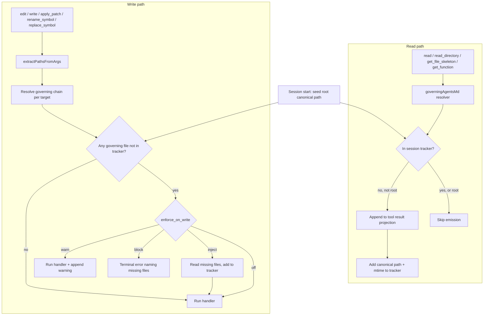

# feat: Add AGENTS.md context discovery, injection, and write enforcement

## Summary

Add first-class AGENTS.md handling: discover instruction files scattered through the workspace, inject the root file once into the static system instructions, inject nested files into read-tool results as the agent enters each directory, track which files are in context per session, and gate the five file-mutating tools on whether the governing AGENTS.md has been seen.

---

## Problem Frame

Orchid has no runtime AGENTS.md handling today. The string `AGENTS.md` appears only as prose guidance inside default skill and agent markdown, telling the agent to "read AGENTS.md" — nothing loads it. Static instructions are assembled in `electron/src/main/ipc/chat.ts` as `appendProjectPersonality(agent.system_prompt, runtime)` (`electron/src/main/project/personality.ts`), and per-turn dynamic context is built in `electron/src/main/llm/build-prompt-context.ts`. Localized, directory-scoped instructions therefore never reach the model unless the agent happens to `read` them, and a mutation can land in a subtree whose conventions the agent never saw.

This plan adds a read path (discovery + injection) and a write path (enforcement) sharing one primitive — a resolver that maps a target path to the chain of AGENTS.md files governing it — and ships both in one delivery.

---

## Requirements

**Discovery and injection**

- R1. The root instruction file (and any configured alias present at the workspace root) is injected once into the static system instructions, alongside personality.
- R2. Nested instruction files are discovered by walking up from a touched path to the workspace root, collecting configured filenames per directory.
- R3. Read-path tools inject each newly discovered governing file into their result projection, deduped against the session tracker.
- R4. The root file is never re-injected by the nested mechanism.
- R5. Injection is capped by byte size; an over-cap file injects a head plus a `read` pointer instead of full content.

**Write enforcement**

- R6. The five file mutators — `edit`, `write`, `apply_patch`, `rename_symbol`, `replace_symbol` — are subject to enforcement.
- R7. When a mutation targets a file whose governing AGENTS.md is not in context, the configured policy applies; the default is `warn`.
- R8. `apply_patch` enforcement evaluates every file in the patch and reports all missing governing files in a single result.
- R9. Enforcement never applies to files outside the workspace, to `execute_command`, to MCP tools, or to non-file mutators.
- R10. Editing an instruction file itself is exempt from the "must be in context" check but refreshes that tracker entry.

**Configuration**

- R11. The feature exposes: `enabled`, ordered `filenames` (aliases), `max_file_bytes`, `max_chain_depth`, `enforce_on_write` policy, `inject_on_read`, and `include_local`.
- R12. These settings merge through the existing defaults → home → project → env chain like all other config.

**State and scoping**

- R13. The context tracker is per-session and is seeded with the root file at session start.
- R14. Tracker identity is the canonical, symlink-resolved path so relative and symlinked variants dedupe to one entry.
- R15. Subagents start fresh with only the root file seeded; they do not inherit the parent tracker.
- R16. A tracker entry whose file changed on disk is detected by mtime/hash and re-injected on next encounter.
- R17. With no session available (direct `tool:execute` IPC), enforcement degrades to non-blocking and never hard-blocks.

---

## Key Technical Decisions

- **Reuse the permission resolver's path extraction:** `extractPathsFromArgs` and `resolveToolScope` in `electron/src/main/permissions/resolver.ts` already resolve tool paths and parse `apply_patch`'s multi-file and `Move to` destinations. The enforcement path reuses this rather than introducing a second walker, so `apply_patch` fan-out (R8) is solved for free.
- **Inject through the result-projection seam, not the system prompt:** nested files are appended to the originating tool's agent projection using the same XML-append pattern as `appendXmlRetrieval` in `electron/src/main/tools/tool-dispatch.ts`. This keeps injection scoped to the tool that earned it, dedupes via the tracker, and avoids re-emitting content into the system prompt every turn.
- **Tracker is a per-session store on `SessionManager`:** modeled on `getTodoStore` / `getActiveTodoStore` in `electron/src/main/session/manager.ts`. It survives the multi-step tool loop and subsequent turns, and is seeded with the root file so the root is never re-injected (R4, R13).
- **Enforcement hooks the dispatcher after permission resolution, before the handler:** one code path in `executeToolCall` covers all five mutators and mirrors the fail-closed posture of `checkPermission` in `electron/src/main/permissions/gate.ts` (KTD posture; default policy is still non-blocking per R7).
- **Root vs nested distinguished by canonical-path identity:** the root file's canonical path is seeded permanently; the upward walk stops at the workspace root and flags the root-level file as root tier so callers skip emission (R4).
- **Aliases are an ordered configurable filename list:** first match per directory wins; the chain still walks up across directories. Resolution stays inside the workspace and never follows symlinks that escape it, reusing `isPathContainedIn` from the resolver (R11, R9).
- **Default enforcement policy is `warn`:** proceed and append a warning naming the unseen files; `block`, `inject`, and `off` are configurable per project (R7).

---

## High-Level Technical Design

The resolver is the shared primitive: `governingAgentsMd(targetPath, cwd, config)` returns an ordered list from the workspace root down to the target's directory, each entry tagged root-tier or nested-tier with its canonical path and mtime.

---

## Scope Boundaries

**In scope**

- Resolver, config fields, session tracker, root injection, read-path injection, write-path enforcement, subagent fresh-start, no-session degradation.

**Out of scope**

- `execute_command` governance — statically ungovernable; already covered by command detection in the permission gate.
- MCP tool enforcement — opaque arguments, no reliable path extraction.
- Non-file mutators (`todo/*`, `rag/index`, `ast/index-tool`) — not file-content edits.
- `grep` / `glob` / `rag_search` injection — these return path sets across many trees; treated as soft discovery only (record nothing, inject nothing) to avoid noise. See Open Questions.
- Renderer/UI surfacing of which AGENTS.md files are in context.
- `@path` include resolution inside instruction files (shim support) — deferred.

---

## Implementation Units

### U1. Resolver and config schema

- **Goal:** A pure, testable primitive that maps a target path to its governing instruction-file chain, plus the config fields that drive it.
- **Requirements:** R2, R5, R11, R12, R14
- **Dependencies:** none
- **Files:**
  - Create `electron/src/main/agents-md/resolver.ts`
  - Modify `electron/src/main/config/schema.ts` (new `agents_md` block)
  - Test `electron/tests/unit/agents-md-resolver.test.ts`
- **Approach:** Walk up from the target's directory to `cwd`, collecting the first configured filename present per directory (ordered alias list). Canonicalize each hit with `fs.realpathSync.native`. Stop at `cwd`; tag the `cwd`-level file root-tier. Cap the walk at `max_chain_depth`. Reject any candidate that escapes `cwd` via symlink using `isPathContainedIn` (import from the resolver). Read content lazily with a `max_file_bytes` cap producing a head-plus-pointer payload.
- **Patterns to follow:** `resolveToolScope` / `canonicalizeEffectivePath` in `electron/src/main/permissions/resolver.ts`; config block shape in `electron/src/main/config/schema.ts`.
- **Test scenarios:**
  - Single root file resolves as root-tier.
  - Nested chain returns root-to-leaf order.
  - Alias precedence: first configured filename wins per directory.
  - Symlinked file escaping `cwd` is excluded.
  - Walk stops at `max_chain_depth`.
  - Over-cap file yields head-plus-pointer, not full content.
  - Case-insensitive filename match on disk preserves the on-disk name.
  - Config defaults merge and a project `.orchid.json` override wins.
- **Verification:** Resolver returns correct chains across nested, aliased, and symlinked fixtures; config parses and rejects unknown keys under the strict schema.

### U2. Per-session context tracker

- **Goal:** A session-scoped store recording which instruction files are in context, seeded with the root file and aware of staleness.
- **Requirements:** R4, R13, R14, R16
- **Dependencies:** U1
- **Files:**
  - Create `electron/src/main/session/agents-md-context.ts`
  - Modify `electron/src/main/session/manager.ts` (`getAgentsMdContextStore`, mirroring `getTodoStore`)
  - Test `electron/tests/unit/agents-md-context.test.ts`
- **Approach:** Store entries keyed by canonical path with mtime/hash and a root-tier flag. Seed the root file's canonical path on store creation. `markSeen`, `isInContext`, and `isStale(entry)` (compare stored mtime/hash to disk). Provide an empty-store fallback for the no-session case, mirroring `_emptyTodoStore`.
- **Patterns to follow:** `TodoStore` wiring and `_emptyTodoStore` fallback in `electron/src/main/session/manager.ts`; `WorkingSetStore` in `electron/src/main/session/working-set.ts`.
- **Test scenarios:**
  - Root file is in context immediately after seeding.
  - `markSeen` then `isInContext` returns true for the same canonical path.
  - Relative and symlinked variants of one file collapse to one entry.
  - `isStale` flips true after the file's mtime changes on disk.
  - Empty-store fallback never throws and reports nothing in context.
- **Verification:** Tracker dedupes by canonical path, survives across calls within a session, and detects on-disk changes.

### U3. Root injection into static instructions

- **Goal:** The root instruction file is appended once to the static system instructions.
- **Requirements:** R1, R4
- **Dependencies:** U1
- **Files:**
  - Create `electron/src/main/project/agents-md.ts` (`appendRootAgentsMd`)
  - Modify `electron/src/main/ipc/chat.ts` (compose after `appendProjectPersonality`)
  - Test `electron/tests/unit/agents-md-root-injection.test.ts`
- **Approach:** A sibling to `appendProjectPersonality`: read the root file via the resolver (root-tier only), append under a clear heading, no-op when disabled or absent. Compose at the same site where personality is appended so ordering is deterministic.
- **Patterns to follow:** `appendProjectPersonality` in `electron/src/main/project/personality.ts`.
- **Test scenarios:**
  - Root content appended once when present and enabled.
  - No-op when `enabled` is false or no root file exists.
  - Alias at root is used when the primary filename is absent.
  - Over-cap root file injects head-plus-pointer.
- **Verification:** The assembled base system prompt contains the root file exactly once.

### U4. Read-path injection

- **Goal:** Read-path tools surface newly discovered governing files in their result projection.
- **Requirements:** R3, R4, R5, R16
- **Dependencies:** U1, U2
- **Files:**
  - Modify `electron/src/main/tools/types.ts` (thread tracker handle onto `ToolExecutionContext`)
  - Modify `electron/src/main/tools/tool-dispatch.ts` (post-projection append for read tools)
  - Modify `electron/src/main/ipc/chat.ts` (provide the tracker when building context)
  - Test `electron/tests/unit/agents-md-injection.test.ts`
- **Approach:** After a read-path tool's agent projection is produced, resolve the governing chain for the tool's target path; for each nested-tier file not in the tracker (or stale), append an `<agents_md path=... scope="new">` block using the `appendXmlRetrieval` pattern and mark it seen. Skip root-tier files entirely. Only the explicit-path read tools participate (`read`, `read_directory`, `get_file_skeleton`, `get_function`).
- **Patterns to follow:** `appendXmlRetrieval` and the projection/offload flow in `electron/src/main/tools/tool-dispatch.ts`; `TOOLS_WITHOUT_OUTPUT_OFFLOAD` membership for read tools.
- **Test scenarios:**
  - First read under a nested AGENTS.md injects it; second read does not.
  - Root-tier file is never injected on read.
  - Stale entry re-injects after on-disk change.
  - Over-cap file injects head-plus-pointer.
  - No tracker (no session) degrades gracefully with no injection and no throw.
- **Verification:** A sequence of reads injects each governing file exactly once and never re-injects the root.

### U5. Write-path enforcement

- **Goal:** The five file mutators are gated on whether the governing AGENTS.md is in context, per the configured policy.
- **Requirements:** R6, R7, R8, R9, R10
- **Dependencies:** U1, U2
- **Files:**
  - Create `electron/src/main/agents-md/enforce.ts`
  - Modify `electron/src/main/tools/tool-dispatch.ts` (pre-handler enforcement step in `executeToolCall`)
  - Test `electron/tests/unit/agents-md-enforcement.test.ts`
- **Approach:** After permission resolution and before the handler, run enforcement for the five mutators only. Extract target paths via `extractPathsFromArgs`; resolve each target's governing chain; collect governing files not in context (excluding the target itself when it is an instruction file, per R10). Apply policy: `warn` appends a `<warning>` to the result and proceeds; `block` returns a terminal generic error naming all missing files; `inject` reads the missing files, marks them seen, appends them, and proceeds; `off` proceeds silently. Aggregate across all `apply_patch` files before acting.
- **Patterns to follow:** `checkPermission` fail-closed posture and `genericTerminalExecution` in `electron/src/main/permissions/gate.ts`; `extractPathsFromArgs` in `electron/src/main/permissions/resolver.ts`.
- **Test scenarios:**
  - `warn`: edit proceeds and result carries a warning naming the unseen file.
  - `block`: edit is rejected with a terminal error; handler never runs.
  - `inject`: missing file is read, added to tracker, appended, and edit proceeds.
  - `apply_patch` touching two trees reports both missing files in one denial.
  - Editing an AGENTS.md file itself is allowed and refreshes its entry.
  - Target outside `cwd` is not enforced.
  - `off` proceeds with no warning.
- **Verification:** Each policy behaves as specified and `apply_patch` fan-out reports comprehensively.

### U6. Subagent fresh-start and no-session degradation

- **Goal:** Subagents begin with only the root seeded; direct IPC without a session never hard-blocks.
- **Requirements:** R15, R17
- **Dependencies:** U2, U5
- **Files:**
  - Modify `electron/src/main/agents/subagent-runner.ts` (seed a fresh tracker per subagent session)
  - Modify `electron/src/main/tools/tool-dispatch.ts` (no-session path forces non-blocking)
  - Test `electron/tests/unit/agents-md-subagent.test.ts`
- **Approach:** When a subagent session is created, seed its tracker with the root file only — do not copy the parent's set. In the dispatcher, when no tracker is resolvable, force the effective policy to non-blocking regardless of config.
- **Patterns to follow:** subagent session creation and `systemPrompt` assembly in `electron/src/main/agents/subagent-runner.ts`; empty-store fallback in `electron/src/main/session/manager.ts`.
- **Test scenarios:**
  - Subagent tracker contains only the root file at start.
  - Parent having seen a nested file does not mark it seen for the subagent.
  - No-session enforcement with `block` configured still proceeds (degraded to warn/off).
- **Verification:** Subagent isolation and no-session safety hold under the configured policies.

### U7. Documentation and skill guidance

- **Goal:** Align docs and default skill prose with the new automatic behavior.
- **Requirements:** R1, R11
- **Dependencies:** U3, U4, U5
- **Files:**
  - Modify `AGENTS.md`
  - Modify default skill markdown that currently instructs "read AGENTS.md" (under `electron/src/main/skills/defaults/`)
- **Approach:** Document the config fields and the inject/enforce behavior; soften skill prose that tells the agent to manually read AGENTS.md now that injection is automatic.
- **Patterns to follow:** existing config documentation style in `AGENTS.md`.
- **Test scenarios:** none (documentation).
- **Verification:** Docs describe the shipped config keys and behavior accurately; no skill instructs redundant manual reads.

---

## System-Wide Impact

- **Hot dispatch path:** U4 and U5 add work to every tool call in `executeToolCall`. The resolver must be cheap and cached; path canonicalization reuses the resolver's existing bounded cache pattern to avoid per-call `realpathSync` on the event loop.
- **Prompt size:** root injection grows the static prompt by one file; nested injection grows individual tool results. Both are byte-capped (R5) to bound token impact.
- **Session state:** a new per-session store joins the todo and working-set stores; it is in-memory and needs no schema migration.
- **Permissions:** enforcement is adjacent to, but distinct from, the permission gate; it does not change approval resolution or risk-class floors.

---

## Risks and Dependencies

| Risk | Mitigation |
|---|---|
| Per-call resolver cost on the dispatch hot path | Reuse the bounded canonical-path cache pattern from the permission resolver; cache governing-chain lookups per turn |
| Prompt bloat from large instruction files | `max_file_bytes` cap with head-plus-pointer fallback (R5) |
| False-positive enforcement stalls agent loops | Default policy is non-blocking `warn` (R7); `block` is opt-in per project |
| Stale context after on-disk edits | mtime/hash staleness check re-injects on next encounter (R16) |
| Symlink escape leaking or governing out-of-workspace files | Containment check reusing `isPathContainedIn`; walk stops at `cwd` (R9) |

---

## Open Questions

- Should `grep` / `glob` / `rag_search` ever inject when a single directory is implicated, or remain soft-discovery only? Default: soft-discovery only; revisit if agents miss conventions in search-heavy flows.
- Should `@path` shim includes (e.g. a `CLAUDE.md` containing `@AGENTS.md`) be resolved, and with what cycle depth cap? Deferred; the alias list covers the common case.
- Is a renderer-side indicator of in-context instruction files worth a follow-up? Out of scope here.

---

## Acceptance Examples

- **Nested injection, then dedupe**
  - **Given** a session with the root file seeded and `electron/src/main/tools/AGENTS.md` present
  - **When** the agent reads `electron/src/main/tools/filesystem/edit.ts` then reads it again
  - **Then** the first result carries the nested AGENTS.md and the second does not (R3, R4).

- **Warn on unseen governance**
  - **Given** `enforce_on_write` is `warn` and `pkg/api/AGENTS.md` is not in context
  - **When** the agent edits `pkg/api/client.ts`
  - **Then** the edit succeeds and the result carries a warning naming `pkg/api/AGENTS.md` (R7).

- **Block aggregates apply_patch**
  - **Given** `enforce_on_write` is `block` and a patch touches files under two unseen AGENTS.md trees
  - **When** the agent calls `apply_patch`
  - **Then** the call is rejected once, naming both unseen files, and nothing is written (R8).

- **Subagent isolation**
  - **Given** the main agent has seen `pkg/api/AGENTS.md`
  - **When** it delegates to a subagent that edits `pkg/api/client.ts`
  - **Then** the subagent's enforcement treats that file as unseen (R15).

---

## Sources and Research

- Static instruction assembly: `electron/src/main/ipc/chat.ts`, `electron/src/main/project/personality.ts`.
- Per-turn dynamic context: `electron/src/main/llm/build-prompt-context.ts`, `electron/src/main/llm/system-prompt.ts`.
- Tool execution context and dispatch: `electron/src/main/tools/types.ts`, `electron/src/main/tools/tool-dispatch.ts`.
- Path extraction and workspace scope: `electron/src/main/permissions/resolver.ts`.
- Permission gate posture: `electron/src/main/permissions/gate.ts`.
- Session store patterns: `electron/src/main/session/manager.ts`, `electron/src/main/session/working-set.ts`.
- Mutating tool definitions: `electron/src/main/tools/filesystem/edit.ts`, `write.ts`, `apply-patch.ts`; `electron/src/main/tools/ast/rename-symbol.ts`, `replace-symbol.ts`.
- Config schema and merge: `electron/src/main/config/schema.ts`.
