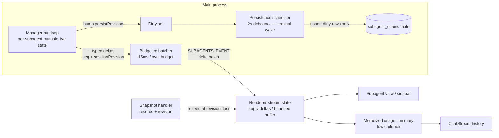

# refactor: Subagent live/durable separation (performance review Batch 3)

## Summary

Replace cumulative subagent live projections with a delta-oriented event protocol, persist subagent records as independently updateable SQLite rows written only when dirty, add bounded admission control with an explicit queued state, and evict terminal runtime data behind a bounded summary cache. One coherent change across the shared event/persistence boundary, per `review.md` Batch 3 (F-04, F-05, F-06, F-07).

---

## Problem Frame

`review.md` (2026-07-26, baseline `14a4df1`) identifies cumulative-state amplification as Orchid's dominant responsiveness risk. Four findings share one protocol boundary — live events, durable handoff, persistence, and renderer selectors — and must be designed together:

- F-04 (P1): every content delta rebuilds complete live segment/tool arrays in the manager, ships a full projection plus a freshly materialized durable record per event, and changes record identities in the renderer, invalidating the main transcript's memoized history.
- F-05 (P1): every 2-second checkpoint serializes the session's entire subagent history into one `subagent_chains_json` column on the main thread; terminal events flush immediately and then trigger a redundant full snapshot.
- F-06 (P2): every spawn begins immediately — no active/queued limits, no fairness, and main-agent tool work can time out behind background subagent work in the shared worker pool.
- F-07 (P2): the process-global manager never prunes terminal records; snapshots, persistence, and prompt-context generation all traverse this growing map, and prompt context repeats complete task texts without a recency bound.

The existing safeguards worth preserving are enumerated in `review.md` ("Existing safeguards to preserve") — coalesced delivery, debounced persistence, incremental session lifecycle writes — this plan extends them rather than replacing them.

---

## Requirements

**Live protocol (F-04)**

- R1. Live subagent updates travel as typed deltas (text, thinking, tool-args, tool-result, usage, state); a durable record is seeded to the renderer once at spawn and re-sent only at terminal handoff.
- R2. Event delivery applies a global per-flush event and byte budget across all subagents, not merely one event per subagent per frame.
- R3. Projection-only events keep the renderer `records` array and durable record objects referentially stable.
- R4. Every live event and snapshot carries a per-session monotonic revision; the renderer rejects stale snapshots and never rolls state back.
- R5. Hydration event buffering is byte-bounded; on overflow the renderer discards intermediate events, records the newest seen revision, and reseeds atomically from a snapshot whose revision meets that floor.
- R6. Chat history rendering depends on a memoized, low-frequency subagent usage summary instead of the full subagent records array.

**Persistence (F-05)**

- R7. Subagent records persist as one SQLite row per record; checkpoints serialize and upsert only records dirtied since the last flush.
- R8. Terminal completion waves batch into one bounded flush, and no post-terminal full snapshot is issued when the terminal event already carries authoritative state.
- R9. Checkpoint bytes and duration are recorded for diagnostics.

**Admission and fairness (F-06)**

- R10. SubagentManager enforces configurable global and per-session active limits plus a bounded queue; excess spawns enter an explicit `queued` state visible in runtime state, IPC, and UI.
- R11. Queued work is admitted fairly across sessions, and queue-wait time is tracked separately from execution time.
- R12. The tool worker pool reserves capacity for main-agent-scoped work so background subagents cannot starve the visible agent.

**Retention and prompt context (F-07)**

- R13. After authoritative terminal persistence, heavy runtime data (chain messages, live projection, project runtime, `_runPromise`) is evicted; only a bounded recent-terminal summary cache is retained.
- R14. Session deletion purges every manager record owned by that session.
- R15. Prompt context includes active subagents plus a bounded recent-terminal set with truncated task text.

---

## Key Technical Decisions

- **Per-session monotonic revision as the single ordering primitive.** Live events, snapshots, and hydration recovery all carry `sessionRevision` from one counter per session in the manager. This serves freshness comparison (R4), overflow recovery floors (R5), and stale-snapshot rejection without a second mechanism (see origin: review.md F-04 rec 7).
- **Mutable internal live state; clone only at snapshot time.** The manager keeps per-run live segments/tools mutable during streaming and emits deltas from the run loop. `getLiveProjections()` deep-copies once per snapshot request (rare) instead of cloning arrays per delta (see origin: review.md F-04 recs 1–3).
- **New `subagent_chains` table, no migration.** One row per subagent record (`session_id`, `subagent_id`, `record_json`), added to the existing schema. Per user decision, installs carry no legacy data to migrate: the legacy `subagent_chains_json` column is left in place but no longer read or written. Follows the targeted-write precedent in `docs/solutions/performance-issues/incremental-sqlite-session-lifecycle-writes.md`.
- **`Session.subagentChains` remains the in-memory and IPC shape.** The storage layer owns row mapping on load; managers and renderer see the same domain records as today. Only how the field is loaded/saved changes.
- **Dirty tracking via per-record `persistRevision`.** The manager bumps a monotonic counter on every mutation of a record; the persistence scheduler upserts rows whose revision exceeds their last-persisted revision. Persistence work scales with dirty records, not total history (R7).
- **Admission control lives in SubagentManager, not the delegate tool.** `spawn()` always returns a record; the record starts `queued` or `running` per capacity. Fairness is round-robin across sessions with pending queued records (see origin: review.md F-06 rec 1).
- **`queued` is a first-class runtime state, never persisted.** Added to `SubagentState` and domain `SubagentStatus`. Queued records are ephemeral like today's `PENDING`: durable seed event reaches the renderer at spawn, but the DB row is written only at admission. Crash loses queued work, matching the existing pending-migration behavior.
- **Conservative configurable defaults, no benchmarks.** Per user constraint, no synthetic benchmarks inform defaults. Limits ship conservative (`max_active_global` 8, `max_active_per_session` 4, `max_queued` 32) under a nested `subagents.*` config group following the `rag.*` / `agents_md.*` precedent, tunable after real-world profiling.
- **Terminal flush no longer broadcasts a snapshot-invalidating change.** The terminal delta event carries the authoritative durable record; `SESSION_SUBAGENTS_CHANGED` is retained only for persistence recovery and cross-window invalidation (R8).
- **better-sqlite3 stays synchronous.** Row-scoped upserts bound per-flush work enough that moving durable writes off the main thread is deferred (see origin: review.md F-05 rec 3).

---

## High-Level Technical Design



Event taxonomy (wire format, one `SUBAGENTS_EVENT` channel, batched):

- `spawned` — durable record seed + initial revision.
- `text_delta` / `thinking_delta` — `{ segmentId, append }` merged per segment within a flush window.
- `tool_start` / `tool_args_delta` / `tool_result` — tool-result content bounded by the existing offload layer.
- `usage` — emitted at a slow cadence (`subagents.usage_event_interval_ms`, default 1000 ms), not per provider event.
- `terminal` — full durable record + final usage + terminal state; the only non-spawn event carrying a record.

Persistence shape:

```text
Checkpoint (per session, 2s debounce):
  for each record where persistRevision > lastPersistedRevision:
    UPSERT INTO subagent_chains (session_id, subagent_id, record_json)
  UPDATE sessions SET updated_at = ? WHERE id = ?

Terminal wave: terminal records mark dirty; one flush after a short
wave window (default 250ms) covers all near-simultaneous completions.

Session open:  SELECT record_json ... WHERE session_id = ? -> Session.subagentChains
Session delete: DELETE FROM subagent_chains WHERE session_id = ?
```

---

## Scope Boundaries

**Out of scope**

- F-02 (streaming Markdown reparse) — intentional per user decision, will not be fixed.
- F-08 (large canonical tool results) — Batch 4; this plan does not change tool-result payload shapes, only how often they cross the subagent event path.
- Per-MCP-server and foreground-command semaphores, and provider retry/backoff coordination (review F-06 recs 6–7) — independent mechanisms, deferred.
- Moving SQLite writes off the Electron main thread (review F-05 rec 3) — deferred; row-scoped writes bound the work first.
- Benchmarks and synthetic performance profiles — excluded per user instruction; verification is behavioral tests plus lint/typecheck.

**Non-goals**

- No changes to the durable `Chain`/`Message` domain shapes or their storage dicts.
- No virtualization/windowing of subagent transcripts in the renderer.

---

## Implementation Units

### U1. Shared delta-event protocol types

- **Goal:** Define the delta-event taxonomy, batched event envelope, and revisioned snapshot shape shared by main, preload, and renderer.
- **Requirements:** R1, R3, R4.
- **Dependencies:** none.
- **Files:**
  - `electron/src/shared/types/subagent.ts` — add `SubagentDeltaEvent` union (`spawned`, `text_delta`, `thinking_delta`, `tool_start`, `tool_args_delta`, `tool_result`, `usage`, `terminal`), each carrying `sessionId`, `subagentId`, `runId`, `sequence`, `sessionRevision`; retain `SubagentLiveProjection` for snapshot seeding only.
  - `electron/src/shared/types/ipc.ts` — replace `SubagentEvent` with `{ sessionId, events: SubagentDeltaEvent[] }` batch envelope; add `sessionRevision` to `SubagentSnapshot`; update `OrchidAPI.subagents.onEvent`.
  - `electron/src/preload/index.ts` — align the `subagents` bridge types (channel names unchanged).
  - `CONCEPTS.md` — add vocabulary: live delta event, session revision, durable handoff.
- **Approach:** Additive type change in one commit; main and renderer are migrated by later units, so keep the old `SubagentEvent` exported under a legacy alias until U4 lands, then remove it. The batch envelope is the unit of IPC delivery so the batcher (U3) controls bytes per send.
- **Patterns to follow:** existing const-object enum style in `subagent.ts`; channel allowlists in `shared/types/ipc.ts`.
- **Test scenarios:**
  - Type-level: delta union is exhaustive in a switch used by a test helper (`electron/tests/unit/subagent-ipc.test.ts`).
  - Snapshot schema accepts `sessionRevision` and rejects missing/negative revisions.
- **Verification:** `npm run typecheck` passes with both old and new event types present.

### U2. Manager delta emission and mutable live state

- **Goal:** The run loop emits typed deltas instead of rebuilding and broadcasting full projections; live accumulation becomes structurally cheap.
- **Requirements:** R1, R4.
- **Dependencies:** U1.
- **Files:**
  - `electron/src/main/agents/manager.ts` — replace `_updateLive`/`_appendLiveText`/`_ensureLiveTool`/`_updateLiveTool` clone-per-delta path with mutable per-run live state plus delta emission through `setOnLiveChange` (now emitting `SubagentDeltaEvent`s); add per-session `sessionRevision` counter; bump `persistRevision` on every mutation; `getLiveProjections()` deep-copies at call time; keep `_commitLiveSegments`/`materializeLiveTail` durable-chain logic intact.
  - `electron/src/main/agents/subagent-runner.ts` — no change expected; confirm `StreamEvent` consumption suffices for delta mapping.
- **Approach:** Text deltas carry `(segmentId, append)` where segmentId is the durable id already assigned to live segments, preserving the existing durable-handoff identity guarantee. Usage deltas throttle at source: accumulate per `usage` event but emit at most one `usage` delta per `subagents.usage_event_interval_ms` per subagent. `spawn()` emits the `spawned` seed; `_finishLive` emits `terminal` with the authoritative record.
- **Patterns to follow:** existing segment-id stability contract documented at `_commitLiveSegments`.
- **Test scenarios (`electron/tests/unit/subagent-runtime.test.ts`, `subagent-transcript.test.ts`):**
  - N content deltas produce N `text_delta` events and exactly one `spawned` and one `terminal` event; no event re-sends segments already delivered.
  - Sequence and sessionRevision are strictly monotonic per run and per session, including across interrupt/failure paths.
  - `getLiveProjections()` after M deltas returns a snapshot equal to today's cumulative projection (parity assertion).
  - Terminal event's record matches `runtimeToDomain(record, { includeLiveTail: true })` output for the same run.
- **Verification:** new and updated unit tests pass; `npm run typecheck`.

### U3. Budgeted event batcher

- **Goal:** Replace the per-subagent coalescer with a batcher enforcing a global per-flush event count and byte budget.
- **Requirements:** R2, R3.
- **Dependencies:** U1, U2.
- **Files:**
  - `electron/src/main/ipc/subagents.ts` — rewrite `createSubagentEventCoalescer` into a batcher: merge `text_delta`s by `(subagentId, segmentId)`; cap each flush at `subagents.event_max_per_flush` (default 200) and `subagents.event_byte_budget_kb` (default 64); overflow defers (never drops) non-terminal deltas to the next flush; `terminal` and `spawned` flush immediately; deliver one batched `SubagentEvent` per window.
  - `electron/src/main/config/schema.ts` — add the `subagents.*` group (all knobs listed in U3/U8/U10/U11 collected here in one unit to avoid schema churn).
- **Approach:** Byte estimate uses serialized-length accounting on the delta payloads (cheap length fields, not JSON.stringify per event). `deliverSubagentChange` no longer materializes a domain record per event — records ride only `spawned`/`terminal` deltas built once by the manager.
- **Test scenarios (`electron/tests/unit/subagent-ipc.test.ts`):**
  - K subagents × M text deltas within one window merge into ≤ K segment-appends per subagent and respect the per-flush byte budget; residual deltas arrive on the next flush in order.
  - Terminal deltas are never deferred behind a full budget.
  - Batches to ineligible windows are skipped without building payloads (existing recipient test extended).
- **Verification:** unit tests pass; `npm run lint`.

### U4. Renderer delta application and bounded hydration recovery

- **Goal:** Renderer stream state applies deltas incrementally and bounds the hydration buffer with revision-floor recovery.
- **Requirements:** R3, R4, R5.
- **Dependencies:** U1 (U2/U3 for end-to-end behavior).
- **Files:**
  - `electron/src/renderer/utils/subagent-stream.ts` — rewrite `applyEvent` into `applyDeltaBatch`: per-subagent live state assembled from deltas; `records` array identity changes only on `spawned`/`terminal`/snapshot; drop projection-only record remapping (`recordWithProjection` path shrinks to spawned/terminal); bound `buffered` by `subagents.hydration_buffer_kb` (default 256) with overflow → discard buffer, record newest seen revision, mark `needsReseed`.
  - `electron/src/renderer/hooks/useSubagents.ts` — on `needsReseed`, request a snapshot and apply it atomically only when `snapshot.sessionRevision >= recorded floor`; replay or preserve newer in-flight events; reject snapshots below the floor. `onEvent` consumes batches.
  - `electron/src/shared/types/subagent.ts` legacy `SubagentEvent` alias removed here (U1 TODO).
- **Approach:** Delta application mirrors the manager's merge rules so renderer-assembled live state equals a snapshot at the same revision — assert this in tests rather than duplicating logic. Snapshot seeding keeps the existing generation-affinity guards (`isSubagentSnapshotAffine`) and adds the revision floor.
- **Patterns to follow:** existing high-water/runId guards in `subagent-stream.ts`; immutable-state return style (`next !== state` short-circuit).
- **Test scenarios (`electron/tests/unit/use-subagents-live.test.ts`, `use-subagents-detail.test.ts`):**
  - Delta-only stream assembles live state identical to a snapshot seeded at the same revision (property-style sweep over interleavings).
  - Records array reference is unchanged across 100 text deltas; changes on `spawned` and `terminal` only.
  - Buffer overflow discards intermediates, triggers one reseed, applies a snapshot at revision ≥ floor, and preserves newer in-flight events; a stale snapshot below the floor is rejected without replacing state.
  - Out-of-order batch (sequence regression) is dropped without state change.
- **Verification:** unit tests pass; `npm run typecheck`.

### U5. Low-frequency usage summary for ChatStream

- **Goal:** Decouple chat history memoization from the subagent records array.
- **Requirements:** R6.
- **Dependencies:** U4.
- **Files:**
  - `electron/src/renderer/hooks/useSubagents.ts` — expose a memoized `usageByParentChain`/`totalUsage` derived only from `spawned`/`terminal`/`usage` deltas at usage cadence.
  - `electron/src/renderer/components/ChatView.tsx` — pass the usage summary, not `subagents`, to `ChatStream`.
  - `electron/src/renderer/components/ChatStream.tsx` — replace the `subagents` dependency of `buildHistoryStreamItems` with the usage summary.
- **Approach:** `buildHistoryStreamItems` consumes usage attribution only; confirm no other record fields leak into history items (subagent chips in the transcript read from messages, not records — verify during implementation).
- **Test scenarios (`electron/tests/unit/chat-rendering-contract.test.ts` or renderer hook tests):**
  - 100 text deltas produce zero `buildHistoryStreamItems` recomputations (memo-identity assertion with a spy).
  - A usage delta recomputes history attribution at most once per usage cadence window.
- **Verification:** unit tests pass; history footer attribution unchanged in existing tests.

### U6. Row-per-record persistence with dirty-only checkpoints

- **Goal:** Subagent records persist as independently updateable rows; checkpoint work scales with dirty records; terminal waves flush once.
- **Requirements:** R7, R8, R9.
- **Dependencies:** U2 (persistRevision), and U1 for event-driven renderer updates.
- **Files:**
  - `electron/src/main/session/storage.ts` — add `subagent_chains` table (`session_id`, `subagent_id`, `record_json`, PRIMARY KEY `(session_id, subagent_id)`); add `upsertSubagentRecords(sessionId, records)` and `deleteSubagentRecords(sessionId)` targeted operations; session load selects rows into `Session.subagentChains`; session delete removes rows; stop reading/writing `subagent_chains_json`.
  - `electron/src/main/session/manager.ts` — add a targeted `syncSubagentRecords(sessionId, dirtyRecords)` path beside (not replacing) `persistSessionFields`, following the persist-first/replace-memory-second ordering.
  - `electron/src/main/agents/persist-subagent-chains.ts` — scheduler collects records where `persistRevision > lastPersistedRevision` per session, upserts only those rows, and logs checkpoint bytes/duration (R9).
  - `electron/src/main/agents/wire-subagents.ts` — terminal events mark dirty and schedule a wave flush (default 250 ms window) instead of an immediate per-terminal flush; `SESSION_SUBAGENTS_CHANGED` fires only on recovery flushes, not ordinary terminal flushes (R8).
  - `electron/src/main/config/schema.ts` — `subagents.terminal_wave_ms` knob (with the U3 schema group).
  - `electron/src/main/ipc/session.ts` — session deletion path already emits `onSessionDeleted`; ensure storage delete removes subagent rows.
- **Approach:** Serialization uses the existing `subagentRecordToStorageDict`; one row stores one serialized record. Full `saveSession()` remains the creation/recovery primitive and writes subagent rows wholesale there. Fresh-install assumption: no read path for `subagent_chains_json`; the column stays in the schema untouched (dropping would force a table rebuild for no benefit).
- **Patterns to follow:** `updateChain()` targeted-write precedent and the transaction/ordering rules in `docs/solutions/performance-issues/incremental-sqlite-session-lifecycle-writes.md`.
- **Test scenarios (`electron/tests/unit/session-persistence.test.ts`, subagent persistence tests):**
  - After two checkpoints with one dirty record each, only that record's row changes (stable `rowid` for untouched siblings, per the deletion-trigger precedent).
  - A session with N terminal records loads back N domain records identical to pre-save (round-trip).
  - Three near-simultaneous terminal events produce exactly one flush and one upsert transaction.
  - Terminal flush emits no `SESSION_SUBAGENTS_CHANGED`; recovery flush does.
  - Session deletion removes all its subagent rows and purges scheduler state (existing `clear` path).
  - Missing-row recovery: deleting a row externally then checkpointing re-upserts it from the authoritative runtime record.
- **Verification:** unit tests pass; `npm run typecheck && npm run lint`.

### U7. Manager admission control and queued state

- **Goal:** Bound concurrent subagent execution with fair queuing, visible end-to-end.
- **Requirements:** R10, R11.
- **Dependencies:** U1 (state taxonomy); independent of U4–U6 but lands after U2 to avoid run-loop conflicts.
- **Files:**
  - `electron/src/main/agents/manager.ts` — `spawn()` admits immediately under limits or parks the record in a bounded FIFO queue with per-session round-robin admission on terminal transitions; new `queued` state; reject with a typed `SubagentQueueFullError` when the queue is full; track `queuedAt`/`startedAt` so queue wait and execution time are separate.
  - `electron/src/shared/types/subagent.ts` — add `QUEUED` to `SubagentState` and domain `SubagentStatus`; restore migration treats persisted `queued` (should never occur) as `interrupted`.
  - `electron/src/main/tools/subagent/delegate.ts` — surface `queued` status and queue position in the tool result so the main agent can reason about backpressure.
  - `electron/src/main/config/schema.ts` — `subagents.max_active_global` (8), `subagents.max_active_per_session` (4), `subagents.max_queued` (32).
  - `electron/src/renderer/utils/subagent-stream.ts`, `electron/src/renderer/components/Sidebar.tsx` (or subagent list components) — group/display `queued` distinctly from `running`.
  - `electron/src/main/llm/build-prompt-context.ts` — `getStates` includes queued entries with their wait time.
  - `CONCEPTS.md` — define the queued state.
- **Approach:** Admission check and queue admit/deny live behind a single private method so future per-provider limits (deferred) slot in without call-site changes. `wait_for_subagent` treats queued records as non-terminal (they resolve when the run finishes, as today). Cancellation removes queued records without starting a runner.
- **Test scenarios (`electron/tests/unit/subagent-runtime.test.ts`, `subagent-tools.test.ts`):**
  - With `max_active_per_session` 2, a third spawn is `queued`; on first terminal, the queued record admits exactly once and emits `spawned`-seed + state deltas in order.
  - Fairness: queued records from sessions A and B alternate admission when global capacity is 1.
  - Queue-full rejection returns a structured tool error naming the limit; no record is leaked into `allRecords()`.
  - Cancelling a queued record emits terminal `interrupted` without consuming a run slot.
  - Queue-wait and execution elapsed are reported separately in record timing fields.
- **Verification:** unit tests pass; `npm run typecheck`.

### U8. Worker-pool main-agent priority

- **Goal:** Main-agent tool work cannot starve behind subagent worker tasks.
- **Requirements:** R12.
- **Dependencies:** none (independent of U2–U7).
- **Files:**
  - `electron/src/main/utils/worker-pool.ts` — two-lane queue: main-agent-scoped tasks dispatch ahead of subagent-scoped tasks, with at least one worker slot effectively reservable (strict priority with anti-starvation aging or a reserved slot — choose during implementation; document the choice).
  - `electron/src/main/llm/tool-dispatch.ts` — tag dispatch with the turn's agent scope (main vs subagent) when queueing worker work.
  - `electron/src/main/config/schema.ts` — `worker_pool.main_agent_reserved` (default 1) if the reserved-slot design is chosen.
- **Approach:** Queue wait is measured and surfaced separately from the execution timeout per review F-06 rec 5: worker tasks record enqueue→start and start→finish timings, and the tool timeout covers execution only.
- **Test scenarios (worker-pool unit tests):**
  - Saturate a size-2 pool with subagent tasks; a main-agent task queued later starts before at least one earlier subagent task.
  - Subagent tasks still complete (no starvation over K rounds with aging).
  - Queue-wait vs execution timings are reported separately and sum to total latency.
- **Verification:** unit tests pass; `npm run lint`.

### U9. Terminal eviction and session-delete purge

- **Goal:** Bound manager retention after terminal persistence and on session deletion.
- **Requirements:** R13, R14.
- **Dependencies:** U6 (authoritative terminal persistence must exist before eviction).
- **Files:**
  - `electron/src/main/agents/manager.ts` — after the terminal wave flush confirms persistence, replace the runtime record with a bounded summary (id, label, task, state, result, error, usage, timings, parentChainIndex); null `_runPromise`, drop `chain` messages, live state, `projectRuntime`, and abort artifacts; retain summaries in a per-session FIFO capped at `subagents.terminal_retention` (default 25).
  - `electron/src/main/agents/wire-subagents.ts` — `onSessionDeleted` additionally purges every manager record owned by the session (active records are cancelled first, then removed).
  - `electron/src/main/config/schema.ts` — `subagents.terminal_retention`.
- **Approach:** Eviction happens only after the terminal row upsert succeeds (persist-first ordering). The renderer snapshot already merges stored records with runtime records, so evicted terminal records continue to render from storage; the summary cache exists for `getStates`/wait flows, not UI.
- **Test scenarios (`electron/tests/unit/subagent-runtime.test.ts`):**
  - After K > retention terminal completions, manager holds ≤ retention summaries plus active records; evicted records are absent from `allRecords()` but present in the snapshot via stored rows.
  - Session deletion with 2 running + 1 terminal subagents leaves zero manager records for that session and cancels the running two.
  - `_runPromise` is null after settlement on success, failure, and interrupt paths.
- **Verification:** unit tests pass; `npm run typecheck`.

### U10. Prompt-context bounding

- **Goal:** Bound subagent contribution to the dynamic system prompt.
- **Requirements:** R15.
- **Dependencies:** U9 (summary cache is the recent-terminal source).
- **Files:**
  - `electron/src/main/llm/build-prompt-context.ts` — `mapSubagents` returns active + at most `subagents.prompt_recent_terminal` (default 5) recent terminal summaries; task text truncated to `subagents.prompt_task_max_chars` (default 200) with an ellipsis marker.
  - `electron/src/main/llm/system-prompt.ts` — render the bounded set; indicate truncation in the `<task>` block.
  - `electron/src/main/config/schema.ts` — the two knobs (fold into the U3 schema group).
- **Test scenarios (prompt-context unit tests):**
  - With 30 terminal records, prompt contains 5 terminal entries, newest-first, tasks truncated at the cap.
  - Active records always appear regardless of the recent-terminal cap.
- **Verification:** unit tests pass; `npm run typecheck && npm run lint`.

---

## Risks & Dependencies

| Risk | Mitigation |
|---|---|
| Protocol change spans shared types, preload, main, renderer; partial landing breaks the event path. | U1 keeps a legacy event alias until U4 removes it; land units in dependency order; each unit keeps `npm run test` green. |
| Delta application divergence between manager and renderer assemblers. | U4 mandates a parity test asserting delta-assembled state equals snapshot state at equal revisions. |
| Row storage regresses crash-recovery semantics for mid-run records. | U6 checkpoint cadence (2s) matches today; mid-run recovery still restores `INTERRUPTED` via the existing restore migration; missing-row recovery test required. |
| Admission limits surprise users with queued/refused delegations. | Delegate result and prompt context surface queue state explicitly; defaults are generous (8 global); all limits configurable. |
| Eviction before durable write loses terminal results. | U9 evicts only after confirmed terminal row upsert; persist-first ordering inherited from U6. |
| Worker-pool priority starves subagent tools under sustained main-agent load. | U8 requires an anti-starvation aging test; choice between strict priority and reserved slot is documented at implementation time. |

---

## Deferred Implementation Notes

- Exact default limits (active counts, budgets, retention) are first guesses under the no-benchmark constraint; tune after real-world profiling or the review's controlled profiles are ever run.
- Reserved-slot vs aged-priority worker lane: decide in U8 after reading `electron/src/main/utils/worker-pool.ts` scheduling internals.
- Whether queued spawns need a queue-dwell timeout (auto-cancel after N minutes) — evaluate during U7; not required by the review.
- Per-provider/connection active limits (review F-06 rec 2) slot into the U7 admission seam later; not required for this batch.

---

## Documentation / Operational Notes

- `AGENTS.md` config table gains the `subagents.*` group (and `worker_pool.main_agent_reserved` if chosen) — update in the unit that lands each knob (U3 collects the schema; doc rows land with U3).
- `AGENTS.md` tool-system and session-persistence sections: update the subagent persistence description after U6 (row storage replaces the single-column description).
- New checkpoint byte/duration log lines (R9) route through the existing `FileLogger`; no new telemetry surface.

---

## Sources / Research

- `review.md` — origin document; findings F-04, F-05, F-06, F-07, and the "Existing safeguards to preserve" list.
- `docs/solutions/performance-issues/incremental-sqlite-session-lifecycle-writes.md` — targeted-write precedent: `updateChain()`, persist-first/replace-memory-second ordering, missing-row recovery contract, deletion-trigger test pattern.
- `electron/src/main/agents/manager.ts` — run loop, live projection machinery, `runtimeToDomain`/`materializeLiveTail` durable handoff.
- `electron/src/main/ipc/subagents.ts` — current per-subagent coalescer and snapshot assembly.
- `electron/src/renderer/utils/subagent-stream.ts` — current hydration/generation-affinity and event application.
- `electron/src/main/session/storage.ts` — `ChainRow` incremental-write pattern and `updateSessionFields` allowlist.
- `electron/src/renderer/hooks/useSubagents.ts` and `electron/src/renderer/components/ChatStream.tsx` — records-array dependency chain into history memoization.
