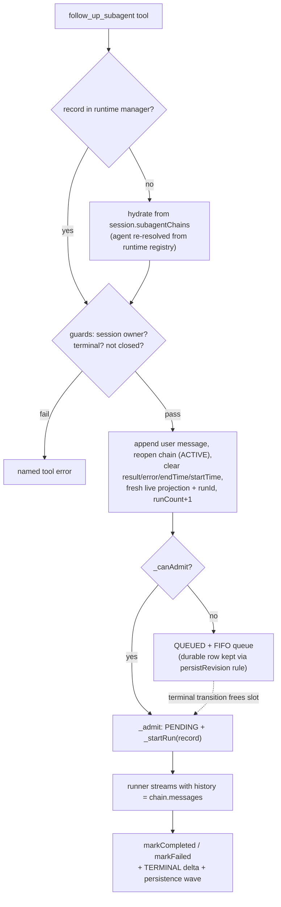

## Summary

Add two subagent lifecycle tools: `close_subagents` hides a terminal subagent from the dynamic system prompt without deleting anything, and `follow_up_subagent` resumes a terminal (completed/failed/interrupted) subagent with new input while replaying its full conversation history. Both tools work across app restarts by lazily hydrating persisted subagent records back into the runtime manager.

---

## Problem Frame

Today the dynamic system prompt lists every subagent of the session forever (`electron/src/main/llm/build-prompt-context.ts` `mapSubagents`), and once a subagent reaches a terminal state there is no way to continue its work: starting over via `delegate_to_subagent` loses all accumulated context. App crashes make this worse — a subagent that was mid-work is restored as `interrupted` with no path to resume it. The main agent needs a way to (a) curate which subagents still occupy prompt space, and (b) send follow-up input to a subagent that finished, failed, or was interrupted — including subagents from before an app restart, since crash recovery is a primary motivation.

---

## Requirements

**Close**

- R1. `close_subagents` marks named subagents closed; closed records disappear from the dynamic system prompt `<subagents>` block on the next turn.
- R2. Closing never deletes or alters the session record, chain, or UI entry; the terminal state (completed/failed/interrupted) stays intact.
- R3. Only terminal records are closeable — running/queued ids are rejected with interrupt guidance; re-closing is idempotent.
- R4. The closed flag persists across app restarts.

**Follow-up**

- R5. `follow_up_subagent` sends new input to a terminal, non-closed subagent and reruns it with its full prior chain (original task, turns, tool calls) plus the new user message.
- R6. Follow-up rejects closed records (named error), non-terminal records (wait/interrupt guidance), unknown ids, and ids owned by another session.
- R7. Resumed runs respect admission limits (`subagents.max_active_global / max_active_per_session / max_queued`) and park in the existing FIFO queue when full.
- R8. A resumed run streams, persists, and finishes exactly like a fresh run: live deltas, terminal event, chain reopened then re-terminalized; a crash mid-run restores the record as interrupted with the follow-up message retained.

**Cross-restart hydration**

- R9. Both tools can target subagent records persisted before the current app launch; the runtime record is materialized on demand from the session's stored `subagentChains`.

**Integration**

- R10. Both tools are registered for the main agent (`general` definition `allowed_tools` + guidance text), carry `RiskClass.DELEGATION`, and are added to `SUBAGENT_FORBIDDEN_TOOLS` so subagents cannot use them.
- R11. The renderer live reducer treats a second run of the same subagent id as a new run (run rotation) instead of dropping its deltas.

---

## Key Technical Decisions

| Decision | Rationale |
|---|---|
| **Closed is a flag, not a new state** | Preserves the terminal reason; a new `CLOSED` state would force edits across every `TERMINAL_STATES` consumer (`cancel` paths, `wait` predicate, restore migration, `runtimeToDomain` status map, Sidebar grouping). |
| **Single-point prompt filter in `SubagentManager.getStates`** | Its only caller is `mapSubagents` in `build-prompt-context.ts`; filtering there hides closed records from the prompt without touching snapshots, `wait`, or the UI. |
| **Lazy hydration at tool time, not session activation** | Materializes only the explicitly targeted records — avoids resurrecting every historical record into the runtime map (and, unfiltered, into the prompt) on session load. |
| **Agent re-resolution by registry name (`agent_type`); missing definition is a tool error** | Synthesizing a permissive fallback agent would grant tools the original definition may not have allowed; definitions live in `~/.orchid/agents` so absence is a rare, explainable failure. |
| **Reuse `_canAdmit` / `_admit` / FIFO queue for resume** | Resume is capacity-equivalent to spawn; reusing the admission path keeps fairness and the per-session/global caps unchanged. |
| **Fresh runId + live projection per resume, re-emit `SPAWNED`** | The renderer keys runs by `(subagentId, runId)`; a fresh `runId` plus a run-rotation reducer change (U7) makes resume indistinguishable from a new run in the UI. |
| **Runner replays chain via a `history` param; `_startRun` passes `record.chain.messages`** | `toApiMessages` already prunes orphaned tool calls/results and replays thinking — no new history machinery; `streamChat` sends full history each turn, same as the main agent today. |
| **Persistence via dirty-checkpoint + `recoverSubagentPersistence`, no new delta type** | `close` mutates no stream state; the wait tool's recovery-flush pattern persists the flag and refreshes the UI without extending the delta protocol. |
| **Per-run `turnId` (`{record.id}#{runCount}`) and reset timing fields on resume** | Keeps provider accounting attribution unique per run and makes elapsed reflect the active run instead of dormant time. |
| **Durable-row eligibility keyed on `persistRevision > 0`** | Refining the queued-record persistence skip (`queuedAt !== null && startedAt === null` → also require `persistRevision === 0`) lets a resume-queued record keep its durable row so a crash while queued retains the follow-up message. |

---

## High-Level Technical Design

Close path: `close_subagents tool` → hydrate-on-miss → terminal guard → set `closed` flag → `_markRecordDirty` + `_notify` → `recoverSubagentPersistence(sessionId)` flush → next turn's `getStates` filter removes it from the prompt.

---

## Scope Boundaries

- **In:** close flag lifecycle; follow-up resume with history replay; lazy cross-restart hydration for close/follow-up; queue integration; renderer run rotation; tool registration, allowlists, and agent instruction updates.
- **Out:** hydrating `wait_for_subagent` / `interrupt_subagents` lookups (pre-restart ids there stay "not found"); an un-close affordance or closed badge in the UI (closed records keep showing in the terminal group); messaging a *running* subagent; wiring the unused `subagents.prompt_recent_terminal` config caps; storage migrations for pre-existing rows (tolerant restore already treats a missing `closed` key as false).

---

## Implementation Units

### U1. Closed flag across domain, runtime record, and prompt filter

- **Goal:** Records can be durably marked hidden-from-prompt while keeping their terminal state.
- **Requirements:** R1, R2, R4
- **Dependencies:** none
- **Files:** `electron/src/shared/types/subagent.ts`, `electron/src/main/agents/manager.ts`, `electron/tests/unit/subagent-runtime.test.ts`
- **Approach:** Add `closed: boolean` to the domain `SubagentRecord`, `SubagentRecordStorageDict`, and the to/from-storage-dict round trip (forward-compat tolerant restore already maps a missing key to false). Add `closed` to the runtime `SubagentRecord` (initialized false in `spawn`), map it in `runtimeToDomain`, and exclude closed records in `getStates` — its sole caller is the prompt context builder.
- **Patterns to follow:** Existing optional field handling in `subagentRecordToStorageDict` / `subagentRecordFromStorageDict` (e.g. `reasoning_effort`).
- **Test scenarios:**
  - **Storage round trip:** closed true/false survive `toStorageDict → fromStorageDict`; missing key restores as false.
  - **Runtime mapping:** `runtimeToDomain` carries the flag.
  - **Prompt filter:** `getStates` omits closed records, keeps non-closed ones, and is session-scoped.
- **Verification:** New unit tests pass; no change to snapshot shape consumed by the renderer beyond the additive field.

### U2. `close_subagents` tool and manager `close()`

- **Goal:** The main agent can close terminal subagents; the flag is flushed to storage and the UI refreshes.
- **Requirements:** R1, R2, R3, R10
- **Dependencies:** U1
- **Files:** `electron/src/main/tools/subagent/close.ts` (new), `electron/src/main/tools/index.ts`, `electron/src/main/agents/manager.ts`, `electron/src/main/agents/subagent-runner.ts`, `electron/src/main/agents/defaults/general/AGENT.md`, `electron/tests/unit/subagent-tools.test.ts`
- **Approach:** `manager.close(subagentIds, sessionId)` returns `{closed, already_closed, not_terminal, not_found}`; per id it enforces session ownership (mismatch reads as not_found, mirroring wait/interrupt), requires a terminal state, sets the flag, `_markRecordDirty`, `_notify`. The tool mirrors `interrupt.ts` (plural `subagent_ids`, `riskClass: DELEGATION`, `genericBuiltInToolOutcome`) and — when anything was closed — triggers `recoverSubagentPersistence(sessionId)` via the same dynamic-import pattern as `wait.ts` so the flush and `SESSION_SUBAGENTS_CHANGED` broadcast land promptly. Register in `registerBuiltinToolsInto`, add to `SUBAGENT_FORBIDDEN_TOOLS`, add to `general/AGENT.md` `allowed_tools` with one guidance line ("close a subagent once its result is incorporated").
- **Patterns to follow:** `electron/src/main/tools/subagent/interrupt.ts` for handler shape and ownership checks; `wait.ts` for the persistence trigger.
- **Test scenarios:**
  - **Happy path:** closing a terminal record sets the flag, removes it from `getStates`, and reports it closed.
  - **Guards:** running/queued ids → `not_terminal` with interrupt guidance; unknown id and other-session id → `not_found`; already closed → `already_closed` (idempotent).
  - **Persistence trigger:** recovery flush is invoked after a successful close.
- **Verification:** Tool tests pass; `npm run typecheck` and `npm run lint` clean.

### U3. Lazy cross-restart hydration

- **Goal:** Records persisted in `session.subagentChains` materialize into the runtime manager on demand.
- **Requirements:** R9, R4
- **Dependencies:** U1 (closed flag must round-trip into hydrated records)
- **Files:** `electron/src/main/agents/manager.ts`, `electron/src/main/tools/subagent/hydrate.ts` (new), `electron/tests/unit/subagent-runtime.test.ts`, `electron/tests/unit/subagent-tools.test.ts`
- **Approach:** Two layers. (a) `manager.hydrate(specs)` inserts records for ids not already live, building runtime records from domain data: terminal state, parsed `start_time`/`end_time`, `label = agent_name`, `selection = chain.selection` (chain storage persists it — verified in `shared/types/chain.ts`), restored `chain`, `closed`, `queuedAt: null`, `startedAt` non-null (satisfies durable eligibility), fresh `makeLiveProjection`, `_liveTerminalEmitted = true` (belt against stray terminal emission), `persistRevision = 0`. (b) A tool-side helper `hydrateMissing(manager, sessionId, ids, ctx)` loads `session.subagentChains`, resolves the agent via `ctx.projectRuntime.agents` by the stored registry name (`agent_type`), collects `agent_missing` ids, and passes `cwd = session.cwd`, `windowId`/`projectRuntime` from the frozen turn context into each spec. Close and follow-up handlers call it before record lookup.
- **Patterns to follow:** `delegate.ts` for lazy `getSessionManager()` usage; the runner's `resolveParentSessionCwdFallback` for cwd fallback semantics.
- **Test scenarios:**
  - **Hydrate:** a persisted-only record becomes `manager.getRecord`-visible with chain, selection, closed flag, and terminal state intact; re-hydrating a live id is a no-op (runtime record wins).
  - **Agent resolution:** known `agent_type` resolves; missing definition surfaces as an `agent_missing` entry.
  - **Prompt:** a hydrated terminal record appears in `getStates` (and in the prompt) unless closed.
- **Verification:** Hydration covered from both tool paths in later units; unit tests pass.

### U4. Manager resume mechanics (`followUp`)

- **Goal:** A terminal, non-closed runtime record can be reopened and run again under admission control.
- **Requirements:** R5, R7, R8, R9
- **Dependencies:** U3 (hydrated records are resume targets)
- **Files:** `electron/src/main/agents/manager.ts`, `electron/tests/unit/subagent-runtime.test.ts`
- **Approach:** `manager.followUp(id, input)` — guards (terminal, `!closed`) → append `makeUserMessage(input)` to the chain and reopen it (`ChainStatus.ACTIVE`, `endTime: null`; set before `_setChainMessages`' terminal-keeping logic applies) → per-run reset: `result`/`error`/`endTime`/`startedAt` cleared, `startTime = now`, fresh `makeLiveProjection` (new `runId`), `_liveCommittedSegmentCount = 0`, `_liveTerminalEmitted = false`, `_lastUsageDeltaAt = 0`, `pendingQuestion = null`, `runCount += 1` — then admission: `_canAdmit` → `_admit(record)` (starts the run), else `QUEUED` with `queuedAt = now`, queue push, `_notify`, and `SPAWNED` re-emit carrying the queued record; when capacity frees, `_admitFromQueue` picks it up unmodified. Refine the durable-eligibility skip in `persistSubagentChains` to also require `persistRevision === 0`, so a resume-queued record keeps its row. Re-queue overflow reuses `SubagentQueueFullError`.
- **Patterns to follow:** `spawn()` for admission shape and `SPAWNED` emission; `_admit()` is reused unmodified.
- **Test scenarios:**
  - **Resume admitted:** state RUNNING via PENDING, user message appended, chain ACTIVE, new live projection runId, run started.
  - **Resume queued:** over-capacity resume parks in the FIFO with a queue position; a terminal transition elsewhere admits it.
  - **Queue full:** resume beyond `max_queued` raises `SubagentQueueFullError`.
  - **Persistence:** resume-queued record still gets a durable row after the eligibility refinement; reopen + user message survive the dirty checkpoint; interrupt mid-resumed-run terminates through the runner-owned boundary (`_runPromise` set by `_admit`).
  - **Guards:** followUp on closed or non-terminal records throws the typed errors the tool maps.
- **Verification:** Manager unit tests pass without breaking existing queue/admission tests.

### U5. Runner history replay

- **Goal:** Resumed runs stream with the full chain, not just a single task message.
- **Requirements:** R5, R8
- **Dependencies:** none (lands independently; needed by U6 end-to-end)
- **Files:** `electron/src/main/agents/manager.ts` (runner params type + `_startRun`), `electron/src/main/agents/subagent-runner.ts`, `electron/tests/unit/subagent-runner.test.ts`
- **Approach:** Add optional `history?: Message[]` to `SubagentStreamRunner` params; `_startRun` passes `record.chain.messages` (tail is the new user message) and a per-run `turnId` (`{record.id}#{runCount}`). `subagent-runner.ts` uses `params.history ?? [makeUserMessage(params.task)]` so the spawn path is byte-identical to today. `toApiMessages` already handles tool-call pairing and orphan pruning across the replayed chain.
- **Patterns to follow:** Existing `streamChat` `messages` contract used by the main agent in `electron/src/main/llm/orchestrator.ts`.
- **Test scenarios:**
  - **History passed:** runner receives `streamChat` messages equal to the chain (assert via mocked `streamChat` in the existing runner test harness).
  - **Spawn unchanged:** without `history`, the runner still sends `[user(task)]`.
  - **Turn attribution:** accounting `turnId` differs between the first run and a resumed run of the same record.
- **Verification:** Runner unit tests pass.

### U6. `follow_up_subagent` tool

- **Goal:** The main agent can resume a terminal subagent with new input and collect the new result via `wait_for_subagent`.
- **Requirements:** R5, R6, R7, R8, R9, R10
- **Dependencies:** U3, U4, U5
- **Files:** `electron/src/main/tools/subagent/follow-up.ts` (new), `electron/src/main/tools/index.ts`, `electron/src/main/agents/subagent-runner.ts`, `electron/src/main/agents/defaults/general/AGENT.md`, `electron/tests/unit/subagent-tools.test.ts`
- **Approach:** `buildFollowUpTool(manager)` with params `{subagent_id, input}`. Handler: hydrate-on-miss (U3) → ownership check (`record.sessionId !== ctx.sessionId` → not_found) → `agent_missing` from hydration is a named error → map manager errors to tool errors (`closed` → "cannot follow up on a closed subagent"; non-terminal → "wait_for_subagent or interrupt first") → on success return `{id, name, status, queue_position?}` mirroring delegate. Description states usage ("fix unfinished work, continue after interruption or crash — full history is replayed"), the closed-record restriction, and that ids are visible in conversation history after restarts.
- **Patterns to follow:** `delegate.ts` result envelope and queue-position surfacing; `interrupt.ts` ownership boundary.
- **Test scenarios:**
  - **Happy path:** terminal record resumes, returns running status; caller-visible result matches delegate shape.
  - **Restart path:** persisted-only record hydrates then resumes.
  - **Errors:** closed / non-terminal / unknown / other-session / missing-agent-definition each produce the named error.
- **Verification:** Tool tests pass; typecheck and lint clean.

### U7. Renderer run rotation for resumed subagents

- **Goal:** The live reducer accepts a new run of an already-known subagent instead of dropping its deltas.
- **Requirements:** R11, R8
- **Dependencies:** U6 (defines the on-wire shape being consumed)
- **Files:** `electron/src/renderer/utils/subagent-stream.ts`, `electron/tests/unit/use-subagents-live.test.ts`, `electron/tests/unit/subagent-view.test.ts`
- **Approach:** In `applyDeltaEvents`, a `spawned` event whose `runId` differs from the subagent's known run is treated as run rotation: reset the per-subagent high-water mark, re-key `runs` to the new `runId`, and rebuild the draft from the spawn seed (the existing `existing.runId === runId` check already prevents aliasing the old run's projection). Filtered replay (`deltaKey` includes `runId`) and snapshot seeding (`seedSnapshotNow` re-keys from projections) need no further changes; `groupSubagents` re-buckets the record by status automatically.
- **Patterns to follow:** Existing reducer ownership of `runs`/`highWater` in `applyDeltaEvents`.
- **Test scenarios:**
  - **Rotation:** spawned → terminal → spawned(new runId) → text_delta → terminal yields the new run's live stream and final record.
  - **Staleness:** deltas from the old runId arriving after rotation are dropped.
  - **Grouping:** a resumed record moves from the terminal bucket back to running in `groupSubagents` output.
- **Verification:** Reducer and view tests pass.

---

## Risks & Dependencies

| Risk | Mitigation |
|---|---|
| Run-rotation reducer change regresses delta ordering for normal (single-run) subagents. | Rotation only fires on a `spawned` with a different `runId`; U7's staleness test pins old-run drops; existing live tests must stay green. |
| History replay grows resumed subagents' prompt cost (full chain resent every turn, like the main agent's unbounded history today). | Accept the parity; U5's description note flags the cost in the follow-up tool description so the model prefers concise follow-ups. |
| Hydrated terminal projections leaking into the renderer live map. | Verified `seedSnapshotNow` only seeds running/queued projections; hydrated records stay terminal — no live entry. |
| Session-revision counter restarts at 0 on relaunch, so a resumed pre-restart record emits low revisions. | Snapshot and deltas stay self-consistent per renderer load (reseed floors are per-load); noted as an accepted edge. |
| Queue-window crash loses a resume-queued run's *execution* (not its data). | The U4 eligibility refinement keeps the durable row — on relaunch the record restores as interrupted with the follow-up message and can be resumed again. |

---

## Sources / Research

- Runtime lifecycle, admission, run loop: `electron/src/main/agents/manager.ts` (`spawn`, `_canAdmit`/`_admit`/`_admitFromQueue`, `_startRun`, `getStates`, `runtimeToDomain`).
- Domain record, storage dict, restore migration: `electron/src/shared/types/subagent.ts`; chain `selection` persistence verified in `electron/src/shared/types/chain.ts`.
- Persistence scheduler and session sync: `electron/src/main/agents/persist-subagent-chains.ts`, `electron/src/main/session/manager.ts` (`syncSubagentRecords`), `electron/src/main/session/storage.ts` (subagent restore).
- Prompt section: `electron/src/main/llm/build-prompt-context.ts` (`mapSubagents`), `electron/src/main/llm/system-prompt.ts`.
- Tool conventions: `electron/src/main/tools/subagent/{delegate,wait,interrupt,answer}.ts`, registration in `electron/src/main/tools/index.ts`, forbidden set in `electron/src/main/agents/subagent-runner.ts`, allowlist in `electron/src/main/agents/defaults/general/AGENT.md`.
- Runner: `electron/src/main/agents/subagent-runner.ts`; history conversion in `electron/src/main/llm/history.ts` (`toApiMessages`).
- Renderer reducer run-keying: `electron/src/renderer/utils/subagent-stream.ts` (`applyDeltaEvents`, `seedSnapshotNow`, `groupSubagents`).
