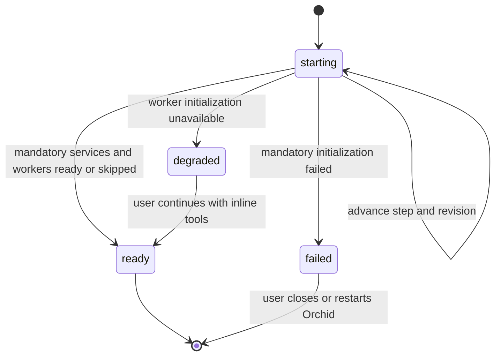
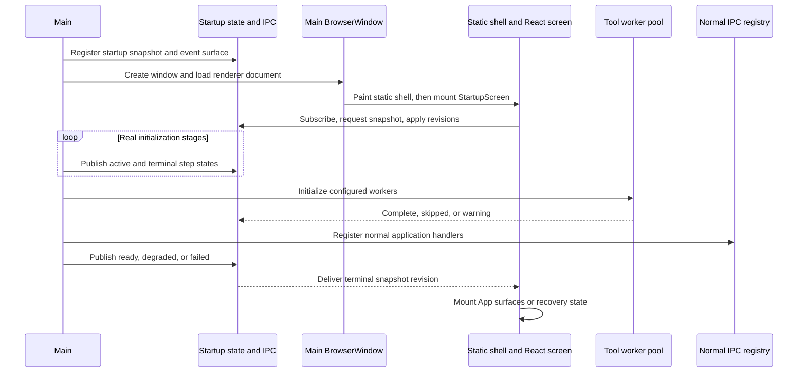

# Progressive Startup Screen - Plan

## Goal Capsule

- **Objective:** Replace Orchid's blank startup interval with an immediate screen that reports real initialization steps and hands off to the application only when startup has settled.
- **Authority:** The Product Contract owns visible stages, failure behavior, and readiness. The Planning Contract owns IPC, state hydration, and lifecycle ordering.
- **Execution profile:** Three dependency-ordered units: establish the startup contract, build the two-layer startup UI, then reorder and instrument main-process initialization.
- **Stop conditions:** Stop if normal renderer code can call an unregistered IPC handler, startup progress can miss a terminal state, or a worker can survive application shutdown.
- **Tail ownership:** Finish with targeted tests, Electron quality gates, and packaged cold, warm, degraded, and failure startup checks.

## Product Contract

### Summary

Open Orchid's main window early and show a branded startup experience in that same window. Replace the static first-paint shell with a React screen that hydrates current startup state and follows live progress. Include tool-worker initialization as a truthful step, while preserving Orchid's ability to continue with inline tool execution if workers are disabled or unavailable.

### Problem Frame

`electron/src/main/index.ts` currently completes configuration, provider, definition, tool, subagent, and worker-pool initialization before creating the window. The worker pool is not required for LLM calls: `electron/src/main/llm/tool-dispatch.ts` executes eligible handlers inline when `getToolWorkerPool()` returns `null`. The pool improves responsiveness for CPU-heavy tools, but its readiness can take several seconds because each worker has a five-second readiness timeout.

After the window exists, `electron/src/renderer/index.html` still leaves `#root` empty until React mounts and places a remote Google Fonts stylesheet in the render path. The result is a launch interval with little trustworthy feedback even though the application is performing identifiable work.

### Requirements

**Immediate feedback and progress**

- R1. The existing main window must paint a dependency-free Orchid shell as soon as Electron can load the renderer document.
- R2. React must replace the static shell with a startup screen that shows the current step and the completed, active, skipped, warning, or failed state of each startup step.
- R3. The visible step sequence must represent real work: opening the window, loading settings and providers, loading agents and tools, starting tool workers, and preparing the application interface.
- R4. The screen must use an accessible live status, avoid fake percentages, respect reduced-motion preferences, and paint without waiting for a network resource.
- R5. The native window, static shell, and React startup screen must share the canonical default background so the handoffs do not flash between colors.

**Readiness and recovery**

- R6. ChatView, config hydration, onboarding checks, and other normal renderer IPC consumers must not mount or invoke until mandatory startup services and the normal IPC registry are ready.
- R7. Tool-worker initialization must be visible as a startup step and must settle before the normal application opens.
- R8. A configured worker pool that starts successfully must complete its step; a pool size of zero must mark the step skipped; a failed pool must mark the step warning and offer entry to Orchid's existing inline-execution mode.
- R9. A fatal mandatory-service failure must replace the loading state with an error state and restart guidance instead of leaving an indefinite spinner or immediately hiding the failure through process exit.

**State delivery and diagnostics**

- R10. A renderer that subscribes after one or more steps have completed must converge on the latest startup snapshot and apply only increasing revisions without missing or replaying transitions.
- R11. Local startup logs must record monotonic duration and outcome data for each step without adding telemetry, user configuration, or sensitive values.

### Acceptance Examples

- AE1. **Covers R1-R5.** Given a normal packaged launch, when Electron creates the main window, then the static Orchid shell paints without a blank or color-flash frame and transitions to the progressive React startup screen.
- AE2. **Covers R3, R7.** Given worker startup takes several seconds, when the user watches startup, then “Starting tool workers” is active until the pool reports ready and the application opens afterward.
- AE3. **Covers R8.** Given the worker pool is disabled, when startup reaches that step, then it is shown as skipped and Orchid opens normally.
- AE4. **Covers R8.** Given worker initialization fails, when the attempt settles, then the step shows a warning explaining that Orchid can continue with potentially less-responsive local tools and provides a Continue action.
- AE5. **Covers R6, R10.** Given progress changes while the renderer subscribes and requests its snapshot, when both deliveries settle, then it renders the highest revision and does not invoke normal application IPC early.
- AE6. **Covers R9, R11.** Given mandatory initialization throws, when the failure is recorded, then the startup screen shows restart guidance and the local log identifies the failed step without exposing secrets.

### Scope Boundaries

- Do not create a second splash `BrowserWindow`.
- Do not make the tool pool a prerequisite for LLM availability; degraded mode keeps the existing inline fallback.
- Do not add a fake progress percentage, rotating marketing copy, remote startup assets, or telemetry.
- Do not expose low-level module names, provider credentials, filesystem paths, or exception text in user-facing startup copy.
- Do not redesign ChatView, onboarding, or settings beyond gating their mount until startup readiness.
- Exact matching of every saved custom theme before config hydration is deferred; startup uses the canonical default theme.

## Planning Contract

### Key Technical Decisions

- KTD1. **Use two startup layers in the existing main window.** `electron/src/renderer/index.html` owns the dependency-free first paint; a focused React `StartupScreen` owns hydrated steps, warnings, and failures until the application is ready. (session-settled: user-approved — chosen over a blank window or a separate splash window: the same-window sequence gives visible progress without focus and window-lifetime handoff problems.)
- KTD2. **Model startup as a main-owned revisioned snapshot.** Main is the sole writer of ordered step state and monotonic timings. The renderer subscribes before requesting a snapshot, then rejects any event at or below its revision floor so no transition is lost or replayed out of order. A narrow acknowledgement invoke lets the degraded screen request the valid `degraded` to `ready` transition without creating renderer-owned startup state.
- KTD3. **Expose only startup snapshot and change events before normal readiness.** Register the startup IPC surface before creating the window. Gate every normal renderer subtree and effect until `registerAllIPC()` has completed and main publishes `ready` or the user acknowledges `degraded`.
- KTD4. **Treat the worker pool as readiness work with a recoverable warning.** Wait for the configured pool attempt to settle and show its status. Success uses workers, disabled skips the step, and failure requires a one-time Continue action into the existing inline fallback rather than misreporting that LLM features are unavailable.
- KTD5. **Use fixed step states, not inferred percentages.** Each step is `pending`, `active`, `complete`, `skipped`, `warning`, or `failed`; overall startup is `starting`, `ready`, `degraded`, or `failed`. User-facing labels are fixed and sanitized while detailed errors remain in local logs.
- KTD6. **Keep first paint independent of remote fonts.** Load the existing Google Fonts enhancement without blocking the shell. Static and React startup layers use packaged assets and system-font fallbacks when the request is slow, offline, or unavailable.
- KTD7. **Keep the window visible during startup.** Align `BrowserWindow.backgroundColor` with the renderer fallback rather than waiting for `ready-to-show`. Electron recommends an immediate window with a matching background for complex applications where delaying visibility can itself feel slow. See [Electron BrowserWindow: showing the window gracefully](https://www.electronjs.org/docs/latest/api/browser-window#showing-the-window-gracefully).

### High-Level Technical Design

These diagrams are directional lifecycle guidance, not implementation syntax.

### Sequencing

U1 establishes the state and IPC contract so both processes share one vocabulary. U2 builds the static and React consumers without mounting normal application effects. U3 moves real startup work behind the early window, publishes every step, and preserves shutdown and fallback semantics.

### Risks and Safeguards

- **An event can arrive between subscription and snapshot resolution.** KTD2 uses monotonic revisions and stale-event rejection rather than assuming request ordering.
- **Normal renderer hooks can call IPC before registration.** KTD3 gates mounting and bootstrap effects, not only visual presentation.
- **Worker initialization can finish after quit begins.** U3 makes the pool module own ready and initializing candidates so disposal cannot miss either state.
- **A loading screen can hide a permanent startup failure.** R9 defines a terminal failure state with restart guidance and keeps detailed errors in local logs.
- **Synchronous main-process work can make visible steps appear to jump.** U3 publishes the active state and yields one event-loop turn before substantial synchronous work, without adding fixed dwell times or delaying readiness.
- **A remote font request can negate first paint.** KTD6 makes font enhancement non-blocking and treats system fonts as the startup baseline.
- **Development timing is not representative of a release.** Vite startup and automatic DevTools affect development launches, so acceptance relies on packaged cold and warm checks.

## Implementation Units

### U1. Add the typed startup state and IPC contract

- **Goal:** Provide one main-owned, revisioned source of startup steps, outcomes, and durations that late renderer subscribers can hydrate safely.
- **Requirements:** R3, R10, R11
- **Dependencies:** None
- **Files:**
  - Add `electron/src/main/startup.ts`.
  - Add `electron/src/main/ipc/startup.ts`.
  - Modify `electron/src/shared/types/ipc-boundary.ts`.
  - Modify `electron/src/shared/types/ipc.ts`.
  - Modify `electron/src/preload/index.ts`.
  - Add `electron/tests/unit/startup-state.test.ts`.
  - Add `electron/tests/unit/startup-ipc.test.ts`.
- **Approach:** Define the fixed steps and terminal phases from R3 and KTD5. Store a full immutable snapshot with a monotonic revision and monotonic per-step timings. Expose a no-input snapshot invoke, a degraded-mode acknowledgement invoke, and a typed change event. Accept acknowledgement only from `degraded` and let main publish the resulting `ready` revision. Register and unregister this narrow handler separately from `registerAllIPC()` so it exists before the window. Validate invoke results and event payloads in preload before exposing `window.orchid.startup.snapshot()`, `continueDegraded()`, and `onChanged()`.
- **Test scenarios:**
  - Valid step transitions increment the revision, preserve fixed ordering, and calculate durations from a controlled monotonic clock.
  - Invalid regressions, duplicate terminal transitions, and updates after `ready` or `failed` are rejected without corrupting the snapshot.
  - A disabled, successful, and failed worker attempt maps to skipped, complete, and warning states respectively.
  - A late snapshot returns every earlier completed step and the current active or terminal phase.
  - The startup IPC accepts no renderer payload and returns the current snapshot.
  - Degraded acknowledgement is rejected in every other phase and advances `degraded` to `ready` exactly once.
  - Preload drops malformed snapshots or events and removes event listeners cleanly.
- **Verification:** Unit tests prove state transitions, revision ordering, hydration, validation, and monotonic timing without loading Electron's full application entry point.

### U2. Build the first-paint and progressive startup UI

- **Goal:** Show immediate branded feedback, then truthful step-by-step progress, degraded recovery, or fatal failure without mounting normal application consumers early.
- **Requirements:** R1-R6, R8-R10
- **Dependencies:** U1
- **Files:**
  - Modify `electron/src/renderer/index.html`.
  - Add `electron/src/renderer/components/StartupScreen.tsx`.
  - Modify `electron/src/renderer/App.tsx`.
  - Modify the appropriate startup surface stylesheet under `electron/src/renderer/styles/` only if primitives and inline utilities are insufficient.
  - Add `electron/tests/unit/startup-screen.test.tsx`.
  - Modify `electron/tests/integration/app-shell.test.ts`.
  - Trim any newly obsolete renderer-style baseline entry in `electron/tests/integration/renderer-style-contract.test.ts` if the touched call sites remove one.
- **Approach:** Seed `#root` with a local icon, product name, and generic status before the module script. Keep critical shell CSS inline, background-aligned, reduced-motion safe, and independent of the remote font stylesheet. On React mount, subscribe to startup events before requesting the snapshot and apply only increasing revisions. Render the fixed step list with existing Orchid primitives such as `StateMessage`, `Spinner`, `StatusBadge`, and `Button`. Convert ChatView to a lazy import so its dependency graph does not delay the progressive startup screen; begin loading and mounting it only after startup reaches `ready`. Start config/onboarding effects at the same gate. For `degraded`, explain inline fallback and call the acknowledgement invoke from Continue; for `failed`, show restart guidance without raw exception text.
- **Test scenarios:**
  - The static shell exists before the module script, uses packaged assets, exposes status semantics, and does not wait for Google Fonts.
  - The React screen renders pending, active, complete, skipped, warning, and failed step states with one clear current status.
  - Snapshot/event races cannot regress a newer revision or duplicate a terminal transition.
  - `ready` mounts the existing application once and removes all startup markup.
  - `degraded` does not load or mount normal effects until Continue advances the main-owned snapshot to `ready`, then enters Orchid with inline tools.
  - `failed` never mounts ChatView and shows restart guidance without sensitive details.
  - Keyboard and screen-reader behavior is correct for live updates and the Continue action; reduced motion disables decorative animation.
- **Verification:** Component tests cover the state matrix and mount gate. App-shell and style-contract tests cover static markup, non-blocking resources, background alignment, primitive use, and the renderer root handoff.

### U3. Publish real startup stages from the application lifecycle

- **Goal:** Create the window before long initialization, report each real step, include worker readiness, and publish a safe terminal state.
- **Requirements:** R3, R6-R11
- **Dependencies:** U1, U2
- **Files:**
  - Modify `electron/src/main/index.ts`.
  - Modify `electron/src/main/llm/tool-pool.ts`.
  - Modify `electron/src/main/ipc/index.ts` only if shared unregister ordering needs an explicit startup hook.
  - Add `electron/tests/unit/tool-pool-lifecycle.test.ts`.
  - Modify `electron/tests/integration/app-shell.test.ts`.
- **Approach:** After Electron readiness, initialize file logging, register startup IPC, create the window, and begin loading the renderer. Advance sanitized stages around existing config/provider setup, definition/tool setup, worker initialization, and normal IPC registration. Yield one event-loop turn after activating a stage before substantial synchronous work so the renderer can present the update; do not add minimum display timers. Return an explicit pool outcome so disabled and unavailable states are distinguishable. Keep `getToolWorkerPool()` null until full readiness, retain inline fallback, and track a single in-flight candidate so quit disposes initializing or ready workers exactly once. Publish `ready` only after `registerAllIPC()`; publish `degraded` for pool failure; publish `failed` for mandatory initialization errors while keeping the window available to explain the failure.
- **Test scenarios:**
  - Startup IPC registration and window loading occur before settings/provider and worker initialization.
  - Each lifecycle block publishes the expected active and terminal step in order.
  - Stage activation yields for presentation without fixed-delay timers controlling readiness.
  - Normal application IPC is registered before `ready` or `degraded` is published.
  - Pool size zero publishes skipped and reaches `ready` without constructing workers.
  - Slow worker initialization remains visible and normal application consumers stay gated.
  - Worker failure publishes warning/degraded while `getToolWorkerPool()` remains null for inline fallback.
  - Mandatory initialization failure publishes failed, logs the detailed error, and does not mount normal application surfaces.
  - Concurrent initialization requests do not create duplicate pools.
  - Quit during initialization and quit after readiness each dispose the candidate or ready pool once within the existing shutdown deadline.
- **Verification:** Lifecycle tests prove publication order, normal-IPC gating, pool outcomes, and shutdown races. Packaged logs show each monotonic step and match the statuses presented by the startup screen.

## Verification Contract

| Gate | Command or check | Proves |
|---|---|---|
| Targeted behavior | `npx vitest run tests/unit/startup-state.test.ts tests/unit/startup-ipc.test.ts tests/unit/startup-screen.test.tsx tests/unit/tool-pool-lifecycle.test.ts tests/integration/app-shell.test.ts` from `electron/` | State hydration, UI states, IPC validation, lifecycle ordering, pool fallback, and shutdown safety |
| Type safety | `npm run typecheck` from `electron/` | Shared startup contracts and renderer/main consumers agree |
| Style and conventions | `npm run lint` from `electron/` | TypeScript, React, accessibility, and renderer conventions hold |
| Production build | `npm run build` from `electron/` | Static assets, preload API, main process, and progressive renderer package correctly |
| Regression suite | `npm run test` from `electron/` | Existing startup, worker, IPC, provider, session, and renderer behavior remains intact |
| Runtime smoke | Launch a packaged artifact under normal, pool-disabled, forced-pool-failure, and forced-mandatory-failure conditions | Visible steps are truthful, readiness gates correctly, degraded mode works, fatal failure is explained, and quit leaks no worker |

## Definition of Done

- Orchid paints a static startup shell in the existing main window before React is ready.
- The React startup screen displays the current real step and settled statuses without fake progress or network-dependent first paint.
- The native, static, and React backgrounds transition without a visible color flash.
- ChatView, config hydration, onboarding, and other normal IPC consumers do not run before the normal IPC registry is ready.
- Tool-worker startup appears as a step; success, disabled, and unavailable outcomes are distinguishable.
- Worker unavailability never disables LLM use and degraded Continue enters the existing inline tool path.
- Fatal initialization shows restart guidance instead of an indefinite loading state or raw exception text.
- Snapshot hydration and revision gating prevent missed, stale, or out-of-order progress.
- Local logs report monotonic step durations and outcomes without sensitive data or telemetry.
- Quit during worker initialization and after readiness disposes all workers within the current shutdown deadline.
- Targeted tests, typecheck, lint, production build, full tests, and packaged startup smoke checks pass.
- The final diff contains no abandoned startup experiments, duplicate state sources, primitive-style drift, or unrelated renderer redesign.
