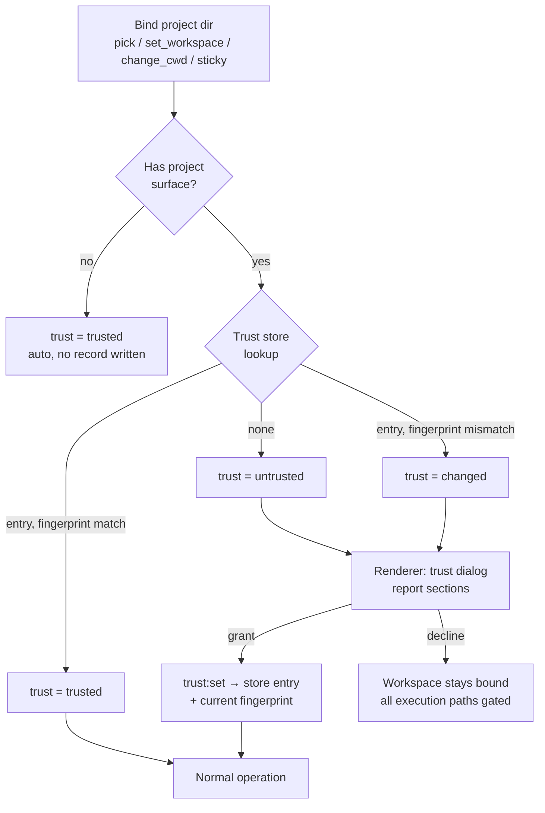

# feat: Add trusted projects gating

## Summary

Add a per-machine trusted-projects system: when a project directory with a project surface (`.orchid.json`, `.orchid/` definitions, or root AGENTS.md aliases) is first opened, Orchid shows a trust dialog listing everything that differs from the home/global configuration — MCP servers, permission rules, project agents/skills/personalities, config overrides — and only starts MCP servers and project services after the user grants trust. Trust is persisted, fingerprinted against the security surface, re-confirmed when that surface changes, and revocable from settings.

---

## Problem Frame

Binding a project directory today executes project-supplied content with no consent step. `bindProjectDirectory()` (`electron/src/main/ipc/session.ts`) accepts any valid directory; `ProjectRuntimeRegistry.get()` (`electron/src/main/project/runtime.ts`) then merges `.orchid.json` over home config, overlaying project agents/skills/personalities. A project can set `permissions` (including `allow` for execution tools, applied via `electron/src/main/permissions/resolver.ts` with source `project-config`), disable AGENTS.md write enforcement, and declare `mcp_servers` that spawn processes. MCP servers start lazily but unsolicited — even opening the sidebar MCP panel (`electron/src/main/ipc/mcp.ts`) calls `ProjectMCPManagerRegistry.get()` (`electron/src/main/mcp/project-registry.ts`), which runs `startAll()`. The sticky `default_project_dir` rebinds at startup without user action, so gating must live on resolution and service paths, not only in the folder picker.

---

## Requirements

**Trust lifecycle**

- R1. Opening a project with a project surface prompts for trust before any MCP server starts or project service runs for it.
- R2. The prompt lists the project surface that differs from home/global: MCP servers (added vs overriding), permission rules, AGENTS.md policy changes, model overrides, other config overrides, project agents/skills/personalities, and root instruction files.
- R3. Projects with no project surface (no `.orchid.json`, no `.orchid/` definitions, no root AGENTS.md alias) are trusted automatically without prompting.
- R4. Trust decisions persist across restarts keyed by canonical absolute path.
- R5. When a trusted project's security surface changes, its state becomes `changed` and requires re-confirmation before services run again.
- R6. Trust is revocable from settings; revocation stops the project's services and blocks new activity for it.

**Execution gating**

- R7. While untrusted, `chat:send` fails with structured kind `untrusted_project`.
- R8. While untrusted, no MCP server for the project starts — including the `mcp:status` sidebar path.
- R9. While untrusted, renderer `tool:execute`, RAG indexing, and AST indexing are rejected; definitions listing returns home-only definitions.
- R10. Subagent turns inherit the trust posture of their parent's captured runtime; they never prompt independently.

**UI**

- R11. Workspace info exposes trust state so any surface can badge an untrusted project.
- R12. The trust dialog opens after binding an untrusted project and on `untrusted_project` send failures.
- R13. Settings provides a trusted-projects panel listing entries with revoke actions.

---

## Key Technical Decisions

- **Separate store at `~/.orchid/trusted_projects.json`:** mirrors the `providers.json` precedent (secrets/records live apart from layered config), keeps `config:save` merge semantics untouched, and never lets a project `.orchid.json` influence its own trust record.
- **Bind-then-gate, not block-bind:** workspace resolution keeps working for navigation and the sticky default may still resolve at startup; every execution path enforces trust. Blocking bind would complicate startup, drafts, and multi-window flows for no security gain.
- **Fingerprint over the security surface only:** hash of `.orchid.json` bytes + listing/hashes of `.orchid/{agents,skills,personalities}` + root AGENTS.md alias contents. Not the whole tree — cheap to compute, and detects the meaningful case (a pull adding servers/permissions/instructions) without false positives from ordinary code changes.
- **`trust` field on `WorkspaceInfo`, not a new `status` value:** `status` keeps directory-usability semantics (`unbound | valid | missing`) and `isWorkspaceBound()` behavior is unchanged; trust is an orthogonal policy dimension.
- **Dormant MCP manager for untrusted projects:** `ProjectMCPManagerRegistry.get()` returns a manager with no servers started; `getStatus()`/`getTools()` stay safe for any lease holder. Granting trust needs no migration — the next `get()` starts servers normally.
- **Single resolution point:** trust state attaches in `resolveWorkspaceFromParts()` (`electron/src/main/project/workspace.ts`) so every window and IPC path sees one answer.
- **Revocation reuses existing invalidation machinery:** `getProjectRuntimeRegistry().invalidate()`, `invalidateProjectMCPManagers()` (lease-aware shutdown), and `forceStopSession()` — the same pattern workspace rebind already uses.
- **Auto-trust bare projects (R3):** the dialog exists to disclose project-supplied behavior; with nothing project-supplied there is nothing to disclose, and universal prompting trains users to click through.

---

## High-Level Technical Design

**Gate matrix (while trust ≠ trusted):**

| Path | Behavior |
|---|---|
| `chat:send` (`ensureActiveSession`, `electron/src/main/ipc/chat/session.ts`) | Reject `kind: 'untrusted_project'` |
| MCP start (`ProjectMCPManagerRegistry.get`, `electron/src/main/mcp/project-registry.ts`) | Dormant manager, no `startAll()` |
| `mcp:status` (`electron/src/main/ipc/mcp.ts`) | Empty status via dormant manager |
| `tool:execute` (`electron/src/main/ipc/tool.ts`) | Terminal error `untrusted_project` |
| RAG index/clear (`electron/src/main/ipc/rag.ts`) | Reject; status returns empty |
| AST index (`electron/src/main/ipc/ast.ts`) | Reject; status returns empty |
| `definitions:list` (`electron/src/main/ipc/definitions.ts`) | Home-only definitions |
| `session:create` (`electron/src/main/ipc/session.ts`) | Reject with guidance to trust first |
| Subagent turns (`electron/src/main/agents/subagent-runner.ts`) | Inherit parent runtime — no change |

---

## Scope Boundaries

**In scope:** trust store, fingerprinting, report diffing, all execution gates, trust IPC, dialog, workspace badge, settings management panel, schema/type updates, tests, docs.

**Out of scope:**

- Per-window or per-session trust granularity (store is per-machine).
- Trust inheritance across directory hierarchies (parent/child dirs are independent entries).
- Per-MCP-server opt-in within a trusted project.
- Content signing or provenance verification of project files.
- Provider connections (already home-scoped; project config cannot create them).
- Changing the existing tool-permission approval UI.

---

## Implementation Units

### Phase A — Foundation

### U1. Shared types, schemas, and IPC channels

- **Goal:** One typed contract for trust state across main/preload/renderer.
- **Requirements:** R4, R11, R12
- **Dependencies:** none
- **Files:**
  - `electron/src/shared/types/ipc.ts` (modify — `WorkspaceInfo.trust`, `TrustState`, `ProjectTrustReport`, `ProjectTrustSetMessage`, `ChatSendErrorKind += 'untrusted_project'`, new `IPC_CHANNELS` entries)
  - `electron/src/shared/types/ipc-schemas.ts` (modify — extend `sessionWorkspaceChangedEventSchema`, `chatSendErrorKindSchema`; add trust report/set schemas)
  - `electron/src/main/ipc/payload-schemas.ts` (modify — zod payload schemas for trust handlers)
- **Approach:** `TrustState = 'trusted' | 'untrusted' | 'changed'` as an optional-with-default field on `WorkspaceInfo` so existing producers stay compilable while U3 wires real values. Channels: `project:trust_get` (report for a cwd), `project:trust_set` (grant/revoke), `project:trust_changed` (push event, all windows). Add both invoke channels to `ALLOWED_INVOKE_CHANNELS` and the event to `ALLOWED_EVENT_CHANNELS`.
- **Patterns to follow:** existing `WorkspaceInfo` / `ChatSendResult` definitions and their zod mirrors in `ipc-schemas.ts`.
- **Test scenarios:**
  - Schema round-trip: workspace event with each trust state parses.
  - `chatSendResultSchema` accepts `untrusted_project` kind.
  - Trust report schema rejects malformed sections.
- **Verification:** `npm run typecheck` and `npm run lint` clean from `electron/`; schema unit tests pass.

### U2. Trust store, fingerprint, and report module

- **Goal:** Main-process source of truth for trust decisions and the diff report.
- **Requirements:** R2, R3, R4, R5
- **Dependencies:** none
- **Files:**
  - `electron/src/main/project/trust.ts` (create)
  - `electron/tests/unit/project-trust-store.test.ts` (create)
  - `electron/tests/unit/project-trust-report.test.ts` (create)
- **Approach:**
  - Store: JSON map `canonicalPath → { trustedAt, fingerprint }`, read/written with `atomicWriteJson` (0600), in-memory cache, injectable file path for tests (mirror `ProjectRuntimeRegistryOptions` in `electron/src/main/project/runtime.ts`).
  - Surface detection: `.orchid.json` exists, `.orchid/{agents,skills,personalities}` contain loadable definitions, or any configured root AGENTS.md alias exists. No surface → trusted without a store entry.
  - Fingerprint: sha256 over `.orchid.json` raw bytes + sorted relative-path listing with per-file hashes (size-capped; oversized files recorded by size) + root alias file hashes. Compute lazily, cache briefly per canonical path.
  - API: `getProjectTrustState(dir)`, `grantProjectTrust(dir)`, `revokeProjectTrust(dir)`, `buildProjectTrustReport(dir)`, `listTrustedProjects()`.
  - Report diffing reads the raw project layer (reuse the `readConfigLayer`/`readPermissionLayer` approach from `electron/src/main/ipc/permission.ts`) and home-effective config (`electron/src/main/config/loader.ts`): MCP servers added vs overriding (command/url, args, env keys only — never env values), permission entries with auto-allow highlighting, `agents_md` field diffs, `default_model`/`tier_models` overrides, remaining overridden keys, project definition names (new vs shadowing home via `readAgents`/`readSkills`/`readPersonalities` with project-only passes), root instruction files present.
- **Patterns to follow:** `ProjectRuntimeRegistry` structure; `atomicWriteJson` usage in `electron/src/main/project/workspace.ts` (`updateStickyDefaultProjectDir`).
- **Test scenarios:**
  - Grant persists and survives reload; keys canonicalize (symlinked path maps to same entry).
  - Bare project → `trusted` with no entry written.
  - Fingerprint flips state to `changed` when `.orchid.json`, a definition file, or root AGENTS.md changes; unrelated file changes do not.
  - Report: added vs overriding MCP server entries; permission rule `allow` flagged; `agents_md.enforce_on_write: off` surfaced; project agent shadowing a home name marked as override.
  - Corrupt/missing store file loads as empty without throwing.
- **Verification:** unit tests pass; no global state leaks (tests use injected paths).

### Phase B — Main-process enforcement

### U3. Trust state in workspace resolution

- **Goal:** Every `WorkspaceInfo` carries trust state.
- **Requirements:** R11
- **Dependencies:** U1, U2
- **Files:**
  - `electron/src/main/project/workspace.ts` (modify — `resolveWorkspaceFromParts`, `resolveWorkspace`)
  - `electron/src/main/session/singleton.ts` (modify if needed for re-export)
  - `electron/tests/unit/workspace-trust-resolution.test.ts` (create)
- **Approach:** after directory inspection succeeds, attach `trust` from the trust store (`trusted` auto for bare projects). Keep `status`/`isWorkspaceBound` semantics untouched. Emit updated workspace events after grant/revoke (U5 owns the handlers; this unit only makes resolution correct).
- **Patterns to follow:** existing inspection-then-attach shape in `resolveWorkspaceFromParts`.
- **Test scenarios:**
  - Valid bound dir, untrusted → `status: 'valid'`, `trust: 'untrusted'`, still workspace-bound.
  - Sticky default resolves untrusted at simulated startup.
  - Grant flips subsequent resolution to `trusted` without rebinding.
- **Verification:** unit tests pass; existing workspace tests unchanged in expectations except new field.

### U4. Execution gates

- **Goal:** No project code, servers, or services run while trust ≠ trusted.
- **Requirements:** R1, R6, R7, R8, R9, R10
- **Dependencies:** U2, U3
- **Files:**
  - `electron/src/main/ipc/chat/session.ts` (modify — `ensureActiveSession` gate + `untrusted_project` result)
  - `electron/src/main/mcp/project-registry.ts` (modify — dormant manager when untrusted)
  - `electron/src/main/ipc/tool.ts` (modify — reject in `resolveToolExecuteContext`)
  - `electron/src/main/ipc/rag.ts`, `electron/src/main/ipc/ast.ts` (modify — reject index/clear; empty status)
  - `electron/src/main/ipc/definitions.ts` (modify — home-only when untrusted)
  - `electron/src/main/ipc/session.ts` (modify — `SESSION_CREATE` rejection; revoke flow helper exports)
  - `electron/tests/integration/trusted-project-gates.test.ts` (create)
- **Approach:**
  - Central guard: trust check keyed by canonical dir, consulted at each gate; no gate reads the store file directly.
  - `ensureActiveSession` rejects after `boundCwd` resolution, before runtime load.
  - MCP registry: when untrusted, create the manager entry without `startAll()`; grant needs no special handling; revoke calls `invalidateProject(dir)` for lease-aware shutdown and `forceStopSession()` for sessions bound to the dir (same pattern as intentional rebind in `electron/src/main/ipc/session.ts`).
  - Subagent runner untouched — it consumes the parent's captured runtime.
- **Patterns to follow:** existing `unbound_workspace` gate in `ensureActiveSession`; `invalidateProjectMCPManagers` lease handling in `electron/src/main/mcp/project-registry.ts`.
- **Test scenarios:**
  - `ensureActiveSession` returns `untrusted_project` for untrusted dir and succeeds after grant.
  - MCP registry never calls `startAll` while untrusted (spy transport layer or server map); starts after grant on next `get()`.
  - `mcp:status` returns empty without starting servers.
  - `tool:execute`, RAG index, AST index reject with clear errors; definitions list omits project overlays.
  - Revoke: running MCP managers for the dir shut down once leases drop; in-flight session for the dir force-stopped.
  - Mid-turn trust revocation does not corrupt an already-captured runtime's completion path.
- **Verification:** integration tests pass; `npm run test` green.

### U5. Trust IPC handlers and preload surface

- **Goal:** Renderer can fetch reports, grant/revoke trust, and observe changes.
- **Requirements:** R5, R6, R12
- **Dependencies:** U1, U2, U3
- **Files:**
  - `electron/src/main/ipc/trust.ts` (create)
  - `electron/src/main/ipc/index.ts` (modify — register/unregister)
  - `electron/src/preload/index.ts` (modify — `window.orchid.projectTrust` namespace)
  - `electron/tests/integration/trust-ipc.test.ts` (create)
- **Approach:** handlers validate payloads via U1 schemas. `trust_get` returns `{ state, report }` for a cwd (report null when trusted-and-unchanged to keep payloads light). `trust_set` grants (writing current fingerprint) or revokes (U4 revoke flow), then broadcasts `project:trust_changed` and re-emits `session:workspace_changed` to every window whose resolved workspace targets the dir. Preload namespace: `get(cwd)`, `set({ cwd, trusted })`, `onChanged(cb)` using the existing `invoke`/`onParsed` helpers.
- **Patterns to follow:** `ipc/permission.ts` handler registration; preload `session` namespace shape.
- **Test scenarios:**
  - Grant → store entry with current fingerprint; workspace event reflects `trusted`.
  - Revoke → state flips, event broadcast, MCP invalidation triggered.
  - Invalid payloads rejected at zod boundary.
  - Report for a changed project includes the updated surface sections.
- **Verification:** integration tests pass; preload exposes typed surface (`typecheck` clean).

### Phase C — Renderer

### U6. Trust dialog and triggers

- **Goal:** Users see the surface diff and decide; gates surface as the dialog, not raw errors.
- **Requirements:** R2, R12, R11
- **Dependencies:** U5
- **Files:**
  - `electron/src/renderer/components/TrustProjectDialog.tsx` (create)
  - `electron/src/renderer/hooks/useTrustPrompt.ts` (create — shared prompt state: subscribe to workspace-changed + `project:trust_changed`, expose `openFor(cwd)` / resolve-on-grant)
  - `electron/src/renderer/hooks/useSession.ts` (modify — consume `workspace.trust`, open dialog after bind, re-resolve on grant)
  - `electron/src/renderer/hooks/useChat.ts` (modify — map `untrusted_project` send failure to dialog)
  - `electron/src/renderer/components/ChatView.tsx` (modify — dialog mount; workspace badge wiring)
  - `electron/src/renderer/components/Onboarding/OnboardingScreen.tsx` (modify — onboarding picks via the raw preload API, not `useSession`, so it checks the returned `trust` state and mounts the same dialog)
  - `electron/src/renderer/components/LeftSidebar.tsx` / `electron/src/renderer/components/session-header.tsx` (modify — untrusted badge)
  - `electron/tests/integration/renderer-style-contract.test.ts` (modify if new composite styles are added)
- **Approach:** dialog built on `DialogSurface` (`electron/src/renderer/components/ui/DialogSurface.tsx`) with primitive-only controls (Button, Alert, StatusBadge); sections per report area with auto-allow permission rules visually highlighted; primary "Trust & Continue", secondary "Don't Trust". A single `useTrustPrompt` hook owns prompt state so every mount point behaves identically; it watches workspace-changed and `project:trust_changed` events and opens for any cwd resolving `trust !== 'trusted'`. Mount points: `ChatView` (picker, `set_workspace`, ConfigView/AnalyticsView paths via `useSession`), `OnboardingScreen` (its pick calls `window.orchid.session.pickProjectDir()` directly and bypasses `useSession`, so it inspects the returned `WorkspaceInfo` and mounts the dialog itself), send-failure mapping in `useChat`, and badge click. Startup with an untrusted sticky default shows the badge only — no auto-modal at boot. `changed` state renders the same dialog with a "This project changed since you trusted it" banner.
- **Patterns to follow:** primitive-first styling contract (`electron/src/renderer/styles/README.md`); existing dialog usage of `DialogSurface`.
- **Test scenarios:**
  - Dialog opens after `pickProjectDir` resolves untrusted; grant re-resolves workspace to trusted.
  - Send failure `untrusted_project` opens dialog instead of rendering a raw error.
  - Onboarding pick of an untrusted project opens the dialog and blocks the wizard's project step until decided.
  - Decline leaves workspace bound-untrusted; composer send re-triggers the dialog.
  - Badge renders for `untrusted`/`changed` states only.
  - Style contract: no component roots in feature JSX; new styles land in `components.css` if needed.
- **Verification:** `npm run test` includes style-contract pass; manual smoke of pick → dialog → grant → MCP panel shows servers.

### Phase D — Management and docs

### U7. Settings trusted-projects panel

- **Goal:** Users can review and revoke trust without reopening each project.
- **Requirements:** R6, R13
- **Dependencies:** U5
- **Files:**
  - `electron/src/renderer/components/ConfigView.tsx` (modify — new panel/tab section)
  - `electron/src/renderer/components/Preferences/` (modify or add panel component consistent with existing tabs)
- **Approach:** list from `listTrustedProjects()` (path, trusted-at, `changed` marker when fingerprint mismatches); revoke button per row calling `projectTrust.set({ cwd, trusted: false })`; empty state guidance. Panel reuses the U6 dialog in read-only "review surface" mode for inspecting a listed project.
- **Patterns to follow:** existing ConfigView tab composition and primitives (`ConfigCard`, `Button`, `StateMessage`).
- **Test scenarios:**
  - List reflects store entries and live `changed` markers.
  - Revoke updates list state and broadcasts workspace change.
- **Verification:** panel renders in ConfigView; revoke flow exercised end-to-end in dev.

### U8. Documentation updates

- **Goal:** Keep institutional docs accurate for the new gate.
- **Requirements:** all (traceability)
- **Dependencies:** U4, U5, U6
- **Files:**
  - `AGENTS.md` (modify — Workspace / Session Cwd section: trust gating; config/store locations list: `~/.orchid/trusted_projects.json`)
  - `CONCEPTS.md` (modify — add Trusted Project, Trust Surface/Fingerprint concepts)
- **Approach:** short entries matching existing doc tone; note the gate matrix paths and the auto-trust rule for bare projects. Capture implementation learnings via `compound` after landing.
- **Verification:** docs review pass; no stale claims about unconditional project loading remain.

---

## Acceptance Examples

- AE1. First open of a project containing `.orchid.json` with one MCP server and `permissions.execute_command: "allow"`
  - **Trigger:** user picks the folder.
  - **Steps:** workspace binds with `trust: 'untrusted'`; dialog lists the server and the auto-allow rule; no server process exists yet (MCP panel empty). User grants; servers start on first turn; subsequent restarts skip the prompt.
  - **Covered by:** R1, R2, R4, R7, R8, R12
- AE2. Trusted project gains a new MCP server via a pull
  - **Trigger:** next workspace resolution after the file change.
  - **Steps:** state flips to `changed`; badge appears; send fails with the dialog; re-grant records the new fingerprint; services resume.
  - **Covered by:** R5, R11, R12
- AE3. Bare repository with no `.orchid.json`, `.orchid/`, or AGENTS.md aliases
  - **Trigger:** user picks the folder.
  - **Steps:** no dialog; workspace immediately usable; no store entry written.
  - **Covered by:** R3
- AE4. Revoke from settings while a session is running in that project
  - **Trigger:** user clicks revoke in the trusted-projects panel.
  - **Steps:** in-flight session force-stops, MCP managers retire as leases drop, next send fails gated, dialog reappears on next interaction.
  - **Covered by:** R6, R7, R8, R13

---

## Risks & Dependencies

| Risk | Mitigation |
|---|---|
| `WorkspaceInfo` shape change ripples through every `sessionWorkspaceChangedEventSchema` consumer; preload `onParsed` validation could drop events across versions | Land U1 schemas, U5 preload, and U6 renderer in one PR; make `trust` optional-with-default in zod so older payloads parse |
| Test suites that bind workspaces programmatically (`session:set_workspace`) break en masse | Bare-project auto-trust (R3) covers fixtures without `.orchid.json`; injectable trust-store path plus a fixture helper to pre-seed trust for suites that need project surfaces |
| Dormant manager edge cases for lease holders (a turn captures a runtime, trust is revoked mid-turn) | Revoke invalidates lazily via existing lease machinery; captured runtimes complete like the rebind flow does — no forced teardown mid-stream |
| Fingerprint cost on large `.orchid` trees | Size and file-count caps in hashing; oversized files fingerprint by size; report building reuses cached surface reads |
| Dialog fatigue trains users to click through | Auto-trust bare projects; dialog content is a concrete diff, not a generic warning |

---

## Deferred Implementation Notes

- Exact hash caps (per-file size limit, max file count) for fingerprinting — decide during U2 with real `.orchid` tree sizes in mind.
- Whether `changed` gets a distinct badge color or shares the untrusted badge with a dialog banner — renderer polish during U6.
- Report payload size guard if a project defines an extreme number of MCP servers/permissions — cap sections with an overflow note if ever needed.

---

## Sources / Research

- Binding choke point and revoke/rebind patterns: `electron/src/main/ipc/session.ts` (`bindProjectDirectory`, workspace handlers).
- Lazy runtime and definition overlay: `electron/src/main/project/runtime.ts`; registries under `electron/src/main/{agents,skills,personality}/registry.ts`.
- MCP lifecycle and lease machinery: `electron/src/main/mcp/project-registry.ts`, `electron/src/main/mcp/manager.ts`.
- Project-permission application: `electron/src/main/permissions/resolver.ts`; raw-layer reading precedent: `electron/src/main/ipc/permission.ts` (`readConfigLayer`, `readPermissionLayer`).
- Config layering and safe writes: `electron/src/main/config/loader.ts`, `electron/src/main/config/merge.ts`, `updateStickyDefaultProjectDir` in `electron/src/main/project/workspace.ts`.
- IPC allowlists and preload patterns: `electron/src/shared/types/ipc.ts`, `electron/src/preload/index.ts`.
- Dialog primitive and styling contract: `electron/src/renderer/components/ui/DialogSurface.tsx`, `electron/src/renderer/styles/README.md`.
