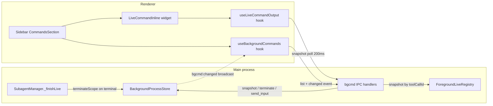

# feat: Live command visualization and user control

## Summary

Give users real-time visibility and control over agent commands: background and foreground `execute_command` calls stream live output in chat widgets, users can send single-line input to interactive (PTY) commands and terminate any command in their session, a new sidebar Commands section provides a session-wide fleet view, and subagent-owned background commands die with their subagent.

## Problem Frame

The migration requirements (F4/R11 in `docs/brainstorms/ts-electron-desktop-migration-requirements.md`) promised user termination of background commands and live terminal surfaces; the interface rework (`docs/plans/2026-07-08-003-feat-interface-rework-full-plan.md`) explicitly deferred both ("LiveCommandInline widget: deferred", "Background command output viewer (right panel live output)").

Today the pieces exist but are disconnected:

- `LiveCommandInline` + `useLiveCommandOutput` (200 ms poll of `bgcmd:snapshot`) work, but `ExecuteCommandRenderer` (`electron/src/renderer/components/ToolResults/registry.tsx`) gates them on `isLive` — tool-call running state. Background spawns return instantly, so the widget flips to a static `TerminalBackgroundResult` while the process keeps running for hours. Replayed sessions never show live output.
- Foreground commands show only "Running…" (`electron/src/renderer/components/ToolResults/ToolResultShell.tsx`) until completion; output is collected in-process and never streamed.
- `BackgroundProcessStore.takeOwnership()`/`releaseOwnership()` are dead code — `owner` can never become `'USER'`, so the agent-side `send_input` "control: USER" rejection is unreachable. There is no IPC for the user to send input or terminate a single command; the only user interrupt kills the entire session's commands via Esc phase 2.
- Subagent-owned background commands outlive their subagent indefinitely (LRU eviction only), invisible except as an aggregate count in session activity.

User decisions shaping this plan: foreground commands included; inline single-line input is sufficient (no xterm.js); subagent-owned commands die with the subagent; sidebar fleet panel in scope; no OS notifications.

## Requirements

**Visualization**

- R1. Background commands render live output in the chat widget while the process runs, including after the originating turn ends and in replayed sessions; the widget freezes on exit or unavailability.
- R2. Foreground commands render live output in their running tool block, replaced by the canonical stdout/stderr result on completion.
- R3. Interactive (PTY) command output renders without raw ANSI escape sequences in the display path; agent-visible tails are unchanged.
- R4. Live widgets resolve visibility against the owning session explicitly, never the window's active session fallback.

**User control**

- R5. Users can send single-line input to a running interactive background command from the widget; non-interactive and exited commands expose no input.
- R6. User input takes ownership; the agent `send_input` tool is rejected while `owner === 'USER'`; ownership releases explicitly or via the existing `background_command_idle_timeout` auto-release.
- R7. Users can terminate any background command in their session from the UI regardless of owning agent scope; agent-side `terminate_command` scope gating is unchanged.

**Fleet view and lifecycle**

- R8. The right sidebar exposes a Commands section listing the session's background commands across all agent scopes with status, owner, live output, input, and terminate.
- R9. When a subagent reaches any terminal state (completed, failed, interrupted), its owned background commands terminate.
- R10. All new IPC is Zod-validated, channel-allowlisted, and session-scoped; agent-visible semantics (result shapes, scope gating, prompt context) are unchanged.

## Key Technical Decisions

- **Unified live snapshot channel:** `bgcmd:snapshot` gains a discriminated target — exactly one of `commandId` (background store) or `toolCallId` (foreground live registry) — plus metadata (`interactive`, `owner`, `command`, `description`, `agentScopeId`). One IPC handler, one renderer hook, one widget for both command kinds.
- **Foreground mirroring is additive:** the foreground path keeps `readBounded` as the canonical authority (stdout/stderr separation, truncation, timeout kill). A side registry mirrors merged chunks into a `HeadTailBuffer` keyed by `toolCallId`, finalized on exit/timeout/abort, removed after a grace period and LRU-capped. No change to tool result semantics.
- **Widget liveness follows the process, not the tool call:** the renderer contract comment "replayed terminal results must not poll" is deliberately revised — replayed background results may poll until the first snapshot reports exited/unavailable, then stop. Long-dead sessions cost one snapshot per widget.
- **User IPC is session-privileged, agent tools stay scope-gated:** user control handlers check `entry.sessionId` only (any `agentScopeId` within the session), mirroring the existing `snapshotForSession` precedent. `send_input`/`terminate_command` tools keep `getVisible` scope gating.
- **`toolCallId` rides `ToolExecutionContext`:** `executeToolCall` already builds a fresh ctx per invocation (`electron/src/main/llm/tool-dispatch.ts`), so adding the call id there reaches the `execute_command` handler on agent, eager-executor, and renderer `tool:execute` paths without touching the handler signature.
- **Scope cleanup hangs off `_finishLive`:** all subagent terminal transitions (completed/failed/interrupted) funnel through `SubagentManager._finishLive` — one hook covers every path.
- **Sidebar list is push-refreshed:** a `bgcmd:changed` broadcast (reusing `subscribeBackgroundProcessChanges`) prompts the renderer hook to re-invoke `bgcmd:list`, following the `SESSION_ACTIVITY_CHANGED` broadcast convention.
- **No new config and no trust gate:** ownership auto-release reuses `background_command_idle_timeout`; new handlers operate only on processes already spawned under a trusted, bound session, matching existing `bgcmd:snapshot` posture.

## High-Level Technical Design

**Command kill matrix after this work**

| Trigger | Effect | Status |
|---|---|---|
| User Stop (widget/sidebar) | Single command, any scope in session | New (R7) |
| Subagent terminal transition | All commands owned by that scope | New (R9) |
| Esc phase 2 / chat:stop / rebind / trust revoke | All session commands (`terminateSession`) | Unchanged |
| LRU eviction at `max_background_processes` | Oldest evictable entries | Unchanged |
| App quit | `terminateAll` | Unchanged |

## Scope Boundaries

**In scope:** live output for background and foreground `execute_command`; single-line user input with ownership; per-command user termination; sidebar fleet section; subagent scope cleanup; session-explicit widget scoping; ANSI stripping in the display path.

**Out of scope:** OS completion notifications (explicitly excluded); xterm.js or full terminal emulation; user input to non-interactive commands (no stdin pipe exists); persistence of commands across app restart (store stays in-memory); changes to agent tool schemas or prompt context; foreground execution model changes.

## Implementation Units

### U1. Terminate subagent-owned commands on terminal transitions

- **Goal:** A subagent reaching any terminal state kills its owned background commands.
- **Requirements:** R9
- **Dependencies:** None.
- **Files:** `electron/src/main/tools/process/background-store.ts`, `electron/src/main/agents/manager.ts`, tests in `electron/tests/unit/subagent-command-cleanup.test.ts` (new).
- **Approach:** Add `terminateScope(sessionId, agentScopeId)` to `BackgroundProcessStore`, mirroring `terminateSession` filtered by scope. Invoke it from `_finishLive`, the single funnel for completed/failed/interrupted projections. Main-scope commands and peer subagent scopes are untouched.
- **Patterns to follow:** `terminateSession` in `background-store.ts`; existing `_finishLive` call sites in `manager.ts`.
- **Test scenarios:**
  - Completed/failed/interrupted subagent each trigger scope termination (processes receive SIGTERM, `exitCode` set).
  - Same-session entries of other scopes and of main are unaffected.
  - Commands spawned after the terminal transition under a recycled scope id are unaffected (no stale hook).
- **Verification:** New unit tests green; session activity `backgroundProcessCount` drops after a subagent ends while its command runs.

### U2. Foreground live output registry

- **Goal:** Foreground command output is observable live by `toolCallId` without changing canonical result semantics.
- **Requirements:** R2, R10
- **Dependencies:** None.
- **Files:** `electron/src/main/tools/process/foreground-live.ts` (new), `electron/src/main/tools/process/execute-command.ts`, `electron/src/main/tools/types.ts`, `electron/src/main/llm/tool-dispatch.ts`, `electron/src/main/ipc/tool.ts`, tests in `electron/tests/unit/execute-command-live-mirror.test.ts` (new) and `electron/tests/unit/execute-command-shell.test.ts`.
- **Approach:** New singleton registry mapping `toolCallId` → entry (`HeadTailBuffer`, `exitCode`, `sessionId`, `agentScopeId`, `command`, `startedAt`). The foreground spawn path registers an entry and appends each stdout/stderr chunk to both the existing bounded collectors and the live buffer; exit, inner timeout, and abort all finalize `exitCode`. Entries are removed after a grace period post-exit and LRU-capped. Add optional `toolCallId` to `ToolExecutionContext`, set from `request.id` in `executeToolCall` and from the generated call id in the renderer `tool:execute` handler. Provide `snapshotForeground(toolCallId, lastN)` and `dropSession`/`dropScope` helpers.
- **Patterns to follow:** `HeadTailBuffer` usage and singleton convention in `background-store.ts`; per-call ctx construction in `tool-dispatch.ts`.
- **Test scenarios:**
  - Live tail grows during execution and snapshots return it.
  - Canonical results unchanged: stdout/stderr separation, truncation, exit codes, inner timeout and abort kills.
  - Entries finalize on exit/timeout/abort; snapshots after exit return the exit code until grace removal, then report unavailable.
  - Registry cap evicts oldest entries; `dropSession`/`dropScope` remove matching entries.
  - `toolCallId` reaches the handler on agent and renderer dispatch paths.
- **Verification:** New and existing unit tests green; manual dev run shows a long foreground command streaming its tail.

### U3. User control and live snapshot IPC surface

- **Goal:** The renderer can list, snapshot, terminate, send input to, and release input on session commands through validated IPC.
- **Requirements:** R1, R4, R5, R6, R7, R10
- **Dependencies:** U2.
- **Files:** `electron/src/shared/types/ipc.ts`, `electron/src/main/ipc/payload-schemas.ts`, `electron/src/main/ipc/chat.ts`, `electron/src/preload/index.ts`, root `AGENTS.md` (architecture notes for the new IPC surface and kill matrix), tests in `electron/tests/unit/bg-command-ipc.test.ts` (new) and `electron/tests/unit/bg-idle-ownership.test.ts`.
- **Approach:** Extend `bgcmd:snapshot` to the discriminated target (exactly one of `commandId`/`toolCallId`) with the enriched response metadata. Add handlers: `bgcmd:list` (session-scoped entries across scopes, joined with subagent display names via `SubagentManager`), `bgcmd:send_input` (session-scoped lookup, requires interactive + running, writes via the store and takes ownership), `bgcmd:terminate` (session-scoped lookup, store terminate), `bgcmd:release_input` (release ownership), and a `bgcmd:changed` broadcast fed by `subscribeBackgroundProcessChanges`. Register all channels in `IPC_CHANNELS`, `ALLOWED_INVOKE_CHANNELS`, and the event allowlist; expose them on the preload `bgCmd` surface. Session resolution keeps the existing payload-then-active-session convention.
- **Patterns to follow:** existing `bgcmd:snapshot` handler; `SESSION_ACTIVITY_CHANGED` broadcast in `electron/src/main/ipc/session-activity.ts`; ask-question snapshot/mutation/event convention.
- **Test scenarios:**
  - Every handler rejects malformed payloads and the snapshot request rejects zero or both target fields.
  - Cross-session access is denied for snapshot/list/input/terminate/release.
  - `send_input` rejects non-interactive and exited commands; success sets `owner: USER`, after which the agent-side `send_input` tool rejects with the control message; `release_input` restores agent access.
  - Terminate kills subagent-scoped commands through session privilege while the agent tool remains scope-gated.
  - Snapshot responses carry the metadata fields; `bgcmd:changed` broadcasts with the owning session id.
- **Verification:** New unit tests green; `npm run typecheck` and `npm run lint` clean.

### U4. Live command widget: controls, session scoping, ANSI stripping

- **Goal:** `LiveCommandInline` becomes a process-liveness widget with input, stop, and release controls bound to the owning session.
- **Requirements:** R3, R4, R5, R6, R7
- **Dependencies:** U3.
- **Files:** `electron/src/renderer/hooks/useLiveCommandOutput.ts`, `electron/src/renderer/components/ToolWidgets/LiveCommandInline.tsx`, `electron/src/renderer/utils/ansi-strip.ts` (new), `electron/src/renderer/styles/components.css` (owns the existing `orchid-live-command-*` classes), tests in `electron/tests/unit/use-live-command-output.test.ts` and `electron/tests/unit/ansi-strip.test.ts` (new).
- **Approach:** The hook accepts a discriminated target plus explicit `sessionId` and exposes metadata (`interactive`, `owner`, `running`) from the enriched snapshot. The widget shows a single-line input only when interactive and running (submit appends newline via `bgCmd.sendInput`), a Stop button while running (`bgCmd.terminate`), and a Release affordance while `owner === 'USER'`. Display output passes through the ANSI stripper; agent-visible buffers are untouched. New controls style through existing `orchid-live-command-*` primitives (extend the primitive definitions, never name new component roots in feature JSX).
- **Patterns to follow:** current hook guards (in-flight dedupe, stale-id protection, unmount safety); `IconButton`/primitive usage in sibling widgets.
- **Test scenarios:**
  - Hook passes `sessionId`, stops polling on exit/unavailable, and resets state on target change.
  - Input hidden for non-interactive commands and disabled after exit; submit sends text with newline.
  - Stop triggers terminate and the widget reflects the exit code; Release returns ownership to agent.
  - ANSI stripper removes CSI/SGR sequences while preserving plain text and newlines.
- **Verification:** Unit tests green; renderer style and motion contract tests pass unchanged or with documented primitive additions.

### U5. Renderer gating: process liveness and foreground running widget

- **Goal:** Live widgets render whenever the underlying process is alive, in both chat and subagent transcripts, and foreground running commands show their live tail.
- **Requirements:** R1, R2
- **Dependencies:** U4.
- **Files:** `electron/src/renderer/components/ToolResults/registry.tsx`, `electron/src/renderer/components/ToolResults/ToolResultShell.tsx`, `electron/src/renderer/components/ToolCallBlock.tsx`, `electron/src/renderer/components/ChatStream.tsx`, `electron/src/renderer/components/SubagentTranscript.tsx`, tests in `electron/tests/unit/chat-rendering-contract.test.ts` and `electron/tests/integration/tool-result-replay.test.ts`.
- **Approach:** Thread the owning session id down to the result renderer props. `ExecuteCommandRenderer` renders `LiveCommandInline` for any background payload — live or replayed — letting the hook freeze exited commands after one snapshot, replacing the static `TerminalBackgroundResult`. The `ToolResultShell` running branch renders a foreground live widget keyed by `block.id` for `execute_command` without background facts, replacing the "Running…" hint; the canonical result still replaces it at completion.
- **Patterns to follow:** existing `isLive` prop plumbing in `ToolResultShell`; `snapshotToToolBlock` conversion in `SubagentTranscript`.
- **Test scenarios:**
  - Replayed session with an exited background command renders the widget, polls once, shows the exit code, and does not keep polling.
  - A background command still running after its turn streams live output in chat.
  - Foreground running blocks show the live tail and are replaced by the canonical result on completion.
  - Subagent transcripts render the same widgets for subagent-scoped commands.
- **Verification:** Unit and replay tests green; manual run confirms live output in chat for both command kinds.

### U6. Sidebar Commands section

- **Goal:** A session-wide fleet view lists background commands across all agent scopes with live output and controls.
- **Requirements:** R7, R8
- **Dependencies:** U3, U4.
- **Files:** `electron/src/renderer/hooks/useBackgroundCommands.ts` (new), `electron/src/renderer/components/Sidebar.tsx`, `electron/src/renderer/components/ChatView.tsx`, tests in `electron/tests/integration/chat-sidebar.test.ts` and `electron/tests/unit/use-background-commands.test.ts` (new).
- **Approach:** New `useBackgroundCommands(sessionId)` hook: invoke `bgcmd:list`, refresh on `bgcmd:changed` events for that session, reset on session switch. New Commands section in the right sidebar (CollapseBlock alongside Subagents/Todos) showing running-first entries with a scope badge (main or subagent name); each row expands into the shared `LiveCommandInline` body with the explicit session id, giving tail, input, and stop from the fleet view. Empty state when the session has no background commands.
- **Patterns to follow:** `SubagentsSection`/`TodosSection` structure and state handling in `Sidebar.tsx`; `SessionActivitySection` event subscription.
- **Test scenarios:**
  - Section lists main- and subagent-scoped commands with correct scope badges and running-first ordering.
  - A `bgcmd:changed` event for the session refreshes the list; events for other sessions are ignored.
  - Session switch re-scopes the list; empty and loading states render.
  - Stop and input from a sidebar row act on the command through the shared widget.
- **Verification:** New tests green; manual run shows commands from main and subagents appearing, updating on lifecycle changes, and responding to controls.

## Risks & Dependencies

| Risk | Mitigation |
|---|---|
| Replay polling burst when loading a session with many historical background commands | Each widget stops after the first snapshot reports exited/unavailable; cost is one IPC per widget |
| Foreground mirror memory under many concurrent commands | Per-entry `HeadTailBuffer` caps (~1 MiB), LRU entry cap, grace removal after exit |
| User takes ownership and walks away, blocking agent input | Existing `checkIdleOwnership` timer auto-releases after `background_command_idle_timeout` |
| ANSI stripping corrupts unusual sequences | Strip in the display path only; agent tails and canonical results untouched |
| PTY color output currently garbled in plain `<pre>` | ANSI stripper (R3) resolves the display path; xterm.js remains out of scope |
| New IPC widens renderer attack surface | Zod validation at the boundary, channel allowlists, session-scoped visibility checks, no cross-session access |

## Acceptance Examples

- AE1. Agent starts an interactive background command; user types a line into the widget input; the agent's next `send_input` is rejected with the `control: USER` message; user clicks Release; the agent's `send_input` succeeds. Covers R5, R6.
- AE2. Agent runs a 60-second foreground test command; the running block streams output live; on completion the canonical stdout/stderr result replaces it unchanged. Covers R2, R10.
- AE3. A subagent spawns a background command and completes; the command terminates; the sidebar list and chat widget both reflect the exit. Covers R8, R9.
- AE4. User opens another session tab; widgets in the first session's transcript keep polling against their owning session and never report unavailable due to the window's active session. Covers R4.
- AE5. User clicks Stop on a sidebar row for a subagent-owned command; it terminates even though the agent-side `terminate_command` is scope-gated against the main agent. Covers R7.

## Open Questions

- Whether the sidebar section retains exited commands until LRU eviction or trims them after a display window — defer to implementation with the default of running-first plus exited-while-retained.
- Whether to add a command-palette jump for the Commands section — optional follow-up using the existing `focusSection` pattern.

## Sources / Research

- `electron/src/main/tools/process/background-store.ts`, `execute-command.ts`, `send-input.ts`, `terminate-command.ts`, `head-tail-buffer.ts` — store capabilities, ownership model, scope gating.
- `electron/src/renderer/components/ToolWidgets/LiveCommandInline.tsx`, `electron/src/renderer/hooks/useLiveCommandOutput.ts`, `electron/src/renderer/components/ToolResults/registry.tsx`, `electron/src/renderer/components/ToolResults/ToolResultShell.tsx` — current widget gating gap.
- `electron/src/main/ipc/chat.ts`, `electron/src/main/ipc/session-activity.ts`, `electron/src/main/ipc/tool.ts` — IPC conventions, session activity aggregation, renderer tool allowlist.
- `electron/src/main/agents/manager.ts` (`_finishLive`), `electron/src/main/llm/tool-dispatch.ts` (per-call ctx), `electron/src/main/llm/build-prompt-context.ts` (owner already surfaced to the dynamic prompt).
- `docs/plans/2026-07-08-003-feat-interface-rework-full-plan.md` — deferred surfaces this plan completes; `docs/brainstorms/ts-electron-desktop-migration-requirements.md` F4/R11/R21 — original parity intent.
