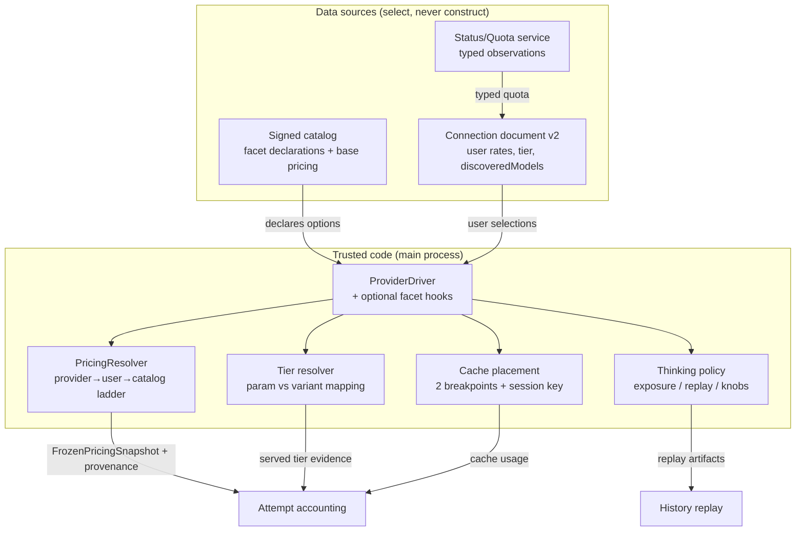

# Provider Capabilities Rework

## Summary

Standardize the built-in provider system around code-owned capability facets — quota, custom currencies, dynamic pricing, prompt-cache breakpoint placement, thinking/reasoning handling, and service tiers — exposed as optional, typed hooks on the trusted driver interface. Layer on user-facing configurability: per-model pricing overrides, live model discovery from provider `/v1/models` endpoints, a unified model listing, and a first-class OpenAI-Responses protocol.

The plan is one landable arc in three implementation phases: **Foundation** (facet types, catalog/connection schema extension, responses protocol), **Thinking** (per-provider thinking policy + replay-artifact persistence), and **Pricing/Discovery** (pricing ladder, per-model overrides, live discovery, unified listing, tier/cache/quota facets, analytics rendering). Phases are for sequencing, not ship boundaries — the full arc lands together.

---

## Problem Frame

The current driver interface (`electron/src/main/providers/drivers/types.ts`) expresses only protocol, auth, and model construction. Everything else a real provider differs on is absent or ad-hoc:

- `ProviderRuntime.freezeSnapshot` (electron/src/main/providers/index.ts) freezes pricing from the signed catalog only; Lilac's live subscription multiplier is read inline from an untyped status observation. There is no ladder, no per-model user override, no dynamic-rate refresh.
- `accounting/middleware.ts` extracts cost evidence from a hardcoded header allowlist plus a per-provider Neuralwatt extractor called inline in `evidenceFor`. Cost provenance is binary (reported vs computed).
- THINKING messages replay as plain `{ type: 'reasoning', text }` parts (electron/src/main/llm/history.ts) with no provider-specific payload. Anthropic's signed/redacted blocks and Meta's encrypted replay are impossible; the current form is wrong for both and silently degrades tool-loop correctness.
- OpenAI is constructed via `.chat()` only (electron/src/main/providers/drivers/native.ts). The Responses API is unreachable, so Meta reasoning replay/summaries and OpenAI `prompt_cache_breakpoint`/`prompt_cache_key` are unavailable.
- Service tiers (OpenRouter `service_tier`, Neuralwatt `-flex`/`-fast`/`-short` variant names) are unreachable; Neuralwatt's model list duplicates variants as separate rows.
- Model lists come only from the signed catalog; providers publishing `/v1/models` with live metadata/pricing cannot update connections. `candidateModels`/`modelOptions` (electron/src/main/ipc/providers.ts) merge connection models from catalog/custom/fallback with provenance already tracked — the seam for a unified listing exists but is unused by any richer per-model treatment.

The result: adding a provider is bespoke, costs are unreliable, multi-turn reasoning correctness degrades per provider, and cache breakpoints are never placed despite stable prefixes.

---

## Requirements

**Driver capability interface**

- R1. Each facet (quota, currency, dynamic pricing, caching, thinking, tiers) is an optional hook on the trusted driver interface; a provider implements only the facets it supports.
- R2. Facet hooks are code-owned: catalog and user data select among declared options but never construct requests or introduce new behavior.
- R3. Adding a new built-in provider consists of one driver module against shared helpers plus a catalog entry, with no changes to orchestration, accounting, or UI paths.
- R4. Every facet exposes typed metadata consumed generically by UI and accounting; known providers no longer surface untyped observation data.

**Pricing and currencies**

- R5. Cost resolution order is API-reported cost, then API-reported usage × rates, with rates resolved provider pricing API → user-set → catalog; every resolved rate carries provenance.
- R6. Users can set field-level rate overrides per model on any connection; overrides fill gaps below the provider pricing API and above the catalog.
- R7. Providers with dynamic pricing declare a refresh cadence; rates refresh in the background, each request freezes the latest-known rates at start, and an unreachable pricing endpoint falls back down the ladder with stale provenance marked.
- R8. Currencies generalize beyond ISO fiat: drivers may declare non-fiat units (e.g. kWh), usage/quota/analytics render native units without forced conversion, and attempt records retain native-unit evidence (consumed/charged amounts, multiplier).
- R9. Rate dimensions cover at least input, output, cache read, cache write (including TTL variants), reasoning, per-request fees, and context-length tiers.

**Caching facet**

- R10. For explicit-cache providers the driver owns breakpoint placement: one breakpoint at the end of the stable tools-plus-system prefix, one that advances with the conversation tail, and a stable session-scoped cache key where the provider supports routing keys.
- R11. User control over caching is limited to driver-declared options (e.g. TTL choice); placement itself is not configurable.
- R12. Generic connections (user-provided compatible endpoints) send no cache markers; their cache usage is only reported from responses.
- R13. Cache read/write usage is normalized into attempt accounting and rendered per attempt.
- R14. Prompt construction keeps the stable-prefix order (static system prompt and tools before volatile content); new dynamic context must land in the dynamic region, for main agents and subagents.

**Thinking facet**

- R15. Each driver/model declares a thinking policy: exposure (readable / summary / opaque / none), replay rule (mandatory-in-tool-loop / recommended / impossible), and request knobs (display mode, summary profile, encrypted-content opt-in).
- R16. Replay artifacts (signatures, encrypted content, reasoning text) persist with chain messages and are replayed per policy; replayable artifacts from a prior model are stripped when the provider or model changes.
- R17. The UI renders readable thinking text or provider summaries, and renders opaque thinking as an indicator with token count rather than text.
- R18. User-configurable thinking options are limited to driver-declared ones: existing per-model reasoning levels plus display/summary options where supported.

**Service tier facet**

- R19. Drivers declare their tier mechanism: request parameter (e.g. OpenRouter `service_tier`) or model-name variants (e.g. Neuralwatt); where variants exist, variant names are used and parameter forms are ignored.
- R20. Model-name variants render grouped under the base model entry with a tier selector; no duplicate model rows; the driver maps the selected tier to the model ID at request time.
- R21. Tier selection is per-model with session-level override, following the reasoning-effort selector pattern.
- R22. The actually-served tier reported by the provider is captured in attempt evidence, and billing uses the served tier's rates.
- R23. Tiers are opt-in: nothing is sent unless selected, and drivers assert provider preconditions (e.g. Neuralwatt flex requires streaming).

**Quota facet**

- R24. Quota and subscription state are a typed driver facet exposing balances, subscription state, and allowances in provider-native units.
- R25. Quota data is informational only — rendered in connection details and analytics — and never gates connection usability, routing, or sends.

**Discovery and unified listing**

- R26. Connections support live model discovery from the provider's models endpoint: automatically once at connection creation with a working credential, and on manual fetch in the wizard and connection edit; no background polling.
- R27. Model metadata precedence is live API > user-set > catalog; discovered models absent from the catalog are added as connection models with provider provenance; endpoints returning only ids contribute nothing beyond the id.
- R28. One unified listing per connection treats catalog, discovered, and user-defined custom models identically — enable/disable, pricing override, reasoning levels, tier selection — with a provenance badge distinguishing origin.
- R29. Custom models keep their manual metadata form (capabilities, limits, pricing) since nothing is known about them.

**Protocols**

- R30. `openai-responses` becomes a first-class protocol with its own driver path, message mapping, usage normalization, and reasoning handling.
- R31. Per-model protocol selection remains the mechanism for multi-API providers; drivers may declare the Responses protocol per model where the provider supports it.

---

## Key Technical Decisions

- **Facet hooks on the trusted driver, not on catalog/user data.** All new behavior is code-owned; catalog and user config select among driver-declared options only. This preserves the trust boundary that remote data never shapes requests. The catalog trust policy list (`TRUSTED_CATALOG_PROVIDER_POLICIES` in electron/src/main/providers/catalog/trust.ts) is where each new provider's allowed protocols/auth/custom-model behavior is pinned in code.
- **A single `PricingResolver` replaces the inline freeze in `ProviderRuntime.freezeSnapshot`.** It composes rate sources in ladder order (provider API → user override → catalog) and emits a `FrozenPricingSnapshot` with per-field provenance. `calculateAttemptCost` gains a rung-provenance input so analytics can report which rung produced each cost. The existing inline `liveLilacPricing` path in index.ts is removed and re-expressed as the Lilac driver's pricing facet.
- **Thinking artifacts persist as an optional typed payload on `Message`.** A `thinking_payload` field (provider id, artifact kind, opaque blob, display text) is stored on THINKING messages, replacing the flat `thinking: string` path for artifact-capable providers. History replay consults the driver's thinking policy to decide what to emit (signed blocks for Anthropic, encrypted reasoning items for Meta-Responses, plain reasoning text for open models, nothing for opaque). Strip-on-switch is handled at replay time by comparing the artifact's provider/model against the current selection.
- **`openai-responses` is a new `ProviderProtocol` member.** Drivers opt in per model; `createNativeLanguageModel` gains a Responses branch using `@ai-sdk/openai`'s responses model. Message mapping, usage normalization, and reasoning handling are protocol-scoped. OpenCode Go's per-model protocol table already exercises this seam.
- **Unified listing builds on the existing `candidateModels`/`modelOptions` provenance seam.** The renderer receives one list with `source: 'catalog' | 'provider' | 'user'`; per-model affordances (enable/disable, pricing override, reasoning levels, tier selection) are uniform. A new `discoveredModels` field on the connection document (version 2) holds live-discovered entries with provider provenance.
- **Service tiers resolve per model + session, driver maps to mechanism.** A per-model `tier` selection (with session override, following `reasoningConfig`) resolves at request time: parameter-style drivers send `service_tier`; variant-style drivers map to the variant model ID. The served tier reported in the response is captured into attempt evidence and used for billing-rate selection.
- **Quota is a typed read-only facet feeding status, never routing.** A driver may expose `fetchQuota`; results render in connection details/analytics. No code path reads quota to gate usability or sends.
- **Cache placement is driver-owned; TTL is the only user knob.** Explicit-cache drivers place the two breakpoints and the session cache key. Generic compatible drivers send no markers and only report `cached_tokens`/cache write usage.

---

## High-Level Technical Design

The facet set hangs off the trusted driver. All request-time composition happens in the main process; the renderer only reads typed metadata and writes user selections.

**Request-time flow:** resolve selection → driver facet hooks read user/catalog selections → `PricingResolver` freezes pricing with provenance → driver builds the model (chat / messages / responses) with cache markers + thinking knobs + tier applied → `accounting/middleware` extracts reported cost + served tier + cache usage → `calculateAttemptCost` resolves cost down the ladder → attempt record carries provenance, served tier, and native-unit evidence.

---

## Implementation Units

Grouped into three phases for sequencing. The full arc lands as one reviewable change.

### Phase A — Foundation

#### U1. Facet metadata types + catalog/connection schema extension
- **Goal:** Define typed facet metadata (thinking policy, tier mechanism, pricing dimensions incl. non-fiat currency, cache capability) on the driver interface and the signed catalog schema; add the connection-document v2 fields (discoveredModels, per-model pricing overrides, per-model tier) with migration from v1.
- **Requirements:** R1, R2, R4, R6, R8, R9, R19, R26, R27, R28, R29
- **Dependencies:** none
- **Files:**
  - Modify `electron/src/shared/types/provider.ts` (protocol enum + connection schema v2 fields + facet-shared types)
  - Modify `electron/src/main/providers/drivers/types.ts` (optional facet hook signatures)
  - Modify `electron/src/main/providers/catalog/schema.ts` (facet declarations + pricing dimensions)
  - Modify `electron/src/main/providers/connection-store.ts` (v1→v2 migration, new fields)
  - New `electron/src/shared/types/provider-facets.ts` (thinking/tier/pricing/currency facet types)
  - Test `electron/tests/unit/provider-connection-store.test.ts`, `electron/tests/unit/provider-catalog.test.ts`, `electron/tests/unit/provider-domain.test.ts`
- **Approach:** Extend `providerProtocolSchema` with `'openai-responses'`. Add optional facet hooks to `ProviderDriver` (e.g. `thinkingPolicy`, `tierMechanism`, `pricingFacet`, `cacheFacet`, `quotaFacet`) — all optional, all returning typed metadata. Catalog schema gains per-provider/per-model facet declarations and richer pricing dimensions (TTL-variant cache write rates, per-request fees, context tiers, non-fiat currency unit). Connection document becomes version 2 with `discoveredModels`, `pricingOverrides` (per model), `tierSelections` (per model); a pure migration function upgrades v1 documents in place on read.
- **Patterns to follow:** existing zod `.strict()` schemas with discriminated unions; `seedReasoningConfig` fill-absent-only pattern in connection-store.ts; catalog field-provenance pattern in catalog/schema.ts.
- **Test scenarios:**
  - Migration upgrades a v1 document to v2 with empty new fields and preserves existing connections.
  - Catalog rejects a provider declaring a facet not in the trusted policy list.
  - Connection schema round-trips new fields (discoveredModels with provenance, per-model pricing override, tier selection).
  - Driver with no facet hooks remains valid (facets optional).
- **Verification:** `npm run typecheck` + new unit tests pass; a v1 `providers.json` loads and writes back as v2.

#### U2. OpenAI-Responses protocol
- **Goal:** Add `openai-responses` as a first-class protocol with a driver branch, message mapping, usage normalization, and reasoning handling.
- **Requirements:** R30, R31
- **Dependencies:** U1
- **Files:**
  - Modify `electron/src/main/providers/drivers/native.ts` (Responses branch for OpenAI)
  - Modify `electron/src/main/providers/drivers/compatible.ts` and `opencode-go.ts` (per-model protocol opt-in)
  - Modify `electron/src/main/llm/model-messages.ts` / `history.ts` (Responses-shaped mapping)
  - Modify `electron/src/main/providers/catalog/trust.ts` (allow `openai-responses` for pinned providers)
  - Test `electron/tests/unit/provider-native-adapters.test.ts`, `electron/tests/unit/provider-opencode-neuralwatt.test.ts`
- **Approach:** `createNativeLanguageModel` switches on protocol; the `openai-responses` branch constructs the responses model via `@ai-sdk/openai`. Message mapping converts `ApiMessage` history into Responses input items (including reasoning items). Usage normalization maps Responses usage into `NormalizedProviderUsage`. Per-model protocol selection stays the mechanism; catalog marks which models use Responses.
- **Patterns to follow:** existing per-protocol branches in `createNativeLanguageModel` / `createOpenCodeGoLanguageModel`; AI SDK v7 responses API usage in `@ai-sdk/openai`.
- **Test scenarios:**
  - OpenAI driver builds a Responses model when the model protocol is `openai-responses`.
  - OpenCode Go maps a Responses-protocol model to the responses route.
  - History with tool calls maps to Responses input items without orphaned tool_results.
  - Reasoning usage normalizes into `reasoningTokens`.
- **Verification:** typecheck + adapter tests; a Responses model streams through the orchestrator end-to-end against a mock.

### Phase B — Thinking facet

#### U3. Thinking policy + replay-artifact persistence
- **Goal:** Add per-provider thinking policies, persist replay artifacts on chain messages, and replay per policy (Anthropic signed/redacted blocks, Meta encrypted items, open-model text, opaque for OpenAI).
- **Requirements:** R15, R16, R17, R18
- **Dependencies:** U1, U2
- **Files:**
  - New `electron/src/main/providers/facets/thinking.ts` (policy resolution + replay decision)
  - Modify `electron/src/shared/types/message.ts` (`thinking_payload` on Message + storage dict)
  - Modify `electron/src/main/llm/message-factories.ts` (thinking message carries payload)
  - Modify `electron/src/main/llm/history.ts` (policy-driven replay + strip-on-switch)
  - Modify `electron/src/main/llm/stream/sdk-event-adapter.ts` (capture signatures/encrypted content + summaries into payload)
  - New `electron/src/main/providers/facets/thinking-ui.ts` (render metadata: text vs summary vs opaque indicator)
  - Test `electron/tests/unit/` new thinking-facet tests + history replay tests
- **Approach:** `Message` gains optional `thinking_payload: { providerId, modelId, kind, blob, displayText }`. The stream adapter populates it from provider-specific parts (Anthropic `signature`/`redacted_thinking`, Responses `encrypted_content`, plain text). `history.ts` consults the driver's thinking policy: `mandatory-in-tool-loop` replays artifacts unmodified with tool results; `recommended` replays when present; `impossible` omits. Strip-on-switch compares artifact provider/model to current selection and drops mismatched artifacts. UI gets render metadata to show text/summary vs an opaque "thinking (N tokens)" indicator.
- **Patterns to follow:** existing THINKING replay path in history.ts; `messageToStorageDict`/`messageFromStorageDict` forward-compat tolerance.
- **Test scenarios:**
  - Anthropic tool loop replays thinking + redacted_thinking blocks unmodified; no 400 from construction.
  - Meta Responses replays encrypted reasoning items; Meta Chat Completions omits thinking.
  - OpenAI (opaque) persists no readable text and renders an indicator with token count.
  - Switching provider/model strips prior artifacts from replay.
  - Storage round-trips the payload; older messages without it still replay as plain text.
- **Verification:** typecheck + tests; an Anthropic extended-thinking tool loop completes without thinking-related 400s.

### Phase C — Pricing, discovery, tiers, cache, quota

#### U4. Pricing ladder + per-model user overrides + dynamic refresh
- **Goal:** Replace the inline freeze with a `PricingResolver` composing provider API → user override → catalog, with per-field provenance, dynamic-rate background refresh, and native-unit support.
- **Requirements:** R5, R6, R7, R8, R9
- **Dependencies:** U1
- **Files:**
  - New `electron/src/main/providers/facets/pricing.ts` (PricingResolver + rate-source chain)
  - Modify `electron/src/main/providers/index.ts` (freezeSnapshot uses resolver; remove inline `liveLilacPricing`)
  - Modify `electron/src/main/providers/accounting/cost.ts` (rung provenance + native-unit evidence)
  - Modify `electron/src/main/providers/accounting/middleware.ts` (generalize evidence extraction via driver facet; keep header allowlist + Neuralwatt extractor behind the facet)
  - New `electron/src/main/providers/facets/pricing-refresh.ts` (driver-declared cadence, background refresh, stale fallback)
  - Test `electron/tests/unit/provider-cost.test.ts`, `provider-accounting-store.test.ts`, new pricing-resolver tests
- **Approach:** `PricingResolver.resolve(connection, model)` walks the ladder; each rate carries `provenance: { source: 'provider-api' | 'user' | 'catalog', observedAt }`. Drivers with dynamic pricing declare a cadence and a `fetchRates` hook; a refresher updates a latest-known cache; an unreachable endpoint falls back down the ladder and marks provenance stale. `calculateAttemptCost` accepts rung provenance and native-unit evidence (consumed/charged kWh, multiplier) and reports the rung on the attempt record. Lilac's inline multiplier path becomes its driver pricing facet.
- **Patterns to follow:** existing `freezePricing`/`freezeRate` structure; `AttemptCostEvidence`/`AttemptCostResolution` shapes in cost.ts; status-service TTL/refresh pattern for the pricing refresher.
- **Test scenarios:**
  - Provider-API rate wins over user override and catalog; user override wins over catalog; catalog is last resort.
  - Reported cost always wins over computed cost regardless of rung.
  - Unreachable pricing endpoint falls back and marks provenance stale.
  - Non-fiat currency (kWh) computes cost from energy rate snapshot and retains consumed/charged/multiplier evidence.
  - Per-request-fee and context-tier rates apply correctly.
- **Verification:** typecheck + cost tests; a Lilac/Neuralwatt attempt records correct provenance and native-unit evidence.

#### U5. Live model discovery + unified listing
- **Goal:** Add driver `fetchModels` hooks, a discovery path on connection create + manual fetch, precedence merge (live > user > catalog), and a unified listing with provenance badges and uniform per-model affordances.
- **Requirements:** R26, R27, R28, R29, R4
- **Dependencies:** U1, U4
- **Files:**
  - New `electron/src/main/providers/facets/discovery.ts` (discovery orchestration + merge)
  - Modify `electron/src/main/providers/drivers/neuralwatt.ts`, `lilac.ts`, `opencode-go.ts`, `native.ts` (fetchModels hooks where the endpoint exists)
  - Modify `electron/src/main/ipc/providers.ts` (discovery IPC + unified `modelOptions` with provenance)
  - Modify `electron/src/main/providers/connection-store.ts` (persist discoveredModels)
  - Modify `electron/src/renderer/components/Providers/ConnectionWizard.tsx`, `ConnectionModelsDialog.tsx` (unified listing, provenance badge, per-model affordances)
  - Test `electron/tests/unit/provider-ipc.test.ts`, new discovery tests, renderer component tests
- **Approach:** Drivers with a models endpoint expose `fetchModels`. Discovery runs once at connection create (when a credential works) and on manual fetch; results merge by precedence into `discoveredModels` with provider provenance; ids-only endpoints contribute only ids. `modelOptions` emits one list with `source: 'catalog' | 'provider' | 'user'` and uniform affordances. The renderer renders provenance badges and the same per-model controls regardless of origin; custom models keep the manual metadata form.
- **Patterns to follow:** existing `candidateModels`/`modelOptions` provenance seam; `seedReasoningConfig` fill-absent merge; Neuralwatt `/v1/models` and OpenRouter `/api/v1/models` response shapes (verified in origin doc).
- **Test scenarios:**
  - Discovery on create adds unknown models with provider provenance; catalog-known models keep catalog metadata unless the live value differs.
  - Precedence: live API overrides catalog context length; user override is preserved over live.
  - Ids-only endpoint (OpenCode Go) adds ids without degrading catalog metadata.
  - Unified listing shows catalog/discovered/custom rows with identical affordances and correct badges.
  - No background polling occurs.
- **Verification:** typecheck + tests; creating a Neuralwatt connection populates discovered models with pricing inline.

#### U6. Service tier facet + cache facet + quota facet + analytics rendering
- **Goal:** Add the tier facet (per-model + session override, driver-mapped mechanism, served-tier billing), the cache facet (driver-owned placement, TTL knob, generic no-marker behavior, usage normalization), the typed quota facet (informational), and native-unit/quota rendering in analytics.
- **Requirements:** R10, R11, R12, R13, R14, R19, R20, R21, R22, R23, R24, R25, R8 (rendering)
- **Dependencies:** U1, U2, U4, U5
- **Files:**
  - New `electron/src/main/providers/facets/tiers.ts` (tier resolution + mapping)
  - New `electron/src/main/providers/facets/cache.ts` (breakpoint placement + session key + TTL)
  - New `electron/src/main/providers/facets/quota.ts` (typed quota contract)
  - Modify `electron/src/main/providers/drivers/neuralwatt.ts` (variant tier mapping + streaming precondition + quota hook), `lilac.ts`, `native.ts` (OpenAI/Anthropic cache + thinking knobs), new `openrouter.ts` driver
  - Modify `electron/src/main/providers/status/service.ts` (typed quota observations)
  - Modify `electron/src/main/providers/accounting/analytics-queries.ts` and `electron/src/renderer/components/AnalyticsView.tsx` (native-unit + quota rendering)
  - Modify `electron/src/main/llm/system-prompt.ts` / `build-prompt-context.ts` (guard stable-prefix order, R14)
  - Test new facet tests + `provider-status-service.test.ts` + renderer analytics tests
- **Approach:** Tier facet: per-model selection + session override (mirroring `reasoningConfig`); parameter drivers send `service_tier`, variant drivers map to variant model ID and assert preconditions (e.g. streaming); served tier from the response lands in attempt evidence and selects billing rates. Cache facet: explicit-cache drivers place the two breakpoints + session key; TTL is the only user knob; generic drivers send no markers and only report usage; cache read/write normalize into `NormalizedProviderUsage`. Quota facet: drivers expose `fetchQuota` returning typed balances/subscription/allowances in native units; status service stores typed observations; rendering is informational only. Analytics renders native units (kWh) and quota state without forced conversion. R14 is guarded by keeping dynamic context in the dynamic region of prompt assembly.
- **Patterns to follow:** `reasoningConfig` per-model + session pattern for tiers; status-service observation pattern for quota; existing analytics currency bucketing for native units.
- **Test scenarios:**
  - Neuralwatt `-flex`/`-fast`/`-short` group under one base model entry; selecting flex sends the variant id and requires streaming.
  - OpenRouter `service_tier` is opt-in; served tier is recorded and billed at served rates.
  - Anthropic/OpenAI explicit cache places breakpoints + session key; TTL selectable; generic connection sends no markers but reports `cached_tokens`.
  - Quota renders balance/subscription/allowance in native units and never gates sends.
  - Analytics shows kWh and USD buckets without merging.
- **Verification:** typecheck + tests; end-to-end Neuralwatt flex attempt bills at 0.65× and records served tier; Anthropic tool loop shows cache hits across turns.

---

## System-Wide Impact

- **Trust boundary:** all new behavior stays code-owned; catalog/user data only selects among driver-declared options. The catalog trust policy list is the single gate for new providers and their allowed protocols/auth/facets.
- **Persistence:** connection document migrates v1→v2; chain messages gain an optional `thinking_payload`. Both must round-trip older data and tolerate forward-compat keys.
- **IPC:** new/extended channels for discovery and unified model options; all payloads remain zod-validated at the boundary per the existing IPC security model.
- **Accounting:** attempt records gain rung provenance, served tier, and native-unit evidence; analytics queries and rendering must handle multiple currencies/units without merging.
- **Renderer:** connection wizard/edit and analytics views change; thinking rendering distinguishes text/summary/opaque.
- **Failure propagation:** pricing-endpoint failure falls back down the ladder (never blocks a request); discovery failure leaves catalog/custom models intact; quota failure degrades to stale/unavailable status only.

---

## Risks & Dependencies

- **AI SDK v7 coverage** — Responses protocol, Anthropic `cache_control`/signature round-trips, and OpenAI `prompt_cache_breakpoint`/`prompt_cache_key` support must be confirmed against the installed `@ai-sdk/*` versions during implementation; a gap changes U2/U3/U6 scope. Mitigation: verify with a minimal spike before building U2.
- **Chain storage growth** — opaque artifacts (Anthropic signatures, Meta encrypted content) grow chains and tie history to the producing provider/model. Accepted per origin; hydration/persistence paths must tolerate larger messages.
- **Catalog signing pipeline** — new facet fields and pricing dimensions must flow through `catalog:seed`/`catalog:sign`; unsigned or policy-violating fields must be rejected at load.
- **Dynamic pricing freshness** — a stale or unreachable pricing endpoint must never block a request; fallback provenance must be visible in analytics so cost reports are interpretable.
- **Lilac quota endpoint** — supply-state/discount fields are not in Lilac's public inference docs; the quota facet's Lilac implementation may need an undocumented endpoint or stay performance-only. Flagged as an open question, not a blocker.

---

## Open Questions

All planning-owned; none block starting.

- Affects U1, U4. [Technical] Exact facet hook signatures, facet metadata shapes, and the shared-helper boundaries drivers reuse.
- Affects U4. [Technical] How cache-write TTL variants (e.g. `input_cache_write_1h`) and per-request fees map onto pricing schema dimensions.
- Affects U3. [Technical] Driver defaults for display/summary options (Anthropic display mode, Meta summary profile) and their connection-level override UI.
- Affects U3. [Technical] Chain-storage format for replay payloads and hydration/persistence behavior, including subagent chains.
- Affects U6. [Technical] Where served-tier evidence lands on the attempt record (existing evidence fields vs new columns).
- Affects U6. [Technical] Typed quota contract shape shared across Neuralwatt, Lilac, and future providers; Lilac's supply-state/discount endpoint needs identification.
- Affects U5. [Technical] Connection document migration details for discovered-model entries and provenance tracking.
- Affects R30, R31. [Technical] Per-model protocol selection mechanics for drivers offering multiple protocols for the same model (OpenCode Go pattern vs Meta Responses).

---

## Acceptance Examples

- AE1. **Covers R5, R7.** Given a dynamic-pricing provider whose pricing endpoint is unreachable, when a request starts, then the user-set rate (else catalog rate) is frozen into the snapshot and provenance marks the fallback source.
- AE2. **Covers R20.** Given a provider exposing `glm-5.2`, `glm-5.2-flex`, `glm-5.2-fast`, `glm-5.2-short`, when the connection lists models, then one `glm-5.2` entry appears with a standard/flex/fast/short selector, and selecting flex sends the variant model id.
- AE3. **Covers R22, R23.** Given an OpenRouter connection with flex selected, when the provider serves on a flex endpoint, then the attempt records the served tier and bills at flex rates; when no flex capacity exists, the provider's error surfaces instead of a silent standard-tier fallback.
- AE4. **Covers R16.** Given an Anthropic conversation with extended thinking, when a tool loop continues, then persisted thinking and redacted-thinking blocks replay unmodified with the tool results.
- AE5. **Covers R15, R30, R31.** Given a Meta reasoning model, when run over Chat Completions, then thinking exposure is none and each turn reasons from scratch; when run over Responses, then encrypted replay and summaries are available per policy.
- AE6. **Covers R25.** Given a connection whose key allowance is blocked, when the user sends, then Orchid sends anyway, the provider rejection surfaces as an attempt error, and the quota panel shows blocked.
- AE7. **Covers R8.** Given an energy-accounting Neuralwatt connection, when attempts complete, then charged kWh and the multiplier are retained as evidence, costs compute from the energy rate snapshot, and quota/analytics render kWh natively.
- AE8. **Covers R27.** Given a catalog context length the live models endpoint contradicts, when discovery runs, then the live value replaces it with provider provenance shown.

---

## Sources / Research

- Origin requirements: docs/brainstorms/2026-08-08-provider-capabilities-requirements.md (carries the verified provider-doc facts for caching, tiers, thinking, discovery, quota).
- Current driver interface: electron/src/main/providers/drivers/types.ts
- Pricing freeze seam: electron/src/main/providers/index.ts (`freezeSnapshot`, inline `liveLilacPricing`)
- Cost evidence seam: electron/src/main/providers/accounting/middleware.ts (`evidenceFor`), cost.ts (`calculateAttemptCost`)
- Catalog trust gate: electron/src/main/providers/catalog/trust.ts (`TRUSTED_CATALOG_PROVIDER_POLICIES`, `validateTrustedProviderDeclarations`)
- Connection store: electron/src/main/providers/connection-store.ts (v1 document, serialized atomic writes)
- Model listing seam: electron/src/main/ipc/providers.ts (`candidateModels`, `modelOptions`)
- Thinking replay seam: electron/src/main/llm/history.ts, message-factories.ts, shared/types/message.ts
- Driver adapters: electron/src/main/providers/drivers/{native,compatible,opencode-go,lilac,neuralwatt}.ts
- Test conventions: electron/tests/unit/provider-*.test.ts (vitest, mocked `importESM`, per-driver suites)
