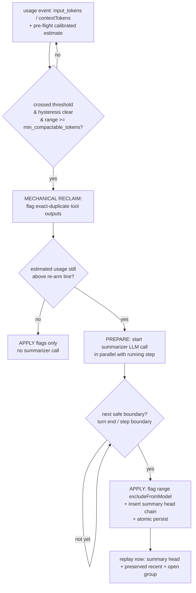
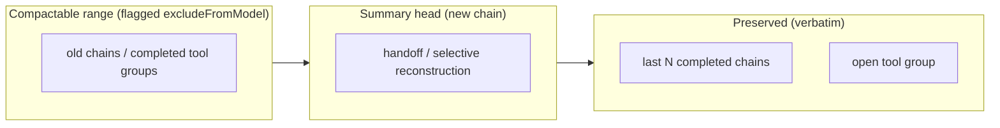
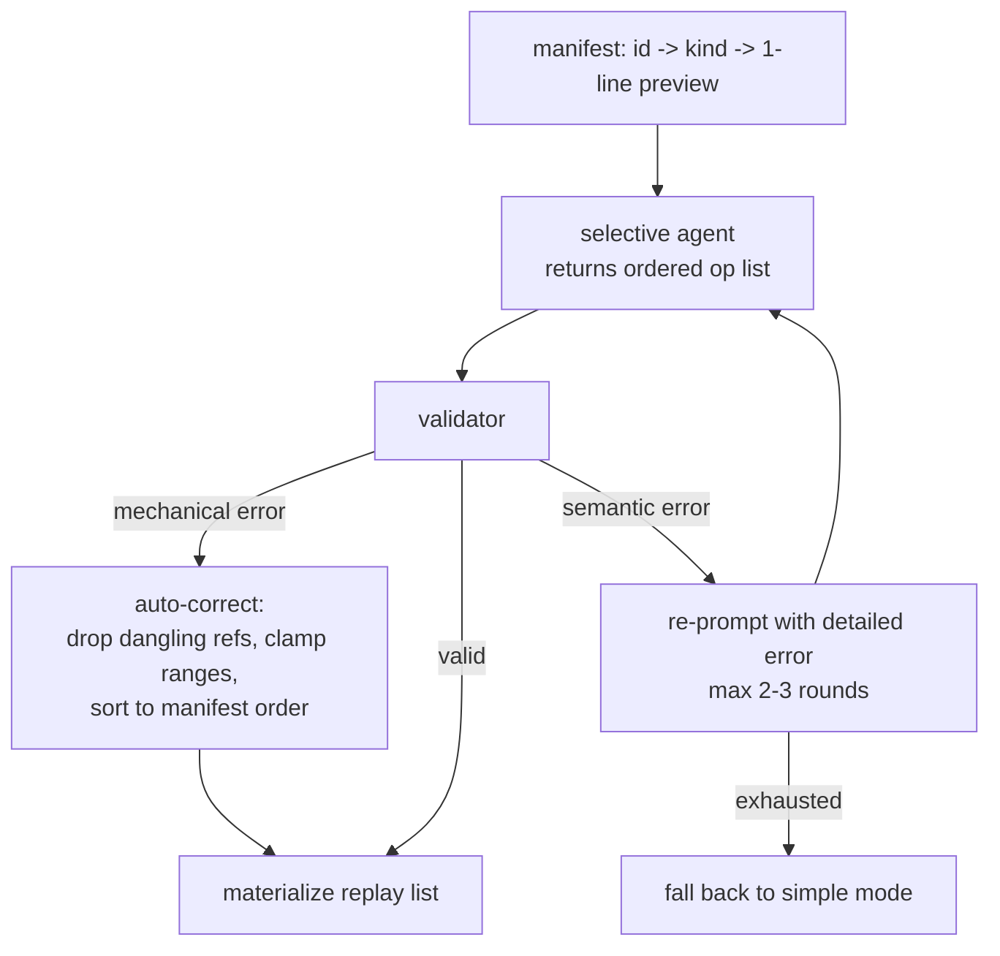

## Summary

Add transparent, configurable context-window compaction for both the main session and subagents. An internal summarizer agent replaces old replay history with a compacted representation while the full transcript stays visible. Two modes — `simple` (handoff summary) and `selective` (ID-referenced reconstruction) — share one trigger, application, and persistence core. Phase 1 ships the shared core plus `simple`; Phase 2 adds `selective`.

A deterministic mechanical reclaim pass (exact-duplicate tool outputs) runs ahead of the summarizer, and a compactor model whose window cannot fit the compactable range surfaces as a user warning rather than silent adaptation. Phase 2 selective mode remains as scoped.

## Problem Frame

Long sessions and long subagent runs send their entire history to the model, unbounded (issue #119 verdict: NOT_IMPLEMENTED). There is no token check, cap, or estimate before `streamChat`; the provider eventually rejects the request and the turn or run dies. Subagents are the more urgent case: they run unattended on tier models with often-smaller windows and do tool-heavy work, so they hit the wall silently and return only an error to the parent.

The issue's three acceptance criteria — stay within limits, transparent to the user, replace (not append) old context — are all satisfiable with infrastructure that already exists: `excludeFromModel`/`hidden` message flags, the internal-agent LLM-to-LLM invocation pattern, per-turn provider-reported usage, and catalog context limits. This plan wires them together.

---

## Requirements

### Core behavior

- R1. Sessions and subagent runs stay within the model's context window across arbitrarily long work.
- R2. Compaction is transparent: it fires automatically on a token threshold without user action, and the user can see that it happened and what the model now believes.
- R3. Compaction replaces old context in the model's replay view; it never appends a parallel history, and it never deletes or hides the original transcript from the user.
- R4. The full original history remains viewable in the chat at all times, and the full compaction output is visible as a first-class message.
- R5. A chain- or tool-group-boundary cut never leaves a dangling `tool_calls` block or an orphaned `tool_result` in the replay stream.
- R6. The preserve window — the most recent completed work — is never compacted; the open tool group of an in-flight turn is never compacted.

### Modes

- R7. `simple` mode: one agent pass over the compactable range returns a handoff summary that replaces it.
- R8. `selective` mode: one agent returns an ordered list of references (keep / keep-range / summarize) over a manifest of ID'd elements; the system validates, auto-corrects mechanical errors, and re-prompts on semantic errors.
- R9. `selective` mode keeps user messages verbatim, may summarize tool calls and thinking, and supports ranged keeps of tool output (e.g. a file read reduced to lines 5–50).
- R10. Compaction mode, threshold, model, prompt agent, and preserve-window size are independently configurable for the `main` and `subagents` scopes.
- R26. When the resolved compactor model's catalog `contextTokens` is smaller than the main model's or a known subagent-scope model's, the user is warned at config time; chunked/merged summarization or session-model fallback is a follow-up, not v1 behavior.

### Trigger and application

- R11. The primary trigger is provider-reported `input_tokens` ÷ catalog `contextTokens` crossing a configurable threshold, checked after each streamed usage event; a calibrated estimate (context-snapshot char measurement scaled by the session's observed tokens-per-char ratio) additionally arms the prepare phase one request early.
- R12. On crossing, the compaction LLM call starts immediately (prepare, mid-step, in parallel with the running step); the mutation applies only at the next safe boundary (apply).
- R13. After a compaction, hysteresis prevents re-firing until usage drops below `threshold − 0.1` and climbs back, or enough new content accrues.
- R14. Compaction does not fire when the compactable range is below a `min_compactable_tokens` floor (firing would cost more than it reclaims).
- R15. A reactive `context_length_exceeded` provider error triggers one compaction-and-retry before declaring the turn/run failed.
- R25. A deterministic mechanical reclaim pass runs before any summarizer invocation: exact-duplicate tool outputs (same tool, normalized args, and output hash) within the compactable range are flagged, keeping the newest occurrence; if estimated usage then falls below the re-arm line, the summarizer is not called.

### Subagents

- R16. Subagent runs compact mid-run at step boundaries using the same core, with the subagent's own model limits and a task-focused prompt.
- R17. When a subagent run still exceeds the window after compaction, it degrades to a structured partial report (done / remaining / where it stopped) returned to the parent as a normal tool result, not a hard failure.
- R18. Compaction cost inside a subagent run is attributed to that subagent in Analytics.

### Analytics and display

- R19. A `summary_tokens` (compaction) category is added to the context snapshot and rendered as its own segment in ContextGrid.
- R20. Each compaction is recorded as its own chain with its own usage footer; its tokens are accounted like any turn.
- R21. The compacted range renders as a collapsed stub by default and expands to full fidelity on click; this is display-only state, independent of the persistence flags.

### Integrity

- R22. A compaction write (flags + summary message) is atomic with respect to crash: a crash mid-turn resumes either the old history or the compacted one, never a half-flagged state.
- R23. A summary message carries a `compacted` marker recording its covered range and mode, so later compactions and the renderer can distinguish it from real content.
- R24. Thinking replay artifacts (provider-signed blobs) are never summarized into a fake reasoning part; they are kept verbatim or dropped.

---

## Key Technical Decisions

- **Replacement via `excludeFromModel`, never deletion or `hidden`.** The flag already drops messages from model replay (`electron/src/main/llm/history.ts`) while the renderer ignores it (`MessageWidget.tsx` only filters `hidden`). This separates "what the model sees" (persistence) from "what's visually folded" (UI collapse state) and satisfies R3 + R4 with no new persistence machinery.

- **Compactable region = all replayable history before the cut point; the minimum safe cut = the start of the current open tool group.** A completed tool group inside the active chain is as safe to compact as a terminal chain; only the open group (unresolved `tool_calls`) is untouchable. This is the rule that survives a single runaway 900k-token turn, which a chain-granularity "never touch the active chain" rule cannot.

- **Two-phase prepare/apply trigger.** The expensive part is the summarizer LLM call, so start it the instant usage crosses threshold (mid-step, in parallel) and splice at the boundary. Eager decision, boundary-only mutation — eager mutation is impossible because mid-step there are unresolved `tool_calls`.

- **Mechanical reclaim before LLM summarization.** Exact-duplicate tool outputs (same tool + normalized args + output hash) inside the compactable range are flagged without a model call; the summarizer runs only if estimated usage remains above the re-arm line. Deterministic, free, and incapable of introducing summarization error.

- **Pre-flight estimates reuse the calibrated snapshot estimator, never tokenizer math.** The next-request estimate = last provider-reported `input_tokens` + a char-estimated tail of new messages, measured with the same machinery as the context snapshot (`messageChars` / `allocateInputTokens`) and scaled by the session's own observed tokens-per-char ratio. Per-model tokenizers stay out of scope; the estimate is advisory only (early prepare) — the usage event remains the source of truth for apply.

- **Contiguous compactable range; no per-chain size exemption.** A skipped small chain inside the range fragments one clean summary into interleaved verbatim islands and breaks order-invariance checking for near-zero token benefit. The only size gate is `min_compactable_tokens` on the whole range (R14), a "is firing worth it" check, not a per-chain skip.

- **Preserve window measured over completed real chains, excluding the summary head.** The summary sits before the preserved chains; if it counted toward the window it would shrink the preserve count on every pass. The `compacted` marker (R23) is what lets the selector tell the summary head from a real chain.

- **Invoke the summarizer via the internal-agent pattern, not `SubagentManager`.** `buildWebFetchSummarizer` (`electron/src/main/tools/index.ts`) and the session-namer (`electron/src/main/ipc/chat/title.ts`) both resolve an internal agent, call `generateText` with the agent's `system_prompt`, and account the call — without leaking the task into subagent context. Both modes use this; `selective` upgrades `generateText` to a multi-turn `streamChat` for its correction loop.

- **Model resolution fallback chain.** Config override `{connectionId, modelId}` → `getTierModelSelection(config, agent.tier)` → current turn/run selection. Mirrors `title.ts`. Lets the compactor be a cheap fast model by default while remaining overridable.

- **Compactor window misfit = warn, don't adapt (v1).** A cheap compactor tier model can have a smaller window than the range it must ingest; rather than chunking or silently falling back, v1 surfaces a config-time warning and defers chunked/merged summarization to a follow-up issue.

- **Do not re-read files at compaction time.** A ranged keep of a file read is a snapshot of the original content lines, not a fresh read. Re-reading injects content the user never saw, is non-deterministic, and races other agents' writes. Freshness-before-edit is a separate tool-level concern.

- **The summary head is its own chain.** Compaction writes a new chain (status `COMPLETED`) rather than mutating older chains in place, preserving the append-only multi-chain invariant (`electron/src/main/session/manager.ts`).

- **Subagents default to `simple` even when main gets `selective`.** A subagent's value to the session is its final report; its intermediate chain has no consumer after completion, so the expensive validated-selective path buys little there.

---

## High-Level Technical Design

### Compaction lifecycle

### Cut-point anatomy

### Mode-2 validation loop

---

## Scope Boundaries

**In scope**
- Main-session and subagent compaction, `simple` and `selective` modes.
- Threshold + reactive-error triggers; prepare/apply; preserve window.
- Deterministic mechanical reclaim pre-pass (exact-duplicate tool outputs).
- Config surface, analytics category, compaction message widget, collapse affordance.
- Subagent partial-report graceful degradation.

**Out of scope**
- Compacting subagent *chains* inside the main session view — subagent chains are already summarized into the parent via their tool result.
- Re-reading files or refreshing content freshness at compaction time.
- Selective-mode thinking summarization (thinking is keep-verbatim-or-drop per R24).
- Client-side token counting (tiktoken); provider-reported usage stays the source of truth, with only the calibrated char estimator reused for advisory pre-flight.
- Summarizer window-fit adaptation (chunked/merge summarization, session-model fallback) — v1 warns, see follow-ups.
- Transcript indexing / recall of evicted messages ("forget with an address") — follow-up.
- Rolling/segmented digest trigger strategy — follow-up.

---

## Implementation Units

### U1. Compaction config schema

- **Goal:** Add the `compaction` top-level config object with per-scope sub-objects.
- **Requirements:** R10, R13, R14
- **Dependencies:** none
- **Files:** `electron/src/main/config/schema.ts`; surfaces re-exported via `electron/src/main/config/index.ts`
- **Approach:** Follow the `subagentsConfigSchema` nested-object pattern (`schema.ts`): a `compactionScopeSchema` (`mode`, `threshold`, `model`, `agent_name`, `keep_recent_chains`, `min_compactable_tokens`, `mechanical_reclaim`, hysteresis delta) with per-field defaults, referenced as `compaction.main` and `compaction.subagents` each with `.default({})` so partial project overrides deep-merge. Defaults: main `simple` @ 0.8, subagents `simple` @ 0.85. Do not put this on the existing `subagents` object.
- **Patterns to follow:** `subagentsConfigSchema` / `agentsMdConfigSchema` nested-object shape and deep-merge contract.
- **Test scenarios:** schema defaults populate on empty config; partial project override merges per-field; out-of-range `threshold` rejected; `model` accepts null and a full selection.
- **Verification:** typecheck passes; defaults resolve for both scopes.

### U2. Summary-head message marker and ContextSnapshot category

- **Goal:** Add the `compacted` message marker and a `summary_tokens` snapshot category.
- **Requirements:** R19, R23
- **Dependencies:** none
- **Files:** `electron/src/shared/types/message.ts`, `electron/src/main/llm/context-snapshot.ts`
- **Approach:** Add an optional `compacted?: { rangeStart, rangeEnd, mode }` field to `Message`, persisted through `MessageStorageDict` (which already tolerates extra keys). Add `summary_tokens` to `ContextSnapshot` and its zod schema; in `context-snapshot.ts` `messageChars`, route messages carrying the marker into a `summary` bucket instead of `assistant`.
- **Patterns to follow:** existing optional-field persistence in `messageFromStorageDict`; category allocation in `allocateInputTokens`.
- **Test scenarios:** marker round-trips through storage dict; summary messages allocate to `summary_tokens`, others unchanged; absent marker → no `summary_tokens` inflation.
- **Verification:** typecheck; snapshot category math unchanged for non-summary messages.

### U3. Cut-point selection

- **Goal:** Pure function partitioning replayable history into compactable range / preserve window / open group, and picking the safe cut.
- **Requirements:** R5, R6
- **Dependencies:** U2
- **Files:** new `electron/src/main/llm/compaction/select.ts`; tested under `electron/tests/`
- **Approach:** Input is the flattened replayable `Message[]` plus chain boundaries. Output is the cut index and the range. Walk from newest back: preserve the last `keep_recent_chains` completed chains and always the trailing open tool group; the cut is the oldest index that is a clean tool-group boundary (no unresolved `tool_calls` span it). Best-effort budget: if the preserve window alone exceeds threshold, shrink the count down to a minimum of the open group. Exclude the summary head (via the U2 marker) from the preserve count.
- **Patterns to follow:** tool-group atomicity in `reconcileOrphanToolResults` (`electron/src/shared/types/chain.ts`) and the survival pre-pass in `history.ts`.
- **Test scenarios:** cut never splits a tool_call/result group; preserve-N honored; preserve window shrinks under budget pressure to a floor of the open group; summary head not counted; single-only-chain yields empty compactable range.
- **Verification:** unit tests pass; property check that no cut produces a dangling call.

### U4. Summarizer invocation (internal-agent pattern)

- **Goal:** Resolve the compactor agent + model and run the summarizer LLM call, accounted.
- **Requirements:** R7, R10, R18, R20, R26
- **Dependencies:** U1
- **Files:** new `electron/src/main/llm/compaction/summarize.ts`
- **Approach:** Load the internal agent (`compactor` / `compactor-subagent`), resolve model via the fallback chain (config override → tier → current), `resolveExecution`, run `generateText` (simple) with `instructions: agent.system_prompt`, wrapped in the accounting middleware with the correct `agentScope` (subagent id when in a subagent run). Return the handoff text. Window-fit check: after model resolution, compare the compactor's catalog `contextTokens` against the main selection and all known subagent-scope selections; if smaller, surface a config-time warning (ConfigView notice + startup log). v1 warns only — no chunking, no silent fallback.
- **Patterns to follow:** `buildWebFetchSummarizer` (`tools/index.ts`) and `createGenerateTitleCallback` (`ipc/chat/title.ts`).
- **Test scenarios:** fallback chain resolves override → tier → current; missing agent/connection degrades gracefully; accounting context carries the subagent scope inside a run; smaller-window compactor resolution emits the warning; equal-or-larger window does not.
- **Verification:** typecheck; resolves against a stubbed provider runtime.

### U5. Mechanical reclaim pass

- **Goal:** Reclaim exact-duplicate tool outputs deterministically before spending tokens on the summarizer LLM call.
- **Requirements:** R25
- **Dependencies:** U2, U3
- **Files:** new `electron/src/main/llm/compaction/reclaim.ts`; tested under `electron/tests/`
- **Approach:** Pure function over the U3 compactable range only (preserve floor and budget extension untouched). Hash each tool result by (tool name, normalized args, output content); when the triple repeats, keep the newest occurrence and flag the earlier ones `excludeFromModel`. v1 ships this single conservative rule — no supersession heuristics, no freshness checks (consistent with the no-re-read decision). Runs at the start of the prepare phase; if post-reclaim estimated usage falls below the re-arm line, the U4 call is never started. A reclaim-only apply (flags, no summary head) rides the U7 atomic persistence path.
- **Test scenarios:** duplicates detected across chains; newest occurrence kept; nothing flagged inside the preserve floor; distinct outputs with same args untouched; reclaim-only apply persists without a summary head; below-re-arm result skips the summarizer.
- **Verification:** unit tests over synthetic histories.

### U6. Prepare/apply trigger engine

- **Goal:** Threshold detection, hysteresis, min-range floor, and the two-phase prepare/apply split.
- **Requirements:** R11, R12, R13, R14, R25
- **Dependencies:** U1, U3, U4, U5
- **Files:** new `electron/src/main/llm/compaction/trigger.ts`
- **Approach:** After each usage event compute `input_tokens / contextTokens`. Additionally, before each request submission compute an advisory estimate: last reported `input_tokens` plus a char-estimated tail of new messages, reusing the context-snapshot measurement machinery (`messageChars` / `allocateInputTokens`) scaled by the session's own observed tokens-per-char ratio — no per-model tokenizer. An estimate-cross starts the U4 prepare call early and stashes the in-flight promise (a later usage event supersedes or discards it). On a confirmed usage crossing (hysteresis clear, range ≥ floor) run the U5 reclaim first, re-evaluate against the re-arm line, and only then start or keep the U4 prepare. At the safe-boundary signal, await the promise and run the apply (flag range, build summary head, hand to the persistence unit). Hysteresis: after a compaction, suppress re-fire until usage falls below `threshold − 0.1` and re-crosses, or `min_compactable_tokens` of new content accrues.
- **Patterns to follow:** the running agent's usage stream in `electron/src/main/ipc/chat/send.ts` (main) and the step boundary in `electron/src/main/agents/xstate/agent-machine.ts` (subagent); estimation calibration in `electron/src/main/llm/context-snapshot.ts`.
- **Test scenarios:** fires once at crossing, not repeatedly (hysteresis); prepare starts mid-step, apply deferred to boundary; no fire below floor; re-arms only after drop-and-recross; estimate pre-flight arms prepare before the confirming usage event; reclaim short-circuit skips the summarizer.
- **Verification:** unit tests with a fake usage stream and boundary signal.

### U7. Atomic compaction persistence

- **Goal:** Apply the flags + insert the summary head as one crash-safe write.
- **Requirements:** R3, R20, R22, R23
- **Dependencies:** U3, U4, U5
- **Files:** new `electron/src/main/llm/compaction/apply.ts`; `electron/src/main/ipc/chat/persist.ts`
- **Approach:** Build the new replay state (flagged range + summary-head message with marker) and persist atomically. For the main session between turns, write the summary head as a new `COMPLETED` chain and update flags via the turn-persistence path. For a mid-turn (active-chain) compaction, ride the existing `checkpointActiveTurn` debounce so a crash resumes the compacted chain. A reclaim-only apply from U5 (flags without a summary head) uses the same atomic path. Never mutate older chains in place.
- **Patterns to follow:** `persistTurnConversation` and `checkpointActiveTurn` (`electron/src/main/ipc/chat/persist.ts`); append-only chain model in `session/manager.ts`.
- **Test scenarios:** crash before apply leaves old history; crash after leaves compacted; summary head is its own chain; mid-turn compaction survives a simulated crash.
- **Verification:** integration test over a stubbed session manager.

### U8. Main-session integration

- **Goal:** Wire trigger + apply into the main turn lifecycle.
- **Requirements:** R1, R2, R3, R11, R12, R15
- **Dependencies:** U6, U7
- **Files:** `electron/src/main/ipc/chat/send.ts`, `electron/src/main/ipc/chat/persist.ts`
- **Approach:** Check the trigger in `startChatTurn` (turn boundary) and after each usage event; at turn start evaluate the advisory estimate and, if already past threshold, compact synchronously at the boundary before the first send rather than waiting for a usage event. Prepare in parallel, apply at the turn boundary before the next send. Add a `context_length_exceeded` classification that fires one compaction-and-retry (R15). Guard against compacting while a turn is in flight except via the mid-turn path.
- **Patterns to follow:** existing turn lifecycle and abort/error paths in `send.ts`; error classification in `electron/src/main/llm/middleware/error-classification.ts`.
- **Test scenarios:** end-to-end: over-threshold history compacts before next send; turn-start estimate crossing compacts before the first send; reactive error triggers one retry; in-flight turn not disturbed; summary appears in next replay.
- **Verification:** integration test; typecheck.

### U9. Subagent mid-run integration

- **Goal:** Wire trigger + apply into the subagent run loop; add partial-report degradation.
- **Requirements:** R16, R17, R18
- **Dependencies:** U6, U7
- **Files:** `electron/src/main/agents/subagent-runner.ts`, `electron/src/main/agents/subagent-persistence.ts`, `electron/src/main/agents/xstate/agent-machine.ts`
- **Approach:** Resolve the subagent's own model limits per run. Check the trigger after each step; prepare in parallel, apply at the `idle` step boundary. Persist via the subagent checkpoint path so a crash mid-run resumes the compacted chain. When still over limit after compaction, emit the structured partial report (done / remaining / where-it-stopped) as a normal tool result to the parent. Do not build on the existing `summary` flag in `subagent-persistence.ts` — it is unrelated in-memory retention eviction.
- **Patterns to follow:** step-boundary handling in `agent-machine.ts`; checkpoint revisions in `subagent-persistence.ts`.
- **Test scenarios:** runaway run compacts mid-run and continues; cut lands at a step boundary; still-over-limit yields a partial report, not a hard failure; crash mid-run resumes compacted chain.
- **Verification:** integration test over a stubbed runner.

### U10. Compaction display

- **Goal:** Render the summary head as a first-class message and the compacted range as an expandable stub; add the ContextGrid segment.
- **Requirements:** R2, R4, R19, R21
- **Dependencies:** U2
- **Files:** new `electron/src/renderer/components/ToolResults/CompactionWidget.tsx` (registered in the widget registry), `electron/src/renderer/utils/stream-building.ts`, `electron/src/renderer/components/ContextGrid.tsx`
- **Approach:** Detect the U2 marker and render a distinct card (what was summarized, tokens freed, agent + model, full handoff expandable). A reclaim-only event (U5) renders as a lighter-weight note. Render the compacted range as a collapsed stub that expands to full fidelity, reusing the `collapsed-stub` / `expandChain` pattern — display-only collapse state, independent of the persistence flags. Add `summary_tokens` as its own ContextGrid segment.
- **Patterns to follow:** `CHAIN_COLLAPSE_THRESHOLD` / `collapsed-stub` in `stream-building.ts`; category segments in `ContextGrid.tsx`.
- **Test scenarios:** summary card renders full handoff; compacted range collapses by default and expands; collapse does not affect model replay; ContextGrid shows the new segment.
- **Verification:** component tests; manual visual check.

### U11. Bundled compactor agents

- **Goal:** Ship the default `compactor` and `compactor-subagent` internal agent definitions.
- **Requirements:** R7, R10, R16
- **Dependencies:** none
- **Files:** `electron/src/main/agents/defaults/compactor/AGENT.md`, `electron/src/main/agents/defaults/compactor-subagent/AGENT.md`
- **Approach:** `type: internal`, `allowed_tools: []`, a cheap fast `tier` (seed/sprout). The subagent variant's prompt is task-focused (preserve everything needed to complete the delegated task). Both are user-overridable in `~/.orchid/agents/` like any agent.
- **Patterns to follow:** `agents/defaults/session-namer/AGENT.md` and `web-fetch/AGENT.md`.
- **Test scenarios:** registry loads both; type is `internal`; they resolve through the model fallback chain.
- **Verification:** registry listing; seed into `~/.orchid/agents/`.

---

### Phase 2 — selective mode

### U12. Selective manifest builder and op schema

- **Goal:** Produce the ID→kind→preview manifest and define the ordered op list the agent returns.
- **Requirements:** R8, R9
- **Dependencies:** U3
- **Files:** new `electron/src/main/llm/compaction/selective/manifest.ts`
- **Approach:** Assign stable ids (message ids, `ToolCall.id`) and emit a compact manifest (id + kind + one-line preview, not content) to keep the agent's input — and each retry — small. Define the op grammar: `keep(id)`, `keep_range(id, startLine, endLine)`, `summarize([ids], text)`.
- **Test scenarios:** manifest covers all replayable elements with stable ids; previews are bounded; ops parse and round-trip.
- **Verification:** unit tests.

### U13. Selective validator and auto-corrector

- **Goal:** Validate the op list, auto-correct mechanical errors, and classify semantic errors for re-prompt.
- **Requirements:** R8, R9, R24
- **Dependencies:** U12
- **Files:** new `electron/src/main/llm/compaction/selective/validate.ts`
- **Approach:** Checks: op ids are a subsequence of manifest order; every user message present; tool_call/result pairing intact (reuse `reconcileOrphanToolResults` + the survival pre-pass); ranged keeps within bounds; summarized spans contiguous; thinking kept verbatim or dropped, never summarized. Auto-correct: drop dangling refs, clamp ranges, sort to manifest order. Semantic errors (missing user messages, un-inferable broken pairs) go back as a detailed re-prompt.
- **Patterns to follow:** `electron/src/shared/types/chain.ts` reconciliation; `history.ts` survival pass.
- **Test scenarios:** out-of-order ops sorted; dangling refs dropped; out-of-range lines clamped; missing user message → re-prompt; summarized thinking → rejected; valid list passes clean.
- **Verification:** unit tests covering each rule and each correction.

### U14. Selective multi-turn loop and materialization

- **Goal:** Run the correction loop and build the final replay list.
- **Requirements:** R8, R9, R24
- **Dependencies:** U4, U13
- **Files:** new `electron/src/main/llm/compaction/selective/run.ts`
- **Approach:** Upgrade the invocation to a multi-turn `streamChat`. Cap correction rounds (2–3) and fall back to `simple` on exhaustion. Materialize: kept messages verbatim, ranged keeps as content-truncated copies (annotated, e.g. "lines 5–50 of 500; later modified by <tool>"), summarized spans as one synthetic message with originals flagged. A pure transform over `Message[]` before `toApiMessages` — the pairing logic is untouched.
- **Test scenarios:** end-to-end selective compaction; correction round on a seeded error; fallback to simple after cap; ranged keep truncates and annotates; materialized list passes the replay invariant.
- **Verification:** integration test; typecheck.

---

## System-Wide Impact

- **Config:** new `compaction` object; old configs without it load on defaults (deep-merge tolerant).
- **Storage:** `MessageStorageDict` gains a tolerated optional `compacted` key; `ContextSnapshot` gains `summary_tokens` — both forward/backward compatible (old builds ignore unknown keys, missing category defaults to zero).
- **Accounting/Analytics:** compaction calls flow through the existing attempt ledger with correct scope; ContextGrid and the Analytics view gain a category.
- **Provider surface:** a new `context_length_exceeded` error kind in the classification middleware.
- **Renderer:** one new widget, one new collapse stub, one new grid segment; no breaking change to `StreamItem` consumers beyond the additions.

## Risks & Dependencies

- **Risk — summary-of-summary collapse.** Long sessions degrade into a vague paragraph if summaries are repeatedly re-summarized. Mitigated by R23 (marker) + the preserve-window exclusion of the summary head + the R14 floor; a cap on summary re-summarization depth is a Phase-2 tuning lever.
- **Risk — summarizer latency stalls a boundary.** Mitigated by the prepare/apply split (R12): the call runs in parallel with the step, so the boundary rarely waits.
- **Risk — provider limit metadata missing/wrong.** Reactive `context_length_exceeded` retry (R15) is the backstop when `contextTokens` is null or understated.
- **Risk — selective mode is large machinery for uncertain gain.** Contained by shipping `simple` first (Phase 1) and defaulting subagents to `simple`; `selective` lands only if Phase-1 summaries prove insufficient.
- **Risk — mechanical reclaim overreach.** Dropping a duplicate whose *position* carried meaning (rare: later edits change outputs, breaking hash equality). Mitigated by exact hash equality of tool+args+output, keeping the newest occurrence, and staying inside the compactable range.
- **Dependency — catalog `limits.contextTokens`** must be populated for the threshold trigger to fire; already resolved at turn/run time.

## Follow-up ideas (not in this plan)

- **Summarizer window-fit adaptation.** When the resolved compactor window cannot fit the compactable range (R26), run chunked summarization with a bounded merge pass, or fall back to the session/run's own model. v1 warns the user instead.
- **Transcript-index recall ("forget with an address").** On compaction, push evicted messages into a session-scoped RAG index (existing `main/rag/` infrastructure) and expose a recall capability to the agent — a lossless complement, possibly a replacement for selective mode's fine-grained reconstruction.
- **Rolling digest trigger** — full candidate write-up below; file as an enhancement issue.

#### Follow-up issue: rolling segment-digest trigger

**Motivation.** Phase 1 uses a cliff strategy: one summarizer call over the whole compactable range (~0.8 × window) at threshold, with prepare/apply hiding the latency behind in-flight steps. Rolling digest replaces it with continuous piecemeal summarization, so the apply step never waits on an LLM call and the prepare/apply promise machinery simplifies to flag + insert.

**Variants considered:**

- **A. Regenerate-over-source** — re-summarize the entire range every K steps: O(n²/K) spend, ingests the whole range each refresh (keeps the window-fit problem). Reject.
- **B. Incremental update** (`digest_new = summarize(digest_old + new content)`): O(n) cost but *is* recursive summarization — the summary-of-summary drift that R23 and the preserve-window exclusion of the summary head exist to prevent. Acceptable only for append-only schema sections (files-edited, decisions log), not re-derived narrative.
- **C. Segmented digests (recommended)**: fixed-size segments (~25–50k tokens, tool-group-aligned); each segment summarized exactly once when it closes, yielding a stable append-only digest; the summary head is `concat(digest₁…digestₖ)` with at most one bounded depth-1 merge. O(n) total cost (each source token passes through an LLM exactly once), drift capped by construction, apply latency ≈ 0, and it structurally improves compactor window fit (reads one segment at a time, never the whole range) — making it the natural vehicle for the window-fit adaptation follow-up (R26).

**Adoption checkpoint.** Ship the cliff strategy in v1; revisit when attempt-ledger telemetry shows (a) frequent boundary stalls where apply waits on prepare, or (b) summarizer spend dominating session cost. Estimated size: a new unit on par with U3 (segments vs chains/tool-groups alignment is new machinery the cut-point selector does not currently have).

## Deferred to Implementation

- Exact default prompt text for `compactor` / `compactor-subagent`.
- The `selective` op-list wire format (JSON schema the agent emits).
- Hysteresis delta and `min_compactable_tokens` final defaults (tune against real sessions).
- Partial-report schema field names for the subagent degradation path.
- Whether `selective` mode's correction rounds share one model context or re-send the manifest each round (cost vs. coherence).
- The mechanical-reclaim rule registry beyond exact-duplicate outputs (supersession heuristics) is not v1.

## Sources / Research

- GitHub issue #119 and its NOT_IMPLEMENTED investigation comment (infrastructure inventory and the append-only caveat this plan's U7 resolves).
- `electron/src/main/llm/history.ts` — replay filtering and tool-group pairing invariant.
- `electron/src/main/tools/index.ts` (`buildWebFetchSummarizer`), `electron/src/main/ipc/chat/title.ts` — internal-agent invocation pattern.
- `electron/src/main/agents/subagent-runner.ts`, `agents/xstate/agent-machine.ts`, `agents/subagent-persistence.ts` — subagent history replay, step boundaries, checkpoint persistence.
- `electron/src/renderer/utils/stream-building.ts` — collapsed-stub / expandChain precedent for the display affordance.
