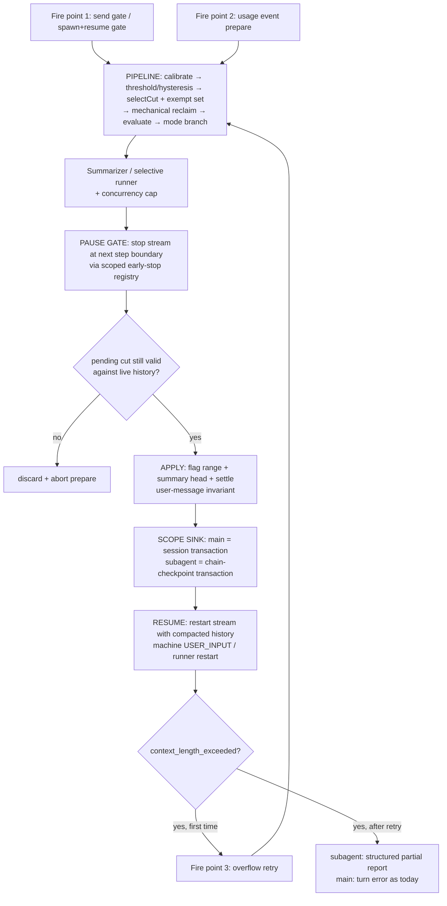

## Summary

Compaction becomes one agent-symmetric engine keyed by agent scope. Subagents gain full parity with the main session — widget visibility, mid-run pause timing, all three fire points, overflow retry — plus a never-drop user-message invariant that protects the delegated task head (subagents) and recent user intent (main). The duplicated gate pipelines, selective apply builders, and manager closures collapse into shared modules.

## Problem Frame

Session compaction (origin plan, R1–R26) shipped with scope-specific orchestration: `electron/src/main/ipc/chat/compaction.ts` (~1170 lines) drives main sessions; `SubagentManager._startRun` carries ~290 lines of closure-based compaction (`electron/src/main/agents/manager.ts`) plus `electron/src/main/agents/subagent-compaction.ts`. The engine core (`electron/src/main/llm/compaction/*`) is shared, but the gate pipeline around it is re-implemented per call site with divergent token estimation, `getConfig()` fallbacks, and silent catches (code review #16, #27, #28, #44, #47).

Main and subagent are both agents doing the same kind of work in different spawns, so the divergence has no principled basis — and it costs concretely:

- Subagent compaction is invisible (no widget), applies only at `step_finish`, never retries on overflow, and never re-validates a pending cut against live history.
- Simple mode can exclude user messages from the model view. For a subagent, losing the delegated task head degrades the run even though the transcript survives; for main, recent user intent can be summarized away.
- Crash-atomicity (R22) holds only for main; subagent persistence is best-effort pokes (`_setChainMessages`, assembler field casts, `_persistence.markCompaction`).

## Requirements

Continues the origin plan's R1–R26. New requirements:

### Parity (subagent ⇄ main)

- R27. Subagent compaction progress and completion render in the subagent transcript via the compaction widget, same as main, and survive snapshot replay.
- R28. Subagent compaction applies mid-run by pausing the tool loop at the next step boundary and resuming with the compacted history — the same timing semantics as main's mid-turn pause.
- R29. Subagent compaction fires from the same three fire points as main: spawn/resume-time calibrated estimate gate, usage-event prepare, and reactive overflow retry.
- R30. A `context_length_exceeded` error inside a subagent run triggers one compact-and-retry before degradation or failure.
- R36. Subagent compaction writes are crash-atomic (R22 parity): a crash mid-run resumes either the pre- or post-compaction chain, never a half-flagged state.
- R37. A pending subagent compaction is re-validated against the live chain history before apply and re-anchored after, under the same validity rules as main (`isPendingCutStillValid`, `reanchorSelectiveReplay`).

### User-message invariant

- R31. Compaction never excludes user messages from the model replay, in any mode, in either scope (R9 generalized beyond selective).
- R32. A subagent run keeps every user message in model view for its entire lifetime — the delegated task head and any question/answer exchanges can never be lost. Default-on, not configurable off.
- R33. A main session keeps the last `keep_last_user_messages` user messages in model view and pins the session's first user message by default.

### Consolidation

- R34. The gate pipeline (calibrate → threshold/hysteresis → cut → reclaim → evaluate → mode branch → apply → post-estimate) exists once, parameterized by scope.
- R35. Selective compaction uses one never-delete apply builder for both scopes; main's `replayMessages`-replacement persistence and the subagent's flag+settle builder converge on it.

## Key Technical Decisions

- **One engine, scope adapters.** A pipeline module in `electron/src/main/llm/compaction/` owns the gate sequence; main and subagent adapters own only sinks: persistence target, widget routing, degradation policy, compactor agent, ledger attribution. Scope identity reuses `AgentScope` (`electron/src/shared/types/agent-scope.ts`), not new ad-hoc keys.
- **Pause mechanism is generalized, not duplicated.** Main pauses via `requestCompactionPause` → `shouldStopEarlyForSession` → orchestrator `stopWhen` → machine idle intercept → apply → `USER_INPUT` resume. The pause registry in `electron/src/main/ipc/next-request-stop.ts` generalizes from session-keyed to (session, agentScope)-keyed; subagent-runner passes the same early-stop predicate into `streamChat` and restarts its stream with the compacted history at the gate. One choreography, two hosts (machine loop vs runner generator).
- **Widget becomes a real scoped event; the fake tool-call channel dies.** The synthetic `'compaction'` tool-call with JSON-stringified state (review #37) is replaced by a typed compaction-progress event keyed by agent scope, routed through the existing sequenced turn-event broadcast (main) and subagent live projection (subagents). Replay derives widget completion from the persisted `compacted` summary-head marker, fixing replay survival for both scopes.
- **User-message invariant lives in the engine, not the call sites.** `selectCut` receives an exempt-id set (preserve window ∪ pinned user messages) so cut math reflects reality; `buildCompactionApply` settles user-message flags universally instead of per-mode helpers (`unflagUserMessagesInApply`, the subagent settle lambda).
- **`keep_last_user_messages` config.** `compactionScopeSchema` gains `keep_last_user_messages: number | null` and `pin_first_user_message: boolean`. Subagent scope defaults `null` (= all, R32); main defaults 10 with pin-first on. `null` for main disables the tail pinning.
- **Overflow retry before partial report.** The subagent runner classifies `context_length_exceeded` (existing `electron/src/main/llm/middleware/error-classification.ts`), records the window as a measured lower bound (calibrate-or-skip rule), compacts synchronously, and retries the step once. R17's structured partial report remains only as terminal degradation when the post-retry next cut is empty.
- **Transactional subagent persistence.** A targeted subagent-chain compaction write (UPDATE flag-changed chains + INSERT summary head in one transaction) mirrors `applyCompactionPersistence`; the `_setChainMessages`/`_persistence` best-effort pokes are deleted. Applied before the run resumes, which the widened mid-run crash window makes mandatory.
- **Runner history becomes a mutable handoff.** The runner's frozen `history` snapshot becomes a box shared with the compaction controller; apply swaps its contents and the stream restart reads it. Removes the `assembler.messages` field poke.
- **Compactor concurrency cap.** The engine holds a small semaphore (default 2) around compactor LLM calls so N subagents crossing threshold simultaneously cannot stampede.

## High-Level Technical Design

### Unified lifecycle (both scopes)

### Scope adapter boundary

| Concern | Main adapter | Subagent adapter |
|---|---|---|
| Trigger state | per-session trigger map | per-run trigger, own model limits |
| Fire point 1 | send-time estimate gate | spawn/resume estimate gate |
| Apply sink | session-DB compaction transaction | subagent chain-checkpoint transaction |
| Widget route | sequenced turn events | subagent live projection |
| Degradation | overflow retry → error | overflow retry → partial report (R17) |
| Compactor agent | `compactor` / `compactor-selective` | `compactor-subagent` / `compactor-subagent-selective` |
| Config | `compaction.main` | `compaction.subagents` (identical shape + defaults) |

## Implementation Units

### U1. Universal user-message invariant + `keep_last_user_messages`

- **Goal.** User messages can never leave the model view in any mode or scope; pinning is configurable.
- **Requirements.** R31, R32, R33.
- **Dependencies.** None.
- **Files.**
  - `electron/src/main/llm/compaction/select.ts` — exempt-id set parameter; pinned ids never enter the compactable range and don't count against the preserve budget.
  - `electron/src/main/llm/compaction/apply.ts` — universal user settle inside `buildCompactionApply`; delete mode-specific unflag helpers at their call sites in U7 (keep exports until then).
  - `electron/src/main/config/schema.ts` — `keep_last_user_messages`, `pin_first_user_message` on `compactionScopeSchema`; subagent default `null` (all), main default 10/true.
  - `electron/src/main/llm/compaction/run-attempt.ts`, `electron/src/main/agents/subagent-compaction.ts` — resolve the exempt set from config per scope and thread it through cut + apply.
  - `electron/src/renderer/components/Preferences/` Compaction tab + `electron/src/main/project/trust.ts` diff surface — new keys visible in config UI and trust report.
- **Approach.** Exemption is decided once per attempt (scope config + message roles) and passed as data; apply and selection consume it independently so the math and the mutation cannot disagree.
- **Patterns to follow.** `resolvePreservePercent` clamping in `select.ts`; config surface pattern from `preserve_percent` (schema → CompactionTab → trust diff).
- **Test scenarios.**
  - `electron/tests/unit/compaction-select.test.ts`: pinned ids excluded from range; preserve budget not consumed by pins; subagent scope pins all user messages including the task head.
  - `electron/tests/unit/compaction-apply.test.ts`: simple-mode apply never flags user messages (previously allowed); pre-flagged user messages are un-flagged by settle.
  - `electron/tests/unit/subagent-compaction.test.ts`: delegated task head survives every compaction cycle in simple and selective modes.
  - Config schema test: defaults per scope; `null` disables tail pinning on main only.
- **Verification.** All compaction test files green; no call site outside the engine computes user exemptions.

### U2. Scoped compaction widget event

- **Goal.** Compaction progress/completion is a typed, agent-scoped event; subagent transcripts render the widget; both scopes survive snapshot replay.
- **Requirements.** R27.
- **Dependencies.** None.
- **Files.**
  - `electron/src/shared/chat/turn-projection.ts` + `electron/src/shared/types/` — compaction-progress event type keyed by (sessionId, agentScopeId).
  - `electron/src/main/ipc/chat/compaction.ts` — emitter emits the event instead of synthetic tool snapshots; delete `compactionWidgetToolId` machinery.
  - `electron/src/main/agents/subagent-live-projection.ts` / `subagent-events.ts` — route subagent compaction events to the owning window (mirror approval-store owner-window routing).
  - `electron/src/renderer/components/ChatStream.tsx`, `SubagentTranscript.tsx`, `ToolResults/` CompactionWidget, `electron/src/renderer/utils/stream-building.ts` — render from the event; derive replay-time completion from the `compacted` marker.
- **Approach.** No literal toolName matching, no JSON re-parse. The widget's lifecycle (running → complete) is carried by the event stream live and by the persisted marker on replay.
- **Patterns to follow.** Sequenced turn-event broadcast in `electron/src/main/ipc/chat/events.ts`; subagent event batching knobs.
- **Test scenarios.**
  - `electron/tests/unit/compaction-stream-emitter.test.ts`: event shape, scope keying.
  - `electron/tests/unit/subagent-live-projection.test.ts`: compaction events project into the subagent stream.
  - `electron/tests/unit/stream-building.test.ts`: widget item builds for both scopes; replay path derives completion from marker; key format stable.
  - `electron/tests/unit/subagent-transcript.test.ts`: widget renders in transcript view.
- **Verification.** Renaming nothing breaks rendering; a compacted-then-reloaded session shows the widget without live events.

### U3. Transactional subagent compaction persistence

- **Goal.** Subagent apply is one atomic write with the `compacted` marker, applied before the run resumes.
- **Requirements.** R36.
- **Dependencies.** None (prerequisite for U5's widened crash window).
- **Files.**
  - `electron/src/main/session/storage.ts` — targeted subagent-chain compaction transaction (UPDATE flags + INSERT summary head), mirroring `applyCompactionPersistence`.
  - `electron/src/main/agents/subagent-persistence.ts` — first-class `applySubagentCompaction` replacing `_setChainMessages` + `markCompaction` pokes and the `_persistence` cast.
  - `electron/src/main/agents/subagent-persistence-recovery.ts` — crash-restart resumes either chain state cleanly.
- **Approach.** Same transaction shape as the session path over `subagent_chains`; chain-split id semantics follow the pinned asymmetric-id convention (see Sources).
- **Patterns to follow.** `applyCompactionPersistence` in `electron/src/main/session/storage.ts`; SQL-footprint rule from the incremental-write learning.
- **Test scenarios.**
  - `electron/tests/unit/subagent-persistence.test.ts`: flags + summary head written in one transaction; rollback on failure leaves prior chain intact.
  - Crash-atomicity test pinning R22 for the subagent path (replaces the vacuous ones flagged by review #38 for this surface): kill between UPDATE and INSERT is impossible; restart loads one coherent state.
  - Flag/chain consistency after split ranges.
- **Verification.** No `assembler` field pokes or `_persistence` casts remain on the compaction path.

### U4. Extract the scope-parameterized gate pipeline

- **Goal.** One pipeline function owns calibrate → gate → cut → reclaim → evaluate → mode branch → post-estimate; main's three call sites and the subagent path call it; subagent spawn/resume gate added.
- **Requirements.** R34, R29 (fire point 1 for subagents).
- **Dependencies.** U1 (exempt-set parameter exists).
- **Files.**
  - `electron/src/main/llm/compaction/pipeline.ts` — new; single `CompactableRange` type exported for everyone (review #44); single char-serialization pass per evaluation (review #47).
  - `electron/src/main/ipc/chat/compaction.ts` — `tryCompactSynchronously`, `handleUsageCompaction`, `applyPendingCompactionIfAny` become pipeline callers; pending store keyed by agent scope.
  - `electron/src/main/agents/subagent-compaction.ts` — `tryCompactSubagentHistory` becomes a pipeline caller with the subagent adapter.
  - `electron/src/main/agents/manager.ts` — spawn/resume-time estimate gate before the first stream (resumed runs only bite; cold runs lack calibration by rule).
- **Approach.** The pipeline returns a decision object; adapters own persistence, widget emission, and trigger-state mutation. Concurrency semaphore lives here.
- **Patterns to follow.** `runCompactionAttempt` extraction (same shape: engine module, callers keep owning persistence).
- **Test scenarios.**
  - `electron/tests/unit/compaction-trigger.test.ts` + new `electron/tests/unit/compaction-pipeline.test.ts`: identical gate decisions for identical inputs across scopes; semaphore caps concurrent summarizer calls; single-serialization (estimator called once per message).
  - `electron/tests/unit/subagent-compaction.test.ts`: spawn-time gate fires on a resumed over-limit chain; no-ops without calibration.
  - Existing main-path tests in `electron/tests/unit/chat-ipc.test.ts` (`chat compaction mid-turn pause`) unchanged in behavior.
- **Verification.** No duplicated clamp/estimate/gate sequences outside the pipeline; `npm run check:runtime-cycles` clean.

### U5. Subagent mid-run pause and resume

- **Goal.** Subagent compaction applies at the next step boundary by stopping the stream, applying, and restarting with compacted history — main's timing.
- **Requirements.** R28, R37.
- **Dependencies.** U2 (widget shows the pause), U3 (atomic write before resume), U4 (pipeline + scoped pause registry).
- **Files.**
  - `electron/src/main/ipc/next-request-stop.ts` — pause registry keyed by (sessionId, agentScopeId); main call sites migrate.
  - `electron/src/main/agents/subagent-runner.ts` — accepts a pause gate; passes early-stop predicate to `streamChat`; on gated stream end: await pending, re-validate against live history, apply (U3 write), swap the history box, restart the stream; on interrupt: clear gate + discard pending.
  - `electron/src/main/agents/manager.ts` — wiring shrinks to adapter construction; `maybeApplyCompactionAtBoundary` step_finish logic replaced by the gate path.
  - `electron/src/main/agents/subagent-compaction.ts` — adopts `isPendingCutStillValid` / `reanchorSelectiveReplay` semantics.
- **Approach.** Mirror main's `resetTurnForCompactionResume` contract: the restart replays turn progress, never the bare task head. Interrupt during the pause aborts cleanly (the subagent twin of review #33).
- **Patterns to follow.** Main's idle-intercept resume in `electron/src/main/ipc/chat/send.ts`; dedupe-before-validate rule from the mid-turn apply learning.
- **Test scenarios.**
  - `electron/tests/unit/subagent-runner.test.ts`: stream stops at step boundary when gate set; restart uses compacted history; in-turn tool progress preserved; interrupt during pause → clean abort, no stray tool events.
  - `electron/tests/unit/subagent-compaction.test.ts`: history mutated between prepare and apply → pending discarded (R37); re-anchor keeps post-prepare suffix.
  - `electron/tests/unit/chat-ipc.test.ts`: main pause behavior unchanged under the scoped registry.
- **Verification.** A subagent crossing threshold mid-run shows widget → pauses → resumes compacted, transcript intact.

### U6. Subagent overflow retry; partial report demoted

- **Goal.** `context_length_exceeded` in a subagent run triggers compact-and-retry once; partial report only when the post-retry cut is empty.
- **Requirements.** R30, R29 (fire point 3).
- **Dependencies.** U5.
- **Files.**
  - `electron/src/main/agents/subagent-runner.ts` — catch classified overflow error, record window lower bound, synchronous compact via pipeline, retry the step once, then degrade.
  - `electron/src/main/agents/subagent-compaction.ts` — `buildSubagentPartialReport` retained, invoked only after failed retry.
- **Patterns to follow.** Main's overflow-retry path in `electron/src/main/ipc/chat/send.ts` (classifier + measured lower bound + single retry).
- **Test scenarios.**
  - `electron/tests/unit/subagent-runner.test.ts`: overflow → compact → retry succeeds → run completes; retry still over → partial report with done/remaining/stoppedAt; retry count never exceeds 1.
  - `electron/tests/unit/subagent-compaction.test.ts`: empty-next-cut exhaustion test (existing net-new logic) gates the partial report.
- **Verification.** No subagent run dies on first overflow while compaction is enabled.

### U7. Dissolve closures; unify selective apply builders

- **Goal.** The manager's compaction closures move into a controller; `buildSelectiveSubagentApply` and main's selective persistence converge on one never-delete builder; dead divergences deleted.
- **Requirements.** R35; closes review #16, #44 residuals.
- **Dependencies.** U4, U5, U6.
- **Files.**
  - `electron/src/main/agents/subagent-compaction.ts` — becomes `SubagentCompactionController` (per-run trigger, gates, adapter); `buildSelectiveSubagentApply` merges into a shared selective-settle helper in `electron/src/main/llm/compaction/apply.ts` used by both scopes.
  - `electron/src/main/ipc/chat/compaction.ts` — `persistSelectiveCompaction` delegates to the shared builder; fake-`like2`/`like3` result shims deleted.
  - `electron/src/main/agents/manager.ts` — `_startRun` compaction block reduced to controller construction; `compactionPreparesEvaluated` counter moves with it.
- **Approach.** Pure-move first, then merge. The merged builder keeps R3 (never delete), R9/U1 (user invariant), and pre-existing-flag survival semantics — the subagent path's rules are the stricter ones and become canonical.
- **Test scenarios.**
  - `electron/tests/unit/subagent-compaction-selective.test.ts` + `electron/tests/unit/compaction-selective.test.ts`: identical inputs produce identical applies across scopes; originals never deleted; pre-excluded ids stay excluded.
  - `electron/tests/unit/subagent-compaction.test.ts`: controller counter observable as before.
  - Manager file size/structure check (no compaction closures inline).
- **Verification.** `npm run lint`, `npm run typecheck`, full compaction + subagent suites green; AGENTS.md directory notes updated (`agents/subagent-compaction.ts` role, `llm/compaction/pipeline.ts`).

## Scope Boundaries

- No change to compaction modes themselves (simple/selective algorithms, manifest validation, correction rounds).
- The two compactor agent definitions stay separate (task-focused vs session handoff prompts); converging them into one agent with a scope preamble is a follow-up.
- No chunked/merged summarization for small compactor windows (still R26-deferred).
- No renderer redesign beyond the widget event swap and transcript rendering.
- No persistence-schema migration beyond what the targeted writes already need.

## Risks & Dependencies

- **Interrupt during a subagent pause** (mirror of review #33 on main): abort must clear the scoped pause gate and discard the pending result; covered explicitly in U5 tests.
- **Latency**: subagents now block on the summarizer mid-run instead of finishing a step; parent wait grows. Mitigated by prepare-in-parallel (already the design) and the concurrency cap.
- **Compaction storms**: N admitted subagents crossing threshold together; semaphore bounds compactor spend, queueing the rest.
- **Calibration cold start**: the spawn/resume gate only bites on runs with observed usage (calibrate-or-skip is a hard rule); fresh runs rely on usage-event prepare and overflow retry. Documented, not worked around.
- **Renderer key churn**: U2 touches stream-building keys for all items; the 550-line `stream-building.test.ts` must be extended, not just kept green.
- Depends on the pinned chain-split id convention staying intact (pure vs durable layers assign ids oppositely on purpose — see Sources).

## Open Questions

- Main default for `keep_last_user_messages` (proposed 10) and whether pin-first should be configurable-off rather than default-on — settle in U1 review with a look at real session shapes.
- Subagent widget transport: extend the existing subagent live-projection event union vs a dedicated channel — decide in U2 against the batching knob budget.
- Whether the concurrency semaphore should also cover main-session compaction (currently single-session by construction).

## System-Wide Impact

- Config: two new keys per scope in `~/.orchid/` config, `.orchid.json` project overrides, CompactionTab, and the trust-report diff surface.
- IPC/renderer: new compaction-progress event type through turn projection, stream building, ChatStream, SubagentTranscript; synthetic tool-call channel removed.
- Session DB: targeted subagent-chain compaction transactions; no schema migration expected beyond existing `compacted` marker machinery.
- Accounting: compactor attempts already scope-attributed (R18); the semaphore adds no schema.
- AGENTS.md: directory-structure notes for `llm/compaction/pipeline.ts`, `agents/subagent-compaction.ts` role change.

## Sources / Research

- Origin plan: `docs/plans/2026-08-17-001-feat-session-compaction-plan.md` (R1–R26, U6/U9 history).
- Code review: `docs/code-review-reports/2026-08-18-feat-session-compaction-pr141.md` (#16, #26, #27, #28, #33, #37, #38, #44, #47).
- `docs/solutions/design-flaws/compaction-null-window-chars4-and-chain-preserve.md` — calibrate-or-skip hard rule; dynamic-import pattern for accounting stores from the chat graph.
- `docs/solutions/logic-errors/mid-turn-compaction-apply-dedupe-mismatch.md` — dedupe-before-validate; resume must merge in-turn progress.
- `docs/solutions/conventions/compaction-chain-split-asymmetric-id-assignment.md` — pinned split-id directions and the declined-invariant discipline.
- Code: `electron/src/main/ipc/chat/compaction.ts`, `electron/src/main/ipc/chat/send.ts` (idle-intercept resume), `electron/src/main/ipc/next-request-stop.ts`, `electron/src/main/agents/manager.ts` (`_startRun` closures), `electron/src/main/agents/subagent-runner.ts`, `electron/src/main/agents/subagent-compaction.ts`, `electron/src/main/llm/compaction/*`.
