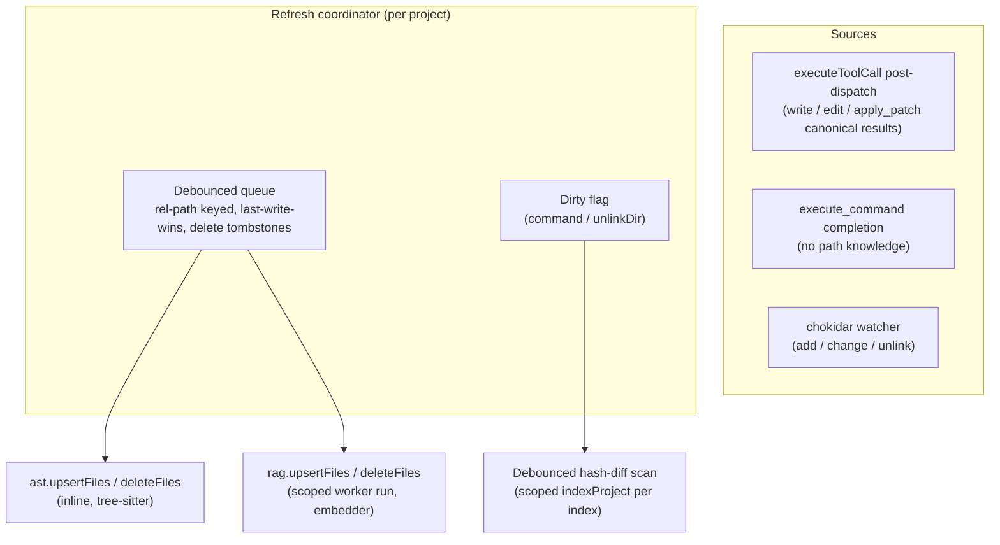

# RAG/AST Index Auto-Refresh on File Mutation

## Summary

Keep the RAG vector index and AST symbol index fresh automatically. Successful file mutations (`write`, `edit`, `apply_patch`) feed a coalesced, debounced incremental-update pipeline shared by both indexers; a chokidar workspace watcher plus a post-`execute_command` dirty-flag cover changes that originate outside Orchid's tools. Everything is user-configurable and on by default.

---

## Problem Frame

Both indexers are hash-based and incremental at scan time — RAG skips unchanged files by md5 (`src/main/rag/indexer.ts`), AST identically (`src/main/ast/indexer.ts`) — but neither is ever re-triggered after writes. The only refresh paths are the manual `rag_index`/`ast_index` tools and first-use auto-index (AST only). Every agentic editing session therefore leaves both databases stale until someone intervenes.

Mutations reach disk through more than the three file tools: `execute_command`, the user's editor, git, and build tooling all change files. A hook on the file tools alone cannot keep indexes truthful.

One latent correctness bug blocks reuse of the existing scoped-run path: the RAG deleted-file sweep (`src/main/rag/indexer.ts`, end of `runIndexProjectImpl`) prunes every stored path absent from the current run's discovered file set. A run scoped to `paths` would delete the rest of the index.

---

## Requirements

**Tool-driven freshness**

- R1. A successful `write`, `edit`, or `apply_patch` mutation is reflected in both indexes without any manual re-index step.
- R2. Index refresh never blocks, delays, or fails the originating tool result.
- R3. A burst of mutations coalesces into one batched incremental update per project.

**External-change freshness**

- R4. Add/change/unlink events under the bound workspace are detected by a watcher and routed through the same update pipeline as tool mutations.
- R5. Completion of `execute_command` marks the project dirty and schedules a debounced hash-diff scan, because commands do not report which files they touched.
- R6. Deleted files are removed from both stores.

**Correctness**

- R7. RAG incremental updates never append to an inconsistent vector state; they bail to a full rebuild instead.
- R8. A paths-scoped RAG run prunes only stored files inside the requested scopes.
- R9. Index-store activity under `.orchid/` never re-triggers refresh (feedback-loop prevention).

**Configurability**

- R10. Auto-refresh is toggleable per index (RAG, AST), on by default.
- R11. The watcher is toggleable, on by default; the coalescing debounce window is configurable.

---

## Key Technical Decisions

- **Single post-dispatch seam**: hook refresh notification into `executeToolCall`'s finalization chain (`src/main/llm/tool-dispatch.ts`), next to `maybeEnforceAgentsMdOnWrite`. All execution paths (orchestrator, eager-tool fallback, subagent runs, renderer `tool:execute`) converge there, so one hook covers every caller. Rationale: mirrors the proven AGENTS.md Phase A/B pattern and avoids per-tool edits.
- **Extract mutated paths from canonical results, not tool args**: the canonical data already carries them (`file-write`/`file-change` carry `path`; `apply-patch` carries `files[].path` + operation). Result-derived paths reflect what actually landed, work uniformly across families, and need no per-tool parsing.
- **Fire-and-forget with per-project coalescing**: a coordinator owns a debounced queue keyed by resolved project path; entries dedupe by relative path with last-write-wins and tombstones for deletes. Rationale: tool latency stays flat (R2) and bursty edits become one batch (R3).
- **Dedicated incremental APIs instead of reusing full `indexProject` for targeted updates**: RAG gains `upsertFiles`/`deleteFiles`; AST gains the same. Deletion is a direct store delete; upsert skips discovery entirely. The scope-aware sweep fix (R8) still lands so the existing scoped-run path is safe for any caller.
- **RAG vector-state guard**: incremental upserts load vector state first and bail to a full rebuild when inconsistent, mirroring the full-scan guard in `runIndexProjectImpl`. Rationale: appending to a misaligned `vectors.npy` permanently corrupts search results.
- **chokidar for watching**: user-selected. Pure JS (no native binding — packaging-safe as a runtime dependency), battle-tested cross-platform edge handling. The `.orchid` store directory is hard-ignored in watcher config on top of the shared ignore dirs.
- **Live config at refresh time**: the coordinator reads current config when a debounced batch fires, not the turn-frozen `projectRuntime` snapshot. Rationale: refreshes are background work that may fire long after the turn ends; frozen turn config is for tool semantics, not background maintenance.
- **`execute_command` gets a dirty flag, not path inference**: statically deriving mutated paths from shell commands is unreliable; the md5-skip in both indexers makes a hash-diff scan cheap. Rationale: correctness by measurement instead of by parsing.

---

## High-Level Technical Design

The coordinator is the only component that mutates indexes on behalf of refresh. Both tool dispatch and the watcher are producers; the indexers' incremental APIs are the consumers. The manual `rag_index`/`ast_index` tools remain unchanged as escape hatches.

---

## Implementation Units

### U1. RAG scope-aware sweep fix

- **Goal**: a paths-scoped RAG run prunes only stored files inside the requested scopes (R8).
- **Requirements**: R8.
- **Dependencies**: none.
- **Files**:
  - `electron/src/main/rag/indexer.ts` (sweep in `runIndexProjectImpl`)
  - `electron/tests/unit/rag-pipeline.test.ts`
- **Approach**: compute scope roots (the `paths` list resolved against the project root; the project root itself when unscoped). In the deleted-file sweep, skip any stored path that resolves outside every scope root. Full runs degenerate to today's behavior because the sole scope root is the project root.
- **Test scenarios**:
  - Scoped run over `src/a/` leaves `src/b/**` rows untouched when `src/b/x.ts` was deleted.
  - Scoped run prunes an in-scope file that no longer exists.
  - In-scope file that became excluded (renamed to `.bak`, oversized, binary) is pruned.
  - Full run still prunes every stored path absent from discovery.
- **Verification**: `rag-pipeline` unit suite passes; no behavior change observable through `rag_index` full runs.

### U2. RAG incremental update API

- **Goal**: targeted upsert/delete entry points that the coordinator (and future callers) use instead of full scans.
- **Requirements**: R1, R6, R7.
- **Dependencies**: U1 (scoped-run safety).
- **Files**:
  - `electron/src/main/rag/indexer.ts`
  - `electron/src/main/rag/index-worker.ts` (scoped worker payload, if the worker start-data shape changes)
  - `electron/tests/unit/rag-pipeline.test.ts`
- **Approach**: `deleteFiles(projectPath, rels)` opens the store, deletes by file batch, flushes vector state. `upsertFiles(projectPath, rels, config)` reuses `readAndHash` per rel, hash-skips unchanged files, chunks and embeds changed ones, and runs in the existing index worker with a scoped `paths` payload (discovery with explicit paths stats those paths only). Both load vector state first; on `!consistent` they trigger a full rebuild instead of appending (R7).
- **Test scenarios**:
  - `upsertFiles` on a changed file replaces its chunks and updates the stored hash.
  - `upsertFiles` on an unchanged file performs no embedding (hash skip).
  - `upsertFiles` with inconsistent vector state triggers full rebuild, not append.
  - `deleteFiles` removes chunks, file row, and vectors for the given rels.
  - Empty/oversized/binary rels are dropped rather than indexed.
- **Verification**: unit suite passes; incremental results match an equivalent full rebuild for the touched files.

### U3. AST incremental update API

- **Goal**: targeted upsert/delete for the symbol store.
- **Requirements**: R1, R6.
- **Dependencies**: none.
- **Files**:
  - `electron/src/main/ast/indexer.ts`
  - `electron/tests/unit/ast-pipeline.test.ts`
- **Approach**: `upsertFiles(projectPath, rels, config)` runs inline on the main thread — single-file tree-sitter parses are ms-scale — reusing the module's `readAndHash` and `extractSymbols`, hash-skipping via `getAllFileHashes`. `deleteFiles(projectPath, rels)` calls `store.deleteByFile` per rel. Applies the AST include-extension predicate so non-source rels are no-ops.
- **Test scenarios**:
  - `upsertFiles` on a changed file replaces its symbols and hash.
  - Unchanged file is skipped (hash match).
  - `deleteFiles` removes all symbol rows for the rels.
  - Non-source extensions (`.md`, `.json`) are ignored.
  - File with a syntax error still parses error-tolerantly and upserts partial symbols.
- **Verification**: `ast-pipeline` unit suite passes; `find_symbol_references` after an incremental update sees renamed/moved symbols.

### U4. Refresh coordinator and config schema

- **Goal**: the coalescing pipeline both producers feed, plus the user-facing config surface.
- **Requirements**: R2, R3, R10, R11.
- **Dependencies**: U2, U3.
- **Files**:
  - `electron/src/main/indexing/refresh-coordinator.ts` (new module)
  - `electron/src/main/config/schema.ts` (new `auto_refresh` section: `rag`, `ast`, `watch` booleans default true; `debounce_ms` default 2000)
  - `electron/src/main/config/merge.ts` (only if deep-merge needs explicit handling for the new section)
  - `electron/tests/unit/index-refresh-coordinator.test.ts` (new)
- **Approach**: the coordinator keeps one queue per resolved project path. Enqueued entries are `(rel, upsert | delete)`; a delete after an upsert for the same rel replaces it. A per-project debounce timer flushes the batch: RAG rels to `rag.upsertFiles`/`deleteFiles`, AST rels to the AST equivalents, each gated by its config flag. Only one batch runs per project at a time; arrivals during a run accumulate into the next batch. A `markDirty(projectPath)` API records that a hash-diff scan is needed and schedules one through the scoped `indexProject` path. All failures log and drop — never propagate (R2). Config is read live at flush time.
- **Patterns to follow**: module-level singleton maps keyed by project path, as both indexers already use for active-run tracking.
- **Test scenarios**:
  - Bursts within the debounce window flush as one batch per index.
  - Late mutation restarts the debounce timer (or joins the pending batch — assert the chosen policy consistently).
  - Delete-after-upsert for the same rel collapses to a single delete.
  - Concurrent flush attempts serialize; second batch waits.
  - Per-index config flags gate their respective calls.
  - Coordinator error in an indexer API is swallowed and logged.
- **Verification**: new unit suite passes; debounce values respected under fake timers.

### U5. Tool-dispatch integration

- **Goal**: mutations and command completions notify the coordinator.
- **Requirements**: R1, R2, R5.
- **Dependencies**: U4.
- **Files**:
  - `electron/src/main/llm/tool-dispatch.ts` (finalization chain in `executeToolCall`)
  - `electron/src/main/indexing/mutation-paths.ts` (new: canonical-result → mutated rels extraction)
  - `electron/tests/unit/tool-dispatch-index-refresh.test.ts` (new)
- **Approach**: a `maybeNotifyIndexRefresh(execution, options)` step runs in the finalization chain beside `maybeEnforceAgentsMdOnWrite`. It returns immediately for `error`/`cancelled` outcomes (nothing landed — same rule as AGENTS.md Phase B). For `file-write`/`file-change` families it extracts `data.path`; for `apply-patch` it extracts `files[].path` with delete operations enqueued as tombstones. Paths resolve against `options.cwd` and are filtered to workspace-contained rels. For a completed `execute_command` it calls `markDirty(options.cwd)`. The whole step is wrapped so any failure degrades to a no-op.
- **Test scenarios**:
  - Successful `write`/`edit` outcome enqueues an upsert with the canonical path.
  - `apply_patch` with mixed operations enqueues upserts and delete tombstones per file.
  - Error and cancelled outcomes enqueue nothing.
  - `execute_command` completion marks the project dirty; read-only tools do not.
  - Extraction failure or coordinator throw leaves the tool result byte-identical.
- **Verification**: new unit suite passes; existing `tool-dispatch` suites unchanged.

### U6. chokidar watcher and workspace lifecycle

- **Goal**: external file changes reach the coordinator (R4), watcher is user-toggleable (R11), no feedback loop (R9).
- **Requirements**: R4, R9, R11.
- **Dependencies**: U4.
- **Files**:
  - `electron/src/main/indexing/watcher.ts` (new module)
  - `electron/package.json` (add `chokidar` to `dependencies`)
  - `electron/src/main/project/workspace.ts` or the session IPC bind path (attach/detach on workspace bind/unbind/rebind)
  - `electron/src/main/index.ts` (dispose on shutdown)
  - `electron/tests/unit/index-watcher.test.ts` (new)
- **Approach**: one chokidar instance per watched project path, refcounted across windows/sessions sharing the workspace. Ignored set: config `ignored_dirs` plus the indexers' default skip dirs, with `.orchid` always ignored regardless of config (R9). `add`/`change` enqueue upserts, `unlink` enqueues deletes, `unlinkDir` marks dirty (subtree membership is not cheaply known), `addDir` is ignored. `awaitWriteFinish` absorbs editor save bursts; coordinator debounce absorbs the rest. Watcher start failures and runtime errors log and disable that project's watcher — command dirty-flag remains as the floor. Config `watch: false` never starts instances; a live toggle change detaches.
- **Test scenarios**:
  - `add`/`change` event enqueues an upsert for the rel path.
  - `unlink` enqueues a delete; `unlinkDir` marks dirty.
  - Events under `.orchid/` and ignored dirs are filtered before enqueue.
  - Two sessions on one workspace share one chokidar instance; both closing releases it.
  - Watcher error disables the instance without throwing into the coordinator.
  - Workspace rebind detaches the old project's watcher and attaches the new one.
- **Verification**: new unit suite passes; manual pass — edit a file in an external editor, observe the refresh batch fire and `rag_search`/`find_symbol_references` return fresh results.

### U7. Config UI and status surfacing

- **Goal**: users can toggle auto-refresh and the watcher in-app; the Workspace Index panel reflects background refresh activity.
- **Requirements**: R10, R11.
- **Dependencies**: U4, U6.
- **Files**:
  - `electron/src/renderer/components/Preferences/RAGTab.tsx` (auto-refresh toggles; AST toggle placement follows existing tab conventions — colocate or split per the panel's current grouping)
  - `electron/src/renderer/components/Sidebar.tsx` (Workspace Index section: last-auto-refresh line)
  - shared status types if the existing `rag:status`/`ast:status` payloads need a field
- **Approach**: reuse the existing preferences-tab pattern (`ScopeToggle.tsx` where per-scope config applies) and the existing status polling the Sidebar already performs for workspace indexes. No new IPC channels unless a status payload must grow.
- **Test scenarios**:
  - Toggling RAG auto-refresh off persists to config and stops RAG refresh batches (integration-level assertion in the coordinator suite or manual).
  - Workspace Index section renders auto-refresh state when indexes exist.
- **Verification**: config round-trips through `config:save`/`config:get`; renderer typecheck passes.

---

## Scope Boundaries

- No persistent embedder session/daemon — each debounced RAG batch pays embedder model-load cost; measure before optimizing. Deferred item, see Open Questions.
- No watching outside the bound workspace; no multi-root support.
- No changes to search-time behavior — `rag_search`, `find_symbol_references`, `rename_symbol` read paths are untouched.
- No full-project idle rescan beyond the command dirty-flag hash-diff.
- MCP tools and subagents that mutate files through shell commands are covered only by the `execute_command` dirty flag and the watcher.
- The `rag_index`/`ast_index` manual tools stay exactly as they are.

---

## Risks & Dependencies

- **Feedback loop** — index stores write into the project (`.orchid/rag`, `.orchid/ast`); a watcher that sees those writes would refresh forever. Mitigated by hard-ignoring `.orchid` in watcher config (R9) and covered by a dedicated test.
- **Embedder spawn cost per batch** — ONNX session load dominates single-file RAG updates. Accepted for v1 behind the debounce; persistent-embedder work is explicitly deferred.
- **SQLite write contention** — incremental upserts open store connections while searches read. Both stores run WAL; batches are small and serialized per project. Watch for `SQLITE_BUSY` in tests.
- **chokidar packaging** — pure JS, no native binding, safe in `dependencies` for electron-builder. Verify the packaged app still resolves it (smoke check).
- **Watcher limits on huge trees** — inotify exhaustion on very large workspaces. chokidar surfaces it as an error; the mitigation is disable-and-log with the command dirty-flag as floor.

---

## Open Questions

- **Persistent embedder**: should the RAG refresh path keep an idle embedder session alive per project to amortize model load? Decide after measuring v1 batch costs.
- **Debounce default**: 2000ms is a placeholder; tune against observed editor-save burst patterns and agentic write bursts.
- **Dirty-flag scan scope**: whether the post-command hash-diff should walk the whole project or only source-tracked directories; start with the existing discovery walk (md5 skip makes it cheap) and revisit if slow on large repos.

---

## Sources / Research

- `electron/src/main/llm/tool-dispatch.ts` — `executeToolCall` finalization chain; AGENTS.md Phase A/B hook pattern this plan mirrors.
- `electron/src/main/rag/indexer.ts`, `electron/src/main/rag/store.ts` — hash-skip incremental scan, scoped `paths` discovery, vector-state consistency guard, the sweep to fix.
- `electron/src/main/ast/indexer.ts`, `electron/src/main/ast/store.ts` — hash-skip scan, `upsertFile`/`deleteByFile` store primitives, first-use auto-index.
- `electron/src/shared/types/tool-result-filesystem.ts`, `electron/src/shared/types/tool-result-apply-patch.ts` — canonical mutated-path fields the dispatch hook extracts.
- `electron/src/main/config/schema.ts` — Zod config sections pattern for the new `auto_refresh` block.
- `electron/src/renderer/components/Preferences/RAGTab.tsx`, `electron/src/renderer/components/Sidebar.tsx` — existing config UI and workspace-index status surfaces to extend.
- `electron/tests/unit/rag-pipeline.test.ts`, `electron/tests/unit/ast-pipeline.test.ts` — test conventions for indexer changes.
