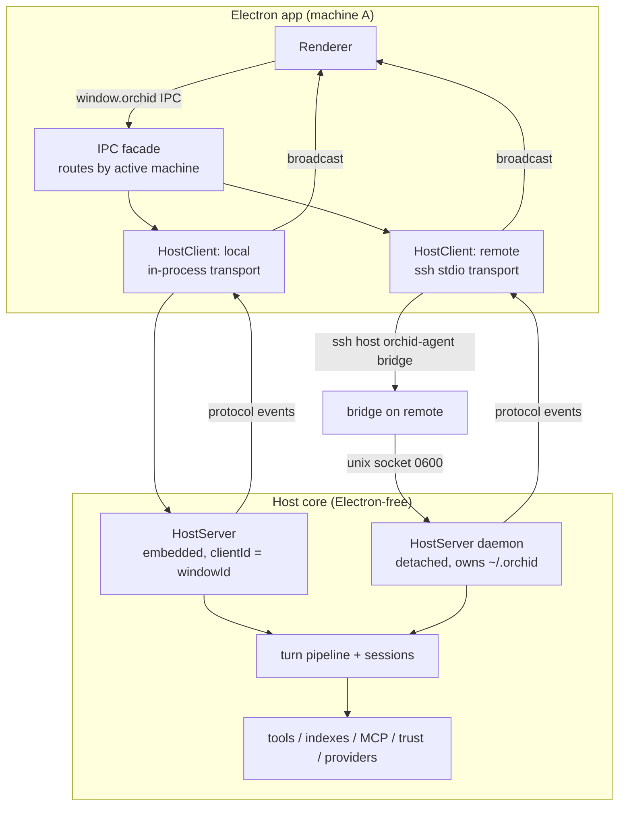

# SSH Remote Machines (issue #112)

## Summary

Each machine runs a headless Orchid agent host that owns its own sessions, projects, indexes, and provider config. The Electron app becomes a connectable client that drives every host — local and remote — through one protocol. Remotes attach over system SSH; turns keep running there when the client disconnects, and any client reconnecting to the same host resumes the full view.

## Problem Frame

Issue #112 asks for continuing project work from another machine via SSH, including while the user's own machine is offline. The investigation comment on the issue confirmed this is greenfield: no SSH library, no remote-workspace concept, sessions hard-wired to local paths. A thin proxy (local agent loop tunneling tool calls over SSH) cannot satisfy the offline requirement — only an agent runtime living on the remote machine can. The codebase's agent core is already nearly Electron-free, which makes extracting a headless host feasible rather than a rewrite.

User decisions locked during scoping:

- **Unify:** local machine speaks the same client protocol as remotes (one code path, deeper refactor), rather than keeping a direct local path beside a remote-only protocol.
- **Pre-installed CLI (v1):** the agent binary must already exist on the remote; auto-provisioning is follow-up work.
- **No cross-machine sync:** sessions live on the machine that runs them; resume = reconnect to that host.

## Requirements

Machine connection list:

- R1. A connection list shows the implicit local machine plus zero or more user-added SSH remotes, each with live connection status.
- R2. Adding a remote captures host/user/port, obtains the host key out-of-band (`ssh-keyscan`), requires explicit fingerprint confirmation, and pins it in an app-managed known-hosts file enforced on every connection.

Per-machine ownership:

- R3. All workspace-scoped state — sessions, chains, todos, working sets, RAG/AST indexes, trust grants, MCP servers, model selections — is owned by the host where work runs; nothing replicates between machines.
- R4. Switching the active machine scopes the session list, workspace binding, and model picker to that machine's host.

Offline continuation and resume:

- R5. A turn accepted by a host runs to completion with no client connected.
- R6. Reconnecting any client to a host resumes the full session view, including in-flight turns, pending approvals, and pending questions.
- R7. Approvals and questions pending on a disconnected host never auto-approve; they persist and fail closed at the existing timeout boundary.

Architecture:

- R8. The Electron app drives local and remote hosts through the same client protocol; the local machine is an embedded in-process host.

## Key Technical Decisions

- **Headless host daemon, not an SSH proxy:** tools, indexes, sessions, and LLM calls all execute host-side against the host's own filesystem and `~/.orchid`. Only a daemon satisfies R5. The daemon owns its SQLite stores; no host identity column is needed anywhere because remote sessions never exist locally.
- **Unified client protocol (user decision):** every machine-scoped IPC handler routes through a `HostClient`. Local is an in-process transport to an embedded host. The protocol stays exercised by daily local use, so it cannot rot.
- **System `ssh` binary with app-managed known-hosts:** zero new native dependencies; inherits the user's keys, agent, and `~/.ssh/config` aliases. Each machine gets its own known-hosts file under `~/.orchid` passed via `-o UserKnownHostsFile` with `StrictHostKeyChecking=yes`; first-connect TOFU is confirmed against `ssh-keyscan` output in the add-machine wizard. Key/agent auth only (`BatchMode=yes`) in v1.
- **Detached socket daemon + stdio bridge:** the app ensures `orchid-agent serve --socket ~/.orchid/daemon.sock` runs detached on the remote (socket mode 0600, same-user only); each client connection runs `orchid-agent bridge` over SSH piping stdio to that socket. The daemon outlives the SSH session, which is what makes R5 true; no user-managed service required (though one can run `serve` manually).
- **Client identity is an opaque string:** today's `ownerWindowId` / `getActive(ownerId)` maps already key on strings. Locally the protocol clientId *is* the window id; on remotes it is a connection id. `draftCwdByWindow`, active-session-per-owner, and approval owner routing generalize without redesign.
- **Env-referenced credentials on headless hosts (v1):** the vault's `SecureStorageAdapter` seam gets a plain-Node adapter that reports encryption unavailable; API-key storage returns a clean error on remotes while environment credential references (already supported by `createEnvironmentCredentialReference`) work. Remote provider setup = remote `~/.orchid/config.json` + env vars.
- **Machine registry in home config, metadata only:** modeled on `providers/connection-store.ts`. No secrets stored in v1 because SSH auth rides the user's existing key/agent.
- **Local-only channels stay local:** `machines:*`, `analytics:*` (local ledger), `updater:*`, `startup:*`, and the native folder picker never route to hosts.

## High-Level Technical Design



Protocol envelope (newline-delimited JSON over stdio or the in-process channel):

```
request  := { id, method, params }
response := { id, ok: true, result } | { id, ok: false, error: { code, message } }
event    := { ev, params, seq }          // seq: per-connection monotonic, drives resync
```

Channel routing matrix (the authoritative classification lives in one table in code, tested by U5):

| Channel family | Routed to | Notes |
|---|---|---|
| `chat:*`, `subagents:*` | host | turn pipeline lives host-side |
| `session:*` | host | except `pick_project_dir` (local dialog; disabled for remotes) |
| `bgcmd:*`, `ask_question:*`, `permission:*` | host | approval/question stores are already EventEmitters |
| `project:trust_*`, `definitions:*`, `agent/skill/personality:*` | host | trust surface and definitions are per-machine; `definition:reveal` degrades on remotes |
| `mcp:*`, `rag:*`, `ast:*`, `index:auto_refresh`, `tool:execute` | host | MCP servers and indexes run on the host |
| `config:get/save/get_home`, `config:read_project/save_project` | host | home/project config is host-owned |
| `providers:*` (reads, models, status) | host | model picker lists the host's connections |
| `providers:create/update/submit_api_key/...` (vault writes) | local-only | typed "unsupported on remote host" error in v1 |
| `machines:*`, `analytics:*`, `updater:*`, `startup:*` | local | never host-routed |

## Implementation Units

### Phase A — Core decoupling (behavior-preserving)

#### U1. Electron-free core hygiene + host boundary lint

- **Goal:** Remove the last Electron references from agent-core modules so the host graph is importable in plain Node; enforce the boundary mechanically.
- **Requirements:** R8 (enables).
- **Dependencies:** none.
- **Files:** `electron/src/main/ipc/next-request-stop.ts` (move to `electron/src/main/agents/next-request-stop.ts`; it is mis-homed and imported by `agents/manager.ts`), `electron/src/main/tools/index.ts` (replace the guarded `require('electron')` todos broadcast with an injectable notifier hook), `electron/src/main/agents/subagent-events.ts` + `electron/src/main/agents/wire-subagents.ts` (split pure delta batching from `BrowserWindow.getAllWindows` delivery; delivery becomes an injected sink), new `electron/scripts/check-host-boundary.mjs`, `electron/package.json` (wire check into `test`).
- **Approach:** Follow the `scripts/check-runtime-cycles.mjs` precedent for the boundary checker: fail if any file reachable from the host entry imports `electron`, excluding the Electron shell modules listed explicitly.
- **Patterns to follow:** existing event-out seams — `permissions/approval-store.ts` (EventEmitter), `tools/ask-question` store.
- **Test scenarios:** notifier hook fires without Electron loaded (run in plain-Node vitest as today); subagent batcher tests (`tests/unit/subagent-runtime.test.ts`, `tests/unit/subagent-live-projection.test.ts`) pass against the split modules; boundary checker fails on a fixture file that imports `electron` and passes on the real tree.
- **Verification:** `npm test` green with zero behavior changes; boundary check green.

#### U2. Host protocol definition

- **Goal:** One typed wire contract shared by client and daemon.
- **Requirements:** R8.
- **Dependencies:** U1.
- **Files:** new `electron/src/shared/host/protocol.ts` (method registry, event registry, Zod request/response/event schemas, protocol version constant, handshake types), `electron/src/shared/host/framing.ts` (newline-delimited JSON encode/decode with size caps).
- **Approach:** Mirror the `IPC_CHANNELS` + `ipc/payload-schemas.ts` pattern; reuse those schemas where payload shapes are identical so IPC and protocol cannot drift. Cover every channel family in the routing matrix; local-only families are absent by construction.
- **Test scenarios:** every method round-trips params/result through Zod; every event payload parses; unknown method and unknown event names reject; framing handles split chunks, oversized frames, and invalid JSON; version handshake accepts equal/mismatch.
- **Verification:** protocol schema tests green; routing matrix table exists in code with full channel coverage.

### Phase B — Host extraction and the unified local path

#### U3. Turn pipeline relocation behind a host event sink

- **Goal:** Move the turn lifecycle out of the IPC layer into host code whose event delivery is injected, so the same pipeline serves daemon and app.
- **Requirements:** R5, R8.
- **Dependencies:** U1, U2.
- **Files:** `electron/src/main/ipc/chat/events.ts` API becomes the `HostEventSink` interface in new `electron/src/main/host/events.ts`; relocate `electron/src/main/ipc/chat/{send,state,snapshot,persist,abort,stream,compaction,title,session}.ts` logic into `electron/src/main/host/chat/` (same file shapes); `electron/src/main/ipc/chat.ts` keeps only IPC registration and forwards.
- **Approach:** Mechanical relocation: `WebContents` params become `clientId: string` (window id locally); all `sendTurnEvent`/`sendSessionEvent`/`sendChatState`/`webContentsForWindowId` call sites route through the sink. The Electron shell installs a sink that broadcasts to windows; the daemon installs one that emits protocol events. `ipc/chat/state.ts` (ActiveAgent registry), `abort.ts`, `stream.ts` are already Electron-free and move as-is.
- **Patterns to follow:** the existing hub API in `ipc/chat/events.ts` — the sink interface mirrors it exactly to keep the diff mechanical.
- **Test scenarios:** existing `tests/unit/chat-ipc.test.ts`, `chat-cancel-gates`, `session-persistence`, `subagent-ipc` suites pass against relocated modules with only import updates; new test asserts `host/**` imports no `electron`; event ordering (seq monotonic per session) holds through the sink.
- **Verification:** full suite green; boundary check covers `host/`.

#### U4. HostServer bindings + `orchid-agent` daemon entry

- **Goal:** Bind core services to protocol methods; ship the node-only CLI.
- **Requirements:** R5, R8.
- **Dependencies:** U3.
- **Files:** new `electron/src/main/host/server.ts` (dispatch table binding protocol methods to session manager, workspace resolver, trust store, approval/ask stores, subagent snapshot surface, background store, definitions, MCP/RAG/AST ops, `tool:execute`, provider reads, config subset), new `electron/src/main/host/daemon.ts` + `electron/src/main/agent-entry.ts` (`serve --stdio`, `serve --socket <path>` detachable, `bridge` socket↔stdio, `--version`), plain-Node `SecureStorageAdapter` in `electron/src/main/providers/credentials/` (availability = unavailable; env references still resolve), new `electron/scripts/build-agent.js` (esbuild bundle following `scripts/build-preload.js`; natives external), `electron/package.json` (`bin` entry).
- **Approach:** Daemon startup mirrors `startup-lifecycle.ts` composition minus windows: seed defaults, register tools, initialize provider runtime with the Node vault adapter, wire subagents with the daemon sink. Daemon uses the remote user's `~/.orchid` via the existing `os.homedir()` constants — no home override needed for v1.
- **Test scenarios:** in-process server integration test exercising each method group; daemon smoke test (pattern: `tests/smoke/provider-live.ts`) spawns `node dist/main/agent-entry.js serve --stdio`, handshakes, creates a session, streams one scripted turn (fake provider fixture), and asserts persisted state; vault: api-key store rejects cleanly on the Node adapter, env-reference connection resolves.
- **Verification:** `orchid-agent --version` runs under plain Node; smoke test green in CI.

#### U5. HostClient + IPC facade unification (local goes through the protocol)

- **Goal:** Every machine-scoped IPC handler routes through a `HostClient`; the local machine becomes an embedded host started at app startup. Zero user-visible behavior change.
- **Requirements:** R8.
- **Dependencies:** U4.
- **Files:** new `electron/src/main/host/client.ts` (per-machine connection handle: request/event subscription/seq tracking) and `electron/src/main/host/transport-inprocess.ts`; `electron/src/main/startup-lifecycle.ts` (new step: start embedded local host); rewire handlers in `electron/src/main/ipc/{chat,session,session-activity,session-working-set,trust,subagents,permission,ask-question,config,definitions,mcp,rag,ast,tool,providers}.ts` to call the client; routing table in `electron/src/main/host/routing.ts`.
- **Approach:** Land channel-family by channel-family behind `activeMachineFor(windowId)` (always `local` in this unit — per-window selection arrives in U8). Host events arriving at the client broadcast through the existing window paths. Local-only families and provider vault writes are explicit table entries with typed capability errors.
- **Patterns to follow:** `ipc/chat/events.ts` recipients gating (`getActive` owner check) stays client-side; the protocol adds nothing.
- **Test scenarios:** the full existing IPC-level suites (`chat-ipc`, `session-workspace-ipc`, `permission-ipc`, `bg-command-ipc`, `subagent-ipc`, `config-ipc`, `provider-ipc`, `mcp-ipc`, `rag-ipc`, `ast-ipc`) pass through the client path; new routing-table test: every `IPC_CHANNELS` entry is classified and machine-scoped ones resolve through the client; in-process round-trip test proving event seq ordering survives the transport.
- **Verification:** suite green; app behaves identically; every machine-scoped request visible in one seam.

### Phase C — Machines and SSH

#### U6. Machine registry + local IPC

- **Goal:** CRUD for machines without any connection semantics yet.
- **Requirements:** R1, R3.
- **Dependencies:** none (parallel with Phase B).
- **Files:** new `electron/src/main/machines/registry.ts` (zod-validated metadata: id, label, kind, host, port, user, agentCommand default `orchid-agent`), `electron/src/main/config/schema.ts` (new `machines` section), new `electron/src/main/ipc/machines.ts` (`machines:list/create/update/delete`), `electron/src/shared/types/ipc.ts` (channels + types).
- **Approach:** Local machine is an implicit member, never stored. No secrets — auth rides the user's ssh agent/keys.
- **Patterns to follow:** `providers/connection-store.ts` (non-secret metadata + validation), `ipc/payload-schemas.ts`.
- **Test scenarios:** CRUD round-trip through home config; invalid entries rejected; local entry immutable and always present; list ordering stable.
- **Verification:** registry tests green; machine visible in IPC layer.

#### U7. SSH transport, TOFU host-key trust, connection manager

- **Goal:** Connect to a remote host's daemon over system SSH; own the lifecycle.
- **Requirements:** R1, R2, R5.
- **Dependencies:** U4 (daemon CLI), U6.
- **Files:** new `electron/src/main/machines/ssh-transport.ts` (spawn `ssh -o BatchMode=yes -o StrictHostKeyChecking=yes -o UserKnownHostsFile=~/.orchid/machines/<id>/known_hosts [-p port] [user@]host -- <agentCommand> bridge`; protocol framing on stdio; child lifecycle), new `electron/src/main/machines/host-key.ts` (`ssh-keyscan` capture, fingerprint parse, per-machine known-hosts write, mismatch = hard fail with surfaced detail), new `electron/src/main/machines/connection-manager.ts` (state machine offline→connecting→connected→lost; ensure detached `serve --socket` via the bridge channel; exponential backoff reconnect; resync handshake using event seq).
- **Approach:** Testability via injectable command template — tests spawn a local Node bridge script instead of real SSH. The detached daemon is ensured idempotently: bridge asks the daemon to spawn/adopt the socket listener before serving stdio.
- **Test scenarios:** transport round-trips requests/events against a fake bridge child process; child exit surfaces as `lost` and triggers backoff; host-key: first scan writes pin, modified key fails closed, fingerprint parse handles multi-algorithm scans; connection-manager transitions cover connect failure, daemon-missing error (actionable message), reconnect-and-resync ordering.
- **Verification:** all machine connection tests green without network access (fixture processes only).

#### U8. Renderer machines UI + per-window active machine

- **Goal:** The user-visible connection list; machine-scoped app state.
- **Requirements:** R1, R3, R4.
- **Dependencies:** U5, U6, U7.
- **Files:** new `electron/src/renderer/components/Machines/MachineSwitcher.tsx`, `AddMachineWizard.tsx` (host/user/port → keyscan → fingerprint confirm → connect), `ConnectionStatusBadge.tsx`; new `electron/src/renderer/hooks/useMachines.ts`; `electron/src/renderer/components/ChatView.tsx` + `LeftSidebar.tsx` (machine-scoped session list and workspace chip); `electron/src/main/host/routing.ts` (`setActiveMachine(windowId, machineId)` map + IPC); `electron/src/renderer/components/ConfigView.tsx` (Machines settings panel).
- **Approach:** Remote workspace binding uses the existing typed-path channel (`session:set_workspace`) plus host-side validation; native folder picker disabled when a remote is active. Provider vault-write UI surfaces the typed "unsupported on remote" error.
- **Patterns to follow:** provider `ConnectionList`/wizard composition; `useSubagents` polling hook; `TrustProjectDialog` for the fingerprint-confirm interaction.
- **Test scenarios:** wizard happy path and keyscan-failure path; switcher scopes session list per machine (fixture two machines); picker disabled for remotes; disconnect banner renders with machine label; active-machine persists per window across reload.
- **Verification:** manual two-terminal smoke (daemon local + fake remote via localhost bridge) plus component tests green.

### Phase D — Disconnect semantics and polish

#### U9. Offline approvals/questions + turn survival on the daemon

- **Goal:** The daemon behaves correctly with zero connected clients.
- **Requirements:** R5, R6, R7.
- **Dependencies:** U4, U7.
- **Files:** `electron/src/main/host/server.ts` (client-connection registry; delivery of approval/ask events targets connected clients; zero clients ⇒ request stays pending), replace the undeliverable-approval auto-abort behavior (today in `ipc/permission.ts` wiring) with timeout-bounded fail-closed settle in the host, `electron/src/main/host/events.ts` (queue pending notifications for resync).
- **Approach:** Approvals persist while disconnected and settle fail-closed at the existing timeout. In-flight turns never abort on client loss — abort sources remain cancel/timeout only. Pending approvals/questions are included in the reconnect snapshot.
- **Test scenarios:** approval created with zero clients settles fail-closed at timeout; reconnect mid-pending delivers it and an answer completes the turn; turn continues across bridge kill (scripted provider fixture) and the post-reconnect snapshot reflects progress; ask-question behaves symmetrically.
- **Verification:** daemon offline-semantics tests green.

#### U10. Reconnect resync + client UX

- **Goal:** Reconnection restores the complete view without duplicates or gaps.
- **Requirements:** R6.
- **Dependencies:** U9, U7, U8.
- **Files:** `electron/src/main/host/client.ts` (resync: session list + open-session snapshots + subagent snapshot + bgcmd fleet + pending approvals/asks, driven by event seq), `electron/src/renderer/hooks/useMachines.ts` + `useChat.ts` (reconciliation reuses existing snapshot reducers from `electron/src/shared/chat/turn-projection.ts`), disconnected-state handling in `InputArea.tsx` (fail-fast send with actionable error; message queue still usable).
- **Test scenarios:** resync after simulated drop: no duplicate terminal events, no lost messages, seq gaps trigger full snapshot fallback; sends while disconnected fail fast with clear copy; live-turn indicator ("running since HH:MM") on resume.
- **Verification:** resync integration test green end-to-end through a bridge child process.

#### U11. Docs, parity harness, follow-up register

- **Goal:** Remote machines are documented and permanently testable.
- **Requirements:** all (traceability).
- **Dependencies:** U10.
- **Files:** `electron/docs/remote-machines.md` (install agent on remote, key-based SSH requirement, `~/.orchid` on the remote, env-var provider credentials, troubleshooting daemon/socket), `docs/plans/deferred-features-todo.md` (follow-ups: auto-provisioning, password/askpass auth, cross-machine analytics aggregation, remote file browser, Windows remotes), new `electron/tests/integration/host-parity.test.ts`.
- **Approach:** Parity harness runs the same assertion set through the in-process transport and a spawned `serve --stdio` child, so the unified path cannot silently diverge from the daemon path.
- **Test scenarios:** parity matrix green on both transports for chat send/stream/tool-result/session-reopen; docs cover every user-facing error path introduced by U7–U10.
- **Verification:** parity test green in CI; issue #112 acceptance criteria demonstrable manually.

## Scope Boundaries

- No editing files *through* an SSH connection (thin proxy) — the issue explicitly excludes it.
- No cross-machine session, ledger, or analytics replication; each host's data stays on that host.
- No auto-provisioning of the agent onto remotes (user-deferred follow-up).
- No password/prompt SSH auth in v1 — key/agent auth only.
- No remote native folder picker; remote workspace binding is a typed path plus host-side validation.
- No provider API-key submission against remotes in v1 (typed capability error); reads and model picking work.
- Local-only channels (`machines`, `analytics`, `updater`, `startup`) never route to hosts.

## System-Wide Impact

- Every machine-scoped IPC handler changes call shape once (U5) — the largest regression surface in the plan; the existing IPC-level test suite is the safety net.
- The turn pipeline moves directories (U3); import churn across `ipc/chat/*` consumers.
- New long-lived process class (detached daemon) with its own lifecycle for indexes, watchers, worker pools, and SQLite handles — startup/shutdown parity with the Electron path is part of U4's smoke test.
- Security surface: app-managed known-hosts enforcement, 0600 socket, fail-closed approvals on disconnect, and no secret storage in the machine registry.

## Risks & Dependencies

- **U5 regression risk (high):** mitigate by landing channel-family by channel-family behind the routing seam with the full suite green between steps.
- **Protocol/IPC schema drift:** mitigate by reusing `ipc/payload-schemas.ts` schemas inside `shared/host/protocol.ts` where shapes are identical.
- **SSH environment variance (Windows client OpenSSH paths, agent absence):** mitigate with actionable connect errors and the fake-bridge test seam; document requirements.
- **Native modules on remotes (better-sqlite3, node-pty, onnxruntime):** the agent package must install against the remote's Node ABI — `scripts/ensure-native-runtime.mjs` already handles the plain-Node case locally; remote install docs cover it.
- **Multiple concurrent GUI clients on one host:** v1 routes approvals/questions to the requesting client; other clients see read-only pending state. Broader semantics deferred.

## Open Questions

- npm distribution and packaging of `orchid-agent` (package name, versioning against the desktop app, native-dependency install story) — resolve at U4 implementation.
- Protocol version negotiation policy beyond the initial equal/mismatch handshake — defer until a second protocol version exists.
- Whether `config:save` against remotes ships enabled in v1 or behind a setting — default enabled, revisit at U5 review.
- Remote platform matrix — Linux/macOS remotes first; Windows remotes untested in v1.

## Sources / Research

- Issue #112 body and investigation comment (greenfield verdict; suggested seams).
- Electron-coupling inventory (this session): agent core is Electron-free except `ipc/**` by design, two `agents/` broadcast files, the vault `safeStorage` default (DI seam exists), one guarded require in `tools/index.ts`; home dir is `os.homedir()`-based with no override; owner ids are opaque strings; no CLI entry exists today.
- `electron/src/main/ipc/chat/events.ts` — the window-routing hub the `HostEventSink` mirrors.
- `electron/src/main/permissions/approval-store.ts` — EventEmitter approval store; undeliverable-approval auto-abort wiring in `ipc/permission.ts`.
- `electron/src/shared/types/ipc.ts` — `IPC_CHANNELS` surface driving the routing matrix.
- `CONCEPTS.md` — Bind-then-Gate trust model, subagent live protocol, session concepts.
- Precedents: `scripts/build-preload.js` (esbuild node bundle), `tests/smoke/provider-live.ts` (plain-Node entry), `scripts/check-runtime-cycles.mjs` (AST-based boundary check), `providers/connection-store.ts` (registry pattern).
